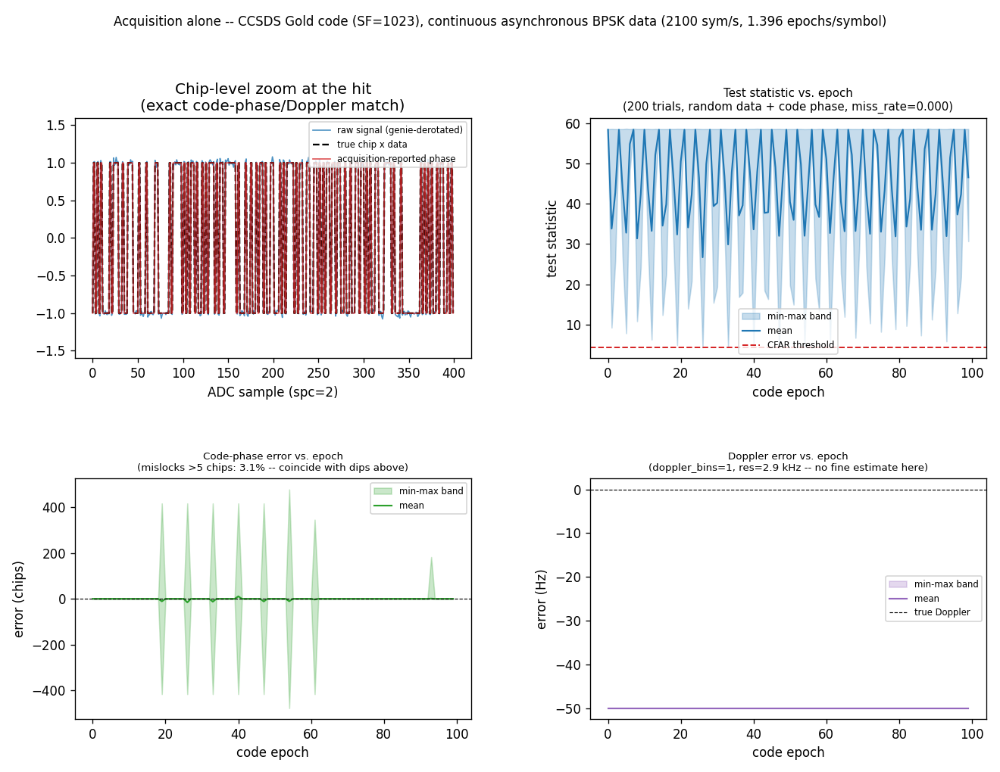
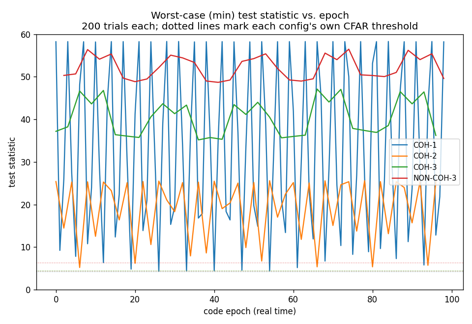

# DSSS Acquisition — Continuous Async-Data Modulation



Stage 1 of a story told across several pages: *"Acquisition ->
Dll(segments) -> MpskReceiver"* is the full continuous-DSSS receive
chain, validated one stage at a time instead of as a single end-of-run
BER number. This page asks the narrowest possible question: with a
**continuous** (non-bursty) 1023-chip CCSDS Gold code at 3 Mchips/s
carrying BPSK data at 2100 sym/s — `chips/symbol ~= 1428.6`, not an
integer, so the data-symbol clock is **asynchronous** to the code-epoch
clock — does [`Acquisition`](../api/python-dsss.md) still land on the
*exact* right code phase and Doppler bin, and does its per-epoch test
statistic survive a data-bit transition landing mid-epoch?

Not to be confused with [DSSS Acquisition Characterization](dsss-acq-characterization.md),
which measures Pd/Pfa vs Es/N0 for a **bursty** preamble+payload link with
synchronous spreading. This page's code is always present and its data
clock is deliberately misaligned to the code clock.

## How it works

```python
--8<-- "src/doppler/examples/dsss_acq_async_data_demo.py:signal"
```

1. Build a continuous capture: silence, then the Gold-code-spread BPSK
    stream at real chip/symbol rates with an independent, non-integer
    symbol clock and a residual 50 Hz carrier.
1. Stream it through `Acquisition.push()` — no `reset()`-hopping sweep
    needed, since (unlike a sparse burst) the code is always present.
1. At the hit, invert `code_phase` (a correlation *lag*) into the code's
    actual phase (`chip_phase = (sf - code_phase/spc) % sf`) and rebuild a
    local chip replica to compare against ground truth.
1. Separately, run the Monte-Carlo sweep: fresh `Acquisition` instances,
    100 epochs of continuous signal each (no silence — this measures
    per-epoch search behaviour in steady transmission, not acquisition
    latency), random data, starting code phase, and a residual Doppler
    drawn uniformly from ±100 Hz per trial, recording test statistic,
    code-phase error, and Doppler error at every epoch.
1. Then the Pd-vs-depth sweep: the same signal construction and trial
    loop at the realistic `DIVERSITY_CN0_DBHZ` margin, run twice per
    depth `D` in `1..12` — once with `(reps=D, max_noncoh=1)` (coherent)
    and once with `(reps=1, max_noncoh=D)` (non-coherent) — recording
    empirical Pd (opportunities-aware: a non-coherent decision only
    completes every `n_noncoh` pushes, so the denominator is pushes
    divided by `n_noncoh`, not raw pushes) at each depth.

Downstream despread ([`Dll(segments)`](dsss-despread-async-data.md), Stage 2)
and demod ([`MpskReceiver`](async-dsss-receiver.md), Stage 3) are later
stages of this story, now both built.

## What you're seeing

**Top left — chip-level zoom at the hit.** The raw received signal
(genie-derotated by the exactly-known injected Doppler — for plotting
only, not part of the real receiver), the TRUE transmitted chip×data
sequence, and Acquisition's own reported chip-phase reconstruction, all
overlaid for 400 samples right where the engine fired. All three match
bit-for-bit — asserted, not eyeballed. This isolates Acquisition's own
`code_phase`/`doppler_bin` estimate from every stage downstream (despread,
carrier recovery) and confirms it is exact.

**Top right — test statistic vs. epoch, Monte-Carlo over random data,
code phase, and Doppler.** At this operating point `doppler_bins == 1`,
so every `push()` evaluates exactly one code epoch — a direct per-epoch
window onto how the asynchronous data modulation affects the search. 200
independent trials (random data, random starting code phase, a residual
Doppler drawn uniformly from ±100 Hz per trial, the same 97 dB-Hz C/N0,
100 code epochs each) are summarized as a min/mean/max band against the
engine's own CFAR `threshold`. The regular scalloping (period ≈ 2.5
epochs, matching the fixed 1.396 epochs/symbol ratio) is real: a data-bit
transition landing mid-epoch partially cancels that epoch's coherent sum.
The worst epochs dip to within a hair of the threshold line — but across
20 000 epoch-trials, detection never actually failed, across the whole
±100 Hz range, not just one fixed offset.

**Bottom left — code-phase error vs. epoch, same Monte Carlo.** Tight,
near-zero error almost everywhere — except at the *exact same* epochs
where the test statistic dipped near threshold above, where the reported
peak occasionally jumps hundreds of chips away (a gross mislock, not a
small error). This is a real, quantified finding: crossing the CFAR gate
does not by itself guarantee an accurate code-phase estimate near
threshold. 3.1% of epochs in this run show a >5-chip mislock, and the
mislocks are provably concentrated at the low-test-stat epochs (asserted,
not just visually correlated). **The mislocks are not noise** — see below.

**Bottom right — Doppler error vs. epoch, same Monte Carlo.** A flat-vs-
time band spanning the full ±100 Hz trial-to-trial spread — each
individual trial's own Doppler is constant across its epochs (that's the
physical scenario: one residual carrier offset per capture), so the
*width* of the band is entirely the Monte-Carlo diversity across trials,
not per-epoch drift within one. Not a bug: at `doppler_bins == 1` the
single Doppler bin spans the engine's *entire* native ±1.47 kHz span, so
this operating point makes no attempt at fine Doppler resolution at all —
that refinement is a downstream tracking-loop job (`MpskReceiver`'s
carrier NCO), not acquisition's.

## Why the mislocks happen

Naively you'd expect a weak epoch to fail closed (miss detection) or fail
randomly (lock onto AWGN). Neither is what happens. A data-bit transition
landing mid-epoch splits that epoch's coherent sum into two
*oppositely-signed* partial segments. At the true code phase this costs
correlation gain — the two segments partially cancel, which is the dip
seen above. The Gold code's 3-valued **full-period** correlation bound
(`{-1, -65, 63}` off-peak) does not apply to these unequal-length
**partial**-period segments: at some *other* candidate phase, the two
mis-signed partial sums can happen to add constructively instead,
producing a peak that beats the (already weakened) true-phase peak.

The example proves this directly rather than asserting it: it replays one
identified bad epoch with **all injected noise removed**. The identical
mislock reproduces bit-for-bit —

```
mislock root cause: trial=0 epoch=26 noisy_error=121.0 chips,
noiseless_replay_error=121.0 chips -- identical mislock with zero noise
proves it's structural (a data-transition splitting the coherent
window), not noise
```

— confirming the mislock is a deterministic consequence of the code's
partial-window self-correlation structure and where the transition falls
within the epoch, not a noise event. Stripping the noise couldn't have
"fixed" a noise-driven failure; it did nothing here, because noise was
never the cause.

## Fixing it: Pd vs. integration depth, at a realistic margin



The mislock story above uses a deliberately strong C/N0 (97 dB-Hz) to
unambiguously isolate the mechanism. At a **realistic** link margin —
Es/N0 = 10 dB, i.e. C/N0 = Es/N0 + 10·log10(symbol_rate) ≈ 43.2 dB-Hz —
the same effect stops being an occasional mislock and becomes a
first-order gap in detection probability itself.

For each integration depth `D` (1 to 12 code epochs), two strategies are
swept at the same total energy: **coherent** forces `reps=D, max_noncoh=1` (one `D`-epoch coherent dump — `Acquisition`'s auto-config
picks the *smallest* depth that meets `pd=0.9`, so at any `D` short of
that it's forced to use the full `D`, still short) and **non-coherent**
forces `reps=1, max_noncoh=D` (`D` independent 1-epoch looks, power-
summed). 200 trials per depth per strategy; error bars are a 95%
binomial confidence interval.

**Non-coherent reaches the pd = 0.9 target by `D≈6` and keeps climbing to
~99.8% by `D=11`.** **Coherent climbs far more slowly and plateaus around
68%** — nowhere near its own 91% theoretical prediction at `D=11`, and
adding still more coherent depth (`D=12`) doesn't help; the engine's
auto-config has already found the smallest `D` it thinks it needs; the
`D=11`/`D=12` gap between empirical and predicted Pd doesn't close by
requesting more.

**Why coherent falls short of its own prediction:** `Acquisition`'s Pd
sizing math assumes a plain, continuous, unmodulated code — it has no
notion of data riding on top. An 11-epoch coherent window spans
`11 / 1.396 ≈ 7.9` symbols, i.e. **about 7 data-bit transitions inside one
"coherent" integration** — the exact self-cancellation mechanism from the
mislock story above, now compounding across a much longer window instead
of costing one epoch's worth of margin. Non-coherent combining never
integrates coherently across a transition in the first place — each
1-epoch look is independent, and power-summing (`|·|²` accumulate) cannot
be dragged down by a badly-phased look the way a coherent sum can; it can
only ever add. That is why non-coherent's *empirical* Pd comfortably
*exceeds* its own theoretical prediction here (the prediction is a
conservative bound for a clean, unmodulated code) while coherent's falls
well short of the same kind of bound.

### The theory curves (dashed)

This isn't hand-waved — both dashed curves are a genuine theoretical
Pd(D) with a **uniformly-distributed data-bit transition**, computed
semi-analytically (exact chip-timing combinatorics, no noise Monte
Carlo): quadrature over the window's phase relative to the symbol clock,
crossed with exact enumeration over the small number of i.i.d. ±1 data
signs the window touches, fed through the same `det_pd`/`marcum_q`
primitives `Acquisition` itself sizes against
([Python: Detection Statistics](../api/python-detection.md)).

- **Non-coherent** — each of the `D` looks is independent, and summing
    independent non-central chi-squared(2) terms gives a non-central
    chi-squared(`2·D`) whose non-centrality is the *sum* of the
    individual looks' non-centralities, exactly what `marcum_q` expects.
    The theory curve lands almost exactly on the empirical one (max
    difference < 0.01 across all 12 depths) — a clean, essentially exact
    validation.
- **Coherent** — the naive model (one amplitude for the whole window,
    computed from the signed segment sum) underestimates empirical Pd by
    as much as 0.47. The fix: `Acquisition`'s slow-time integration is a
    `D`-point Doppler FFT, not a plain time-domain sum, and a mid-window
    phase step (the transition) leaks energy into *every* FFT bin, not
    just the zero-Doppler one — detection only needs the *peak* bin to
    cross threshold. Using the window's own `D`-point DFT peak instead of
    its DC term shrinks the gap to about 0.17. The **remaining** gap is
    the honest, quantified footprint of an analogous leakage effect on
    the *code-phase* axis — the same partial-correlation mislock
    mechanism from the first figure above, now also handing out partial
    credit toward detection at low margin, not just occasional
    wrong-phase locks. Modeling that fully means walking the entire 2-D
    Doppler × code-phase grid, not just the on-diagonal true-phase slice
    this model uses — a real, open extension, left as future work rather
    than forced to match.

This same semi-analytical model now runs *inside* `Acquisition` itself: pass
`symbol_rate` and the engine jointly searches `doppler_bins × n_noncoh`
against this honest, data-modulation-aware Pd, instead of the old
Doppler/code-phase-only search that could silently under-size a
data-modulated link the way the coherent curve above demonstrates. See the
[DSSS acquisition guide](../guide/dsss-acquisition.md#continuous-data-modulated-signals-the-asynchronous-symbol-clock-case)
for the construction — not just because it avoids an occasional mislock, but
because at a realistic margin, coherent combining across many data-modulated
epochs may simply never reach the detection probability the old,
data-modulation-blind sizing math promised.

```python
--8<-- "src/doppler/examples/dsss_acq_async_data_demo.py:diversity_configs"
```

```python
--8<-- "src/doppler/examples/dsss_acq_async_data_demo.py:diversity_acq"
```

## Run it

```sh
python -m doppler.examples.dsss_acq_async_data_demo   # ~1 min -> two PNGs
```

Writes both figures on this page (`dsss_acq_async_data_demo.png` and
`dsss_acq_async_data_demo_diversity.png`); both are wired into `make gallery`.

Source: `src/doppler/examples/dsss_acq_async_data_demo.py`. See also the
[DSSS acquisition guide](../guide/dsss-acquisition.md) (the recommendation
this page's epoch-diversity comparison backs),
[DSSS Despread — Acquisition-to-Dll Hand-off](dsss-despread-async-data.md)
(Stage 2: does this page's hit correctly seed `Dll`, and does `Dll` have
its own version of the mislock mechanism above),
[Continuous Async DSSS Receiver](async-dsss-receiver.md) (Stage 3: the
full downstream chain, including carrier/symbol recovery) and
[Streaming Async Despreader](async-despread.md) (the despread-only half
at toy parameters).
