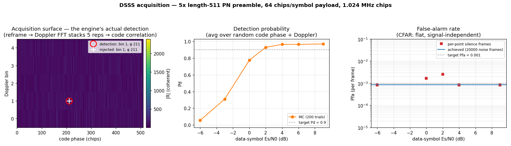

# DSSS Acquisition — Pd / Pfa vs Es/N0



A performance characterisation of `doppler.dsss.Acquisition`: the probability
of detection (`Pd`) and probability of false alarm (`Pfa`) of a
spread-spectrum burst acquirer, measured by Monte-Carlo against the data-link
**Es/N0**.

## The scenario

A direct-sequence transmitter emits a burst:

```
[ silence | 5× length-511 PN preamble | BPSK DSSS payload | silence ]
```

- **Acquisition preamble** — a 9-stage Galois maximum-length sequence (period
    `2⁹ − 1 = 511` chips), repeated **5 times** so the receiver can integrate it
    coherently.
- **Payload** — random BPSK data spread at **64 chips per symbol** over a
    *distinct* code, so it decorrelates from the preamble.
- **Channel** — the burst arrives at a **random integer code phase** and a
    **random carrier (Doppler) offset, uniform across the engine's
    ±`chip_rate/(2·sf)` ≈ ±1 kHz capture range**, buried in AWGN. Chip rate is
    **1.024 MHz**.

Everything radiated is built through the wfm **wfmgen** surface —
`Synth(type="pn")` for the preamble, `dsss_spread` for the payload. Only the
channel (delay, Doppler, silence, AWGN) is applied around it.

## What you're seeing

**Left — the acquisition surface and the actual detection.** This is the
engine's own decision surface for the preamble frame, reconstructed exactly as
it computes it: reframe the frame into `(5, 511)` (one row per code
repetition), take the **slow-time Doppler FFT** down the rows — which
coherently **stacks all five repetitions** for the full `10·log10(5·511) ≈ 34`
dB gain — then circularly correlate each row against the PN code. The single
bright cell is the peak; the red circle is the engine's **actual emitted
detection** and the white cross is the injected cell. Here both sit at
**(Doppler bin 1, code phase 211)** — the engine acquired the right
`(Doppler, delay)` index, and the surface is flat noise everywhere else (the
PN code's near-ideal autocorrelation). This coherent stack is *why* the burst
is detectable even though the raw signal sits below the noise — the defining
DSSS property.

**Centre — Pd vs Es/N0.** The Monte-Carlo S-curve, averaged over random code
phase and random Doppler across the capture range, passing through the
configured `pd = 0.9` target. The knee sits a few dB above the raw
`10·log10(sf·reps) ≈ 34` dB coherent gain because the average folds in the
**Doppler scalloping** and within-segment rotation losses of the coarse 5-bin
search — an honest operating curve, not the on-bin best case.

**Right — Pfa vs Es/N0.** The false-alarm rate, measured on the noise-only
(silence) frames. It is set by the engine's CFAR threshold and is **independent
of the signal**, so it stays flat at the configured `pfa = 1e-3` target across
the whole sweep. The solid line is the achieved rate over a 20 000-frame
noise-only run (≈ `8.5e-4`); the squares are the noisier per-Es/N0 estimates.

## How it works

`Acquisition` is constructed from physics, not tuning knobs — the PN code, the
front-end geometry (`reps`, `spc`, `chip_rate`), a sizing sensitivity
(`cn0_dbhz`), and the detection targets (`pfa`, `pd`). It then:

1. Frames the raw stream into `(doppler_bins, code_bins)` where
    `code_bins = sf·spc` is one PN segment (the fast-time / code-phase axis) and
    `doppler_bins` is the coherent depth (≤ `reps`).
1. Runs a slow-time Doppler FFT along the segment axis.
1. Correlates against the single-row PN reference (the circular code matched
    filter on the fast-time axis).
1. Estimates a CFAR noise floor and gates the peak — emitting an
    `(doppler_bin, code_phase, …)` event whenever the test statistic crosses an
    automatically configured, Bonferroni-corrected threshold.

A deliberately low sizing `cn0_dbhz` pins the coherent depth to all five
repetitions (`doppler_bins == reps`), so one acquisition frame spans the whole
preamble.

### Es/N0

With a unit-power chip and complex AWGN of per-sample variance `σ²` (per-sample
power SNR `γ = 1/σ²`):

```
Ec/N0 = spc · γ                       per chip      (+10·log10(spc) dB)
Es/N0 = DATA_SF · Ec/N0               per data symbol (DATA_SF chips)
      → Es/N0_dB = snr_db + 10·log10(DATA_SF · spc)
```

At `spc = 1` that is a flat `+10·log10(64) = +18.06` dB offset from the
per-sample SNR the engine sizes against — the x-axis of the two operating
curves.

## Run it

```sh
python -m doppler.examples.dsss_acq_characterization   # ~30 s → PNG
```

The waveform geometry, signal construction, and the `(Doppler bin, code phase)`
mapping live in `doppler.examples.dsss_acq_characterization`, shared with the
`test_acq_characterization` gate so the demo and the test agree by construction.
