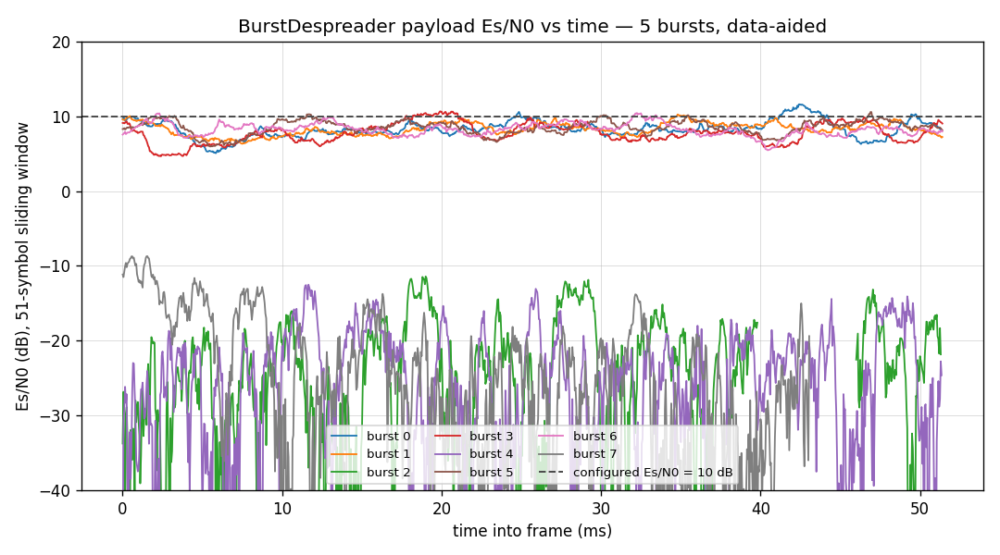

# A 5-Burst DSSS Link — wfmgen's Three Faces, the Full Receiver Chain



Two things in one example: exercise every way `wfmgen` can produce a
waveform against the *same* declarative scene, then run the resulting
capture through all three DSSS receiver objects — `Acquisition`,
`BurstDespreader`, `BurstDemod` — each demonstrated on its own before
they're chained, with every downstream stage seeded from what `Acquisition`
actually *finds*, not from ground truth. The goal driving the geometry
choices below wasn't a clean demo; it was finding rough edges and real
failure modes in the API, which it did (see
[Rough edges found](#rough-edges-found)).

## The scenario

5 bursts, each `[ 5x512-chip unmodulated preamble | 1000-symbol BPSK payload spread 50 chips/symbol ]`, payload Es/N0 = 10 dB, separated by a
variable (burst-to-burst distinct) inter-burst gap. The payload frame is
`sync word | 1000 payload bits | CRC-16`, spread by a *second*, short code
distinct from the preamble code — the same frame layout
[`BurstDemod`'s own test suite](../api/python-dsss.md) uses, just longer.

## Generating the capture — three faces, one scene

`wfmgen` is one C engine reachable three ways: the CLI binary, the
`Composer.from_file` Python binding loading the identical JSON scene, and
the `Composer`/`Segment` object API built with no JSON at all. Each burst is
**one declarative `type="dsss"` segment** — the engine tiles the preamble,
XOR-spreads the `sync | payload | CRC-16` frame with the second code, sizes
the segment to exactly one burst, and interprets `snr_mode="esno"` as the
payload *data-symbol* Es/N0 (see the
[waveforms guide](../guide/wfmgen/waveforms.md#dsss-two-code-spread-spectrum-bursts)).
All three faces should produce byte-identical samples for the same scene —
and here that's not just documentation, it's an assertion:

```python
import tempfile

from doppler.examples.dsss_burst_pipeline_demo import (
    generate_waveform,
    burst_starts,
)

with tempfile.TemporaryDirectory() as tmp:
    rx, acq_code, data_code, payload_bits, frame_bits = generate_waveform(
        tmp
    )
starts = burst_starts()
len(rx), len(starts)
```

`generate_waveform` raises if any two faces diverge — reaching the return
value means the CLI, `Composer.from_file`, and `Composer([Segment(...)])`
all agree, bit for bit, on this multi-segment DSSS scene.

## Acquisition — alone, and actually blind

The first draft of this example fed `Acquisition` a pre-cut window aligned
exactly to each known burst's start — which hands a CFAR detector the
answer to the only question it exists to answer. `Acquisition`'s real job
is running continuously against a channel that's mostly silence and noise,
finding a signal (or not) with zero prior knowledge of its timing. So this
section runs it that way: ONE instance, swept blindly across the *entire*
capture:

```python
from doppler.examples.dsss_burst_pipeline_demo import demo_acquisition

hits, acq = demo_acquisition(rx, acq_code)
len(hits)
```

Every one of the 5 real bursts is discovered at Doppler bin 0 (no Doppler
was injected in this scene), at exactly its true sample position, purely
from CFAR threshold crossings — no ground truth passed in. A handful of
false alarms in the noise-only regions typically also show up; see
[Rough edges found](#rough-edges-found) for why, and how the pipeline
handles them.

### How `push()` actually buffers and frames samples

Worth walking through in full, since it's *why* the sweep above is written
the way it is (`native/src/acq/acq_core.c:322-410`):

- It's a **ring-buffer FIFO**, not an accumulate-then-process call. Each
    call writes as many input samples as currently fit, drains every
    complete `n = doppler_bins * code_bins`-sample frame available (one 2-D
    FFT + PN correlate + CFAR test per frame), and loops write/drain until
    the input is consumed — so one call can hand it far more than the
    ring's own capacity.
- **Leftover samples short of a full frame stay buffered across calls** —
    unless a single call already hit the **hardcoded, non-configurable
    64-result cap** (`native/src/dsss/dsss_ext_acq.c:148`, not exposed as a
    Python parameter), in which case the remaining input for that call is
    genuinely *dropped*, not buffered. Not a concern at realistic CFAR
    settings, but a real edge case worth knowing about.
- **Framing is strictly sequential and non-overlapping**: one dwell is
    always exactly one frame's worth of samples, in order, with no
    sliding/search built into the primitive. A real burst's start is
    essentially arbitrary relative to a fixed dwell grid, so
    non-overlapping dwells *will* occasionally split a preamble across two
    dwells and miss it. Overlap is the **caller's** job — this demo
    `reset()`s the ring + accumulator between dwells at a hop 1/4 of a
    dwell width (75% overlap), since `push()` has no "restart the search
    here instead" concept of its own.

## BurstDespreader — alone

Seeded from the matching *discovered* hit (Doppler bin → Hz via
`doppler_res_hz`; the absolute sample position already resolved the code
phase, so `init_chip_phase=0.0`), `set_acq` pulls the Costas/DLL loops in
across the preamble, then `steps()` despreads the frame to soft symbols:

```python
from doppler.examples.dsss_burst_pipeline_demo import demo_despreader

results = demo_despreader(rx, hits, acq, acq_code, data_code, frame_bits)
[r["esn0_db"] for r in results]  # data-aided Es/N0 (dB), per detection
```

Bit errors land near zero and the measured Es/N0 lands within a couple dB
of the configured 10 dB on every *real* burst — the tracking loop follows
the carrier and code phase continuously across all 1029 frame symbols. Any
false alarms score wildly wrong Es/N0 and near-zero lock, exactly as they
should.

### Es/N0 (dB), not `snr_est` — now a standalone `doppler.snr` module

`BurstDespreader`'s own `snr_est` isn't useful here (see
[Rough edges found](#rough-edges-found)), so this demo reports a
**data-aided Es/N0 (dB)** instead: strip the known modulation
(`z = soft * sign`), and Es/N0 (linear) = signal energy over complex noise
variance = `a**2 / mean(|z - a|**2)` where `a = mean(Re(z))` — the same
convention `wfm_awgn_amplitude`/`add_noise()` use elsewhere in this repo.
It's scale-invariant (works regardless of `BurstDespreader`'s internal
symbol normalization) *and* polarity-invariant (`a**2` doesn't care whether
`a` is + or −), so unlike the bit-error count it needs no resolution of the
sign ambiguity.

This started as a Python prototype in the demo script itself — fine for
validating the idea, but doppler is C-first, and a computed metric is an
algorithm, not orchestration. It's now [`doppler.snr`](../api/python-snr.md),
a new standalone module (`native/src/snr/`): `snr_data_aided_db()` (the
estimator this demo uses) plus a non-data-aided sibling, `snr_m2m4_db()`
(moment-based/M2M4, Pauluzzi & Beaulieu 2000 — needs no known symbols at
all, for any constant-modulus signal), both with sliding-window `_series`
counterparts. Verified bit-for-bit identical output to the retired Python
prototype.

A single scalar per burst hides the interesting part, though: a sliding
51-symbol window of the same estimate, plotted against time into the
frame, is the hero image above. It shows what a table can't — tracking-loop
settling right after the preamble hand-off, and any mid-frame dip (the DLL
boundary slip noted below shows up as exactly that on burst 0).

## BurstDemod — full pipeline

`BurstDemod` is a **one-shot feedforward** design: estimate `(freq, rate)`,
dechirp once, despread, frame-sync, check the CRC-16. No tracking loop —
also seeded from the *discovered* hit, not ground truth:

```python
from doppler.examples.dsss_burst_pipeline_demo import demo_burst_demod

demod_results = demo_burst_demod(
    rx, hits, acq, acq_code, data_code, payload_bits
)
sum(1 for valid, _errs in demod_results if valid), len(demod_results)
```

Every real burst decodes; any false alarms correctly fail the CRC. That
"every real burst decodes" result wasn't true when this example was first
written — at this scale it failed the CRC on more than half the real
bursts, which led to a real bug fix in the C core. See below.

## Rough edges found

Finding these was the point of building this example, not an
inconvenience:

- **(since fixed — this example drove the fix)** `wfmgen` originally had
    **no DSSS primitive at all**: the two-code burst had to be hand-spread
    into a `type="bits"` pattern (`np.tile` + XOR in numpy), whose
    `snr_mode="esno"` then referred to one output *chip* — so a target
    *data-symbol* Es/N0 needed the hand conversion
    `snr_db_fs = esn0_db - 10*log10(sf*sps)` plus an explicit
    `snr_mode="fs"` — with a Python CRC-16 copy and manual sync insertion on
    top, and the built-in PN generator couldn't even make the codes (it's
    capped to Mersenne `2**n - 1` periods; 512 and 50 aren't). All of that
    is now the first-class
    [`type="dsss"` source](../guide/wfmgen/waveforms.md#dsss-two-code-spread-spectrum-bursts)
    this page uses: explicit any-length code arrays, engine-built frame with
    the shared `doppler.wfm.crc16` kernel (the same C the demod validates),
    data-symbol `esno`, and intrinsic burst length.

- **(since fixed — this example drove the fix)** There was no "N discrete
    bursts, jittered spacing" primitive — the train had to be N copy-pasted
    segments. The `repeats=N` segment field now plays one declaration N
    times with per-instance ranged gap redraws and fresh per-instance noise
    (fixed signal) — see
    [DSSS bursts](../guide/wfmgen/dsss-bursts.md). This page keeps its five
    explicit fixed-gap segments as reproducible ground truth (each burst's
    seed and position pinned independently).

- **(since fixed — this example drove the fix)** Inter-burst gaps were
    hard zeros — digital silence a CFAR front-end never sees in the field
    (the demo's blind sweep was correspondingly optimistic). Gaps now carry
    the segment's noise floor **by default** (gh-409): the AWGN stream
    keeps running through delay and trailing gaps while the signal stops.
    This walkthrough pins `gap_noise="off"` so every detection is exactly
    attributable to a known position; the guide's
    [DSSS bursts](../guide/wfmgen/dsss-bursts.md) page demonstrates the
    honest noisy-floor capture (and the SigMF sidecar's per-instance
    ground-truth annotations that make scoring against it trivial).

- **`Acquisition.push()`'s buffering/framing** is a ring-buffer FIFO with
    non-overlapping frames and a hardcoded 64-result-per-call cap — see
    [How `push()` actually buffers and frames samples](#how-push-actually-buffers-and-frames-samples)
    above for the full walkthrough. The short version: leftover samples
    persist across calls (good), but a call that hits the 64-result cap
    drops its remaining input (edge case), and achieving search overlap
    across dwells is entirely the caller's responsibility (not a knob on
    the object).

- **(resolved — [doppler#394](https://github.com/doppler-dsp/doppler/issues/394))
    Sweeping many overlapping dwells once produced more false alarms than
    the naive `pfa * n_dwells` estimate** — 3 observed vs. ~0.47 expected
    across a 471-dwell sweep at the default `pfa=1e-3`. A follow-up
    2.34M-dwell Monte-Carlo study (`dsss_acq_characterization.py`'s
    `measure_sweep_pfa`) swept the same blind, overlapping-dwell pattern
    over pure noise across four overlap fractions (0%/50%/75%/87.5%) and
    found every condition within ±1.8 std devs of the naive estimate, with
    no trend toward inflation as overlap increased. The 3-vs-0.47 run was
    ordinary Poisson variance (`P(X>=3 | lambda=0.47) ~ 1.5%`, rare but not
    implausible for one run), not a calibration or composability gap —
    `pfa`/`pfa_cell` are correctly sized for a single dwell regardless of
    how many overlapping dwells a caller chooses to blindly sweep. Not a
    correctness bug either way, since the downstream stages correctly
    rejected all 3 false alarms in the original run.

- **`BurstDespreader` has no absolute phase reference.** The Costas loop
    locks to a line, not a point, so its raw hard bits can come out globally
    inverted. Resolving that sign is exactly what `BurstDemod`'s sync-word
    correlation (or a hand-rolled equivalent) is for — `BurstDespreader`
    alone cannot do it, which is why the demo above scores both polarities.

- **`BurstDespreader.bits()`/`.steps()` don't always emit exactly
    `len(x) // (sf*sps)` symbols** for an exact-multiple input. Under
    realistic noise the DLL's code-tracking jitter can slip the
    integrate-and-dump boundary by one symbol over a long (1000+ symbol)
    frame. Genuine streaming behaviour, not a bug — but downstream code must
    not assume the output length is exact.

- **(resolved) `Acquisition.push()`'s 6th tuple element used to be a linear,
    un-suffixed `snr_est`.** It was documented as "estimated *per-sample
    amplitude* SNR" — `test_stat / sqrt(2*pi) / sqrt(2*n)`, a
    bandwidth-dependent quantity ("per-sample" really meant "normalised by
    the sample rate") that isn't portable across `spc`/`reps` configurations
    and gave no legible sense of link margin: a large, healthy `test_stat`
    (~24) could still show a small, flat linear ratio (~0.2), which reads as
    "stuck"/broken even for a rock-solid detection. It's now `cn0_dbhz_est`
    — the same statistic inverted back through the engine's own
    C/N0-to-amplitude-SNR sizing transform, directly comparable to the
    `cn0_dbhz` the engine was constructed with. It tracks true C/N0 while
    AWGN dominates the CFAR noise estimate, and saturates at the code's own
    autocorrelation-sidelobe floor once C/N0 exceeds what the code/geometry
    can resolve — a real ceiling, not a bug. First draft of this demo
    printed the old field as `snr(dB)`, which was simply wrong; the new
    field genuinely is dB (dB-Hz).

- **`BurstDespreader.snr_est` is numerically unstable once the Costas loop
    is well locked on BPSK**, and isn't dB either — an EMA of
    `Re(prompt)^2 / Im(prompt)^2`. A locked BPSK prompt has `Im -> 0`, so the
    ratio can spike to absurd values — this demo observed everything from
    single digits up to `6.9e6` across otherwise-healthy bursts. Not
    suffixed `_db` even though `BurstDemod.est_snr_db` is, and — unlike
    `Acquisition`'s field above — not yet fixed upstream. This demo reports
    a proper [data-aided Es/N0 (dB)](#esn0-db-not-snr_est-now-a-standalone-dopplersnr-module)
    instead.

- **The Es/N0 replacement was first a Python prototype, then ported to
    C.** Reimplementing the fix in Python was fine to validate the idea,
    but doppler is C-first — a computed metric is an algorithm, not
    orchestration. A repo-wide survey found no existing home for it
    (`doppler.measure`/`doppler.psd` are spectral/broadband ADC metrics,
    the wrong question domain; `doppler.detection` is deliberately
    input-only Pd/threshold math), so it's now
    [`doppler.snr`](../api/python-snr.md), a new standalone module —
    `snr_data_aided_db()` plus a non-data-aided sibling, `snr_m2m4_db()`
    (moment-based/M2M4, no known symbols needed at all), both with
    sliding-window `_series` counterparts. Verified bit-for-bit identical
    to the retired Python prototype. `BurstDespreader.snr_est` and
    `PPE.snr_db` are candidates to eventually rebuild on this shared
    module too — not done here, flagged for follow-up.

- **Found and fixed a real bug in `BurstDemod`**
    (`native/src/burst_demod/burst_demod_core.c`). At this demo's original
    scale (1000-symbol payload, 5x512-chip preamble, Es/N0=10dB) it failed
    the CRC on more than half of runs. Raising `est_segments` from 10 to 200
    barely moved the pass rate (1-2/10 either way) — a real clue, since
    `est_segments` only changes the *time-sampling grid* within the fixed
    preamble span, not the span itself.

    The actual bug: `burst_demod_demod()` already squared the despread
    payload symbols and ran `PolynomialPhaseEstimator` over them — a
    baseline ~20x longer than the preamble — to NDA-refine the chirp rate
    `mu`, but **discarded the frequency term the same estimate call also
    returns**, and gated the whole refinement behind `max_rate > 0.0`,
    skipping it entirely for the Doppler-only (`max_rate=0`) case this demo
    uses. The fix applies the discarded frequency correction the same way
    the rate correction already was (halved for the BPSK squaring — safe
    here because the preamble estimate already pins the residual to a small
    fraction of a cycle per symbol, nowhere near the squaring's half-cycle
    ambiguity zone) and stops gating the block on `max_rate` (a
    Doppler-only `ppe_create(nsym, 0.0)` naturally returns `rate_norm=0`,
    so the rate term is already a no-op when `max_rate=0`).

    Verified: 10/10 valid in an isolated numpy repro (residual frequency
    error dropped from a few-to-17 Hz down to sub-Hz) and every real burst
    in this demo's actual wfmgen capture, with the existing 89-test
    `test_burst_demod.py` / `test_realtime_file_demod.py` / `test_ppe.py`
    suites still green. `BurstDespreader`'s continuous tracking loop never
    had this ceiling — it doesn't need a good feedforward estimate, it
    converges to one.

## Reproduce

```sh
python -m doppler.examples.dsss_burst_pipeline_demo
```

Source: `src/doppler/examples/dsss_burst_pipeline_demo.py`. Integration
tests (skipped when the `wfmgen` CLI isn't built):
`src/doppler/dsss/tests/test_burst_pipeline_demo.py`.

## See also

- [DSSS Acquisition & Despreading](dsss-despread.md) — the shorter,
    single-burst version of the `Acquisition` -> `BurstDespreader` chain.
- [DSSS Acquisition: Pd/Pfa](dsss-acq-characterization.md) — how
    `Acquisition`'s detection performance is characterised against Es/N0.
- [wfmgen — One Engine, Every Waveform](wfmgen.md) — the CLI and Composer
    API this example's generation step exercises.
- [Python: DSSS](../api/python-dsss.md) — the full `Acquisition` /
    `BurstDespreader` / `BurstDemod` reference.
