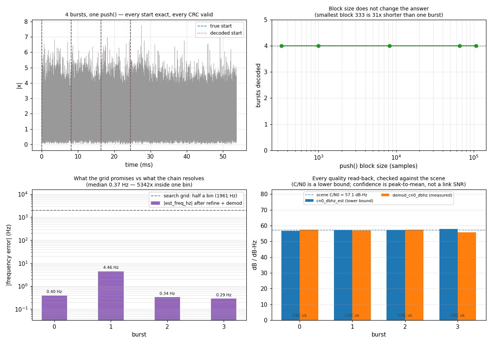

# DsssBurstReceiver — the Composed Burst Chain



The composed form of `BurstAcquisition -> refine -> BurstDemod`, the burst
DSSS receive chain, in one C object:
[`DsssBurstReceiver`](../api/python-dsss.md). Its continuous counterpart is
[`DsssReceiver`](dsss-receiver.md); the hand-composed version of *this*
chain — each stage demonstrated on its own — is the
[5-Burst DSSS Link](dsss-burst-pipeline.md) page, and that page is still the
one to read first if you want to see what each stage does.

This page is what composing them buys. It is not fewer lines.

## What the hand-off actually costs

Between acquisition and demodulation sits arithmetic that every caller was
redoing, and getting subtly wrong:

- acquisition reports an **end** anchor and a code phase **modulo one code
    period**. Neither is a burst start, and recovering one from the other is
    the `refine` stage — a search over whole code periods either side.
- one preamble raises **several** detections. Coalescing them is a rule
    about a span, not a loop the caller writes.
- the bin→frequency fold was restated at four call sites in three mutually
    inconsistent ways before it became
    [`dp_fftfreq()`](../c-api/index.md).

## Four properties, each asserted

The example is a gate, not an illustration: it exits non-zero if any of
these stops being true.

### 1. Block size does not change the answer

The same capture is pushed whole, then in 64 KiB, 1000 and 333-sample
blocks — the smallest **32x shorter than a single burst**. All five decode
the same four bursts at the same samples, with `dropped == 0`.

```python
--8<-- "src/doppler/examples/dsss_burst_receiver_demo.py:decode"
```

That is not free. It is what the history ring and the internally sliced
push are for, and it was broken in three separate places at once
([#1008](https://github.com/doppler-dsp/doppler/issues/1008)): an early
return that never looked at `x`, a `break` that left the tail unwritten,
and a discard that did not count. A block carrying several bursts lost all
but the first.

### 2. A burst split across two calls is held, not lost

Feed half a burst and `push()` returns nothing — deliberately. A burst is
returned when it is **complete**, not when it is guessed at. Feed the rest
and it comes out whole, bit-exact, wherever the split fell.

<!-- docs-snippet: skip=an excerpt whose names (capture, truth, payload) live in the example's namespace; the script itself is executed on every push by `make test-examples-python` -->

```python
--8<-- "src/doppler/examples/dsss_burst_receiver_demo.py:split"
```

`pending` is how you can tell the difference between "nothing here" and "I
am holding one". **Read it before you stop feeding a stream**: closing a
file or a socket while it is non-zero discards a burst that would have
decoded, and no other read-back distinguishes that case from an empty
capture — `dropped` counts samples the ring refused, `n_bursts` counts what
was demodulated, and a truncated burst is neither.

### 3. `refine_span` is the minimum burst spacing

Two detections closer together than `refine_span` are treated as the same
preamble and merged. So bursts packed tighter than it are **lost rather
than reported**, and the span is a property to read rather than a constant
to assume:

<!-- docs-snippet: skip=an excerpt whose names (BURST_LEN, receiver) live in the example's namespace; the script itself is executed on every push by `make test-examples-python` -->

```python
--8<-- "src/doppler/examples/dsss_burst_receiver_demo.py:spacing"
```

The boundary is sharp. At spacing exactly `refine_span`, one burst of four
is lost; one sample more recovers all four. Both spans were internal until
[#1011](https://github.com/doppler-dsp/doppler/issues/1011) — the only way
to learn the minimum spacing was to read the C, and the header's own
formula for it was 2.4x low.

### 4. Every read-back, checked against the scene

One `push()` can complete several bursts, and the scalar properties
(`rx.cn0_dbhz_est` and friends) describe only the **last** one. `events()`
hands back the same fields *per burst*, and between them they are the
object's entire diagnostic surface:

| field            | what it is                                  | what it is checked against here                          |
| ---------------- | ------------------------------------------- | -------------------------------------------------------- |
| `preamble_start` | exact stream position of the preamble       | the burst's true start, sample for sample                |
| `doppler_hz_est` | signed coarse Doppler, from the search grid | must sit inside the bin that contains the truth          |
| `doppler_res_hz` | that grid's bin width                       | `fs / (sf * spc)` — `acq` transforms `sf*spc` verbatim   |
| `cn0_dbhz_est`   | C/N0 **lower bound** implied by the hit     | `Es/N0 + 10·log10(Rs)` of the scene that was generated   |
| `est_freq_hz`    | residual frequency after refine + demod     | a hundredth of one search bin — and it beats that by far |
| `est_rate_hz`    | chirp-rate estimate                         | zero, because `max_rate=0` switches that axis **off**    |
| `est_snr_db`     | the estimator's own peak-to-mean confidence | a floor — it is **not** a link SNR                       |
| `refine_margin`  | runner-up code period over the winner       | strictly under 1, or the wrong period won                |
| `frame_valid`    | every check that RAN came out good          | 1, on every burst                                        |
| `frame_checked`  | checking stages actually reversed           | 1 with a CRC, 0 with none — a different fact from a fail |

<!-- docs-snippet: skip=an excerpt whose names (results, capture, truth) live in the example's namespace; the script itself is executed on every push by `make test-examples-python` -->

```python
--8<-- "src/doppler/examples/dsss_burst_receiver_demo.py:probes"
```

The bottom two panels of the figure are those rows plotted. The left one is
the reason the chain does not stop at acquisition: the search grid can only
promise half a bin — **1961 Hz** at this geometry — and refine plus demod
resolve the residual to well under a hertz, three orders of magnitude
inside it. The right one puts the quality read-backs beside the scene that
produced them: the C/N0 estimate lands within about a decibel of the
scene's **57.1 dB-Hz** on every burst, from a bound that is allowed to be
pessimistic and must not run hot.

Two of these are easy to misread, so the example asserts them rather than
mentioning them:

- **`est_rate_hz == 0` is a configuration fact, not a measurement.** This
    receiver was built with `max_rate=0.0`, so the chirp axis is not
    searched. A caller who wants a rate has to ask for one.
- **`est_snr_db` is confidence, not SNR.** It is the winning estimator
    row's peak-to-mean ratio. Comparing it with the link's Es/N0 will give
    a number that looks meaningful and is not.

## The receiver stops at hard and soft decisions

This object used to assume `sync | payload | CRC-16`, then briefly held a
frame description of its own — four knobs, a checker and a `frame_valid`
read-back. Neither is a physical-layer fact, and the second put a CCSDS
coverage policy inside a header that says it "knows nothing about CCSDS"
([#1022](https://github.com/doppler-dsp/doppler/issues/1022)).

So the chain is three objects, each knowing one thing:

| layer    | object                                 | knows                                                    |
| -------- | -------------------------------------- | -------------------------------------------------------- |
| physical | `DsssBurstReceiver`                    | the codes, the sync word, and how many symbols follow it |
| frame    | `wfm.FrameDesc` / `Frame`              | the fields, the stages, and what each covers             |
| codes    | `coding.Viterbi`, `coding.ReedSolomon` | the arithmetic a stage calls                             |

`push()` returns **`frame_syms` bits per burst** — the frame as received,
sync word first — and `llrs()` returns the same decisions as soft values.
That is the whole output. Undoing the frame is a separate call:

<!-- docs-snippet: skip=an excerpt whose names (ref_bits, payload) live in the example's namespace; the script itself is executed on every push by `make test-examples-python` -->

```python
--8<-- "src/doppler/examples/dsss_burst_receiver_demo.py:deframe"
```

- **`crc=none`** is simply a shorter frame — the receiver is told a smaller
    `frame_syms`, and the DeFramer reports `rx_checked == 0`: *carries no
    check* is not *the check failed*, and an FER conflating them would score
    every unprotected frame as an error.
- **A randomiser** round-trips when both descriptions carry it; a receiver
    that does not derandomise gets bits the CRC rejects rather than a
    silently wrong payload.
- **An outer code REPAIRS** inside `deframe()`, before the payload is
    sliced. Measured on this chain: eight injected bit errors reach the
    payload without `rs_depth` and are gone with it.

What the receiver gained by giving all that up is that it can be pointed at
*any* frame: it needs a template to correlate and a length to slice, and
nothing else.

## Soft bits, for whatever decodes them

`push()` returns hard bits; `llrs()` returns the same decision seen a
second way, one value per frame symbol:

<!-- docs-snippet: skip=a two-line excerpt whose names (rx, x) belong to a caller's own stream; the identity it shows is executed by `test_the_soft_bits_are_the_hard_ones_seen_a_second_way` -->

```python
bits = rx.push(x)                    # hard, per burst, frame rows
llr = rx.llrs(rx.llrs_max_out(1))    # soft, same order, same rows
```

The convention is `mpsk_soft_demap`'s — positive means bit 0, so
`(llr < 0)` reproduces exactly the bits `push()` returned, which the tests
assert rather than assume. A hard decision costs roughly **2 dB** of the
coding gain a soft-input decoder exists to deliver, and until recently that
number was computed and freed one line before the slicer.

They are **scaled**, not raw: `2·a·r/n0`, with `n0` estimated from the
symbols themselves (after derotation the real axis carries the signal and
the imaginary axis carries noise alone). A Viterbi would not care — it is
invariant to a positive scale — but LLRs from different bursts are not
comparable without one, and the scaled version is a measurement in its own
right: every 6 dB of Es/N0 multiplies it by about four (measured 17.9 →
67.2 → 259.2 at 6, 12 and 18 dB).

The **inner code** is the one stage nothing here undoes yet: it covers the
sync word, so a hard-decision correlator cannot find a coded frame at all
and frame sync would have to run after the Viterbi. The soft bits it needs
now exist; the ordering does not.

## The same thing in C

The [C example](https://github.com/doppler-dsp/doppler/blob/main/native/examples/dsss_burst_receiver_demo.c)
demonstrates the same sections and prints the same numbers,
because both build their capture from **one wfmgen scene** through the same
engine — `wfm_compose_create()` in C, `Composer`/`Segment` in Python.
Neither tiles a preamble, spreads a frame, appends a CRC or draws noise.
(The per-burst estimates of the read-back section are the one place the two
faces differ in the last decimal: the payload bits are drawn differently, so
the noise the estimator sees is not the same realisation. Every check the two
apply is the same one, derived the same way from the scene.)

What the C face shows that the Python one cannot is the part the binding
does for you: the lifecycle you manage yourself, and that the output buffer
is **the caller's** — sized from `push_max_out()` on the block being
pushed, not from `payload_len`, because one call may complete several
bursts.

## Why the preamble is 255 chips, not 511

`acq` transforms `sf * spc` **verbatim**: the code-axis correlation is
circular, so zero-padding the replica or the epoch would change the
correlation rather than interpolate it. An m-sequence is `2^n - 1` chips —
31, 127, 511, 2047 — every one prime or near-prime, which is the worst case
for an FFT. At 127 chips and `spc=4` that is 508 = 2²·**127**, and
pocketfft falls back to Bluestein: **9.70 µs against 0.75 µs** for a smooth
length, and 21 MSa/s against 52 end to end.

255 chips at `spc=2` is 510 = 2·3·5·17 — smooth, **and** twice the
autocorrelation ratio of the 127-chip code. Better on both axes rather than
a trade.

Rounding to 512 is the trap: no binary code of that length has good
periodic autocorrelation (an extended m-sequence gives 8.0; the best of a
4000-code random search reached 10.7), and this object's own
[certification](https://github.com/doppler-dsp/doppler/blob/main/src/doppler/dsss/tests/validation/dsss_burst_receiver/results.md)
brackets what that costs — ratio 31 found every burst offset, 1.07 lost
47% of them.

## Related pages

- [5-Burst DSSS Link](dsss-burst-pipeline.md) — the same chain, hand-composed, each stage on its own
- [DsssReceiver](dsss-receiver.md) — the continuous counterpart
- [DSSS Acquisition: Pd/Pfa](dsss-acq-characterization.md) — the search stage characterised
