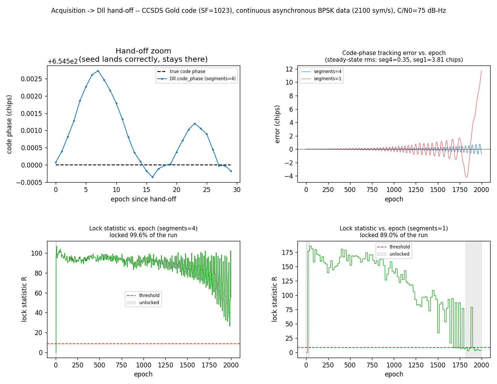

# DSSS Despread — Acquisition-to-Dll Hand-off, Continuous Async-Data



Stage 2 of the same story as
[DSSS Acquisition — Continuous Async-Data Modulation](dsss-acq-async-data.md):
*"Acquisition -> Dll(segments) -> MpskReceiver"* is the full continuous-DSSS
receive chain, validated one stage at a time instead of as a single
end-of-run BER number. Stage 1 proved
[`Acquisition`](../api/python-dsss.md) lands on the exact right code phase
and Doppler bin even under continuous, asynchronous data modulation — and,
with the `symbol_rate=` sizing knob, can be configured to do so robustly by
default. This page asks the next question: does that hit correctly seed
[`Dll`](../api/python-track.md) (the code-tracking despreader), and does
`Dll` — a **carrier-blind**, closed-loop early/late discriminator, not an
open-loop search — have its own version of Stage 1's self-cancellation
failure mode?

## How it works

```python
--8<-- "src/doppler/examples/dsss_despread_async_data_demo.py:signal"
```

1. Build the same kind of continuous capture Stage 1 uses: silence, then
    the Gold-code-spread BPSK stream at real chip/symbol rates with an
    independent, non-integer symbol clock and a residual 50 Hz carrier —
    which stays on the signal all the way through this page (unlike
    Stage 1's own chip-zoom panel, never genie-derotated; proving `Dll`
    tracks correctly with zero upstream carrier correction is the point).

1. Acquire it — the first gallery use of `symbol_rate=` against a real
    continuous signal:

    ```python
    --8<-- "src/doppler/examples/dsss_despread_async_data_demo.py:acq_symbol_rate"
    ```

1. At the hit, convert `code_phase` (a correlation lag) into `Dll`'s
    `init_chip` seed and construct the despreader:

    ```python
    --8<-- "src/doppler/examples/dsss_despread_async_data_demo.py:handoff"
    ```

1. Stream the rest of the capture through `dll.steps()`, one code epoch
    per call, recording the tracked code phase, lock statistic, and lock
    decision after every call — for `segments=4` (non-coherent partials)
    and, on an identical second `Dll` instance, `segments=1` (a coherent
    full-epoch dump), so the two configurations' behavior can be compared
    epoch-for-epoch on the same signal.

Carrier and symbol-timing recovery ([`MpskReceiver`](async-dsss-receiver.md))
are Stage 3.

## What you're seeing

**Top left — hand-off zoom.** `Dll.code_phase` against the true
instantaneous code phase for the first 30 epochs right after the hand-off.
They agree to a small fraction of a chip from the very first epoch —
asserted exactly, not eyeballed (a wrong sign inversion in the
lag-to-phase conversion would miss by roughly half a code period, not a
fraction of a chip). This isolates the hand-off arithmetic itself from
everything downstream.

**Top right — code-phase tracking error vs. epoch, full run.**
`segments=4` and `segments=1` overlaid on the same axes, at a link margin
(75 dB-Hz) chosen specifically to make the difference visible — much
stronger and both configurations track essentially perfectly, much weaker
and both struggle badly enough that the comparison gets noisy.
`segments=4` stays tight (steady-state RMS well under a chip);
`segments=1` visibly oscillates with growing amplitude — the two share an
identical, correctly-seeded starting point, so the divergence is
real tracking behavior, not an artifact of the hand-off.

**Bottom row — lock statistic vs. epoch**, `segments=4` (left) and
`segments=1` (right), against the always-on lock detector's threshold,
shaded where `locked` is `False`. `segments=4` stays locked essentially
the entire run. `segments=1` starts locked too, but visibly loses lock for
stretches later in the run as its tracking error grows — a real,
measured difference in reliability between the two configurations on the
identical signal.

## Why `segments=1` doesn't mislock the way Acquisition does

`Acquisition`'s search is open-loop: one dump, one argmax over every
code-phase/Doppler hypothesis, no memory between epochs, so a single
transition-corrupted epoch can hand the peak to a wrong candidate
outright — an instant relocation to a completely unrelated phase (Stage
1's mislock, hundreds of chips in a single step).

`Dll` is closed-loop: its NCO integrates a loop-filtered error across many
epochs, so a bad epoch perturbs the tracked phase rather than replacing it
outright. But closed-loop isn't immune. `segments=1`'s coherent full-epoch
dump has less per-look SNR margin against a transition-corrupted look than
`segments=4`'s non-coherent partials — each of the `K` partial correlations
in a `segments=K` epoch is independently accumulated and combined
non-coherently, so a single data-transition-corrupted partial cannot drag
the others down the way it can drag down one coherent full-epoch sum (see
[Async Symbol-Rate Despreader](../design/async-symbol-despreader.md) §3.2
for the general non-coherent `|E|`/`|L|` combining argument this page
gives the continuous-async-data, carrier-present proof of). Over an
extended run that shows up as measurably higher tracking-error variance
and periodic, brief unlock for `segments=1`.

The failure *mode* is different from Stage 1's: gradual drift and
intermittent unlock, not an instant jump to an unrelated wrong phase — a
loop-filtered NCO has no competing code-phase hypothesis to jump to the
way an argmax search does. But the vulnerability is real: run this page's
signal for long enough (well past the window plotted above) and
`segments=1` eventually loses lock outright and drifts without bound,
while `segments=4` degrades far more gracefully at the same point.

## A gotcha: the loop bandwidth

`Dll`'s own constructor default `bn` (0.01) is tuned for a much lower
update rate than one code period every `TE` samples here, and goes
unstable over a long run at this geometry — verified: with the default
`bn`, code phase drifts by hundreds of chips within a couple thousand
epochs and lock never latches at all, for *either* `segments` value. Every
validated `Dll` example in this codebase uses `bn=0.002` instead, and this
page does too, explicitly, rather than silently inheriting a default that
doesn't fit this class of geometry (a much higher update rate than a
typical DLL configuration tuned for a slower symbol-synchronous loop).

## Run it

```sh
python -m doppler.examples.dsss_despread_async_data_demo   # a few seconds -> one PNG
```

Writes the figure on this page (`dsss_despread_async_data_demo.png`),
wired into `make gallery`.

Source: `src/doppler/examples/dsss_despread_async_data_demo.py`. See also
[DSSS Acquisition — Continuous Async-Data Modulation](dsss-acq-async-data.md)
(Stage 1, the acquisition-only proof this page's hand-off consumes), the
[DSSS acquisition guide](../guide/dsss-acquisition.md) (`symbol_rate=` and
the `Acquisition` sizing this page's hand-off starts from),
[Streaming Async Despreader](async-despread.md) (the despread-only half at
toy parameters), and
[Continuous Async DSSS Receiver](async-dsss-receiver.md) (Stage 3: the
full downstream chain, including the finding that this page's own
`segments=4` sweet spot is insufficient once `MpskReceiver` is added).
