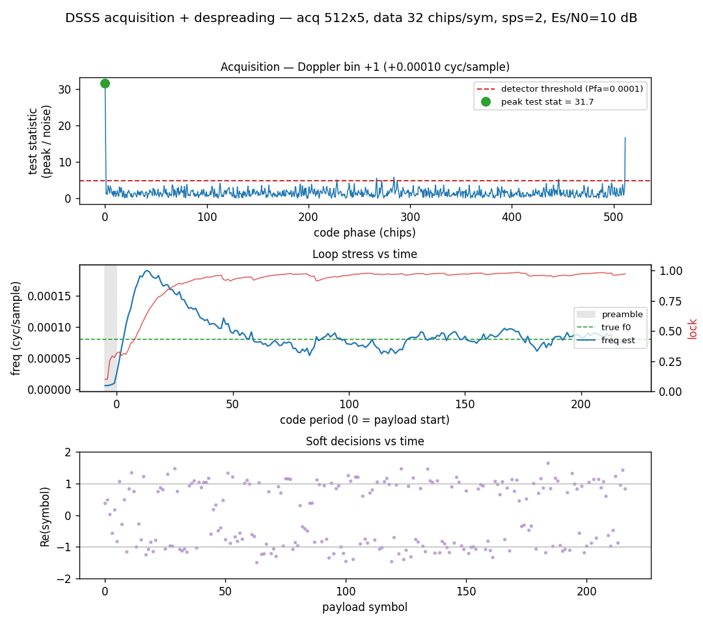

# DSSS Acquisition & Despreading



A complete direct-sequence spread-spectrum (DSSS) BPSK receiver: acquire the
burst, then track and despread it. The transmit burst is an **acquisition
preamble** — 5 repetitions of a long (512-chip) acquisition code, unmodulated —
followed by a **payload** spread by a *distinct*, shorter (32-chip) data code.
`Es/N0 = 10 dB`, with a residual carrier offset.

## What you're seeing

**Top — Acquisition.** A 2-D (Doppler × code-phase) matched-filter search of the
preamble against the acquisition code, coherently summing the 5 periods, via
[`Corr`](../api/python-spectral.md). The plot is the **test statistic** (peak ÷ noise
estimate) across code phase at the winning Doppler bin. The sharp peak clears the
**CFAR detector threshold** (red dashed) from
[`det_threshold`](../api/python-detection.md) — the signal is declared present, and the
peak `(Doppler bin, code phase)` seeds the despreader.

**Middle — Loop stress vs time.** The carrier-frequency estimate (blue) pulling
onto the true offset (green dashed) while the lock metric (red) ramps to 1. The
preamble (shaded) is where `set_acq` pulls the loops in coherently — the
unmodulated repeated code gives a full ±π carrier discriminator — before the
payload begins.

**Bottom — Soft decisions vs time.** The complex prompt symbol's real part as
dots, clustering on ±1 (a 180° flip is don't-care).

## How it works

The receiver is built from two new objects:

- [`track.LoopFilter`](../api/python-track.md) — a reusable 2nd-order PI loop filter,
    the shared engine of the code and carrier loops.
- [`dsss.BurstDespreader`](../api/python-dsss.md) — carrier wipe-off (Costas) + an
    early/prompt/late delay-locked loop (DLL), integrate-and-dump per code period.

```python
import numpy as np
from doppler.dsss import BurstDespreader

# A real DSSS-BPSK payload: 40 symbols spread by a 32-chip data code at 2
# samples/chip, plus the long acq code that seeds the preamble pull-in.
rng = np.random.default_rng(0)
data_code = rng.integers(0, 2, 32).astype(np.uint8)
acq_code = rng.integers(0, 2, 512).astype(np.uint8)
dsig = np.where(data_code & 1, -1.0, 1.0)
syms = (rng.integers(0, 2, 40) * 2 - 1).astype(float)
rx = np.repeat(np.concatenate([s * dsig for s in syms]), 2).astype(
    np.complex64
)
acq_freq, acq_chip = 0.0, 0.0  # seeded from acquisition (genie here)

# seed from acquisition: norm_freq (cycles/sample), chip phase (chips)
d = BurstDespreader(data_code, sf=32, sps=2,
               init_norm_freq=acq_freq, init_chip_phase=acq_chip)
d.set_acq(acq_code, acq_reps=5)    # preamble-aided pull-in (optional)
symbols = d.steps(rx)              # complex prompt symbols
bits    = d.bits(rx)              # or hard BPSK decisions
```

The despreader is seeded by acquisition and is transport-agnostic: its cf32
symbol output chains over the `stream` module's `dp_header_t` framing like any
other DSP block.

Source: `src/doppler/examples/dsss_despread_demo.py`.
