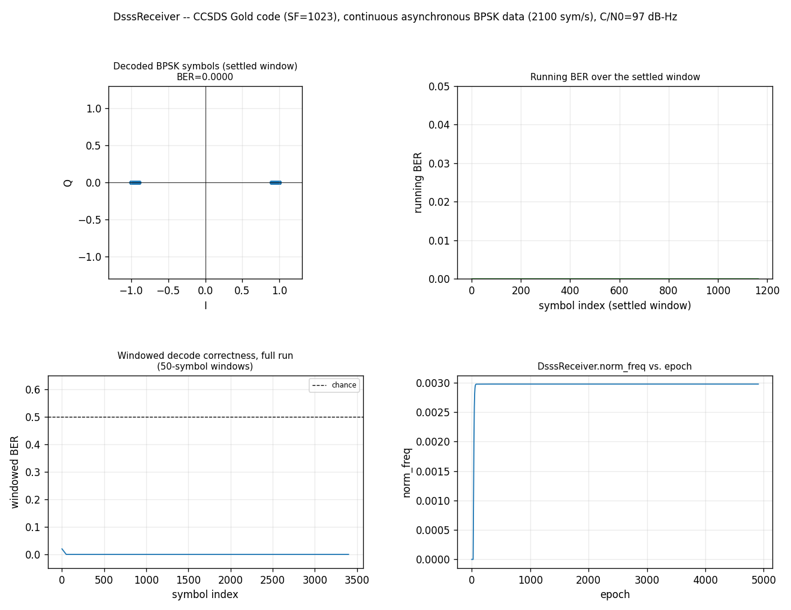

# DsssReceiver — the Composed Continuous DSSS Receiver



The single-object payoff of the story that began with
[DSSS Acquisition: Continuous Async-Data Modulation](dsss-acq-async-data.md)
(Stage 1), continued through
[DSSS Despread: Continuous Async-Data Hand-off](dsss-despread-async-data.md)
(Stage 2), and closed the loop in
[Continuous Async DSSS Receiver](async-dsss-receiver.md) (Stage 3):
`Acquisition -> Dll(segments) -> RateConverter -> MpskReceiver`, now
composed into one C object,
[`DsssReceiver`](../api/python-dsss.md). Same CCSDS Gold-code signal and
operating point (CN0=97 dB-Hz, SEED=6) as Stage 3 — this page isn't a new
finding, it's everything Stage 3 hand-composed across four objects
(the `_new_acq()`/`_new_chain()`/`_receive()` helpers, the phase-inversion
hand-off, the `RateConverter` bridge) collapsed into one object and one
`steps()` call.

## A simple API, with escape hatches

Only `code`/`chip_rate`/`symbol_rate` are required — everything else is a
physically-motivated default, the same "easy path derives, raw path pins"
shape `Acquisition`/`Dll` already use:

```python
--8<-- "src/doppler/examples/dsss_receiver_demo.py:receiver"
```

`segments`/`sps` default to Stage 2/3's own validated values (4 and 8);
this page passes them explicitly for clarity, not because they're
required. Three escape hatches cover the power-user surface:

- `configure_search_raw(doppler_bins, n_noncoh)` — pins the embedded
    Acquisition's search grid directly, forwarding to
    `Acquisition.configure_search_raw`.
- `configure_lock_raw(...)` — re-tunes the embedded Dll's code-lock
    detector directly, forwarding to `Dll`'s own raw lock configuration.
- `configure_chain_raw(segments, sps, n)` — pins the despread/resample/
    demod grid directly, bypassing the create-time `segments`/`sps`
    defaults, still bridged by a freshly-sized `RateConverter` — the one
    composition-specific knob this object adds beyond its children's own.

## How it works

```python
--8<-- "src/doppler/examples/dsss_receiver_demo.py:signal"
```

```python
--8<-- "src/doppler/examples/dsss_receiver_demo.py:stream"
```

`steps()` streams raw samples through whichever child is currently
active: while searching, samples feed the embedded Acquisition and
nothing is emitted (an empty array is normal, not an error). The moment a
hit fires, `Dll`/`RateConverter`/`MpskReceiver` are built and seeded from
it — the exact phase-inversion hand-off and rate-bridging Stage 2/3
validated by hand — and the **unconsumed tail of that same call** is
handed straight to them, so no samples are dropped at the transition.
While tracking, samples feed `Dll -> RateConverter -> MpskReceiver` in
sequence and demodulated symbols come back. `steps()` accepts any block
size; state carries across calls.

## What you're seeing

Same four panels as Stage 3, now produced by one object: decoded BPSK
constellation (settled window), running BER (settled window), windowed
decode correctness across the full run, and `DsssReceiver.norm_freq` vs.
epoch — flat at zero through the searching phase (the placeholder chain's
own untracked value), then pulling in from the Acquisition-quantized seed
to the true residual Doppler the moment the receiver locks.

## Also serializable, like every stateful object in this codebase

`DsssReceiver` composes four children's state into one blob
(`state_bytes()`/`get_state()`/`set_state()`), a fixed shape whether
searching or tracking — the layout doesn't change, only the values do,
so a receiver mid-search and one already locked serialize and restore
through the identical interface.

Source: `src/doppler/examples/dsss_receiver_demo.py`. See also
[DSSS Acquisition: Continuous Async-Data Modulation](dsss-acq-async-data.md)
(Stage 1), [DSSS Despread: Continuous Async-Data Hand-off](dsss-despread-async-data.md)
(Stage 2), and [Continuous Async DSSS Receiver](async-dsss-receiver.md)
(Stage 3, the hand-composed reference this object's C core mirrors).
