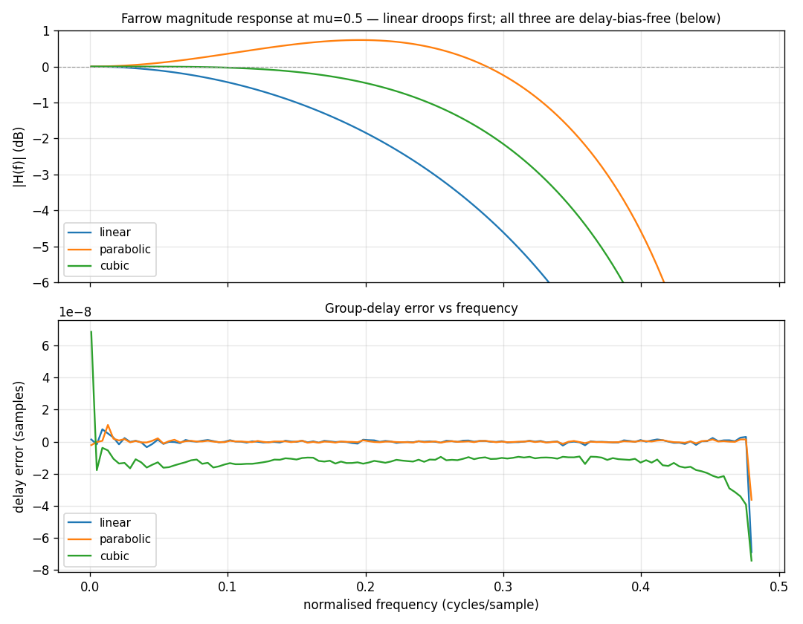

# Farrow Interpolator



A [`resample.Farrow`](../api/python-resample.md) fractional-delay interpolator —
the lean, sample-by-sample alternative to a polyphase resampler when all you need
is a fractional tap (a symbol-timing loop's interpolator). It has three
selectable orders — `linear`, `parabolic`, `cubic` — sharing one 4-tap delay
line and a fixed 2-sample group delay, so a driving timing loop is
order-agnostic.

The plot sweeps a tone across the band, interpolates it at a half-sample delay
(`µ = 0.5`, the worst case), and measures the interpolator's response per order.

## What you're seeing

**Top — Magnitude response.** `|H(f)|` in dB. An ideal fractional delay is 0 dB
everywhere. Linear droops first; the symmetric piecewise-parabolic carries a
slight passband bump but holds the band further; cubic is flattest near DC.
Higher order buys usable bandwidth for a few more taps.

**Bottom — Group-delay error.** All three are **symmetric about the
interpolation point**, so the realised delay matches the requested `µ` to within
float noise (the axis is ×10⁻⁸) across the whole band — no timing bias. That
linear-phase property is exactly why these interpolators suit a timing loop: the
loop estimates `µ`, the interpolator delivers *that* delay without skewing it.

## How it works

Each order is a polynomial in `µ` (Horner form) over the 4-tap window; the
fractional offset `µ ∈ [0,1)` comes from an **integer timing NCO** (the post-wrap
accumulator value), so the timing accumulation stays exact while only the
interpolation is floating point.

```python
import numpy as np

from doppler.resample import Farrow

x = np.exp(2j * np.pi * 0.05 * np.arange(256)).astype(np.complex64)

f = Farrow(order="cubic")          # "linear" | "parabolic" | "cubic"
y = f.delay(x, mu=0.3)             # constant fractional delay mu of a block
# or drive it sample-by-sample for a timing loop:
#   farrow_push(x[n]) every sample; farrow_eval(mu) on a symbol strobe
```

This is the interpolation half of a symbol synchronizer: the integer NCO gives
the symbol strobe and `µ` for free on overflow, and the Farrow produces the
sample at that instant.

Source: `src/doppler/examples/farrow_demo.py`.
