# Gallery

Output plots from the example scripts in `examples/python/`.
Run `make gallery` to regenerate all images.

- **[wfmgen — One Engine, Every Waveform](wfmgen.md)**

    ______________________________________________________________________

    [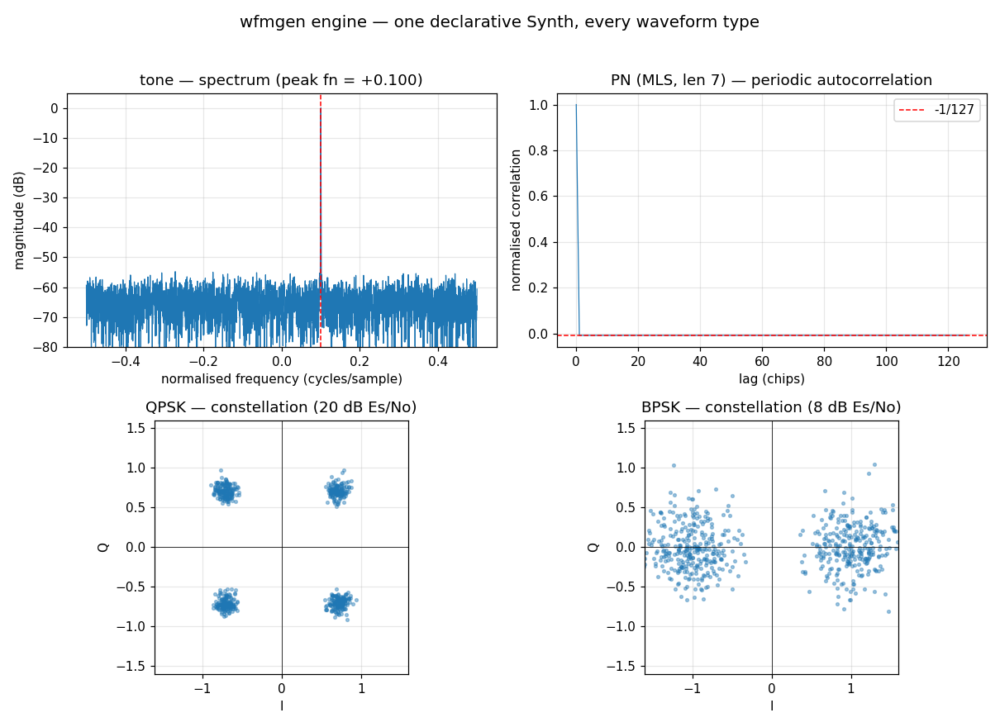](wfmgen.md)

    Tone, PN (MLS thumbtack), QPSK and BPSK constellations from one
    declarative `Synth` — the engine behind the `wavegen`/`wfmgen` tools.

    [:octicons-arrow-right-24: Walkthrough](wfmgen.md)

- **[Composing a Scene — sum, add, headroom](wfm-composition.md)**

    ______________________________________________________________________

    [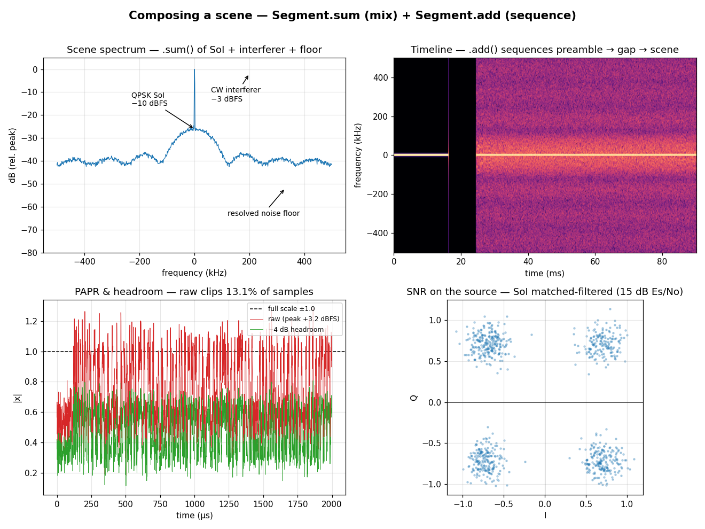](wfm-composition.md)

    A QPSK SoI under a CW interferer over one resolved noise floor
    (`.sum()`), sequenced after a preamble (`.add()`), with PAPR / clip /
    headroom and the SoI's Es/No.

    [:octicons-arrow-right-24: Walkthrough](wfm-composition.md)

- **[Four WCDMA Carriers — Welch & AccTrace](wcdma-carriers.md)**

    ______________________________________________________________________

    [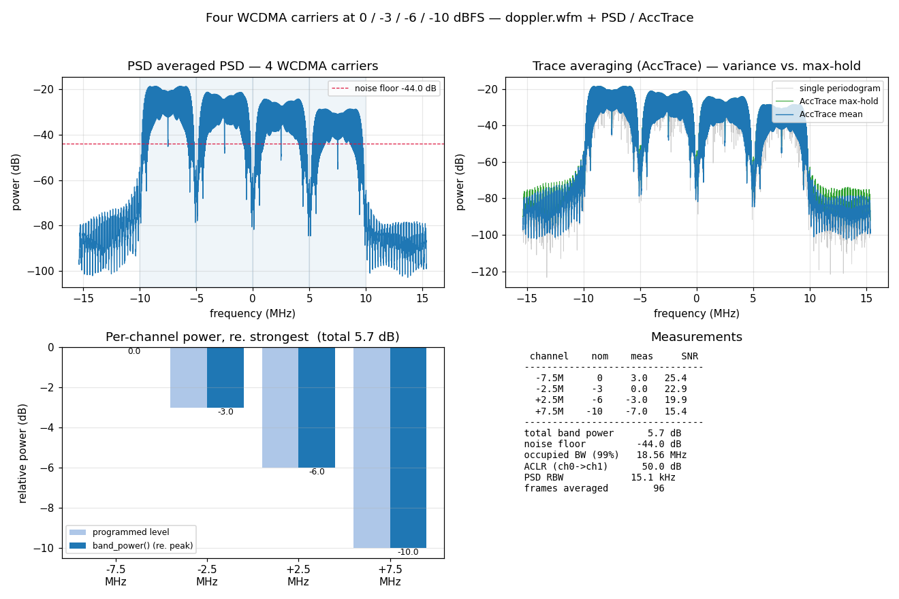](wcdma-carriers.md)

    Four RRC-shaped WCDMA channels at 0 / -3 / -6 / -10 dBFS, measured with
    `Welch` — averaged PSD, per-channel `band_power`, occupied bandwidth, SNR,
    ACLR — and `AccTrace` mean vs. max-hold.

    [:octicons-arrow-right-24: Walkthrough](wcdma-carriers.md)

- **[AGC — Step Response](agc.md)**

    ______________________________________________________________________

    [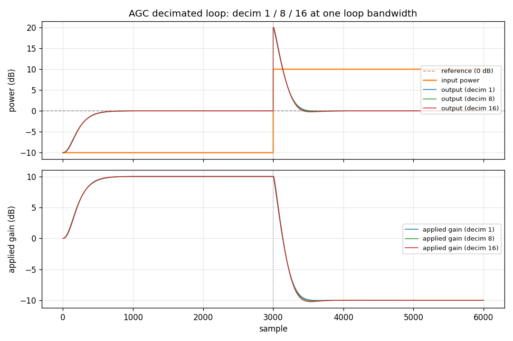](agc.md)

    20 dB power step tracked within ~350 samples. All three
    decimation settings converge identically.

    [:octicons-arrow-right-24: Walkthrough](agc.md)

- **[CIC Decimation Filter](cic.md)**

    ______________________________________________________________________

    [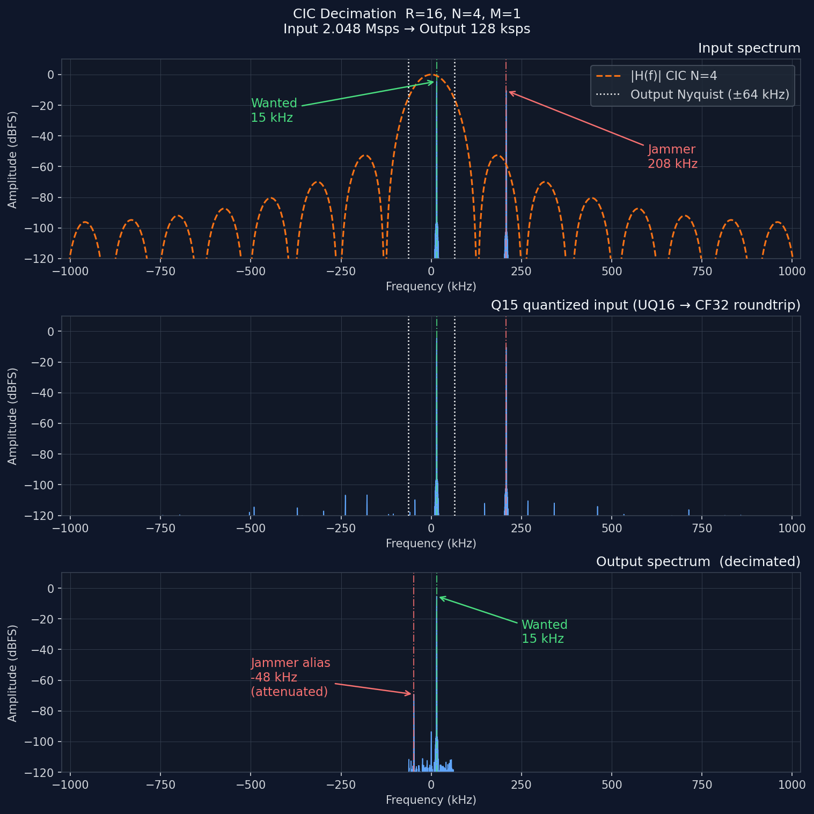](cic.md)

    Wideband IQ → CIC → narrowband slice. Jammer alias attenuated
    ~90 dB; offset-binary UQ16 integer pipeline shown in middle panel.

    [:octicons-arrow-right-24: Walkthrough](cic.md)

- **[Q15 vs UQ15 Quantization](q15-uq15.md)**

    ______________________________________________________________________

    [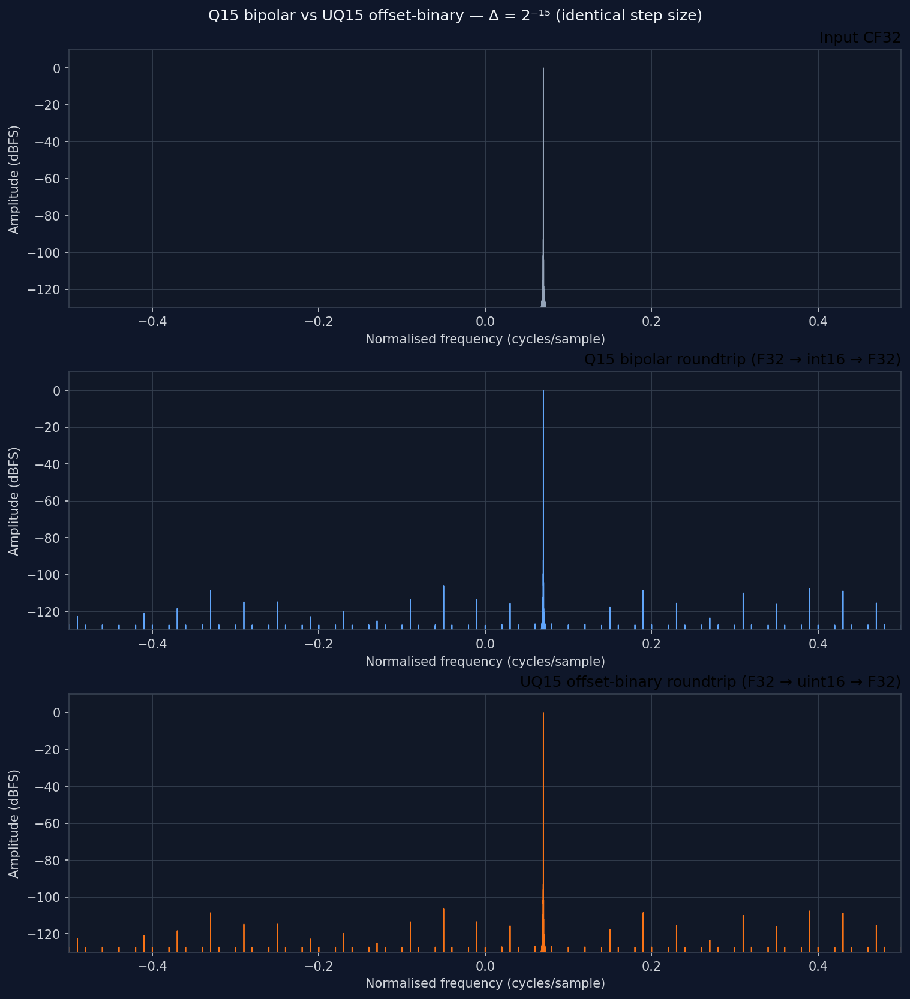](q15-uq15.md)

    Bipolar and offset-binary encodings of the same Q15 step — identical
    noise floor, different integer conventions.

    [:octicons-arrow-right-24: Walkthrough](q15-uq15.md)

- **[cvt Quantization Noise](cvt-quantization.md)**

    ______________________________________________________________________

    [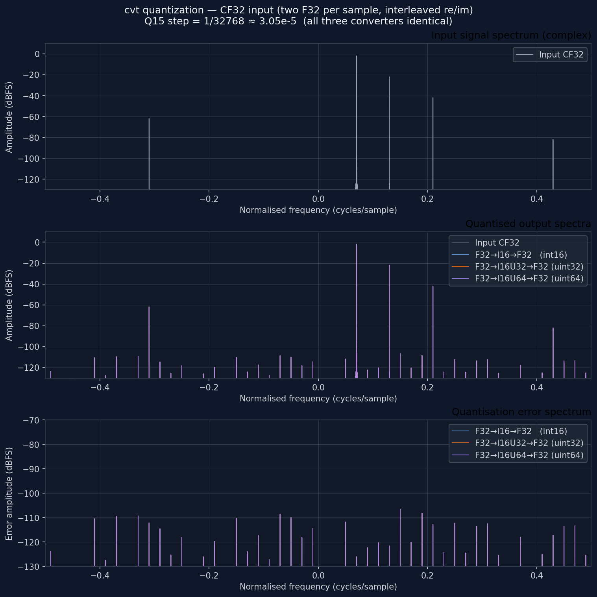](cvt-quantization.md)

    All three cvt formats (I16, I16U32, I16U64) overlaid — identical
    Q15 noise floor across 80 dB dynamic range.

    [:octicons-arrow-right-24: Walkthrough](cvt-quantization.md)

- **[Correlation and Detection](corr.md)**

    ______________________________________________________________________

    [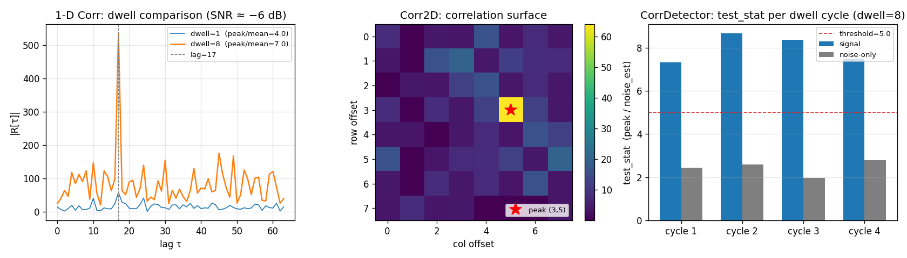](corr.md)

    Coherent integration, 2-D template matching, and streaming
    CFAR detection in one run.

    [:octicons-arrow-right-24: Walkthrough](corr.md)

- **[Detection Theory Curves](detection-curves.md)**

    ______________________________________________________________________

    [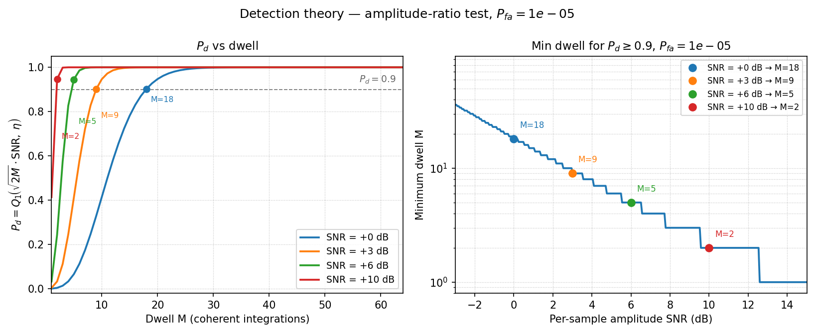](detection-curves.md)

    Pd vs SNR and Pd vs dwell from closed-form Marcum Q. Every
    3 dB SNR halves the required dwell.

    [:octicons-arrow-right-24: Walkthrough](detection-curves.md)

- **[Monte Carlo vs Marcum Q](detection-sim.md)**

    ______________________________________________________________________

    [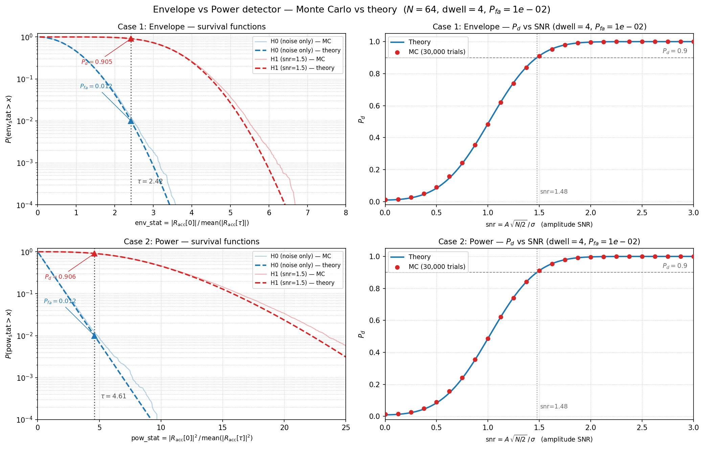](detection-sim.md)

    30 000 trials per SNR point. Empirical survival functions and
    Pd vs SNR match theory throughout.

    [:octicons-arrow-right-24: Walkthrough](detection-sim.md)

- **[2-D Acquisition Grid](detection2d.md)**

    ______________________________________________________________________

    [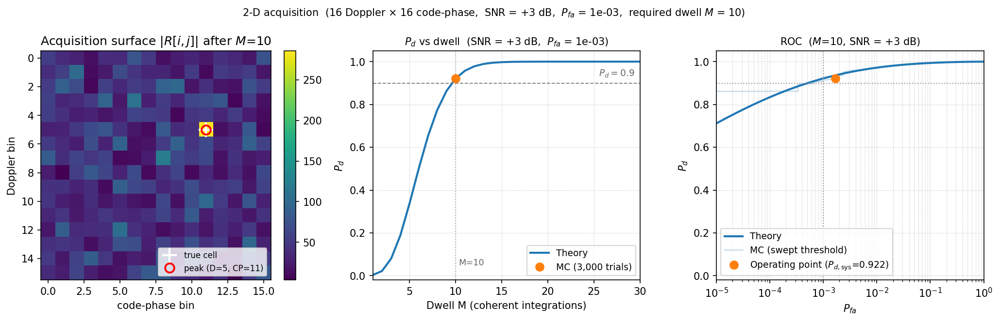](detection2d.md)

    GPS/CDMA-style 16 × 16 Doppler × code-phase search in one
    FFT2 call. Bonferroni-corrected CFAR.

    [:octicons-arrow-right-24: Walkthrough](detection2d.md)

- **[RateConverter — Cascade Selection](rate-converter.md)**

    ______________________________________________________________________

    

    CIC, halfband, and polyphase Resampler stages selected automatically
    by rate ratio. Tone-frequency preservation verified across four regimes.

    [:octicons-arrow-right-24: Walkthrough](rate-converter.md)

- **[Functional DDCR — Real to Baseband](ddc-fn.md)**

    ______________________________________________________________________

    [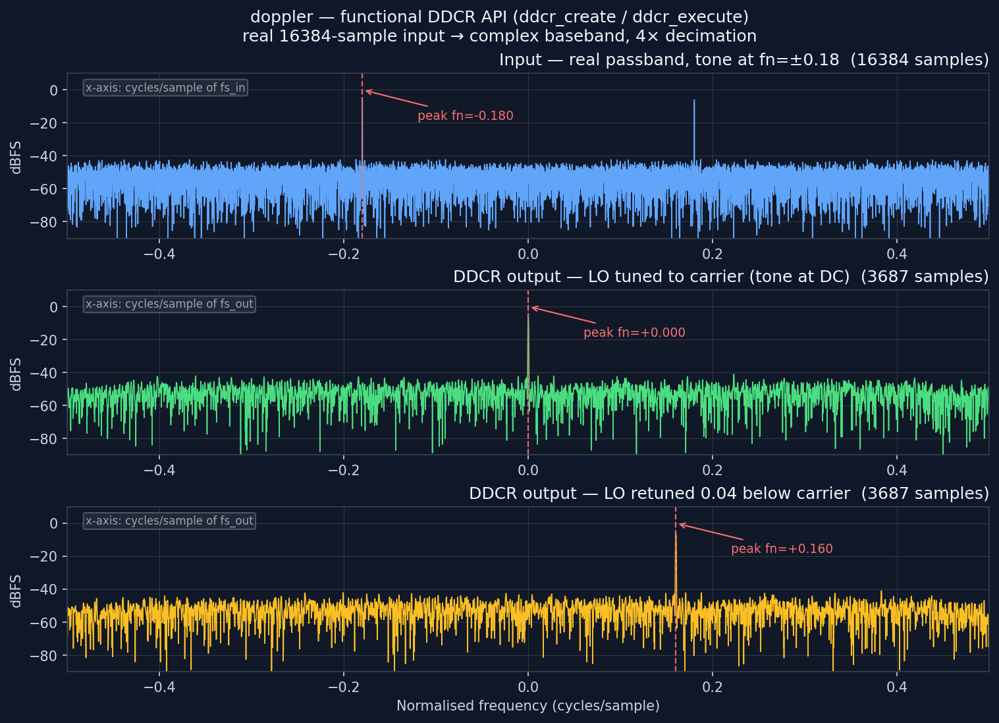](ddc-fn.md)

    The capsule-state `ddcr_*` API: real passband in, complex baseband out,
    4× decimation. Carrier parked at DC, retuned phase-continuously, plus a
    GIL-released thread-per-shard core-scaling curve.

    [:octicons-arrow-right-24: Walkthrough](ddc-fn.md)

- **[HBDecimQ15 — Fixed-Point Halfband](hbdecim_q15.md)**

    ______________________________________________________________________

    [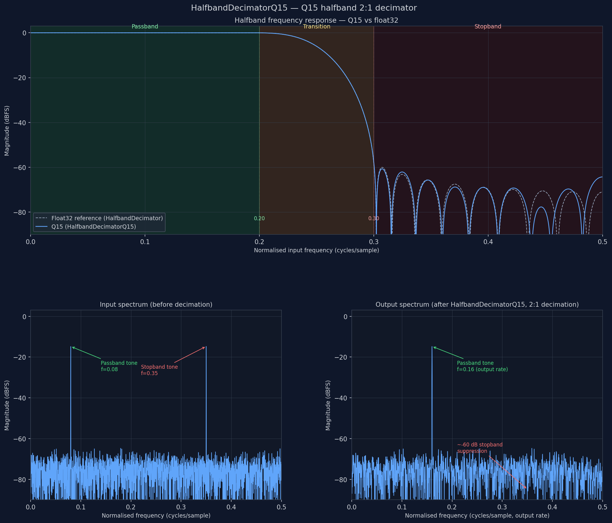](hbdecim_q15.md)

    Q15 halfband 2:1 decimator for interleaved IQ int16. AVX2
    two-pass madd inner loop; passband flat, stopband −60 dB.

    [:octicons-arrow-right-24: Walkthrough](hbdecim_q15.md)

- **[ADC Quantisation — 3–8 Bits](adc.md)**

    ______________________________________________________________________

    [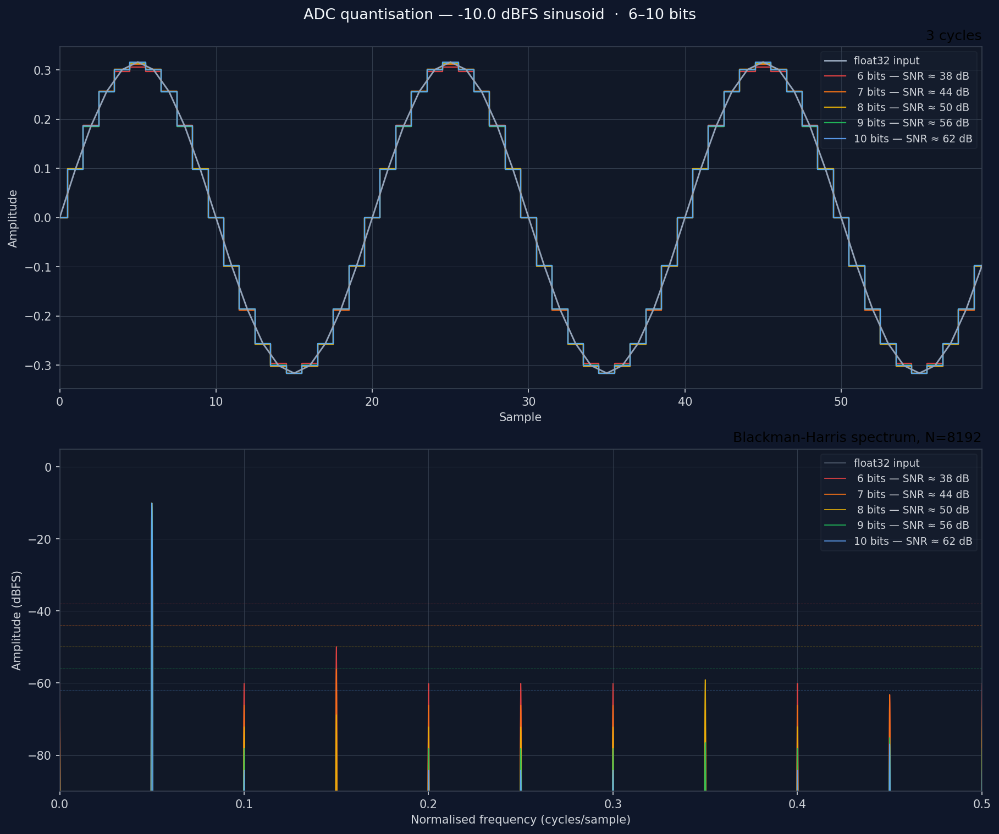](adc.md)

    Staircase resolution and spectral noise floor across six bit depths.
    Each additional bit halves the step size and drops noise by 6 dB.

    [:octicons-arrow-right-24: Walkthrough](adc.md)

- **[Measurement Suite — ADC Characterisation](measure.md)**

    ______________________________________________________________________

    [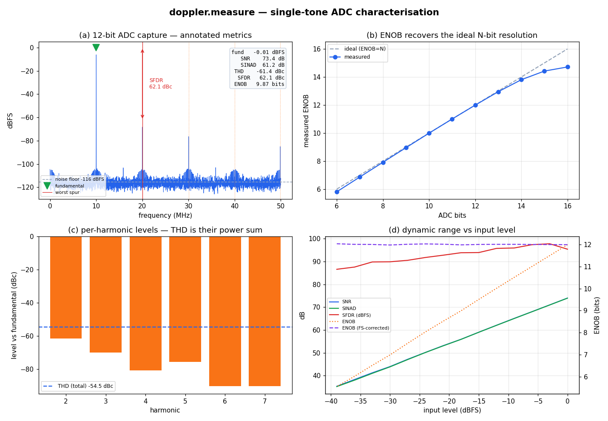](measure.md)

    SNR / SINAD / THD / SFDR / ENOB from `ToneMeasure` with window-main-lobe
    integration — an annotated spectrum, ENOB-vs-bits recovery, and a
    dynamic-range sweep.

    [:octicons-arrow-right-24: Walkthrough](measure.md)

- **[AWGN Generator](awgn.md)**

    ______________________________________________________________________

    [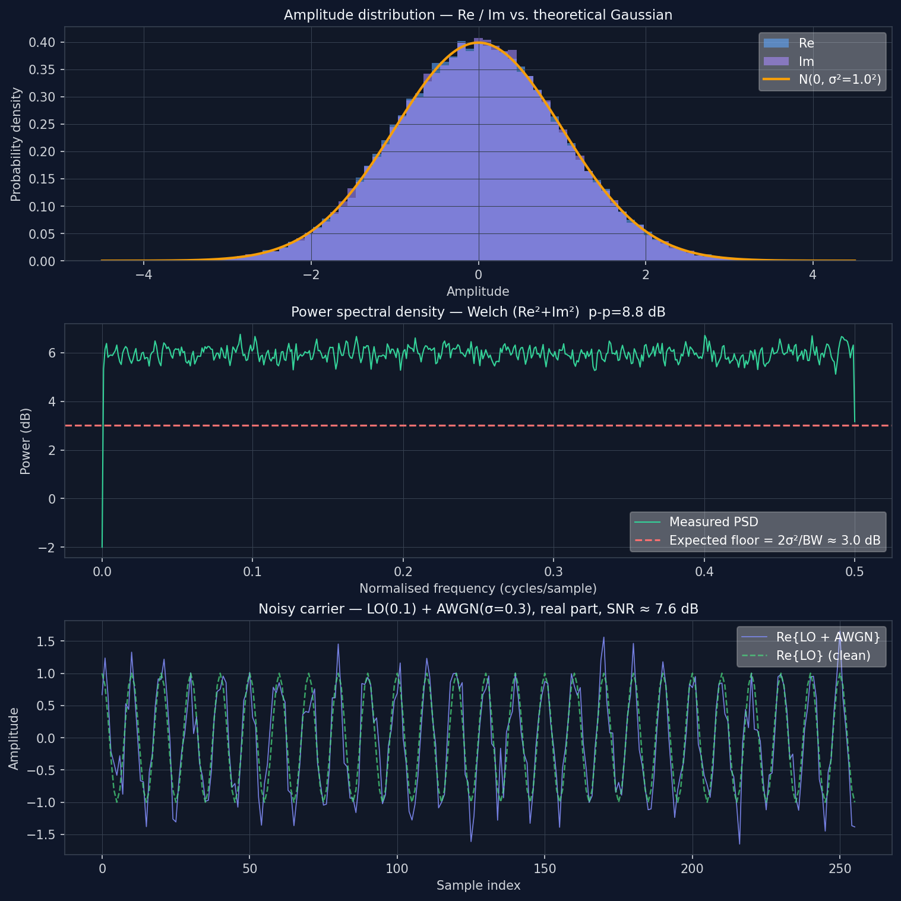](awgn.md)

    Complex AWGN from the Box-Muller generator — the amplitude histogram
    against the theoretical Gaussian PDF and the flat power spectral density.

    [:octicons-arrow-right-24: Walkthrough](awgn.md)

- **[Waveform I/O — One Capture, Four Containers](wfm-io.md)**

    ______________________________________________________________________

    

    The same QPSK capture written to **raw**, **CSV**, **BLUE** and **SigMF**
    and read back with `read_iq` — the C codec behind `wfmgen --file_type`.

    [:octicons-arrow-right-24: Walkthrough](wfm-io.md)

