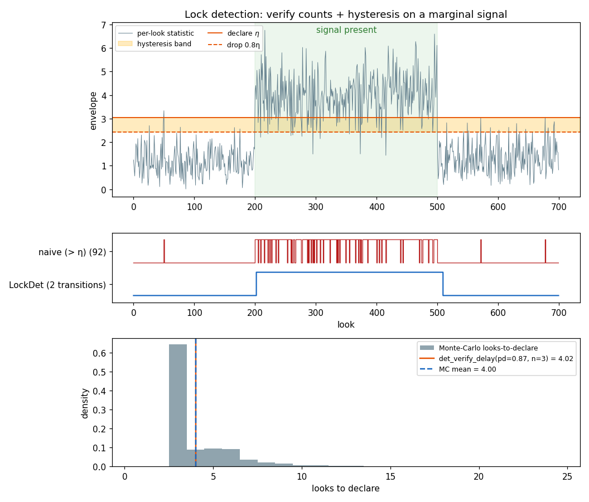

# Lock Detection: Verify Counts + Hysteresis



## What you're seeing

**Top — a per-look envelope statistic** through signal-off →
marginal-signal → signal-off. During the signal segment the per-look
detection probability is deliberately marginal (`pd ≈ 0.87`): most
looks clear the declare threshold `η`, but one look in seven misses.
The shaded band between the declare threshold and the 0.8η drop
threshold is the **level hysteresis** — a metric inside it advances
neither a declare nor a drop.

**Middle — the two flags.** The naive single-comparison flag
(`metric > η`) — how every loop's lock indicator starts life —
transitions **92 times** on this trace: it chatters on every marginal
miss and false-alarms in the noise segments. The
[`LockDet`](../api/python-detection.md#lock-verification) flag,
driven by the *same* per-look statistic, transitions exactly
**twice**: one declare, one drop.

**Bottom — the price, predicted.** Time hysteresis is not free: a
declare needs `n_up` consecutive hits, which costs latency. The
Monte-Carlo looks-to-declare distribution (4 000 trials) has mean
**4.00 looks** against the closed-form
`det_verify_delay(pd, n_up)` prediction of **4.02** — the cost of the
chatter-free flag is known before you run anything.

## How it works

Consecutive independent looks compound: `n` looks at per-look
probability `p` reach `p^n`. That single fact turns both verify
counts into *derived* quantities instead of tuned magic numbers:

- **Declare side** — at a per-look false-alarm rate of `1e-2`, three
    consecutive hits compound to `1e-6`: a loose (cheap, fast) per-look
    threshold plus a verify count of 3 buys the same false-declare
    protection as a much higher single-look threshold, at a fraction of
    the missed-detection cost.
- **Drop side** — while locked, a drop needs `n_down` consecutive
    looks *below the 0.8η band*. At `pd ≈ 0.87` the probability of a
    look falling below 0.8η is ~0.05, so ten straight misses is a
    ~`1e-13` event per window — the lock survives any realistic fade
    wobble, yet a true signal loss (where that probability jumps to
    ~0.95 per look) drops the flag within ~15 looks.

The whole rule is sized from budgets, end to end:

```python
from doppler.detection import (
    LockDet,
    det_threshold,
    det_verify_count,
    det_verify_delay,
)

# per-look threshold from the per-look false-alarm rate
eta = det_threshold(1e-2)
assert round(eta, 3) == 3.035

# declare count from the compound false-declare budget: (1e-2)^3 = 1e-6
n_up = det_verify_count(1e-2, 1e-6)
assert n_up == 3

# the latency that buys, at a per-look pd of 0.9: ~3.7 looks on average
assert round(det_verify_delay(0.9, n_up), 2) == 3.72

# the rule itself: level hysteresis (two thresholds) + time hysteresis
d = LockDet(up_thresh=eta, down_thresh=0.8 * eta, n_up=n_up, n_down=10)
assert [d.step(5.0), d.step(5.0), d.step(5.0)] == [0, 0, 1]  # 3rd hit locks
assert d.step(2.8) == 1  # inside the band: sticky, no drop progress
```

`LockDet` is the Python face of the embeddable C leaf
(`native/inc/lockdet/lockdet_core.h`): a pointer-free POD with a
force-inline step, designed to live *inside* a tracking loop's state
struct. Two shipped loops already run on it:

- the [DLL](dll.md)'s always-on code-lock detector steps it on the
    CFAR statistic at each N-look decision
    (`Dll.configure_lock` derives `n_up` from the pfa exactly as
    above), and
- the [M-PSK receiver](mpsk-receiver.md)'s acquisition↔tracking
    handover steps it on the carrier lock metric each recovered symbol
    — two-way: 8 straight above-threshold symbols hand over, 32
    straight below the drop threshold fall back to NDA acquisition.

## Run it

```bash
python src/doppler/examples/lockdet_demo.py   # → lockdet_demo.png  (~10 s)
```

See the [detection API](../api/python-detection.md) for the full
derived chain — C/N0 → `(pd, pfa)` → thresholds
(`det_threshold_*`), verify counts (`det_verify_count`), declare
latency (`det_verify_delay`), and smoothing bandwidth
(`det_ema_alpha`).
