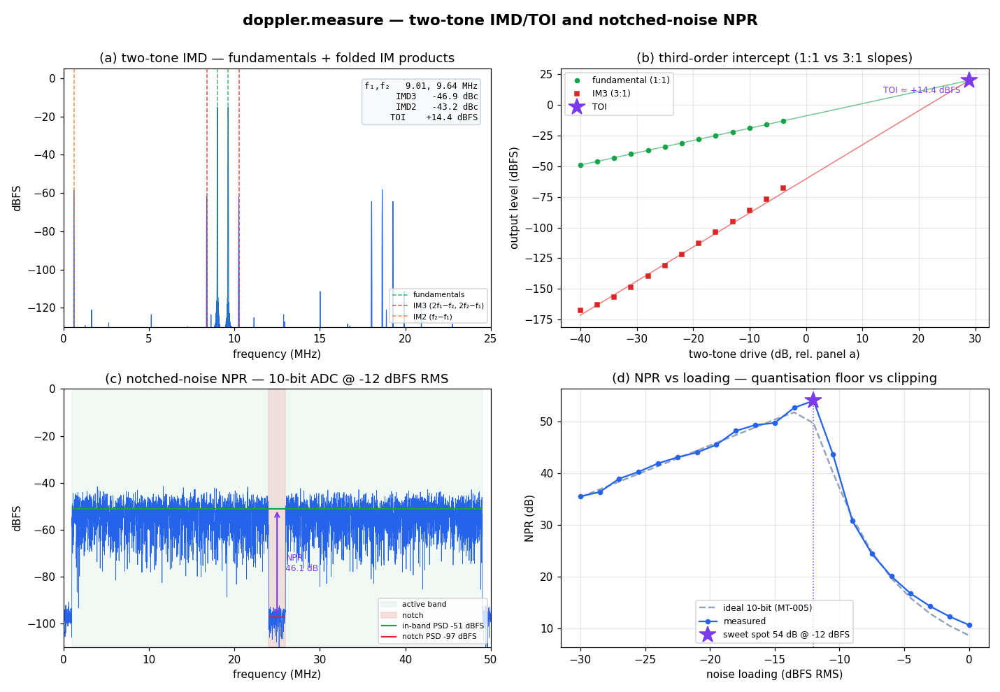

# Measurement Suite — two-tone IMD/TOI & notched-noise NPR



The other two analysers in `doppler.measure` — `IMDMeasure` (two-tone
intermodulation and the third-order intercept) and `NPRMeasure` (notched-noise
Noise Power Ratio) — the standard tests for a converter's large-signal linearity
under multi-carrier loading. The companion to the single-tone
[ADC characterisation](measure.md) page.

## What you're seeing

**(a) Two-tone IMD spectrum.** Two equal tones pass through a weak polynomial
nonlinearity. `IMDMeasure` finds the two fundamentals and integrates the folded
intermodulation products over their main lobes — **IM2** at `f₂−f₁` and **IM3**
at `2f₁−f₂` / `2f₂−f₁`. One `analyze()` call returns `imd2_dbc`, `imd3_dbc`, the
product frequencies, and the intercepts.

**(b) Third-order intercept.** As the two-tone drive rises, the fundamental
climbs **1:1** and IM3 climbs **3:1**; extrapolating the two slopes to their
crossing gives the **TOI** (`toi_dbfs`) — the canonical large-signal linearity
figure of merit, reported directly so you don't have to fit it yourself.

**(c) Notched-noise NPR spectrum.** Broadband (≈full-Nyquist) noise with a
carved notch is driven into a 10-bit ADC. `NPRMeasure` averages the in-band PSD
and the noise that quantisation + distortion has dumped into the notch; **NPR**
is their ratio (`npr_db`), with the active-band / notch geometry passed as
`analyze()` arguments plus a guard keep-out around the notch edges.

**(d) NPR vs loading — measured vs. the ideal.** NPR plotted against **RMS**
loading (the convention; the Gaussian peak runs ~12–13 dB higher), overlaid with
the ideal-quantiser curve from [ADI MT-005](https://www.analog.com/media/en/training-seminars/tutorials/mt-005.pdf)
(Gray–Zeoli granular `q²/12` + Gaussian-overload model). At low loading the notch
floor is quantisation-limited (NPR climbs 6 dB/octave); past the clipping knee
distortion fills the notch (NPR falls). The measured curve tracks the ideal and
peaks at the optimal loading — ≈ −13 dBFS RMS, ≈ 52 dB for 10 bits.

## Reproduce

```sh
python src/doppler/examples/measure_imd_npr_demo.py
```

## The measurement objects

```python
from doppler.measure import IMDMeasure, NPRMeasure

# Two-tone IMD / third-order intercept
imd = IMDMeasure(n=n, fs=fs, beta=12.0)
r = imd.analyze(two_tone_capture)
r.imd3_dbc, r.imd2_dbc, r.toi_dbfs        # products + intercept (dBFS)
r.imd3_lo_freq, r.imd3_hi_freq            # folded 2f₁−f₂, 2f₂−f₁

# Notched-noise NPR — band/notch edges (Hz) + a guard keep-out are call args
npr = NPRMeasure(n=n, fs=fs, full_scale=2.0**9)
g = npr.analyze(codes, active_lo, active_hi, notch_lo, notch_hi, guard_hz)
g.npr_db, g.inband_psd_dbfs, g.notch_psd_dbfs
```

See the [design guide](../design/measurement-suite.md) for the windowing,
main-lobe integration and calibration conventions, and the
[Python API](../api/python-measure.md) for the full field list.
