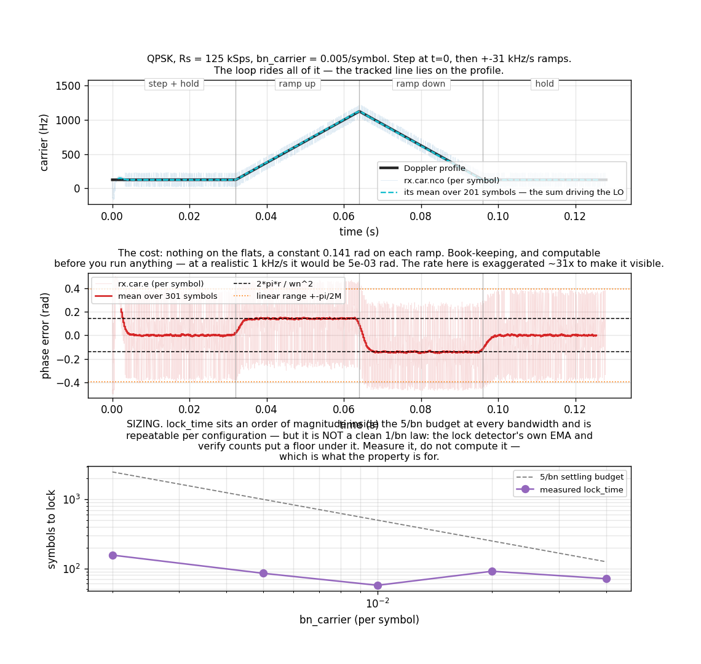

# M-PSK Receiver — Sizing the Carrier Loop, and Riding a Doppler Profile



A [`track.MpskReceiver`](../api/python-track.md) is handed a carrier that steps,
then ramps up, then ramps down, then holds. It rides all of it.

The practical question is not whether it copes — it does — but **how to size
`bn_carrier` so acquisition happens in a time you can plan around**, and what
the profile costs once it has. The short answers: a step is free, a ramp is
very cheap, and acquisition time is something to **measure**, not compute.

## A step is free; a ramp is very cheap

The carrier loop filter is **type 2** — a PI filter feeding a phase
accumulator. Against a frequency **step** its steady-state phase error is zero
*regardless of loop gain*. Against a **ramp** it holds a constant phase offset:

$$
\theta_{ss} = \frac{2\pi r}{\omega_n^2},
\qquad
\omega_n = \frac{8\zeta\,b_n}{4\zeta^2+1} = 1.8857\,b_n \ \ (\zeta = 0.707)
$$

with $r$ the Doppler **rate** in cycles/symbol². That is the middle panel, and
the measured mean lands within 1% of the closed form on both ramps.

**It is book-keeping.** At the figure's settings the offset is 0.141 rad, but
that rate is exaggerated ~31× to make it visible at all: at a realistic
**1 kHz/s** the same formula gives **4.5e-3 rad**, roughly 1% of the
discriminator's $\pi/2M$ linear range. It costs no decisions. You can compute
it before you run anything, and usually then ignore it.

The offset only matters when it approaches that linear range — which is the
real Doppler-rate ceiling of a given `bn_carrier`, and since $\theta_{ss}$ goes
as $1/\omega_n^2$, the maximum trackable rate goes as $b_n^2$.

## Sizing: measure the acquisition time, do not compute it

The bottom panel is the decision that actually matters. Acquisition sits an
order of magnitude inside the classical `5/bn` settling budget at every
bandwidth, and is **repeatable per configuration** — the seed-to-seed spread is
a few percent.

But it is **not a clean 1/bn law**, and the page says so because the tidy
version is tempting and wrong. Measured across five seeds, `bn = 0.01` comes
out *bimodal* (140/140/139/57/57) and the trend is not monotonic. The lock
detector has its own dynamics — an EMA at `CARRIER_NDA_LOCK_ALPHA = 0.05` and a
verify count in each direction — which puts a floor under the loop's settling
and makes declaration a threshold crossing rather than a settling time.

So: pick `bn_carrier` from the loop bandwidth your link needs, then read
[`lock_time`](../api/python-track.md) back for your configuration. That is what
the property exists for.

```text
rx = MpskReceiver(m=4, sps=8, m_out=4, bn_carrier=0.005)
rx.steps(iq)
rx.lock_time  # symbols to the FIRST lock declaration, or -1 if never
```

## The top panel plots the sum, not the integrator

`rx.car.nco` is the command that actually drives the LO: `integ + kp*e`.
`rx.car.freq` is the **integrator alone** — the frequency *memory*, which is
what survives a handover — and on a ramp the two differ by exactly the
proportional term. Measured on the ramp up: the sum lags by 4.4e-06
cycles/sample against a 1.0e-03 excursion, the integrator by 3.3e-05, a factor
of 7.5.

Publishing only the integrator made a correctly-tracking loop look like it was
lagging, which is why the sum is now a probe in its own right.

Its per-symbol variance is large — that is the light band in the top panel —
because the proportional term carries the discriminator's full data noise. Its
**mean** is what tracks the ramp, exactly as `get_nco_freq()` documents.

## Why measure ramps at all, if they are cheap

Because a **step-only test cannot size a loop.** A type-2 loop nulls a step
whatever its gain, so a loop running several times narrower than configured
passes every step test unchanged. That is not hypothetical: it is how
`freq_scale` under-drove every non-`strobe` NDA tap in this library until a
ramp measurement found it
([gh-765](https://github.com/doppler-dsp/doppler/issues/765)).
`native/validation/rx_nda_tap.c` now gates the closed form on every tap.

## Telemetry, not reconstruction

Every trace is a probe the receiver already publishes, captured losslessly at
`decim=1` through [`Telemetry`](../api/python-telemetry.md) and a
`MemoryCapture`. Nothing here re-derives a loop internal from the output
symbols.

```python
--8<-- "src/doppler/examples/mpsk_doppler_profile_demo.py:profile"
```

## The step has to be one a cold loop can find

`F0_SYM` is 0.001 cycles/symbol, which is 0.8 of the `bn/M` seeding bound. Past
that bound an M-th-power NDA loop still acquires, but pull-in time grows as
$\Delta f^2/b_n^3$ — the first draft of this example used a step 6.4× the bound
and the receiver had not locked by the end of a 16 000-symbol record. If a cold
acquisition is taking implausibly long, that ratio is the first thing to check.

## Related pages

- [M-PSK Receiver](mpsk-receiver.md) — the constellation, lock and BER story.
- [M-PSK Receiver: Performance](mpsk-receiver-performance.md) — EVM, SER and
    lock time over random geometries.
- [Design note](../design/mpsk.md) — the two-clock architecture, the NDA taps,
    and where the discriminator reads.
