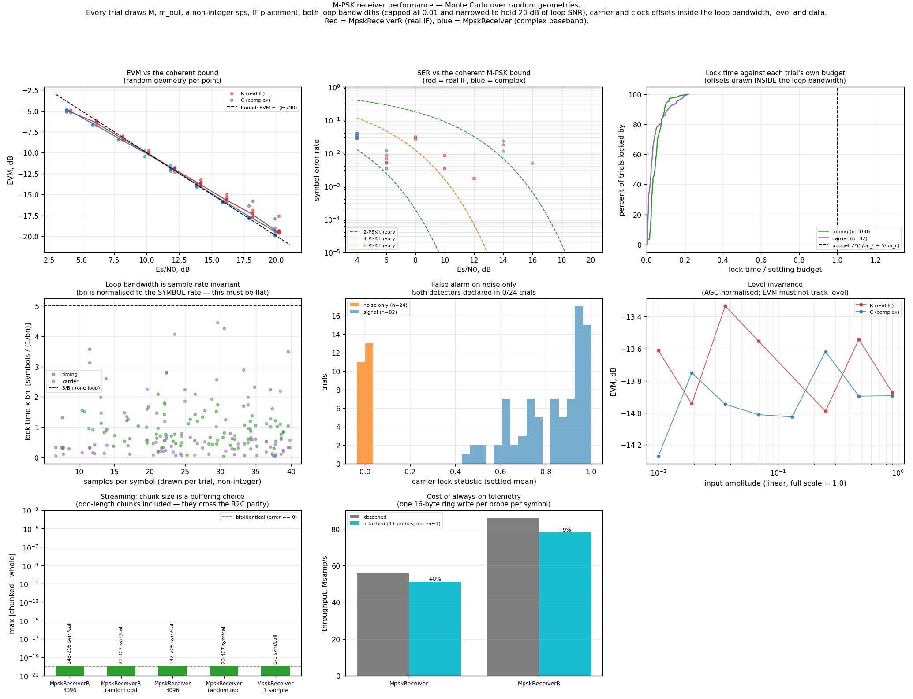

# M-PSK Receiver — Performance Characterisation



This is the receiver's characterisation, not a demo of it. Everything on the page
is measured over **randomly drawn geometries** rather than a fixed grid, on both
[`track.MpskReceiver`](../api/python-track.md) (complex baseband) and
[`track.MpskReceiverR`](../api/python-track.md) (real IF) — see the
[walkthrough page](mpsk-receiver.md) for what they are and the
[design note](../design/mpsk.md) for how they work.

Each trial independently draws the constellation order, `m_out`, a **non-integer**
samples-per-symbol, the IF placement, both loop bandwidths, the frequency and
clock offsets, the absolute level, and the data. That is the point:

!!! quote "Why random draws, not a grid"

    A grid measures the geometries you thought of. Random draws over the
    documented input domain either show you a clean distribution or hand you the
    outlier — and that is exactly how a real one hid here for weeks: at
    `sps = 10` with `m_out = 4` and an IF at 0.10, the occupied band reaches DC,
    where the real front end's image rejection collapses, and EVM falls to
    −4 dB. No grid of "reasonable" cases drew it.

## The measurement rules the panels obey

These are not incidental — get any of them wrong and the numbers look like DSP
defects. They are the same rules the [design note](../design/mpsk.md) and the
receiver's test harness encode.

| Rule                                      | Why                                                                                                                                                                                                                                                                                                                |
| ----------------------------------------- | ------------------------------------------------------------------------------------------------------------------------------------------------------------------------------------------------------------------------------------------------------------------------------------------------------------------ |
| **Settling = `2·(5/bn_t + 5/bn_c)`**      | 5/Bn per loop; the two **add** because they are cascaded (the carrier discriminator reads the on-time strobe, so it cannot converge until timing has); then double for joint tracking, where each loop sees the other's transient. Measuring from `5/bn` alone reads −9.0 dB where the settled answer is −23.2 dB. |
| **Offsets INSIDE the loop bandwidth**     | Seeded on truth, the loop never leaves its initial state and any lock time is meaningless. Asserted outside `Bn`, the test measures luck. Measured: carrier lock in 39 symbols at `0.25·Bn`, 1376 at `1·Bn`, **never** at `2·Bn`.                                                                                  |
| **Loop SNR ≈ 20 dB, `bn ≤ 0.01`**         | `ρ_L = Es/N0 + squaring_loss − 10log₁₀(bn)`. Below ~20 dB the loop is driven by noise: the estimate random-walks and the receiver **declares lock while producing chance-level symbols**. If you are short of it, narrow `bn` — never accept less.                                                                 |
| **Never widen `bn` for a shorter record** | `bn` is normalised to the **symbol** rate, so settling is a fixed number of symbols at any sample rate. Widening does not buy samples, it changes the receiver. A heavily oversampled case simply needs millions of samples — that is what [`wfmgen`](wfmgen.md) is for.                                           |
| **Anchor at SER = 1e-3**                  | Per-M that is 6.8 / 10.3 / 15.7 dB, which asks "does it meet its bound" at the same place on the curve for every order, instead of at one arbitrary Es/N0.                                                                                                                                                         |

## The panels

**EVM vs the coherent bound.** Self-referenced EVM — each symbol against its own
hard decision — against `EVM_dB = −(Es/N0)_dB`. EVM is an I/Q-plane quantity, so
there is no factor of two, and an EVM *beating* the bound means the measurement is
wrong. Median margin over the whole random sweep: **+0.1 dB**.

**SER vs the theoretical M-PSK bound.** Truth-referenced, with a lag and rotation
search, red for the real IF and blue for complex baseband. Paired with EVM
deliberately: a bit error rate alone is fragile in both directions, and it is the
**disagreement** between a truth-referenced rate and a truth-free EVM that carries
the diagnosis.

**Lock time against each trial's own budget.** Not an absolute symbol count — a
*fraction* of that trial's `2·(5/bn_t + 5/bn_c)`, which is the only way to compare
trials with different bandwidths. The demo asserts every trial at or above its own
SER = 1e-3 anchor declares lock.

**Loop bandwidth is sample-rate invariant.** Lock time in **symbols** against
samples per symbol — this panel must be **flat**. It is the direct check that `bn`
is normalised to the symbol rate, and the reason a heavily oversampled geometry
needs a longer record rather than a wider loop.

**False alarm on noise only.** Noise in, no signal: how often either detector
wrongly declares lock. Since the carrier lock statistic was
[limited](mpsk-receiver.md#where-lock_thresh-comes-from-a-pfa-not-a-guess) its
threshold maps to a false-alarm probability at every M — the default 0.5 is
4.42 σ, a per-look Pfa of 5.0e-6 — and this panel is where that is checked
end to end rather than asserted.

**Level invariance.** EVM across three decades of absolute input level. Both
receivers AGC-normalise internally, so EVM **must not track level**; a slope here
is a gain-staging bug.

**Streaming: chunk size is a buffering choice.** The same input pushed through in
arbitrary chunk sizes must produce a bit-identical output stream. Odd-length
chunks are included on purpose — they cross the real path's R2C halfband parity,
which is where a chunking bug would actually live.

**Cost of always-on telemetry.** Throughput with all 11 probes attached versus
fully detached: one 16-byte ring write per probe per symbol. Measured
**+8%** (complex) and **+9%** (real) — the interleaved, warmed-up numbers. A naive
A-then-B benchmark on this reported telemetry as 43% *faster*, because the lazy
output-buffer allocation is charged to whichever runs first.

## Streaming a real capture in

The receivers are streaming objects: state carries across calls, so a capture
arrives in whatever blocks your transport hands you.

```python
--8<-- "src/doppler/examples/mpsk_receiver_performance_demo.py:chunking"
```

## Reproduce

Every panel is independently selectable, so a single question is cheap to ask:

```bash
# all eight panels
python src/doppler/examples/mpsk_receiver_performance_demo.py

# just the two that answer "does it meet its bound?"
python src/doppler/examples/mpsk_receiver_performance_demo.py --only evm,ber

# more draws for a tighter distribution
python src/doppler/examples/mpsk_receiver_performance_demo.py --trials 400
```

!!! note "Not run by the examples gate"

    This script is listed in `src/doppler/examples/.examples-skip`. Its Monte
    Carlo asserts the coherent bound, and 8PSK at `m_out < 8` genuinely misses it
    (measured 8.1 dB of loss at `m_out = 4`, `sps = 10.73`), so pass/fail depends
    on the draw. Everything it measures about the *shipped defaults* is covered by
    `src/doppler/track/tests/`, which does run in CI.
