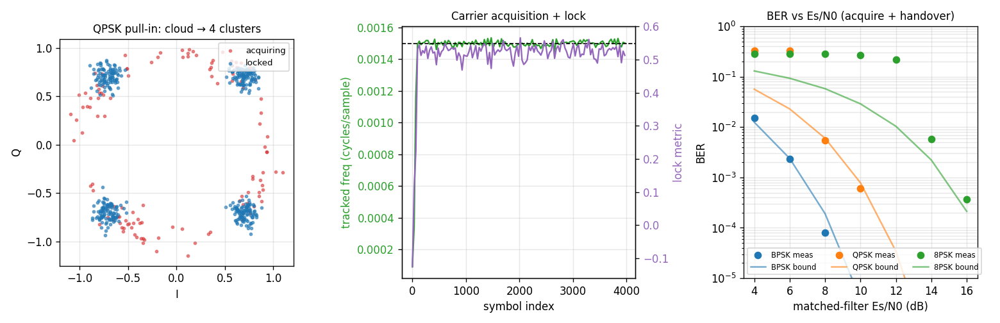

# M-PSK Receiver — Pull-in, Lock, and BER



[`track.MpskReceiver`](../api/python-track.md) is a complete per-sample M-PSK
modem. It composes the tracking primitives on one shared sample loop: a
[`CarrierNda`](carrier-nda.md) carrier loop (per-sample integer-NCO wipe-off +
non-data-aided M-th-power acquisition), an owned **matched filter** on the
de-rotated stream (integrate-and-dump boxcar by default, or root-raised-cosine
for band-limited links), and a [`SymbolSync`](symsync.md) Gardner timing loop.
Carrier recovery follows the project rule: **predetection de-rotation** (always)
and **postdetection discrimination**. See the [design note](../design/mpsk.md).

**Left — Constellation pull-in.** A QPSK signal with a `0.0015` cycles/sample
carrier offset, with the loop seeded at zero. During acquisition (red) the
de-rotated symbols sweep a ring — the residual carrier is still rotating them;
once the non-data-aided loop pulls the NCO onto the offset, the symbols (blue)
collapse onto the four QPSK clusters. No data aiding and no symbol timing are
required to acquire — that is what the M-th-power arm buys.

**Middle — Carrier acquisition + lock.** The tracked frequency (green) snaps from
zero onto the true offset (black dashed) within tens of symbols, and the lock
metric (purple) rises and holds. The lock metric is orientation-normalised, so it
reads `~+` at lock for every M (BPSK ≈ 1, QPSK ≈ 0.62, 8PSK ≈ 0.41) and is what
the opt-in `auto_handover` thresholds on.

**Right — BER vs Es/N0.** Bit error rate against the coherent M-PSK bound, using
NDA acquisition followed by decision-directed handover (`auto_handover=1`). BPSK
and QPSK track the bound within ~1–2 dB. **8PSK shows an acquisition threshold**:
the 8th-power discriminator's phase noise is large at low SNR, so the loop does
not pull in until ~13–14 dB — above which decision-directed tracking takes over
and it falls to the bound. This is the fundamental cost of non-data-aided 8PSK
acquisition; a known preamble or external frequency aid removes the threshold.

## Carrier handover — acquire blind, track clean

By default (`auto_handover=0`) the receiver stays in robust NDA tracking the
whole time. Enabling handover hands the **shared NCO** from the M-th-power
discriminator to a lower-jitter **decision-directed** error `e = Im(y·conj(â))/|y|`
on the recovered symbols once the loop has locked and a warmup has elapsed —
essential for 8PSK, whose M-th-power phase noise would otherwise cross the ±π/8
decision margins. The decision-directed loop steers at symbol rate (a naturally
lower loop bandwidth), which is exactly what low-jitter steady-state tracking
wants; the NCO frequency estimate carries across handover.

```python
from doppler.track import MpskReceiver

rx = MpskReceiver(m=4, sps=8, n=4, pulse="iandd",
                  bn_carrier=0.01, bn_timing=0.01,
                  auto_handover=1, lock_thresh=0.4, warmup_syms=200)
sym  = rx.steps(iq)          # recovered symbols (~ len(iq) / sps)
bits = rx.bits(iq)           # hard Gray bits, LSB-first per symbol
assert rx.tracking == 1      # handed over to decision-directed tracking
```

## Resolving the M-fold ambiguity — differential bits

The carrier loop locks to one of `m` phases, so the absolute constellation
orientation is ambiguous. `bits(..., differential=1)` decodes each symbol from
the phase **difference** between consecutive symbols, which is invariant to an
unknown constant carrier phase:

```python
rx = MpskReceiver(m=8, sps=8, differential=1)
bits = rx.bits(iq)           # rotation-invariant; survives any fixed phase slip
```

## DSSS-MPSK — chain after a despreader

A spread-spectrum M-PSK receiver is just a despreader feeding this modem: the
[`Dll(segments)`](async-despread.md) streaming despreader collapses each PN epoch
to one symbol-rate soft chip, and `MpskReceiver` recovers carrier, timing, and
bits on that stream — `Dll(segments) → MpskReceiver`.
