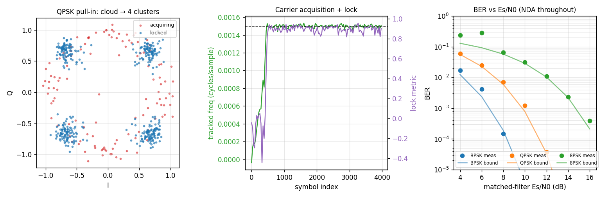

# M-PSK Receiver — Pull-in, Lock, and BER



[`track.MpskReceiver`](../api/python-track.md) is a complete M-PSK modem, and it
owns no filter, no NCO and no interpolator of its own. It is a **matched
down-converter with two loops closed around its two control ports**: a
[`MatchedDDC`](ddc-fn.md) mixes, decimates and matched-filters in the dot
products it was already doing, a carrier loop steers its LO (`freq_ctrl`), and
[RateSync](ratesync.md)'s own timing loop steers its terminal accumulator
(`rate_ctrl`). The terminal polyphase stage's **bank is the matched filter**
(integrate-and-dump by default, or root-raised-cosine for band-limited links) and
the **arm it selects is the fractional symbol-timing delay**. Carrier recovery
follows the project rule, now structurally rather than by convention:
**predetection de-rotation** in the LO at the front of the chain, and
**postdetection discrimination** on the matched-filtered symbols at the end of
it. See the [design note](../design/mpsk.md).

Because the front end plans its own cascade, `sps` is a **double** and an
irrational samples-per-symbol — a free-running ADC clock against the symbol clock
— is no harder than an integer one. The matched filter costs ~34 taps/arm at
`sps = 8` and at `sps = 256` alike, against the ~4225 taps/arm a single-stage
design would need at the top of that range.

[`track.MpskReceiverR`](../api/python-track.md) is the **real-input twin**: same
loops, same handover, same demapper — literally the same implementation — with a
`MatchedDdcr` front end so it takes a real IF (`f32`) instead of complex
baseband. It is a separate type rather than a flavor because `steps()` takes a
different dtype, and a shared class would have to name the dtype in a method.

**Left — Constellation pull-in.** A QPSK signal with a `0.0015` cycles/sample
carrier offset, with the loop seeded at zero. During acquisition (red) the
de-rotated symbols sweep a ring — the residual carrier is still rotating them;
once the non-data-aided loop pulls the LO onto the offset, the symbols (blue)
collapse onto the four QPSK clusters. **No data aiding** is required to acquire —
that is what the M-th-power discriminator buys. Note that the old engine needed no
*symbol timing* either; the rebuilt one does, because its discriminator runs on
the on-time strobe.

**Middle — Carrier acquisition + lock.** The tracked frequency (green) snaps from
zero onto the true offset (black dashed) within tens of symbols, and the lock
metric (purple) rises and holds. The lock metric is orientation-normalised, so it
reads `~+` at lock for every M (BPSK ≈ 1, QPSK ≈ 0.62, 8PSK ≈ 0.41) and is what
the opt-in `acq_to_track` switch thresholds on.

**Right — BER vs Es/N0.** Bit error rate against the coherent M-PSK bound, using
NDA acquisition followed by decision-directed tracking (`acq_to_track=1`). BPSK
and QPSK track the bound within ~1–2 dB. **8PSK shows an acquisition threshold**:
the 8th-power discriminator's phase noise is large at low SNR, so the loop does
not pull in until ~13–14 dB — above which decision-directed tracking takes over
and it falls to the bound. This is the fundamental cost of non-data-aided 8PSK
acquisition; a known preamble or external frequency aid removes the threshold.

## Acquisition-to-tracking switch — acquire blind, track clean

By default (`acq_to_track=0`) the receiver stays in robust NDA tracking the
whole time. Enabling the switch hands the **shared LO** from the M-th-power
discriminator to a lower-jitter **decision-directed** error `e = Im(y·conj(â))/|y|`
on the recovered symbols once the loop has locked and a warmup has elapsed —
essential for 8PSK, whose M-th-power phase noise would otherwise cross the ±π/8
decision margins. Both discriminators run on the same on-time strobe at the
symbol rate, so the handover is a plain discriminator swap: the shared loop
filter carries the frequency estimate across it in both directions, which makes a
drop-back a swap rather than a cold re-acquisition.

The drop-back is real, not decorative — the discriminator and the lock metric
keep running while tracking, so a receiver that loses its signal falls back to
NDA acquisition instead of sitting in `tracking` forever on stale data.

```python
--8<-- "src/doppler/examples/mpsk_receiver_demo.py:receiver"
```

## Resolving the M-fold ambiguity — differential bits

The carrier loop locks to one of `m` phases, so the absolute constellation
orientation is ambiguous. `bits(..., differential=1)` decodes each symbol from
the phase **difference** between consecutive symbols, which is invariant to an
unknown constant carrier phase:

```python
import numpy as np
from doppler.track import MpskReceiver

rng = np.random.default_rng(0)
syms = np.exp(2j * np.pi * rng.integers(0, 8, 2000) / 8)
iq = np.repeat(syms, 8).astype(np.complex64) * 0.5   # 8PSK, 8 samples/symbol

rx = MpskReceiver(m=8, sps=8, differential=1)
bits = rx.bits(iq)           # rotation-invariant; survives any fixed phase slip
assert len(bits) == 3 * (len(iq) // 8 - 3)           # log2(8) = 3 bits/symbol
```

## A real IF instead of complex baseband

`MpskReceiverR` takes `float32` samples of a real bandpass signal and tunes it
down itself. Its one extra constraint is `sps > 2·m_out`: the cascade behind the
R2C halfband runs at twice the overall rate.

```python
import numpy as np
from doppler.track import MpskReceiverR

m, sps, fc = 4, 24.0, 0.10          # QPSK, real IF at 0.10 cycles/sample
rng = np.random.default_rng(3)
syms = np.exp(2j * np.pi * rng.integers(0, m, 4000) / m)
bb = np.repeat(syms, int(sps))                      # I&D (rectangular) pulses
n = np.arange(len(bb))
rf = (bb * np.exp(2j * np.pi * fc * n)).real.astype(np.float32) * 0.5

rx = MpskReceiverR(m=m, sps=sps, m_out=4, init_norm_freq=fc, bn_carrier=0.002)
out = rx.steps(rf)

print(f"{len(out)} symbols, lock {rx.lock:.2f}")
assert len(out) > 3000            # ~ one symbol per sps input samples
assert rx.lock > 0.4              # QPSK locks toward the 0.62 ceiling
```

Read `rx.lock`'s **sign** as well as its magnitude: a steady negative lock is the
signature of an inverted carrier error, not a weak one, and the per-M ceilings
(BPSK ≈ 1, QPSK ≈ 0.62, 8PSK ≈ 0.41) are ceilings — a lock statistic *above* its
ceiling means the loop gain is wrong, not that the lock is unusually good.

### `nda_tap` — buying pull-in range back

The carrier discriminator's tap point sets how much frequency error it can even
*see*: an M-th-power detector updating at rate `F` is unambiguous only for
`|Δf| < F/(2M)`. Reading the on-time strobe is the cleanest input and the
narrowest range; two wider taps trade signal quality for range, and both are
also **timing-independent**, which the strobe tap is not.

| `nda_tap`          | Update rate | Max acquired `Δf` (QPSK, `sps=8`) | Needs timing? |
| ------------------ | ----------- | --------------------------------- | ------------- |
| `strobe` (default) | `Rs`        | `0.01·Rs`                         | yes           |
| `mf_all`           | `m_out·Rs`  | `0.02·Rs`                         | no            |
| `lo_arm`           | LO rate     | **`0.08·Rs`**                     | no            |

`lo_arm` is 8× the strobe — exactly the `sps` factor theory predicts. It is
fixed at construction, so nothing switches underneath you:

```python
rx = MpskReceiver(m=4, sps=8, m_out=4, bn_carrier=0.05, nda_tap="lo_arm")
```

`bn_carrier` keeps its meaning at every tap (symbol-rate normalised). The tap
does not widen the loop by itself — it widens what the discriminator can see and
improves the stability margin, which is what lets you then raise `bn_carrier`.

!!! warning "`lo_arm` does not work at 8PSK"

    Its arm is a short lowpass rather than the pulse matched filter, and the raw
    M-th-power gain over an arm goes as `Σ g_k^M`, which collapses at 8th power.
    Measured at Es/N0 20 dB: BPSK and QPSK decode cleanly on every tap (SER 0,
    EVM ≈ −16 dB); `lo_arm` at 8PSK sits at chance (SER 0.85, lock 0.081 against
    the 0.41 ceiling). Use `strobe` or `mf_all` for 8PSK.

!!! danger "`Δf = k·F/M` is a stable false lock, at every tap"

    `F/M` is where the M-th power aliases onto zero, so the M-fold ambiguity is a
    **frequency** ambiguity as well as a phase one. Measured on QPSK with an
    initial error of `Rs/4`: the loop never moves and still reports a lock of
    **+0.546** against the 0.62 ceiling, with a stationary constellation — so
    EVM and blind M2M4 both look clean too. **No self-referenced metric catches
    this**; it takes an external frequency reference or a sync word. A faster tap
    pushes the alias out proportionally.

    Beyond any tap's range, put a coarse frequency estimate in front (an FFT
    sweep, or `dsss.Ppe`) and pass it as `init_norm_freq`.

## Don't trust one metric — least of all a bit error rate

A bit error rate is truth-referenced: it needs the transmitted symbols *and* a
lag/polarity alignment search, which makes it fragile in both directions (a
too-narrow lag window reports chance on a perfectly good receiver; a wide one on
a short record can find a lucky alignment on garbage). Pair it with two
validators that need neither truth nor lag:

- **self-referenced EVM** — each symbol against its *own* hard decision. At lock
    this sits at `−(Es/N0)` dB; EVM is an I/Q-plane quantity, so there is no
    factor of two.
- **blind M2M4 SNR** — [`snr_m2m4_db`](../api/python-snr.md), moment-based.

Their **disagreement** is what carries the diagnosis. M2M4 uses only `|x|²` and
`|x|⁴`, so it is **rotation-blind**: a constellation that is cleanly shaped but
spinning still reads a healthy M2M4 while EVM collapses. A healthy M2M4 beside a
collapsed EVM therefore says *the amplitudes are fine, the phase is not* — which
no error rate could have told you. In the run above they agree within ~0.5 dB
(EVM −23.8 dB, M2M4 +24.1 dB), which is what a real lock looks like. In C, both
helpers are shared in `native/tests/dp_sym_test.h`.

## DSSS-MPSK — chain after a despreader

A spread-spectrum M-PSK receiver is just a despreader feeding this modem: the
[`Dll(segments)`](async-despread.md) streaming despreader collapses each PN epoch
to one symbol-rate soft chip, and `MpskReceiver` recovers carrier, timing, and
bits on that stream — `Dll(segments) → MpskReceiver`.

## Reproduce

```bash
python src/doppler/examples/mpsk_receiver_demo.py   # → mpsk_receiver_demo.png
```
