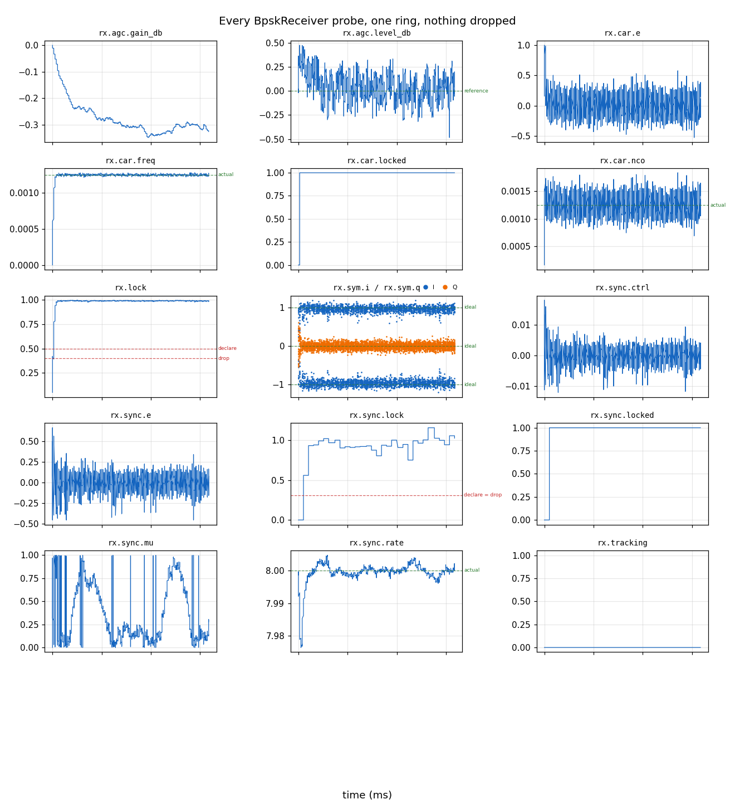

# Capturing All Receiver Telemetry



## What you're seeing

Every panel is one telemetry probe a `track.BpskReceiver` exposes — except
the recovered symbol, where `rx.sym.i` and `rx.sym.q` share one axis because
the thing worth seeing is their *relative* size, and separate panels would
autoscale that away. Every trace came out of a **single**
`telemetry.MemoryCapture` over a
**single** `telemetry.Telemetry` ring. One `set_telemetry` attach registers
the receiver's own carrier probes **and** forwards to both of its
instrumented children — the symbol-timing loop and the front-end AGC — so a
cold-start BPSK pull-in leaves a complete record of the whole receiver:

- **`rx.sym.i` / `rx.sym.q`** — the recovered symbol, and the only probe
    here that is an **output** rather than a loop internal. Sharing one axis
    is what makes it readable: I settles into two clean ±1 decision bands
    while Q collapses onto zero, which is the carrier loop resolving phase —
    a BPSK decision is real, so everything left in Q is error. The example
    asserts it (mean|I| ≈ 17× mean|Q| over the settled half), so the figure
    and the check are the same claim rather than two.
- **`rx.lock` / `rx.car.locked`** — the carrier lock EMA rises off its
    cold-start value and `rx.car.locked` declares. The panel carries the
    **declare and drop thresholds** the decision actually used, read off the
    receiver (`lock_thresh`, `lock_drop_thresh`) rather than retyped here, so
    the line and the decision it drives cannot drift apart.
- **`rx.tracking`** — flat at 0, and that is the point: **there is no
    handover.** One M-th-power NDA discriminator steers the LO from the first
    output to the last (Mode 1 in [the design](../design/mpsk.md)), so nothing
    waits for anything and the transient is simply the cost of starting cold.
    `acq_to_track` is still on the shipped constructor and this demo leaves it
    at its default; a probe that cannot vary is not a diagnostic, and retiring
    it is [#831](https://github.com/doppler-dsp/doppler/issues/831).
- **`rx.car.freq`** — the tracked NCO frequency pulls in to the injected
    0.0015 cyc/sample offset.
- **`rx.car.e` / `rx.sync.e` / `rx.sync.ctrl`** — the carrier discriminator
    and the timing TED / loop-filter control settle out of the acquisition
    transient.
- **`rx.sync.rate` / `rx.sync.mu`** — the tracked samples/symbol settles on
    ~8.0 and the fractional interpolation phase sweeps its `[0, 1)` range.
- **`rx.sync.lock` / `rx.sync.locked`** — the timing lock statistic climbs
    and its verify-counted decision declares, against **its own** threshold
    (`sync_lock_thresh`), which is not the carrier's number and is not derived
    the same way — symsync sizes block length and threshold together from
    (rolloff, esno_min, pfa, pd). Declare and drop are the same level here and
    the panel says so in one line: the timing decision's hysteresis is in its
    verify **counts**, not its levels.
- **`rx.agc.gain_db` / `rx.agc.level_db`** — the front-end AGC, which by
    `mpsk_rx_agc_bn()` is the slowest of the receiver's three loops. Here it
    has nothing to do: the stimulus is unit-magnitude symbols against a 0 dB
    reference, so the loop starts converged and both traces are dither —
    `level_db` holding the reference inside a few tenths of a dB while the
    commanded gain wanders by hundredths. That is the point worth reading
    off this panel. `level_db` is the loop's *input*, so "converged" is
    legible from the trace alone; `gain_db` settles to an offset that
    depends on how loud the input happened to be, and cannot be judged
    without knowing it. A cold, off-reference start is where the pair
    separates, and that measurement belongs with the AGC's own evidence
    rather than here.

Nothing is decimated (`decim=1`) and nothing is dropped — the summary cell
reports the full capture: 16 probes, one 16-byte record per event. For the
fourteen carrier, timing and symbol probes an event is a recovered symbol;
the two
`rx.agc.*` probes are tapped **pre-terminal**, ahead of the stage the timing
loop steers, and emit once per gain update instead, so they are denser and
carry no symbol index. The x-axis is real time, because each record carries
the sample index it was stamped with — which is what lets two probes counted
on different grids be read against each other at all.

## How it works

Two things the caller no longer does. **The drain**: a `MemoryCapture`
sizes the ring from the probe count and the block, and `set_now(i)` drains
at every boundary — so losslessness is arithmetic rather than a cadence you
have to get right, and `close()` raises if a record was lost anyway.
**The split**: `read_dict(index=True)` returns `{name: (n, values)}`, so
nothing below filters by probe id, inverts an id-to-name map, or plots an
event ordinal in place of a time axis.

```python
--8<-- "src/doppler/examples/mpsk_telemetry_capture_demo.py:capture"
```

The 16-byte record layout **is** the capture format. `records()` returns
the exact C `dp_tlm_rec_t` as a structured array
(`n:u8, value:f4, probe:u2, flags:u2`), so `.tofile()` writes it with no
transformation and those bytes are byte-for-byte the `TLM16` payload that
`dp_tlm_sink` frames onto the NATS wire. File storage and streaming fan-out
share one format — the capture above verifies the round-trip bit-exact.

The ring stays SPSC: producer (`steps`) and consumer (the capture's drain)
run on one thread together, which is exactly why the boundary drain is both
the fastest option and the provable one.

For a capture you never need back in-process, `Capture(tlm, block, path, clock)` writes those same bytes straight to disk plus a `<path>-meta` JSON
sidecar carrying the probe registry and time base — self-describing, so a
reader needs nothing from the process that wrote it. To take the same
records across processes live, publish them as `TLM16` frames instead; see
[Many Emitters, One Consumer](telemetry-fanin.md).

## Run it

```bash
python src/doppler/examples/mpsk_telemetry_capture_demo.py   # → mpsk_telemetry_capture_demo.png  (~2 s)
```

See the [telemetry API](../api/python-telemetry.md) for the probe tables
and record layout, [M-PSK Receiver](mpsk-receiver.md) for the receiver
itself, and [Lock Detection](lockdet.md) for the verify-counted decisions
the `*.locked` / `rx.tracking` traces come from.
