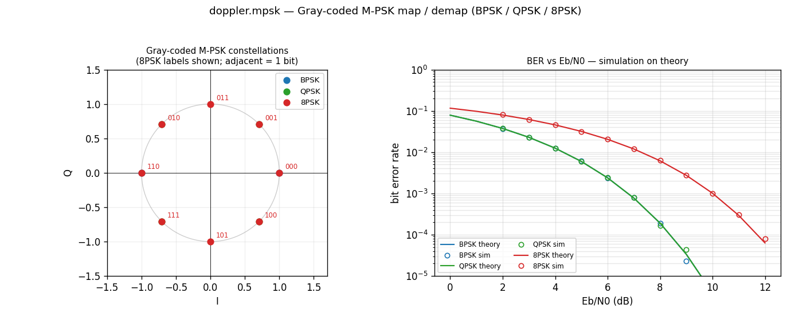

# M-PSK constellation (Gray-coded map / demap)



[`doppler.mpsk`](../api/python-mpsk.md) is the **M-ary PSK constellation
primitive** — the decision (and its transmit inverse) the MPSK receiver
composes. A symbol carries `log2(M)` bits packed into one byte (0..M−1); that
byte **is** the Gray-coded label, so a slip to an adjacent constellation point
flips exactly one bit. M ∈ {2, 4, 8}: BPSK, QPSK (axis-separable, at π/4), 8PSK.

## What you're seeing

**Left — constellations.** BPSK / QPSK / 8PSK on the unit circle (8PSK labels
annotated). Walking the circle, each neighbour differs by exactly one bit — the
Gray property that makes a symbol error cost (usually) one bit error.

**Right — BER vs Eb/N0.** `mpsk_map` → complex AWGN → hard `mpsk_demap`,
Monte-Carlo, overlaid on the closed forms: BPSK = Gray QPSK = `Q(√(2·Eb/N0))`;
8PSK Gray ≈ `(2/3)·Q(√(2·Es/N0)·sin(π/8))`. The simulated points sit on the
theory — the constellation and the slicer are correct end to end.

## API

Element-wise (memoryless) map/demap, plus differential variants. `m` defaults to
QPSK and is keyword-capable — call positionally or by name:

```python
import numpy as np
from doppler.mpsk import mpsk_map, mpsk_demap, mpsk_bits_per_symbol

sym = np.random.randint(0, 8, 1000).astype(np.uint8)  # 8PSK Gray labels
iq  = mpsk_map(sym, m=8)          # -> unit-amplitude cf32 points
rx  = mpsk_demap(iq, m=8)         # -> Gray labels (hard decision)
assert np.array_equal(rx, sym)
mpsk_bits_per_symbol(8)           # 3
```

**Differential mode** resolves the M-fold carrier phase ambiguity (a
decision-directed carrier loop locks to one of M phases). Information rides on
phase *differences*, so an unknown constant rotation cancels — at ~2× the
symbol-error rate:

```python
from doppler.mpsk import mpsk_diff_map, mpsk_diff_demap

iq  = mpsk_diff_map(sym, m=8)
rot = (iq * np.exp(1j * np.pi / 4)).astype(np.complex64)  # one-step phase slip
out = mpsk_diff_demap(rot, m=8)
assert np.array_equal(out[1:], sym[1:])   # rotation-invariant after the reference
```

## How it works

`map` takes the Gray label `g`, recovers the constellation index `k = gray_decode(g)`, and emits `exp(j·(2πk/M + φ0))`. `demap` slices to the nearest
index by phase and returns `gray_encode(k̂)`. The inline `mpsk_slice()` /
`mpsk_constellation()` helpers in `mpsk_core.h` are the C composition API the
carrier loop (`track.Carrier.Mpsk`) and the MPSK receiver inline per symbol —
the decision-directed carrier error is `Im(y · conj(â))` where `â` is the sliced
point. Differential map/demap accumulate / difference the index across the array.

Source: `src/doppler/examples/mpsk_constellation_demo.py`.
