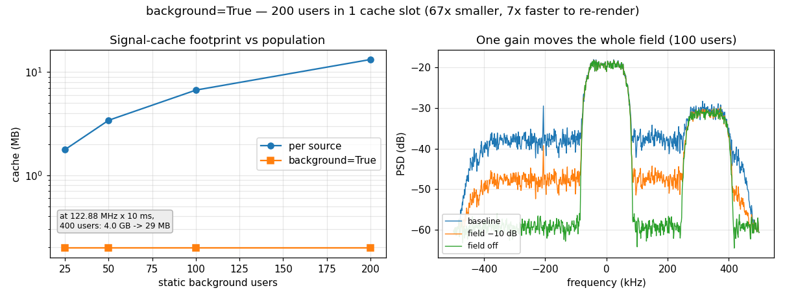

# One Cache Slot for a Whole Background Field



[`Plan`](plan.md) is fast because it caches every source of a scene
*separately*: each render is a re-weighted sum of buffers that were synthesised
once, so any source can be re-levelled, rotated or dropped without touching the
DSP. The price of that separability is one full-length buffer per source.

For most scenes that is the right trade. For a scene dominated by emitters that
never move it is the wrong one. A crowded uplink, a co-channel user population,
an interference field — those sources exist to be *present*, not to be swept,
and paying a separate cache buffer for each one buys an override nobody will
ever use. At a realistic capture rate the bill is brutal: 400 users at
122.88 MHz over 10 ms is ~1.3 M samples each, about **4 GB** of cache for a
scene in which exactly one interferer actually varies.

Marking those sources `background=True` folds them into **one** pre-summed
cache entry.

## What you're seeing

The scene is a crowded uplink: a population of static QPSK users spread across
the band, a wanted signal at DC carrying the SNR, and one strong interferer at
+330 kHz.

**Left — cache footprint.** Bytes of signal cache against population size, the
same scene built both ways. Per-source grows linearly — 200 users is 13.2 MB
even at this toy 8192-sample ON-time. Folded is *flat*, because the entire
population is always a single buffer, whatever its size: **67× smaller** at 200
users, and the ratio keeps growing with the population. The inset quotes the
workload the feature exists for.

**Right — the field as one control.** Welch PSD of three renders that differ by
a single number. The background is the broad shelf; the wanted signal is the
flat-topped block at DC, the interferer the one at +330 kHz. Trim the composite
by 10 dB and the whole field drops by 10 dB — measured at **9.98 dB** — while
the wanted signal moves 0.06 dB. Disable it and the field vanishes, leaving
exactly the two signals and the noise floor.

That is the part worth internalising: the fold does not merely save memory, it
gives you a control you did not have before. The background is now *one* entry
in `gains` / `phases` / `enable`, so scaling, rotating or removing the entire
interference field is a single scalar — and re-rendering it is ~5× faster,
because each render touches 3 buffers instead of 102.

## Building it

```python
import numpy as np

from doppler.wfm import Composer, Segment, prepare, qpsk

# The scene's parameters come from the tested example script itself, so this
# page and the figure above can never drift apart.
from doppler.examples.plan_background_demo import FS, NS, WANTED_SNR
```

The population is written **first** and flagged. That ordering is load-bearing,
not stylistic — see the note below.

```python
--8<-- "src/doppler/examples/plan_background_demo.py:scene"
```

Folding changes what the cache costs, not what it produces:

```python
--8<-- "src/doppler/examples/plan_background_demo.py:savings"
```

```python
folded, per_source = footprint(50)
assert folded == 3 * NS * 8  # background + wanted + jammer
assert per_source == 52 * NS * 8  # one buffer each
```

And the whole field answers to one override — index 0 is the composite, then
the foreground sources in spec order:

```python
--8<-- "src/doppler/examples/plan_background_demo.py:override"
```

```python
plan = prepare(uplink(100))
base, trimmed, off = overrides(plan)
assert plan.n_sources == 3  # 100 users, 1 slot
```

## How it works

`prepare()` renders each background source once, multiplies it by its own
`10**(level/20)`, and accumulates it into a single buffer whose `base_gain` is
`1.0`. From `render()`'s point of view nothing is special about that slot — it
is just a cache entry that happens to be pre-summed — which is why the whole
feature needs no changes in the render path, and why `n_sources` drops from
`population + 2` to `3`.

**Why the background must come first.** A `Composer` sums its sources into a
running accumulator in spec order, and float addition is not associative. The
composite sums *from zero*, so it equals the composer's partial sum at that
point only if nothing precedes it. A background source sitting behind a
foreground one would still be *nearly* right — and would quietly cost the
bit-exactness guarantee the whole `Plan` design rests on. `prepare()` rejects
that ordering with a `ValueError` instead of silently degrading.

**Why it is still fast to prepare.** The sum has to run in spec order, so it
cannot simply be fanned out one source per core. Instead a *group* of
background sources is synthesised concurrently and then accumulated in order,
and the ordered accumulation itself is split by **sample** — each worker owns a
contiguous slice of the composite and applies the whole group to it in
sequence. That is bit-identical to a serial fold and still uses every core. The
group is capped by a memory budget, so a 400-source background never
materialises 400 live buffers; and the slice size keeps the accumulator
L2-resident, so it is touched once per group rather than once per source.

**Gain semantics.** For an ordinary source, `gains[k]` *replaces* its level —
it is an absolute dBFS setting. For the composite it is a **trim**: members keep
their relative levels and the whole mix scales. There is no bit-exact
alternative (factoring a shared reference gain back out reintroduces a multiply
that breaks the exactness proof), and a trim is the meaningful control for a
field anyway.

## Notes

A *bundled* segment — a lone source carrying its own real SNR — folds nothing.
It has nothing to sum with, and its baked-in noise amplitude rides on the same
`base_gain` the fold would overwrite, so the flag is a no-op there rather than a
silent amplitude error.

## See also

- [Prepare Once, Sweep Many](plan.md) — the `Plan` component cache this builds on.
- [Composing a Scene](wfm-composition.md) — building the `Composer` scenes a Plan prepares.
- [Crowded Band](crowded-band.md) — a many-source scene rendered the ordinary way.

## Reproduce

```sh
python -m doppler.examples.plan_background_demo plan_background_demo.png
```

Source: `src/doppler/examples/plan_background_demo.py`.
