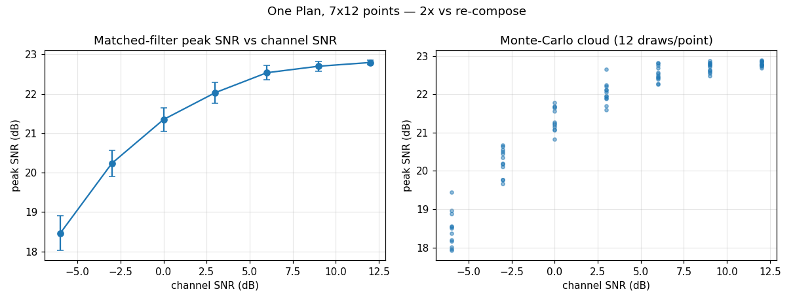

# Prepare Once, Materialize Many — the `Plan` stimulus engine



Evaluating a system — a detector, a demodulator, a synchroniser — means feeding
it the *same* scene at many operating points: a detection or BER curve is a
sweep over SNR, each point averaged over independent noise draws. But a composed
scene is a linear form,

$$
\text{out} \;=\; \sum_k \text{gain}_k \cdot \text{signal}_k \;+\; \text{noise},
$$

and the expensive DSP — spreading, root-raised-cosine pulse shaping, the local
oscillator — lives entirely in the **signal** terms, which do not change when
you sweep a level, a phase, the SNR, or the noise seed. `Plan` renders each
source *once*, caches it, and serves every variation as a cheap re-weighted sum.
So a campaign that re-runs one scene hundreds of times pays the signal-synthesis
cost once — and every render is **bit-for-bit identical** to a full compose.

## What you're seeing

The scene is a five-user co-channel CDMA burst (one wanted user carrying the
SNR, four interferers at −3 dBFS) plus a pilot tone. One `Plan` drives the whole
figure.

**Left — the detection curve.** At each swept channel SNR, the wanted user's
spreading code is matched-filtered and the correlation-peak SNR recorded, mean ±
std over twelve Monte-Carlo noise draws. It climbs with channel SNR and then
flattens as the multiple-access interference floor takes over — exactly the
multi-user detection knee you would expect, and the cache reproduces the precise
noise power the resolver placed at every point.

**Right — the Monte-Carlo cloud.** The individual per-draw peak SNRs behind each
mean: twelve independent noise realizations per SNR, drawn from a seed sweep over
one Plan. The signal is identical across draws; only the noise differs.

The title reports the measured speedup of Plan-based stimulus generation over
re-composing every point — a few× here, and it grows with the number of sources
and the sample count, since that is exactly the signal work the cache elides.

## Building it

Prepare a scene, then sweep — the baseline render reproduces a full compose
exactly, and every swept point is a re-weight of the cache:

```python
import numpy as np
from doppler.wfm import Composer, Segment, prepare, qpsk, tone

scene = Composer(Segment.sum(
    qpsk(snr=0.0, seed=7, sps=8, pn_length=9),      # the wanted user (anchor)
    qpsk(seed=101, sps=8, pn_length=9, level=-3.0),  # a co-channel interferer
    tone(freq=2.2e5, seed=3, level=-10.0),           # a pilot
    fs=1e6, num_samples=8192,
))

plan = prepare(scene)                       # render + cache every source ONCE
assert np.array_equal(plan.render(), scene.compose())   # baseline is bit-exact

# sweep channel SNR — each point is a cheap re-weight, not a re-synthesis
curve = {snr: plan.at(float(snr)) for snr in range(-6, 15, 3)}

# a Monte-Carlo cloud at one SNR: independent noise, identical signal
draws = list(plan.monte_carlo(6.0, 12, seed0=1000))
assert len({d.tobytes() for d in draws}) == 12          # all realizations differ
```

`render()` also takes per-source overrides — `gains` (dBFS levels), `phases`
(radians), and `enable` (drop a source) — so the same Plan sweeps a gain
imbalance or a relative phase just as cheaply:

```python
# disable the interferer, and pull the pilot down 6 dB — no re-synthesis
clean = plan.render(enable=[True, False, True], gains=[0.0, -3.0, -16.0])
```

## Notes

`Plan` v1 covers a single finite, non-ranged `sum` segment with a separable
noise floor (the common evaluation scene). A lone *bundled* noisy source — one
source that carries the SNR alone, its private RNG fused into the signal — is not
separable and raises `ValueError`. Frequency (Doppler) and delay (multipath) are
planned follow-ups on the same frame.

## See also

- [Composing a Scene](wfm-composition.md) — building the `Composer` scenes a Plan prepares.
- [WCDMA Carriers](wcdma-carriers.md) — a multi-carrier measurement scene.
- `src/doppler/examples/plan_demo.py` — the script behind this figure.
