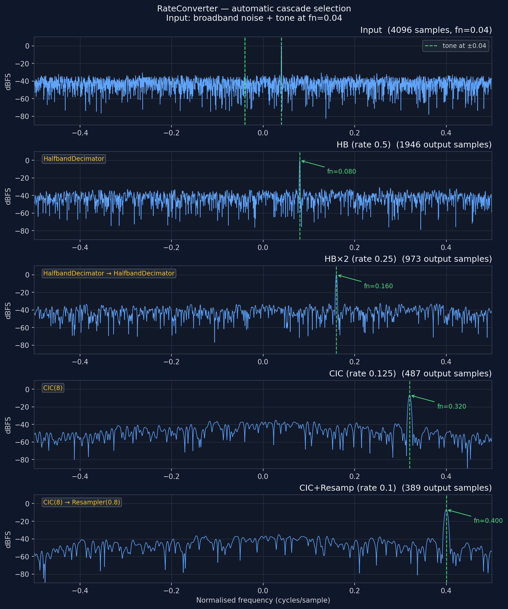

# RateConverter — Automatic Cascade Selection



## What you're seeing

Five panels share the same x-axis — normalised frequency in cycles/sample
(−0.5 to +0.5 = one full output Nyquist interval).

**Top panel — input.** 4096 samples of broadband complex noise with a single
complex tone injected at fn = 0.04 (4 % of the input sample rate). This is
the identical signal fed to all four converters below.

**Lower four panels — decimated output**, one per cascade topology. Each
x-axis is normalised to the converter's output sample rate, so the same
physical tone moves to a higher normalised frequency as the rate ratio
decreases. The yellow label in the top-left corner of each panel names the
exact stages RateConverter selected automatically for that rate.

| Panel      | rate  | D = 1/rate | Cascade selected                      | Tone at fn_out |
| ---------- | ----- | ---------- | ------------------------------------- | -------------- |
| HB         | 0.5   | 2          | HalfbandDecimator                     | 0.08           |
| HB×2       | 0.25  | 4          | HalfbandDecimator → HalfbandDecimator | 0.16           |
| CIC        | 0.125 | 8          | CIC(8)                                | 0.32           |
| CIC+Resamp | 0.1   | 10         | CIC(8) → Resampler(0.8)               | 0.40           |

Every panel annotates the predicted tone position (fn_out = fn_in / rate) with
a green marker. Tone recovery is accurate to well under one FFT bin.

## How it works

The selection rule is pure arithmetic on D = 1/rate:

```
rate >= 1.0 or D < 2        →  Resampler(rate)
D ≈ 2^1                     →  HalfbandDecimator
D ≈ 2^2                     →  HalfbandDecimator → HalfbandDecimator
D = 2^n, n>=3, D<=4096      →  CIC(D)
D >= 8, non-power-of-2      →  CIC(R*) → Resampler(R*/D)
otherwise (2 ≤ D < 8)       →  Resampler(rate)
```

where R\* = nearest power-of-two to D. Halfband stages are the cheapest
(one multiply per two input samples); CIC has no multiplies at all. The
polyphase Resampler handles any rate but is the most compute-intensive, so
it is used only when a pure-power-of-two topology cannot be applied.

```python
from doppler.resample import RateConverter
import numpy as np

rc = RateConverter(0.1)
print(rc.stages)   # ['CIC(8)', 'Resampler(0.8)']

x = np.random.randn(4096).astype(np.complex64)
y = rc.execute(x)  # len(y) ≈ 410
print(len(y))

# Change rate — cascade is rebuilt automatically
rc.rate = 0.25
print(rc.stages)   # ['HalfbandDecimator', 'HalfbandDecimator']
```

The execute buffer is grown lazily on the first call and invalidated on every
rate change, so callers pay no per-call allocation overhead in steady state.

```bash
python src/doppler/examples/rate_converter_demo.py
```

See
[`doppler.resample.RateConverter`](../api/python-resample.md#rateconverter-automatic-cascade)
for the full API reference.
