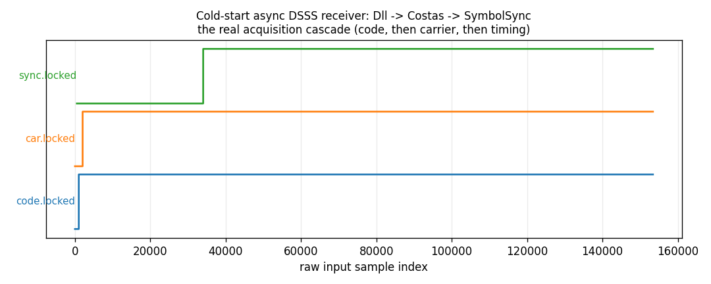

# Full-Chain Lock-Up



A real closed-loop async DSSS receiver — `Dll(segments=K) -> Costas -> SymbolSync` — cold-started with **no** code, carrier, or timing
knowledge, watched with a single `Telemetry` context attached to all
three loops. This is the payoff of the
[lock-detector consistency pass](../guide/lock-detection.md): one
shared `lockdet_core.h` decision rule and one shared telemetry bus
across three independently-tracking loops, so their `.locked` traces
read as one story instead of three unrelated ones.

## What you're seeing

Each loop's `.locked` probe, stamped against the **raw input sample
index** (not each loop's own internal look count — see
[How it works](#how-it-works)) and stacked so the three step traces
don't overlap:

- **`code.locked`** (bottom, blue) — the `Dll`'s CFAR code-lock
    detector. It declares first: despreading gain means the code
    statistic clears its threshold almost immediately.
- **`car.locked`** (middle, orange) — the `Costas` carrier loop.
    It declares next, once the code is removed and the residual
    carrier is a clean tone for the PLL discriminator to pull in on.
- **`sync.locked`** (top, green) — `SymbolSync`'s timing loop. It
    declares last: its Gardner statistic needs a de-rotated,
    despread symbol stream before the eye-opening ratio it measures
    means anything, so it cannot even start converging until the
    other two are already tracking.

This ordering — code, then carrier, then timing — is not a coincidence
of this particular run; it is the real acquisition dependency chain a
cold-start receiver climbs, made visible because every loop reports
`.locked` the same way.

## How it works

Each loop runs at its own internal rate: the `Dll` decides once per
code epoch, `Costas` once per partial, `SymbolSync` once per recovered
symbol. Rather than plot three unrelated indices, every probe is
stamped with the **raw input sample index** at the start of the block
that produced it (`tlm.set_now(i)` before each block's three
`.steps()` calls, the same pattern
[Many Emitters, One Consumer](telemetry-fanin.md) uses for unrelated
objects) — so all three land on one shared timeline even though they
never see the same sample count.

```python
--8<-- "src/doppler/examples/receiver_lock_demo.py:chain"
```

```python
import numpy as np

from doppler.telemetry import Telemetry

code, rx = make_signal()
tlm = Telemetry(1 << 16)
d, cos, ss = run_chain(code, rx, tlm)
assert d.locked and cos.locked and ss.locked  # all three pulled in cold

recs = tlm.read()
assert tlm.dropped == 0

# demux by probe id, exactly as in the telemetry fan-in pattern:
code_locked = recs[recs["probe"] == tlm.probe_id("code.locked")]
sync_locked = recs[recs["probe"] == tlm.probe_id("sync.locked")]
# code declares lock at (or before) the sample index sync does --
# the dependency chain the figure above shows.
assert code_locked["n"][code_locked["value"] > 0][0] <= (
    sync_locked["n"][sync_locked["value"] > 0][0]
)
```

`Costas(tsamps=1)` de-rotates per-partial rather than per-symbol
because the true symbol boundary is not yet known — see
[Streaming Async Despreader](async-despread.md) for why `Dll(segments=K)`
outputs partials in the first place, and
[the async receiver's own test suite](https://github.com/doppler-dsp/doppler/blob/main/src/doppler/track/tests/test_async_dsss_receiver.py)
for the full link-budget validation (BER, code/timing-rate tracking,
and independent symbol-clock drift) this composition is proven
against.

Source: `src/doppler/examples/receiver_lock_demo.py`.
