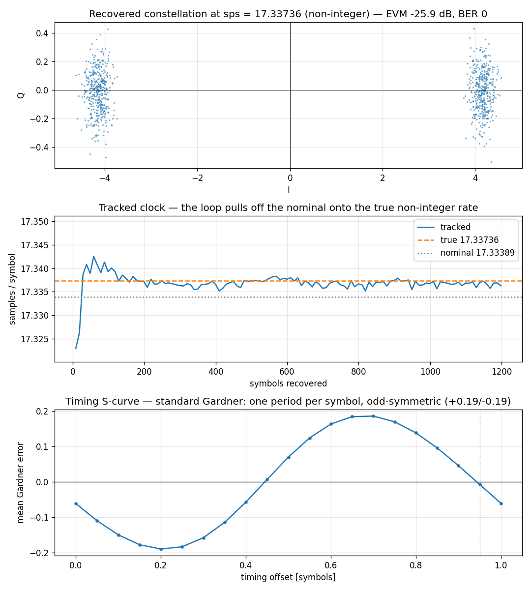

# Arbitrary-Rate Symbol Recovery



[`track.RrcSync`](../api/python-track.md) recovers symbols from a stream whose
sample clock has **no integer relationship to the symbol clock** — here
17.33389 samples per symbol, and 200 ppm off even that.

It does it by fusing the two halves of a conventional timing recovery. Where
[`SymbolSync`](symsync.md) runs a matched FIR and then a separate
[`Farrow`](farrow.md) interpolator steered by an integer NCO, `RrcSync` builds
the matched filter **as the polyphase bank of a resampler**, so the arm the
resampler's accumulator selects *is* the fractional timing delay. One dot
product does both jobs. Because that accumulator is a `double`, `sps` is a
`double` — no integer relationship is required anywhere.

## What you're seeing

**Top — Recovered constellation.** Matched-filtered symbols at a fractional
`sps`, tight on ±1 at 14 dB SNR (EVM ≈ −26 dB) with zero bit errors.

**Middle — Tracked clock.** The recovered samples/symbol pulling off the
nominal it was built with (dotted) onto the stream's true rate (dashed). The
loop is tracking an *asynchronous, non-integer* clock — `rate` reports the
truth, which is what a caller disciplining a clock reads.

**Bottom — Timing S-curve.** The Gardner error against timing offset, measured
from the object itself (loop frozen, noiseless, every symbol's error averaged
through its telemetry). It is the **standard Gardner S-curve** — one period per
symbol, odd-symmetric, with the stable lock (negative-going zero) and the
unstable point exactly half a symbol apart. Nothing about the fusion changes
the detector; only the filter it reads from is different.

## How it works

Two banks run at `rate = 1/sps` — one on-time, one whose prototype is
displaced half a symbol for the Gardner transition gate — fed the same input
and the same control, so their accumulators evolve identically:

```text
per input:  push x[n] through both matched filters at the current ctrl
            accumulator completes a symbol period -> both emit, paired
per symbol: e    = TED(mid, on_time, prev_on_time)      # gardner or dttl
            ctrl = PI(e) / sps      # spread over the inputs a symbol spans
```

Pinning the mid sample to a *bank offset* rather than to an even/odd output
parity is what makes this behave. With one bank at `rate = 2/sps` and
alternating outputs called on-time/mid, the roles are anchored to nothing at
the symbol rate: the S-curve then has period T/2 with two equally stable
equilibria — and the wrong one samples the transitions — so the loop hunts
between them instead of locking.

The bank's arm must also move the sampling instant the **same way** crossing an
emission boundary does. The accumulator is the only timing authority and the
arm is its fractional read-out; build the bank the other way round and the two
fight, turning the effective sampling instant into a sawtooth of one full
output period that no loop bandwidth can remove.

```python
--8<-- "src/doppler/examples/rrcsync_demo.py:signal"
```

## The pulse is a parameter

The fusion belongs to the polyphase engine, not to the root-raised cosine, so
the common **rectangular / NRZ** case is the same object with a different
prototype — `pulse="iandd"`, the unit rectangle over one symbol that an
integrate-and-dump computes:

```python
from doppler.track import RrcSync
from doppler.wfm import Synth

# rectangular chips / NRZ data at a fractional samples-per-symbol
nrz_iq = Synth(type="bpsk", sps=8, snr=20.0, pulse="rect").steps(8192)
nrz = RrcSync(sps=8.0, pulse="iandd")
nrz_symbols = nrz.steps(nrz_iq)
assert nrz.locked
```

The rectangle spans one symbol against the RRC's `2*span`, so its bank costs a
small fraction of the taps per arm. At an integer `sps` a boxcar matched filter
on NRZ recovers the symbols essentially exactly; at a fractional `sps` it pays
only the edge-sample quantisation the rectangle's discontinuity implies.

## Choosing between the two timing loops

Pick `RrcSync` when the sample rate is not an integer multiple of the symbol
rate, or when the matched filter is RRC (or a boxcar) anyway and you would
rather pay one filter than two. Pick [`SymbolSync`](symsync.md) when the pulse
is something else entirely (it takes any upstream matched filter) or when `sps`
is a small integer and the integer-NCO's slip-free strobe accounting matters.

Source: `src/doppler/examples/rrcsync_demo.py`.
