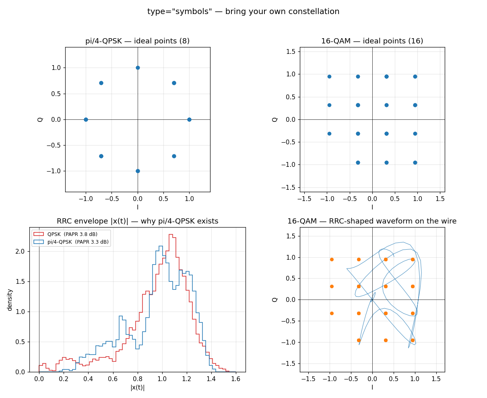

# type="symbols" — Bring Your Own Constellation



## What you're seeing

Every built-in `wfmgen` modulation — `bpsk`, `qpsk`, … — bakes in a fixed
bit→symbol map. `type="symbols"` removes that ceiling: you hand the engine a
complex64 stream and **each element becomes an output point directly**. The
synth oversamples it by `sps`, cycles it to fill the request, and — with
`pulse="rrc"` — shapes it through the same matched-FIR path every other
modulation uses. One hook expresses *any* constellation: pi/4-QPSK, QAM, APSK,
or something you invented this morning.

Each constellation is shown two ways — the **rect** pulse, where a boxcar
matched filter recovers the exact points, and the **RRC** pulse, the continuous
band-limited trajectory the radio actually transmits.

**Top-left — pi/4-QPSK, ideal points.** Two QPSK rings offset by π/4 (eight
points), used on alternate symbols. "Compute the symbols, pass them" — there is
no π/4-QPSK modulation enum, and none is needed.

**Top-right — 16-QAM, ideal points.** A 4×4 grid normalised to unit average
power. A random symbol stream through the rect pulse; the boxcar matched filter
lands exactly on the sixteen points.

**Bottom-left — why pi/4-QPSK exists.** The distribution of the RRC-shaped
envelope `|x(t)|` over a long run. Plain QPSK (all symbols from one ring → 180°
flips) drives the envelope clean through zero, so its histogram carries mass at
the origin; pi/4-QPSK (alternating rings → the phase step is capped at ±135°)
has a hard floor near 0.15 and never collapses. That floor drops the
peak-to-average ratio by ~0.5 dB and lets a power amplifier run closer to
saturation — the entire reason the modulation exists.

**Bottom-right — 16-QAM, shaped.** The RRC-shaped I/Q trajectory threading
between the sixteen points — the band-limited waveform actually on the wire,
contrasted with the crisp rect grid above it.

## The idea

A modulation is just a rule for turning data into constellation points. The
built-in types hard-code that rule; `type="symbols"` lets you *supply the points
directly*, so anything you can express as a complex stream is one call away:

```python
import numpy as np
from doppler.wfm import Synth

# pi/4-QPSK: rotate every other QPSK symbol by π/4, then pass the stream
qpsk = np.array([1 + 1j, -1 + 1j, -1 - 1j, 1 - 1j], np.complex64) / np.sqrt(2)
stream = np.array(
    [qpsk[i % 4] * (np.exp(1j * np.pi / 4) if i % 2 else 1) for i in range(64)],
    np.complex64,
)

s = Synth(type="symbols", symbols=stream, sps=4)
iq = s.steps(64 * 4)                       # (256,) complex64
```

The stream is force-cast to complex64 by the binding, so an `np.complex128`
array (e.g. anything divided by `np.sqrt(2)`) is accepted without a manual cast.

## Pulse shaping is orthogonal

The same stream, band-limited with a root-raised-cosine pulse — identical to the
shaping the built-in `bpsk`/`qpsk` types use:

```python
s = Synth(type="symbols", symbols=stream, sps=8,
          pulse="rrc", rrc_beta=0.35, rrc_span=6)
wire = s.steps(64 * 8)
```

With the rect pulse (the default), a boxcar matched filter — averaging each
symbol's `sps` samples — returns the exact points you fed in:

```python
rect = np.asarray(Synth(type="symbols", symbols=stream, sps=8).steps(64 * 8))
recovered = rect.reshape(64, 8).mean(axis=1)   # == stream (to float32)
```

## Carrier and noise compose as usual

`freq` puts the constellation on a carrier and `snr` adds AWGN, exactly as for
the built-in modulations:

```python
s = Synth(type="symbols", symbols=stream, sps=8, freq=1e5, snr=12.0)
```

## Rendering through a Composer

For timing, mixing, sequencing, and reproducible seeds, wrap the `Synth` in a
`Segment` and render it with a `Composer`. Note that `num_samples` /
`off_samples` belong on **`Segment.sum`**, not on `Composer`:

```python
from doppler.wfm import Segment, Composer

seg = Segment.sum(Synth(type="symbols", symbols=stream, sps=8),
                  fs=1e6, num_samples=4096)
iq = Composer(seg).execute(4096)
```

## From the command line

The CLI takes the constellation as a raw interleaved-I/Q complex64 file:

```sh
# write a constellation stream, then generate 100k shaped samples from it
python -c "import numpy as np; \
  np.array([1+1j,-1+1j,-1-1j,1-1j],np.complex64).tofile('qpsk.cf32')"
wfmgen --type symbols --symbols-file qpsk.cf32 --sps 8 \
       --pulse rrc --count 100000 -o wave.cf32
```

Output is byte-identical to the Python `Synth`/`Composer` faces.

## Reproduce

```sh
python src/doppler/examples/symbols_demo.py     # the four-panel figure (.png)
```

## See also

- [wfmgen — One Engine, Every Waveform](wfmgen.md) — the built-in modulations.
- [Composing a Scene](wfm-composition.md) — sum, add, headroom, sequencing.
- [Python composer API](../api/python-wfmgen.md) — `Synth` / `Segment` /
    `Composer` / `Writer` in full.
