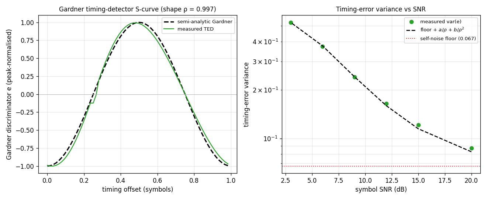

# Timing Loop — Theory Validation

A theoretical-correctness check on [`track.SymbolSync`](../api/python-track.md)'s
Gardner timing-error detector.

**Left — Timing-detector S-curve.** The open-loop TED (swept static timing
offset, bandwidth → 0) matches a **semi-analytic Gardner reference** computed
directly from the pulse train (shape correlation **ρ ≈ 0.997**). The
characteristic is period-one-symbol with two zeros a half-symbol apart — the
stable lock (positive restoring slope) and the unstable null. (The two timing
references differ by the Farrow's fixed 2-sample group delay, removed by a
peak-normalise + circular alignment.)

**Right — Timing-error variance vs SNR.** `var(e)` is a data-pattern
**self-noise floor** (≈ 0.067, present even at infinite SNR — a defining Gardner
property) plus an AWGN contribution that grows as `1/SNR` (signal×noise) and
`1/SNR²` (noise×noise); the `floor + a/ρ + b/ρ²` model fits the measurements to
within 10 %.

Source: `src/doppler/examples/symsync_theory_demo.py`;
tests in `src/doppler/track/tests/test_theory_symsync.py`.
