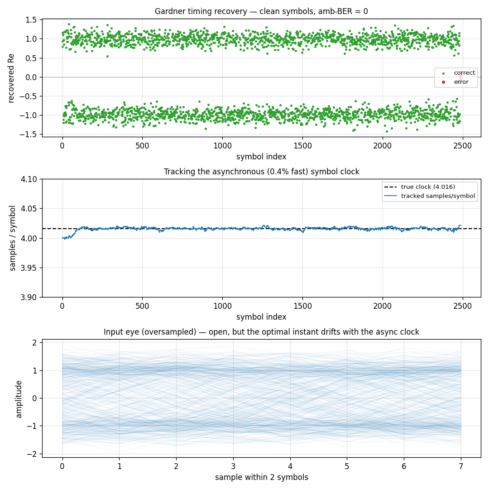

# Symbol Timing Recovery



[`track.SymbolSync`](../api/python-track.md) recovers the symbol clock of an
**asynchronous** data stream — one whose symbol rate is not locked to (and here
runs 0.4 % fast of) the receiver's sample clock. It is a Gardner timing-error
detector closing a PI loop around an **integer timing NCO** and a
[`Farrow`](farrow.md) interpolator: the NCO's post-wrap accumulator value is the
interpolation fraction µ — free, with no floating-point timing phase — so the
timing accumulation stays exact while only the interpolation is floating point.

The signal is an RC-shaped BPSK stream with a static fractional-sample offset, a
0.4 % clock-rate offset, and AWGN at 14 dB.

## What you're seeing

**Top — Recovered symbols.** The interpolated symbol's real part per symbol: a
brief pull-in, then clean ±1 once timing locks — the data is recovered with zero
bit errors (a global inversion is don't-care).

**Middle — Tracked clock.** The recovered samples/symbol converging onto the
true offset rate (dashed). The loop tracks the *asynchronous* clock — a moving
rate, not just a static phase.

**Bottom — Input eye.** The raw oversampled input folded to two symbols: the eye
is open, but with an async clock the optimal sampling instant drifts — which is
exactly why a fixed sampler fails and a tracking interpolator is needed.

## How it works

One per-sample integer-NCO loop produces two interpolants per symbol for the
Gardner detector, derived from the phase **value** (not a parity counter, so a
loop correction can never desync them):

```text
per sample:  push x[n] into the Farrow; advance the integer timing NCO
             half-scale crossing  -> mid-symbol interpolant (µ from the NCO)
             full-scale wrap      -> on-time interpolant   (µ from the NCO)
per symbol:  e = Re{ conj(mid) * (on_time - prev_on_time) }   # Gardner TED
             PI loop -> adjust the NCO frequency (slip-free)  # no phase nudge
             emit the on-time interpolant
```

Steering the NCO through its **frequency** (folding the proportional term into
the rate rather than nudging the phase) keeps the strobe count smooth — a direct
phase nudge near a wrap boundary would insert or delete a symbol (a cycle slip).

```python
import numpy as np

from doppler.track import SymbolSync

# an oversampled BPSK stream (4 samples/symbol) to drive the loop
bits = np.random.randint(0, 2, 400) * 2 - 1
rx = np.repeat(bits, 4).astype(np.complex64)

ss = SymbolSync(sps=4, bn=0.01, zeta=0.707, order="cubic")
symbols = ss.steps(rx)   # one timing-corrected symbol per recovered instant
ss.rate                  # tracked samples/symbol (the recovered clock)
```

`order` selects the Farrow interpolator (`linear` / `parabolic` / `cubic`);
`bn` / `zeta` set the loop bandwidth and damping. The synchronizer tracks
residual clock offsets up to roughly ±1 % cleanly — it follows acquisition,
just as the carrier loops track the residual after the FFT search.

Source: `src/doppler/examples/symsync_demo.py`.
