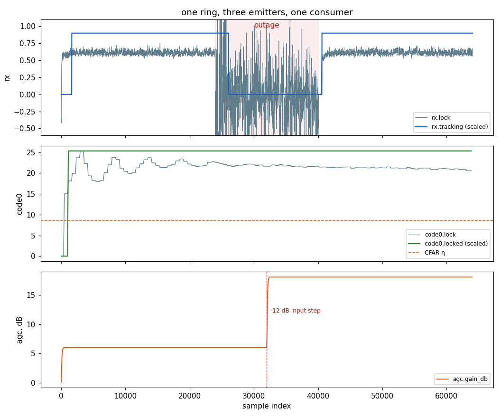

# Telemetry: Many Emitters, One Consumer



## What you're seeing

Three unrelated DSP objects — an M-PSK receiver (`rx.*`), a DSSS code
loop (`code0.*`), and an AGC (`agc.*`) — attached to a **single**
`Telemetry` context and stepped block by block on one producer thread,
while **one consumer** drains the shared ring, demuxes by probe name,
and writes the capture to disk. Every trace in the figure came out of
the same `read()` loop:

- **`rx`** — QPSK with a mid-stream outage: the carrier lock EMA
    (`rx.lock`) collapses, the two-way handover (`rx.tracking`) drops
    back to NDA acquisition, and re-declares when the signal returns.
- **`code0`** — a PN-31 code seeded half a chip off: the CFAR
    statistic (`code0.lock`) climbs through pull-in past the dashed
    detection threshold, and the verify-counted decision
    (`code0.locked`) declares once — no chatter at the crossing.
- **`agc`** — a −12 dB input level step: `agc.gain_db` ramps to
    re-level the output.

Statistic and decision stream side by side (`.lock`/`.locked`,
`.lock`/`.tracking`) — the consumer never re-derives a threshold.

## The consumption model

Two rules carry the whole design:

1. **One producer thread per context.** The ring is SPSC, so *any
    number of emitters* may share a context as long as everything that
    steps does so on one thread — prefixes keep the probe names
    disjoint, and `set_now(n)` stamps all sources with one sample
    clock. Multiple threads or processes get a ring each; the fan-in
    then happens over the wire (below) or in files.
1. **The consumer sets the drain cadence.** `read()` is non-blocking
    and the ring never stalls the DSP thread — a slow reader costs
    *records* (`dropped` counts them), never *throughput*. Drain at
    least as fast as the aggregate emit rate and `dropped` stays 0.

### Write to disk

The 16-byte record layout **is** the capture format — a structured
array saved verbatim, no transformation on either side:

```python
import tempfile
from pathlib import Path

import numpy as np

from doppler.agc import AGC
from doppler.telemetry import Telemetry
from doppler.track import Dll

tlm = Telemetry(1 << 14)  # ONE ring ...
code = (np.arange(31) % 2).astype(np.uint8)
d = Dll(code=code, sps=2)
d.set_telemetry(tlm, "code0")  # ... TWO emitters
agc = AGC(ref_db=0.0, loop_bw=0.0025, alpha=0.05)
agc.set_telemetry(tlm, "agc")

x = np.ones(31 * 2 * 50, dtype=np.complex64)
chunks = []
for i in range(0, x.size, 512):  # produce block-wise ...
    tlm.set_now(i)
    d.steps(x[i : i + 512])
    agc.steps(x[i : i + 512])
    chunks.append(tlm.read())  # ... ONE consumer drains
recs = np.concatenate(chunks)
assert tlm.dropped == 0

cap = Path(tempfile.mkdtemp()) / "tlm_capture.npy"
np.save(cap, recs)  # the record layout IS the file format
back = np.load(cap)
assert np.array_equal(back, recs)

# demux by probe id, e.g. the code loop's verify-counted decision:
locked = back[back["probe"] == tlm.probe_id("code0.locked")]["value"]
assert locked.size > 0
```

For long captures, append `read()` chunks to an open file handle and
rotate on size — each chunk is already wire-format bytes.

### Subscribe to a service

Across processes the same records travel as `TLM16` frames on the NATS
wire layer, and the pattern is **subject-is-the-source**: each pipeline
drains its *own* ring to its *own* subject, and a single consumer
process takes them all in. Probe-id spaces are per-ring, so the subject
tells the consumer which name map to demux with:

<!-- docs-snippet: skip=needs a live nats-server on 127.0.0.1:4222 -->

```python
from doppler.stream import Publisher, Subscriber, TLM16

# pipeline A and pipeline B (separate processes, one ring each) ...
pub_rx = Publisher("nats://127.0.0.1:4222/tlm.rx0", TLM16)
pub_ch = Publisher("nats://127.0.0.1:4222/tlm.ch1", TLM16)
pub_rx.send(tlm_rx.read())  # each drains its OWN ring, verbatim
pub_ch.send(tlm_ch.read())

# ... and ONE consumer process taking it all in
sources = {
    "rx0": Subscriber("nats://127.0.0.1:4222/tlm.rx0"),
    "ch1": Subscriber("nats://127.0.0.1:4222/tlm.ch1"),
}
for src, sub in sources.items():
    recs, hdr = sub.recv(timeout_ms=1000)
    assert hdr["sample_type"] == TLM16
    print(src, len(recs), "records")  # demux with THAT source's name map
```

A C pipeline publishes the same frames without Python in the loop: the
`dp_tlm_sink_*` helper (`telemetry/tlm_sink.h`, in the optional
`libdoppler_stream` component) drains a `dp_tlm_t` ring straight to a
subject on a timer thread. Frames are byte-identical either way, so C
producers and Python consumers mix freely.

## Run it

```bash
python src/doppler/examples/telemetry_fanin_demo.py   # → telemetry_fanin_demo.png  (~10 s)
```

See the [telemetry API](../api/python-telemetry.md) for the probe
tables and record layout, [Lock Detection](lockdet.md) for the
verify-counted decisions the `rx.tracking` / `code0.locked` traces come
from, and [Streaming](../examples/streaming.md) for the NATS wire layer
itself.
