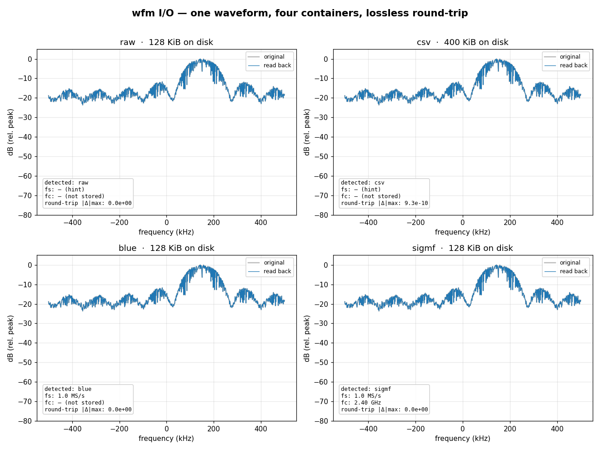

# Waveform I/O — One Capture, Four Containers



A waveform has to land somewhere. `doppler.wfm` writes the same `complex64`
samples to four containers and reads each back — the same C codec behind the
`wfmgen` CLI's `--file_type`. The trade is metadata for size and simplicity.

## What you're seeing

The same QPSK capture written to **raw**, **CSV**, **BLUE type-1000**, and
**SigMF**, then read back; each panel overlays the round-tripped spectrum on the
original (they coincide — the codec is lossless for `cf32`) and annotates the
on-disk size and the metadata the container recovered:

- **raw** — bare interleaved I/Q. Smallest and fastest, but **no metadata**: the
    reader must be *told* the sample type, and `fs`/`fc` are not stored.
- **CSV** — human-readable `I,Q` text. Self-describing shape, no metadata, ~3× the
    bytes (and a tiny text-rounding error).
- **BLUE (type-1000)** — a 512-byte header recording the sample format, byte
    order, and `fs` (as `xdelta = 1/fs`); the reader recovers them with no hints.
- **SigMF** — a `.sigmf-data` + `.sigmf-meta` JSON pair; the most self-describing,
    recovering **both** `fs` and `fc` (and one annotation per segment).

`Reader` auto-detects the container (BLUE magic / `.sigmf-meta` sidecar / `.csv`
extension / else raw); raw is the one case that needs a `sample_type` hint.

## Building it

```python
from doppler.wfm import Composer, Reader, Segment, Writer, sigmf_meta

seg = Segment("qpsk", fs=1e6, freq=1.5e5, snr=20, sps=8, num_samples=1 << 14)
x = Composer([seg]).compose()

# BLUE: one self-describing file — fs/fc tagged on write, recovered on read.
with Writer("cap.blue", file_type="blue", sample_type="cf32", fs=1e6, fc=2.4e9) as w:
    w.write(x)
with Reader("cap.blue") as r:                 # container auto-detected
    y, fs = r.read_all(), r.fs                 # fs recovered from the header

# SigMF is a pair: Writer lays down .sigmf-data; sigmf_meta() writes the sidecar.
with Writer("cap.sigmf-data", file_type="sigmf", sample_type="cf32", fs=1e6, fc=2.4e9) as w:
    w.write(x)
open("cap.sigmf-meta", "w").write(
    sigmf_meta(sample_type="cf32", fs=1e6, fc=2.4e9, segments=[seg])
)
```

The CLI writes the same containers — `wfmgen --file_type raw|csv|blue|sigmf` —
byte-for-byte identical to the Python `Writer`.

## Reproduce

```sh
python examples/python/wfm_io_demo.py    # the four-container figure (writes .png)
```

See the [Python composer API](../api/python-wfmgen.md#compose-multi-segment-composition-writers-and-a-zmq-sink)
for the full `Writer` / `Reader` / `read_iq` surface.
