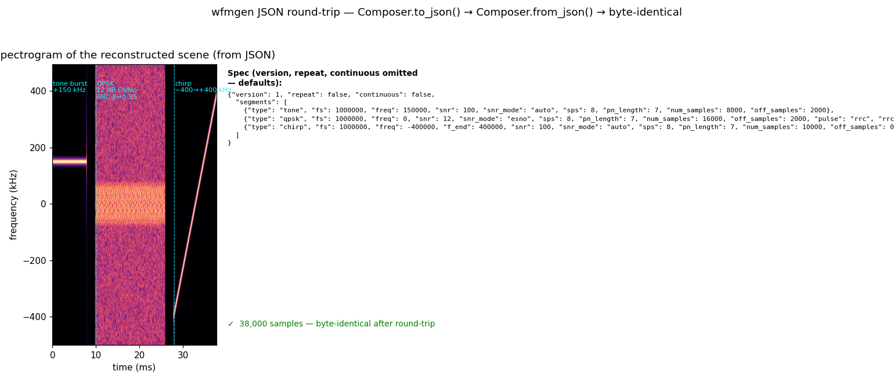

# Waveform JSON Round-Trip



A waveform scene is portable: once serialised to JSON it can be archived,
shared, and reproduced on any platform that has `wfmgen` or the Python API —
with byte-identical output guaranteed.

## What you're seeing

**Left — spectrogram of the reconstructed scene.** Three segments play in
order: a clean tone burst at +150 kHz (tight ridge), a QPSK burst with RRC
shaping at 12 dB Es/No (noise haze spread across the band), and a linear chirp
sweeping −400 → +400 kHz. The scene was loaded from the JSON spec shown on
the right — not from the original Python objects.

**Right — the JSON spec.** Boilerplate fields (`seed`, `pn_poly`, `lfsr`)
are omitted from the display for readability; the full spec carries them.
`version`, `repeat`, and `continuous` are at the top level; everything else
lives inside `segments`, one object per segment.

## The round-trip

```python
from doppler.wfm import Composer, Segment
import numpy as np

# Three self-contained segments: a tone burst, a QPSK burst, a chirp sweep.
tone_seg = Segment("tone", fs=1e6, freq=1.5e5, snr=100.0, num_samples=8000)
qpsk_seg = Segment("qpsk", fs=1e6, snr=12.0, snr_mode="esno", sps=8,
                   pulse="rrc", rrc_beta=0.35, num_samples=16000)
chirp_seg = Segment("chirp", fs=1e6, freq=-4e5, f_end=4e5, num_samples=10000)

composer_a = Composer([tone_seg, qpsk_seg, chirp_seg])
iq_a       = np.asarray(composer_a.compose())

spec_json  = composer_a.to_json()          # → JSON string (same as --record)

composer_b = Composer.from_json(spec_json) # → same as --from-file
iq_b       = np.asarray(composer_b.compose())

assert np.array_equal(iq_a, iq_b)         # byte-identical
```

`to_json()` writes the fully-resolved spec — every default filled in, every
derived value explicit. `from_json()` (or `from_file()` for a path on disk)
parses it back and builds an identical composer. Because the spec drives the
same C engine in both directions, the round-trip is exact to the last bit.

## Using it from the CLI

Save the JSON to a file and feed it straight to `wfmgen`:

```sh
# From Python: write the spec
python - <<'EOF'
from doppler.wfm import Composer, Segment
c = Composer([
    Segment("tone",  fs=1e6, freq=1.5e5, snr=100.0, num_samples=8000,  off_samples=2000),
    Segment("qpsk",  fs=1e6, snr=12.0,   snr_mode="esno", sps=8,
            pulse="rrc", rrc_beta=0.35, rrc_span=8, num_samples=16000, off_samples=2000),
    Segment("chirp", fs=1e6, freq=-4e5,   f_end=4e5, num_samples=10000),
])
open("scene.json", "w").write(c.to_json())
EOF

# From CLI: replay it
wfmgen --from-file scene.json --output scene.cf32
wfmgen --from-file scene.json --sample-type ci16 --output scene.ci16
```

Or skip Python entirely — `wfmgen json-template` dumps an editable starter
spec, and every `wfmgen` run can be recorded with `--record`:

```sh
wfmgen json-template scene.json          # editable skeleton
wfmgen --from-file scene.json \
       --record run.json -o out.cf32     # record the resolved run
wfmgen --from-file run.json  -o b.cf32  # byte-identical replay
```

The JSON schema is at `docs/schema/wfmgen.schema.json`; the test suite in
`src/doppler/wfm/tests/test_schema.py` validates every `--record` output
against it automatically.

## Reproduce

```bash
python src/doppler/examples/wfm_json_demo.py   # → wfm_json_demo.png
```
