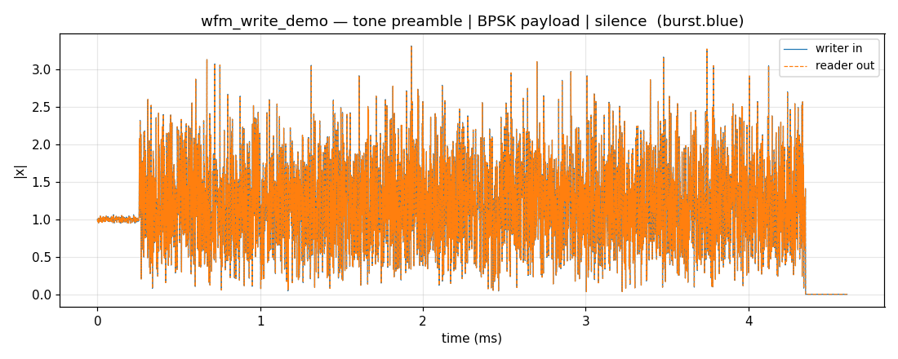

# Waveform Write — Compose, Write, Read Back



The shortest path from a `Composer` to a file: build a burst, hand it to
`Writer`, recover it with `Reader`, and compare the envelopes.

## What you're seeing

Time-domain magnitude of a three-phase burst written to a BLUE type-1000
file and read back:

- **Tone preamble** — 256 samples, flat envelope, 100 kHz offset, 30 dB SNR.
- **BPSK payload** — 512 symbols at 8 samples/symbol, 10 dB SNR. The
    envelope fluctuates with the AWGN noise floor.
- **Silence** — 256 zero-padded samples; the envelope drops to the noise floor.

The two traces land exactly on top of each other — `cf32` round-trips through
BLUE without loss. BLUE's 512-byte header stores the sample type, byte order,
`fs`, and `fc`, so `Reader` needs no side-channel hints.

## Building it

```python
--8<-- "src/doppler/examples/wfm_write_demo.py:burst"
```

## Reproduce

```sh
python src/doppler/examples/wfm_write_demo.py   # → burst.blue + wfm_write_demo.png
```

For four containers side by side — raw, CSV, BLUE, and SigMF — see
[Waveform I/O](wfm-io.md). For the flag/parameter reference behind `Writer`
and `Reader`, see [Guide: Output & containers](../guide/wfmgen/output.md).
