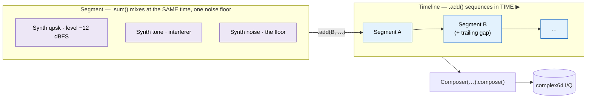

# Waveform Generator — `wfmgen`

doppler ships a C-first **waveform generator**: one declarative synth engine
(every algorithm in C, exactly once), exposed two ways —

- **`wfmgen`** — the one command-line tool. A single waveform *or* a
    multi-segment scene, the **raw / CSV / BLUE / SigMF** containers, and
    streaming to **ZMQ**. (A one-segment run is the simple single-waveform case.)
- **`doppler.wfm`** — the same engine as a Python API, one import path:
    `from doppler.wfm import …`.


Reach for `--from-file` (or the Python `Composer`) when you need multiple
segments, mixing, BLUE/SigMF, or a ZMQ stream — otherwise the flags below
generate a single waveform.

!!! tip "The 30-second version"

    ```sh
    wfmgen --type qpsk --snr 12 --count 100000 -o capture.cf32   # 100k QPSK samples @ 12 dB Es/No
    wfmgen --type tone --freq 0.1 --count 4096                   # a 0.1·Fs tone → stdout (cf32)
    wfmgen --type pn --pn-length 9 --file-type csv -o pn.csv      # length-9 MLS as text
    ```

______________________________________________________________________

## Installation

```sh
pip install doppler-dsp        # → the `wfmgen` command + the doppler.wfm API
```

The wheel ships the self-contained `wfmgen` binary as package data and a
`wfmgen` console-script — a thin shim that `exec`s it — alongside the
`doppler.wfm` Python module. To build from source instead:

```sh
git clone https://github.com/doppler-dsp/doppler && cd doppler
cmake -B build -DBUILD_PYTHON=ON && cmake --build build --target wfmgen_cli
# binary: build/native/src/wfmcompose/wfmgen
```

______________________________________________________________________

## Waveform types

`--type` selects the waveform; every type shares the same parameter set.

| `--type` | What it is                                                 | Key parameters                      |
| -------- | ---------------------------------------------------------- | ----------------------------------- |
| `tone`   | a complex sinusoid at `--freq`                             | `--freq`                            |
| `noise`  | complex AWGN (unit power)                                  | `--snr` (ignored — it *is* noise)   |
| `pn`     | a maximum-length sequence (±1 chips), `--sps` samples/chip | `--pn-length`, `--pn-poly`, `--sps` |
| `bpsk`   | BPSK symbols (PN-sourced data), `--sps` samples/symbol     | `--sps`, `--snr`                    |
| `qpsk`   | Gray-coded QPSK symbols (PN-sourced data)                  | `--sps`, `--snr`                    |
| `chirp`  | linear-FM sweep `--freq` → `--f-end` over `--count`        | `--freq`, `--f-end`                 |
| `bits`   | a user bit pattern, oversampled `--sps` and cycled         | `--bits`, `--modulation`, `--sps`   |

The data bits for `bpsk`/`qpsk` come from a deterministic PN sequence (seeded by
`--seed`), so output is reproducible and receiver-correlatable. A `chirp` sweeps
its instantaneous frequency linearly from `--freq` (the start) to `--f-end` over
the `--count` samples, then holds at `--f-end`; `--f-end < --freq` is a
down-chirp. The phase is continuous across segments, so concatenated chirps join
seamlessly (radar pulse compression, SAR, sonar). A `bits` waveform instead
plays back **your** sequence — a preamble, sync word, or test vector — given as
a 0/1 string (`--bits 10110101`), a hex string (`--bits-hex AA55`, MSB first),
or a file (`--bits-file pattern.txt`); `--modulation` (`none`/`bpsk`/`qpsk`)
maps the bits to symbols. The PSK carriers (`pn`/`bpsk`/`qpsk`) default to
rectangular sample-and-hold chips (a wide `sinc²` spectrum); add `--pulse rrc`
for **root-raised-cosine** shaping to get a band-limited carrier (e.g. a WCDMA
QPSK downlink at roll-off 0.22) straight from the generator.

```sh
wfmgen --type chirp --freq 100e3 --f-end 300e3 --fs 1e6 --count 10000 -o chirp.cf32
wfmgen --type bits --bits 10110101 --modulation bpsk --sps 8 --count 64 -o sync.cf32
wfmgen --type bits --bits-hex AA55 --modulation none --sps 4 -o preamble.cf32
wfmgen --type qpsk --sps 8 --pulse rrc --rrc-beta 0.22 --count 100000 -o wcdma.cf32
```

______________________________________________________________________

## Parameter reference

### Engine

=== ====

| Flag           | Type                                 | Default  | Meaning                                                                        |
| -------------- | ------------------------------------ | -------- | ------------------------------------------------------------------------------ |
| `--type`       | `tone noise pn bpsk qpsk chirp bits` | `tone`   | waveform                                                                       |
| `--fs`         | float (Hz)                           | `1.0`    | sample rate (default `1.0` ⇒ `--freq`/`--f-end` are normalised, cycles/sample) |
| `--freq`       | float (Hz)                           | `0`      | frequency offset from baseband (mixed by the LO); chirp start                  |
| `--f-end`      | float (Hz)                           | `0`      | chirp end frequency (`--type chirp` only)                                      |
| `--snr`        | float (dB)                           | `100`    | SNR; metric chosen by `--snr-mode` (≈clean at 100)                             |
| `--snr-mode`   | `auto fs ebno esno`                  | `auto`   | how `--snr` is interpreted (see below)                                         |
| `--seed`       | uint32                               | `0`      | PRNG / LFSR seed (deterministic)                                               |
| `--sps`        | int                                  | `1`      | samples per symbol (`*psk`/`bits`) / per chip (`pn`)                           |
| `--pn-length`  | int (2..64)                          | `15`     | LFSR register length → period `2ⁿ−1`                                           |
| `--pn-poly`    | uint64                               | `0`      | LFSR polynomial; `0` ⇒ auto-pick the MLS polynomial                            |
| `--lfsr`       | `galois fibonacci`                   | `galois` | LFSR realization (same polynomial/period, different sequence)                  |
| `--bits`       | 0/1 string                           | —        | `bits`: pattern, e.g. `10110101` (or `--bits-hex`/`--bits-file`)               |
| `--modulation` | `none bpsk qpsk`                     | `bpsk`   | `bits`: how the pattern maps to symbols                                        |
| `--pulse`      | `rect rrc`                           | `rect`   | pn/bpsk/qpsk pulse shape; `rrc` = band-limited RRC shaping                     |
| `--rrc-beta`   | float                                | `0.35`   | RRC roll-off (`--pulse rrc`)                                                   |
| `--rrc-span`   | int                                  | `8`      | RRC filter support in symbols (`--pulse rrc`)                                  |
| `--count`      | int                                  | `1024`   | number of complex samples to generate                                          |

### Output

| Flag              | Values                    | Default | Meaning                                   |
| ----------------- | ------------------------- | ------- | ----------------------------------------- |
| `--sample-type`   | `cf32 cf64 ci32 ci16 ci8` | `cf32`  | wire type; integers are full-scale ±1.0   |
| `--file-type`     | `raw csv blue sigmf`      | `raw`   | container (see [Containers](#containers)) |
| `--endian`        | `le be`                   | `le`    | byte order (raw/BLUE only; csv is text)   |
| `--output` / `-o` | path *(or `zmq://…`)*     | stdout  | sink                                      |
| `--record`        | path                      | —       | write a JSON record of the resolved run   |

### Composer (multi-segment, `--from-file`)

| Flag                    | Meaning                                                                                                        |
| ----------------------- | -------------------------------------------------------------------------------------------------------------- |
| `--from-file SPEC.json` | run a multi-segment spec (see [Multi-segment](#multi-segment-specs))                                           |
| `json-template [FILE]`  | subcommand: dump an editable example spec (to `FILE`, else stdout) — see [Multi-segment](#multi-segment-specs) |
| `--level DB`            | source level in dBFS (≤0); scales the segment by `10^(DB/20)` (SNR-invariant; default 0)                       |
| `--headroom DB`         | back the output off to `−DB` dBFS so peaks fit (SNR-invariant; default 0)                                      |
| `--clip-report`         | print the clipped fraction + peak; `--clip-error` exits non-zero on a clip                                     |
| `--fc HZ`               | capture center frequency, written into BLUE/SigMF metadata                                                     |
| `--off N`               | trailing off-time (zeros) after the segment                                                                    |
| `--repeat`              | loop the whole sequence                                                                                        |
| `--continuous`          | never stop (implies repeat) — for streaming                                                                    |
| `--detached`            | BLUE only: write `<out>.hdr` (HCB) + `<out>.det` (data)                                                        |
| `--realtime`            | pace the output to `fs`, mimicking a sample clock (see [Real-time pacing](#real-time-pacing))                  |
| `--realtime-resync`     | like `--realtime`, but re-anchor to "now" on each underrun                                                     |

______________________________________________________________________

## Amplitude & full-scale

The amplitude invariant is **unit average power**: every waveform is normalised
so its mean power is `1.0`. That — *not* a constant envelope — is what the rest
of the system is built on. It is the reference the SNR math uses (signal power
≡ 1, so the noise σ falls straight out of the target SNR; see
[SNR & noise](#snr-noise)), and the level you control is the SNR, not a signal
gain. The I/Q full-scale is **±1.0** per axis (→ the largest integer code).

Today's waveforms all *happen* to be **constant-envelope**, so for them the peak
equals the average and they sit exactly at ±1.0 — but that is a property of the
current set, **not** a design assumption:

| `--type`      | Sample values                         | Envelope           | Avg. power |
| ------------- | ------------------------------------- | ------------------ | ---------- |
| `tone`        | `exp(j·2πft)`                         | constant, mag 1    | `1.0`      |
| `bpsk` / `pn` | `±1` (real axis)                      | constant, mag 1    | `1.0`      |
| `qpsk`        | `(±1/√2, ±1/√2)`                      | constant, mag 1    | `1.0`      |
| `chirp`       | `exp(j·φ(t))`, φ′ ramps `freq→f_end`  | constant, mag 1    | `1.0`      |
| `noise`       | complex Gaussian, `σ = 1/√2` per axis | Gaussian, PAPR > 0 | `1.0`      |

**Don't rely on `|z| = 1`.** A pulse-shaped (RRC), QAM, or OFDM waveform has a
**peak-to-average power ratio (PAPR) above 0 dB**: at unit *average* power its
*peaks* run well past ±1.0. `noise`, and any signal-plus-noise sum, already do.

### Scaling to the wire, and headroom

`cf32` / `cf64` carry samples verbatim and **never clip** — peaks past ±1.0 are
preserved. The integer types map **±1.0 → ±max-code** by **saturating each axis
to ±1.0, then truncating toward zero** (a plain cast, not round-to-nearest):

| `--sample-type` | Map                   | Full-scale code  |
| --------------- | --------------------- | ---------------- |
| `ci32`          | `clip(v, ±1)·(2³¹−1)` | `±2 147 483 647` |
| `ci16`          | `clip(v, ±1)·32767`   | `±32 767`        |
| `ci8`           | `clip(v, ±1)·127`     | `±127`           |

So clipping is governed by **PAPR**, not by something being "signal" vs "noise":

- A **constant-envelope, clean** signal (today's tone/PSK/PN at `--snr 100`)
    fills the integer range exactly, with no clipping.
- **Any PAPR > 0 dB content clips** at the rails — added noise (at `--snr 0`,
    noise power = signal power, ~⅓ of integer I/Q components already saturate)
    and any future pulse-shaped / QAM / OFDM mode. Such a signal needs
    **headroom**, which `wfmgen` provides: **`--headroom <dB>`** (and
    `Writer(headroom=…)` in Python) scales the whole output down to `−H` dBFS so
    the peaks fit. It is a single common gain, so it is **SNR-invariant** — it
    moves only the absolute level, not any power ratio — and `0` dB (the default)
    is a bit-exact no-op. An integer capture that clips reports the exact backoff
    to use (`remedy: --headroom N`). You can also just carry envelope-varying
    signals as a **float** type (`cf32` / `cf64`), which never clips.

[`Reader`](#reading-a-capture-back) inverts the same map, so a float round-trip
is exact and an integer round-trip is exact only where it neither clipped nor
truncated.

```python
>>> import numpy as np
>>> from doppler.wfm import Synth
>>> # the invariant is unit *average* power (here a clean, constant-envelope QPSK)
>>> x = Synth(type="qpsk", sps=1, snr=100.0).steps(4096)
>>> bool(np.allclose(np.mean(np.abs(x) ** 2), 1.0))
True
>>> # add noise (or, later, pulse-shaping / QAM) and peaks exceed full-scale:
>>> y = Synth(type="qpsk", sps=1, snr=0.0).steps(100000)
>>> float(np.mean(np.abs(y.real) > 1.0)) > 0.1   # many samples clip in ci*
True
```

______________________________________________________________________

## SNR & noise

`--snr` is applied as AWGN; `--snr-mode` chooses the reference:

| Mode   | `--snr` means                                               | Use for              |
| ------ | ----------------------------------------------------------- | -------------------- |
| `fs`   | SNR over the full sample rate (in-band power / noise power) | tones, wideband      |
| `esno` | **Es/No** — energy per *symbol* over noise PSD              | modulated (`*psk`)   |
| `ebno` | **Eb/No** — energy per *bit* over noise PSD                 | link-budget work     |
| `auto` | `fs` for `tone`/`noise`/`pn`, `esno` for `bpsk`/`qpsk`      | the sensible default |

**`--snr 100` (the default) is *clean*** — `snr ≥ 100 dB` generates **no AWGN at
all**, so a clean waveform pays no noise cost. Lower `--snr` to add noise; the
signal stays at unit average power ([Amplitude & full-scale](#amplitude-full-scale)),
so the per-axis noise σ is `σ = sqrt(1 / (2·10^(snr_fs/10)))`, where Es/No and Eb/No
are first converted to an over-`fs` SNR using `10·log10(sps)` (and, for Eb/No,
the bits/symbol: 1 for BPSK/PN, 2 for QPSK). (`--type noise` always generates
AWGN.)
Likewise **`--freq 0` skips the LO** — the carrier is a constant 1 — so a clean
baseband waveform is pure signal generation.

!!! example "Same QPSK at three references"

    ```sh
    wfmgen --type qpsk --snr 10 --snr-mode esno     # 10 dB Es/No (the auto default)
    wfmgen --type qpsk --snr 7  --snr-mode ebno     # 7 dB Eb/No  (= 10 dB Es/No)
    wfmgen --type qpsk --snr 1  --snr-mode fs        # 1 dB over fs (per-sample)
    ```

______________________________________________________________________

## PN sequences & MLS

`--type pn` emits a maximum-length sequence; `--pn-length n` sets the LFSR
register length (**2 to 64**, period `2ⁿ−1`). The register, polynomial, and
`--pn-poly` are full 64-bit. Leave **`--pn-poly 0`** and the engine selects a
primitive polynomial that yields a true MLS for that length (a built-in table of
verified primitive polynomials for every length 2..64) — verified by
period, balance, and the thumbtack autocorrelation. Supply `--pn-poly` only to
force a specific tap set.

```sh
wfmgen --type pn --pn-length 7   --sps 1 --count 127   # one full period (2⁷−1)
wfmgen --type pn --pn-length 11  --sps 4               # length-11 MLS, 4× oversampled
wfmgen --type pn --pn-length 7   --lfsr fibonacci      # Fibonacci realization
```

`--lfsr` selects the LFSR realization: **`galois`** (default, internal XOR
feedback) or **`fibonacci`** (external XOR of the tapped bits). Both use the same
primitive polynomial and have the same period `2ⁿ−1`; they differ only in the
chip sequence/phase. The Fibonacci taps are derived from the same polynomial, so
`--pn-poly 0` still auto-selects the MLS for either mode.

______________________________________________________________________

## Containers

`--sample-type` (the *datatype*) is orthogonal to `--file-type` (the *container*)
and `--endian` (byte order).

| `--file-type` | Output                                        | Notes                                                      |
| ------------- | --------------------------------------------- | ---------------------------------------------------------- |
| `raw`         | interleaved I/Q in the chosen `--sample-type` | the SDR default; honors `--endian`                         |
| `csv`         | one `I,Q` line per sample                     | `%0.9f` cf32, `%0.17g` cf64, `%d` integer; text, no endian |
| `blue`        | **X-Midas / REDHAWK BLUE type-1000**          | *(`wfmgen` only)* self-describing 512-byte header          |
| `sigmf`       | `<base>.sigmf-data` + `<base>.sigmf-meta`     | *(`wfmgen` only)* one annotation per segment               |

**BLUE type-1000** writes a complete 512-byte X-Midas/REDHAWK Header Control
Block so one file is fully self-describing: `data_rep`←`--endian`, `format`
(`CB`/`CI`/`CL`/`CF`/`CD`)←`--sample-type`, and `xdelta = 1/fs`. Add
**`--detached`** to split it into a header + data pair — `<out>.hdr` (the HCB,
with `detached=1` and `data_start=0`) and `<out>.det` (the raw samples). Detached
output requires `--output` and a finite (non-`--continuous`) run; attached mode
keeps whatever extension you give `-o` (`.blue`/`.prm`/`.tmp`).

**SigMF** writes the samples as `raw` into `<base>.sigmf-data` and a JSON sidecar
`<base>.sigmf-meta` with `core:datatype`/`core:sample_rate`, a capture at `--fc`,
and one annotation per composer segment (frequency edges, label, `wfmgen:*`
params).

```sh
# 16-bit big-endian into a self-describing BLUE file
wfmgen --type qpsk --count 200000 --sample-type ci16 --endian be \
       --file-type blue -o capture.blue

# a SigMF pair (capture.sigmf-data + capture.sigmf-meta)
wfmgen --from-file scenario.json --sample-type ci16 --file-type sigmf -o capture
```

### SigMF sidecar schema

The `.sigmf-meta` JSON is SigMF 1.0.0 with one **annotation per source per
segment**, so a multi-segment / multi-source scene becomes a self-labelling
ground-truth capture. The exact shape `wfmgen` (and `Composer.to_sigmf`) emit
— see `native/src/wfm/wfm_writer.c`:

```json
{
  "global": {
    "core:datatype": "ci16_le",
    "core:sample_rate": 1000000,
    "core:version": "1.0.0",
    "core:description": "doppler wfmgen",
    "core:author": "doppler wfmgen"
  },
  "captures": [
    { "core:sample_start": 0, "core:frequency": 2400000000.0 }
  ],
  "annotations": [
    {
      "core:sample_start": 0,
      "core:sample_count": 4096,
      "core:freq_lower_edge": -62500.0,
      "core:freq_upper_edge": 62500.0,
      "core:label": "qpsk",
      "wfmgen:snr": 20.0,
      "wfmgen:snr_mode": "esno",
      "wfmgen:sps": 8,
      "wfmgen:seed": 1,
      "wfmgen:pn_length": 7,
      "wfmgen:pn_poly": 0
    }
  ]
}
```

- `core:datatype` is `<sample_type>_<endian>` (`cf32_le`, `ci16_be`, …).
- `captures[0].core:frequency` is `--fc` (the RF centre); annotation frequency
    edges are **baseband** offsets from it — a chirp spans `f_start..f_end`, a
    modulated source is roughly `±fs/(2·sps)` wide, a tone is a point.
- `core:label` is the source type (`tone`/`noise`/`pn`/`bpsk`/`qpsk`/`chirp`/
    `bits`); the `wfmgen:*` keys carry the generator parameters so the capture
    round-trips to the spec that made it.

`Composer.to_sigmf(sample_type="cf32", endian="le", fs=1e6, fc=0.0)` returns
this document as a string; pair it with a `Writer(..., file_type="sigmf")` data
file. (The validator test
`src/doppler/wfm/tests/test_api_surface.py::TestComposerGraph` asserts the
global/annotation keys.)

______________________________________________________________________

## Sinks

| `--output`           | Result                                                                 |
| -------------------- | ---------------------------------------------------------------------- |
| *(omitted)*          | binary stream to **stdout** (pipe it)                                  |
| `file.iq`            | write to a file                                                        |
| `zmq://tcp://*:5555` | *(`wfmgen` only)* publish to a **ZMQ PUB** endpoint (SIGS wire format) |

```sh
wfmgen --type tone --count 1000000 | other-tool          # pipe via stdout
wfmgen  --type tone --continuous --output zmq://tcp://*:5555   # stream forever to ZMQ
```

A `dp_sub_*` subscriber (e.g. `examples/c/spectrum_analyzer`) reads the ZMQ
stream.

______________________________________________________________________

## Real-time pacing

By default `wfmgen` emits as fast as the CPU allows — `fs` is only metadata
(the BLUE `xdelta`, the ZMQ header). Add **`--realtime`** to throttle the output
to `fs`, so blocks leave on an `epoch + n/fs` schedule — mimicking a hardware
sample clock feeding the sink. This is what you want when a downstream consumer
expects samples to arrive at the real rate (a live spectrum display, an SDR
playback emulation):

```sh
# Stream QPSK to a live receiver at the true 1 MS/s, not as fast as possible
wfmgen --type qpsk --fs 1e6 --sps 8 --continuous --realtime \
       --output zmq://tcp://*:5555
```

The schedule is **drift-free**: each deadline is recomputed from the cumulative
sample count against a fixed epoch, so sleep jitter never accumulates — the
long-run rate is exactly `fs`. Pacing does **not** alter the samples; a file
written with and without `--realtime` is byte-identical.

If the producer can't keep up (a block takes longer than its `N/fs` period —
an *underrun*), `wfmgen` keeps the absolute timeline and prints a summary to
stderr at exit (`wfmgen: 3 underrun(s) — worst 1.2 ms behind real time`). Use
**`--realtime-resync`** instead to re-anchor the clock to "now" on each
underrun, staying near real time going forward at the cost of an inserted gap.

!!! note "Software pacing is average-rate, not sample-accurate"

    On a non-realtime OS you get a drift-free *average* rate with bounded
    per-block jitter, never true sample-clock fidelity. Keep blocks large
    enough that the period `N/fs` comfortably exceeds scheduler jitter, and let
    the consumer's buffer absorb the rest. The same engine is in Python as
    [`SampleClock`](../api/python-wfmgen.md#compose-multi-segment-composition-writers-and-a-zmq-sink).

______________________________________________________________________

## Multi-segment specs

`wfmgen --from-file SPEC.json` sequences segments — each a waveform plus an
optional trailing off-time — and can repeat or run forever. Both the CLI and
the Python `Composer` API drive the same C engine, so their output is
**byte-identical** for the same parameters.

=== "CLI (JSON spec)"

    ```json title="scenario.json"
    {
      "version": 1,
      "segments": [
        { "type": "tone", "fs": 1e6, "freq": 1e5, "snr": 100.0,
          "num_samples": 10000, "off_samples": 5000 },
        { "type": "qpsk", "fs": 1e6, "snr": 9.0, "snr_mode": "esno",
          "sps": 8, "num_samples": 40000 }
      ]
    }
    ```

    ```sh
    wfmgen --from-file scenario.json -o scenario.cf32
    ```

=== "Python API"

    ```python
    from doppler.wfm import Composer, tone, qpsk

    scene = (
        Composer(fs=1e6)
        .add(tone(freq=1e5, snr=100.0, num_samples=10000, off_samples=5000))
        .add(qpsk(snr=9.0, snr_mode="esno", sps=8, num_samples=40000))
    )
    scene.write("scenario.cf32")
    ```

`type` and `snr_mode` are strings in JSON; every other field is numeric and
**falls back to the engine default** if omitted. `num_samples` is the on-time;
`off_samples` is a trailing gap of zeros. `repeat` loops the sequence;
`continuous` never finishes (for streaming). On every loop the **seed advances**
(see [Fresh noise on repeat](#fresh-noise-on-repeat)), so a repeated stream is a
fresh realization, not byte-identical copies.

Rather than write the JSON schema from memory, dump a ready-to-edit example
with **`wfmgen json-template`** and edit it down:

```sh
wfmgen json-template > scenario.json   # or: wfmgen json-template scenario.json
# …edit scenario.json…
wfmgen --from-file scenario.json -o scenario.cf32
```

The template is a representative spec — an inline tone, an RRC-shaped
QPSK-from-bits burst with a trailing gap, and a two-source `sum` mix — that is
**valid by construction**: it round-trips through `--from-file` unchanged, so
it doubles as a working starting point, not just documentation. With no path
(or `-`) it prints to stdout; pass a path to write the file directly.

### Fresh noise on repeat

A repeated stream should be a *stream*, not the same bytes over and over — so
each source's **`seed` advances by one on every loop** (`--repeat` and
`--continuous`). A one-burst spec run `--continuous` therefore emits an endless
sequence of **distinct noise realizations**: ideal for a soak test, a live
receiver fuzz, or a rotating-file recorder. Pass 0 (the first loop) reproduces
the spec exactly, so a finite single-pass run is unchanged and remains
byte-reproducible from `--record`.

What the advancing seed changes depends on the source — it drives both the noise
and any PN-sourced data:

| Source type        | Fixed across repeats             | Varies across repeats         |
| ------------------ | -------------------------------- | ----------------------------- |
| `bits`             | the bit pattern                  | the AWGN                      |
| `tone` / `chirp`   | everything (no seed-driven part) | the AWGN (if `--snr` adds it) |
| `noise`            | —                                | the whole noise sequence      |
| `pn`/`bpsk`/`qpsk` | —                                | the PN data **and** the AWGN  |

So to repeat a **fixed waveform under fresh noise** — e.g. a known preamble or
sync code that a receiver must re-acquire every burst — carry the code as a
**`bits` pattern** (fixed), not a `pn` source (which would re-randomize the code
each loop). For an endless stream of *independent* random bursts, a `pn`/`*psk`
source is exactly right.

```sh
# A 31-chip PN preamble + payload, repeating forever, fresh noise each burst:
wfmgen --from-file burst.json --continuous --realtime -o stream.cf32
# burst.json: a `bits` segment (the code as an explicit 0/1 pattern) + trailing
# gap → the code is identical every burst, only the AWGN changes.
```

______________________________________________________________________

## Mixing sources (`sum`) and sequencing them (`add`)

A segment can hold **several sources mixed at the same time** — a signal of
interest plus interferers plus a noise floor — instead of just one. The two
composition verbs are orthogonal:

- **`.sum()` mixes** sources over the *same* span (one receiver → one sample
    rate, one shared noise floor). SNR lives on a source; the floor is resolved
    **once, in C**, so the Python, JSON, and `wfmgen --from-file` faces are
    byte-identical.
- **`.add()` sequences** segments in *time*, back-to-back — the multi-segment
    timeline above, built fluently.



```python
from doppler.wfm import Composer, Segment, qpsk, tone, noise

# A scene: a −12 dB QPSK SoI at +50 kHz over a CW interferer, at 15 dB Es/No.
scene = Segment.sum(
    qpsk(snr=15, snr_mode="esno", level=-12),  # the anchor sets the floor
    tone(freq=5e4),                             # an interferer (level 0 dBFS)
    num_samples=65536,
)

# Sequence a clean preamble tone, then the scene:
timeline = Segment("tone", freq=1e5, num_samples=2000, off_samples=500).add(scene)
iq = Composer(timeline).compose()
```

Rules of the floor (resolved per segment): an explicit `noise(level=N)` source
fixes it at `N` dBFS; otherwise the first source carrying `snr` is the anchor
and the floor is `level(anchor) − SNR_fs(anchor)`. Other sources place
themselves with `level` (a plain dBFS offset); giving a non-anchor *both* `snr`
and `level` is a spec error. A single-source segment keeps its bundled AWGN
untouched, so it is byte-identical to the pre-composition path.

In the wfmgen JSON schema, a mixed segment replaces the inline source fields
with a **`sum`** array (each entry is a source; `fs`/`num_samples`/`off_samples`
stay on the segment):

```json
{ "fs": 1e6, "num_samples": 65536, "off_samples": 0,
  "sum": [
    { "type": "qpsk", "snr": 15.0, "snr_mode": "esno", "sps": 8, "level": -12.0 },
    { "type": "tone", "freq": 5e4 }
  ] }
```

`--record` writes the **resolved** sum (the cleaned anchor plus an explicit
`noise` source at the floor), so a recorded scene reproduces exactly.

______________________________________________________________________

## Reproducible runs (`--record`)

`--record run.json` writes the **fully-resolved** spec — every value *after*
defaulting (the auto-selected MLS polynomial, the resolved SNR mode, a summed
segment's cleaned anchor + explicit noise floor) **and** the `--headroom`. Feed
it straight back with `--from-file` and you get a byte-identical stream:

```sh
wfmgen --type bpsk --count 50000 --sps 4 --headroom 6 --record run.json -o a.iq
wfmgen --from-file run.json -o b.iq      # a.iq and b.iq are identical
```

The recorded `--headroom` is reapplied on replay; an explicit `--headroom` on
the `--from-file` run overrides it. Use `--record` to document a capture next to
its data, or to pin an exact scenario in a test.

______________________________________________________________________

## The three faces of `wfmgen`

`wfmgen` is generated by `just-makeit` in three faces that accept the same flags
and produce **byte-identical** output:

```sh
wfmgen --type qpsk --count 4096 -o out.iq            # 1. installed C-backed console script
python -m doppler.wfm.cli --type qpsk --count 4096 # 1b. same, as a module
python wfmgen.py --type qpsk --count 4096            # 2. PEP 723 script (uv run wfmgen.py)
./build/wfmgen --type qpsk --count 4096              # 3. standalone C binary
```

______________________________________________________________________

## Python API

The engine is also a Python class — ideal for notebooks and pipelines.

```python
import numpy as np
from doppler.wfm import Synth

# Every flag is a keyword argument; the same defaults apply.
synth = Synth(type="qpsk", fs=1e6, snr=12.0, snr_mode="esno", sps=8, seed=1)

block = np.asarray(synth.steps(4096))   # → complex64 ndarray
one   = synth.step()                     # → a single complex64 sample
synth.reset()                            # restart the sequence (keeps config)
```

Also exported from `doppler.wfm`:

| Symbol                                                             | Use                                                 |
| ------------------------------------------------------------------ | --------------------------------------------------- |
| `Synth(type=…, …)`                                                 | the waveform engine (above)                         |
| `PN(poly, seed, length)`                                           | a raw LFSR / PN sequence object                     |
| `bpsk_map(bits)` / `qpsk_map(syms)`                                | map bits/symbol-indices → cf32 constellation points |
| `wfm_awgn_amplitude(snr_db, signal_power)`                         | AWGN amplitude for a target SNR over fs             |
| `wfm_ebno_to_snr_db(ebno_db, bits_per_symbol, samples_per_symbol)` | Eb/No → over-fs SNR                                 |

```python
# A matched-filter QPSK constellation (the receiver view):
sym = np.asarray(Synth(type="qpsk", snr=20, snr_mode="esno", sps=8).steps(8*600))
pts = sym.reshape(-1, 8).mean(axis=1)    # boxcar matched filter per symbol
```

### Reading a capture back

The `raw` container is **interleaved** I/Q in the chosen `--sample-type`, so a
naive `np.fromfile` gets the layout (and, for integers, the scale) wrong.
`read_iq` does the right thing — a zero-copy complex view for the float types, a
SIMD rescale to ±1.0 for the integer types — or pass `raw=True` for the raw
`(N, 2)` on-disk view:

```python
from doppler.wfm.readback import read_iq

iq = read_iq("capture.iq", sample_type="ci16")   # → complex64, ±1.0
iq = read_iq("capture.iq", sample_type="cf32")   # → complex64, zero-copy
```

`generate → read_iq` is bit-faithful. See
[Type System → Reading interleaved I/Q](../types.md#reading-interleaved-iq-in-python).

______________________________________________________________________

## Recipes

```sh
# A clean tone at +100 kHz (1 MHz Fs), 1 Msample, 16-bit I/Q to a file
wfmgen --type tone --freq 1e5 --fs 1e6 --count 1000000 --sample-type ci16 -o tone.ci16

# Noisy BPSK at 6 dB Eb/No, as CSV for quick inspection
wfmgen --type bpsk --snr 6 --snr-mode ebno --count 2000 --file-type csv -o bpsk.csv

# A scenario: tone burst, gap, then QPSK — recorded for reproducibility
wfmgen --from-file scenario.json --record run.json --file-type blue -o scene.blue

# Stream continuous QPSK to ZMQ for a live receiver
wfmgen --type qpsk --snr 10 --continuous --output zmq://tcp://*:5555
```

______________________________________________________________________

## See also

- [Gallery: wfmgen — one engine, every waveform](../gallery/wfmgen.md) — the
    spectra/constellations behind each type, with the demo script.
- [Python: Source (NCO / LO / AWGN)](../api/python-nco.md) — the building-block
    primitives the engine composes.
