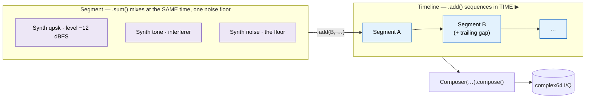

# Concepts — the object model

`wfmgen` has one job — turn a description of a signal into I/Q samples — but a
realistic description has layers: *what* a waveform is, *how loud* and *how
long* it plays, *what else* plays alongside it, and *what comes next*. doppler
gives each layer its own object, and they stack in a fixed ladder:

**`Synth` → `Segment` → `Timeline` → `Composer` → samples.**

Understanding that ladder is the whole mental model. Everything else in this
guide is detail on one rung.



______________________________________________________________________

## The four objects

| Object         | Is                                                                                                 | Adds                                        | Analogy                                                           |
| -------------- | -------------------------------------------------------------------------------------------------- | ------------------------------------------- | ----------------------------------------------------------------- |
| **`Synth`**    | one source's *recipe* — what a single waveform **is** (`type` + params, optional `symbols`/`bits`) | the signal itself                           | a single instrument's part                                        |
| **`Segment`**  | one or more Synths **summed**, over a **time span** (`num_samples`) + trailing gap (`off_samples`) | timing + mixing + one noise floor           | a bar of music — several instruments playing together for a while |
| **`Timeline`** | Segments **in sequence** (`.add`)                                                                  | order in time                               | the arrangement — bars back-to-back                               |
| **`Composer`** | **renders** a scene (a Segment or Timeline) to samples                                             | repeat / continuous / seed advance / output | the performance — pressing *play*                                 |

The shortest possible read: **`Synth` = "the source", `Segment` = "sources
playing together for a while", `Timeline` = "segments one after another",
`Composer` = "press play".**

______________________________________________________________________

## Why `Synth` exists when `Segment` does

A common first question: if a `Segment` can hold a source and a duration, why is
there a separate `Synth`?

Because a `Synth` is **reusable and standalone**. It is a pure recipe with no
notion of *when* or *how long* — so you can:

- pull samples from it directly with `.steps(n)` / `.step()` (no Segment, no
    Composer needed — the common case for a notebook);
- drop the *same* `Synth` into several Segments at different levels or times;
- mix several Synths inside one Segment.

A `Segment` is what you get when you give one or more Synths a **time span** and
a **shared noise floor**. A one-source Segment is essentially "a Synth with a
duration". So the rule of thumb:

- **Just need samples of one waveform?** Build a `Synth`, call `.steps(n)`.
- **Need mixing, timing, sequencing, or a container?** Wrap Synths in
    `Segment` → `Timeline` → `Composer`.

______________________________________________________________________

## The two composition verbs

The ladder has exactly two ways to combine — and they are orthogonal:

- **`.sum()` mixes** sources over the *same* span — one receiver, one sample
    rate, one shared noise floor. A signal of interest plus interferers plus a
    floor. `Segment.sum(synth1, synth2, …, num_samples=N)`.
- **`.add()` sequences** segments in *time*, back-to-back — a preamble, then a
    payload, then a gap. `segmentA.add(segmentB, …)` (or `Composer().add(…)`).

`.sum` stacks in the *same* time window (one column); `.add` lays segments out
along *time* (one row). Full worked examples are in [Scenes](scenes.md).

______________________________________________________________________

## Gotcha — where timing lives

Timing (`num_samples`, `off_samples`) is a property of a **`Segment`**, not a
`Composer`. Put it on `Segment.sum(...)`:

```python
from doppler.wfm import Synth, Segment, Composer

seg = Segment.sum(Synth(type="qpsk", sps=8), fs=1e6, num_samples=4096)
iq = Composer(seg).execute(4096)
```

Passing `num_samples`/`off_samples` to `Composer(...)` **directly** raises
`TypeError: pass either segments or single-segment kwargs, not both` — the
Composer renders a scene that already carries its own timing.

(As a convenience, `Composer(type="qpsk", num_samples=…)` accepts single-segment
kwargs to build a one-segment scene for you — but you cannot pass *both* a
prebuilt segment and segment kwargs.)

______________________________________________________________________

## CLI ↔ Python: the same ladder

The command-line tool is the same four objects with a flatter surface: a bare
`wfmgen --type …` is a one-source, one-Segment render; `--from-file spec.json`
describes a Timeline of Segments (each a source or a `sum` of sources); the tool
*is* the Composer. Both faces drive the **same C engine**, so their output is
byte-identical for the same parameters. See [Scenes](scenes.md) for the JSON
schema and [Python API](python.md) for the class API.
