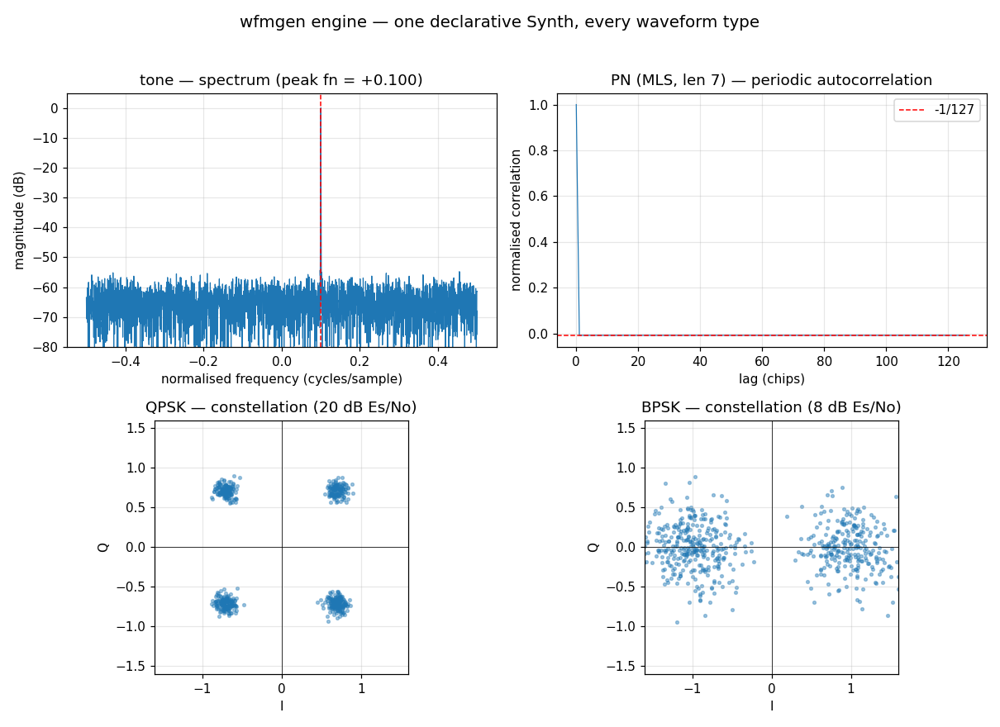
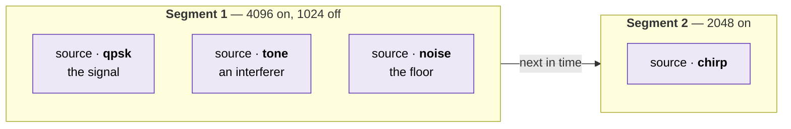
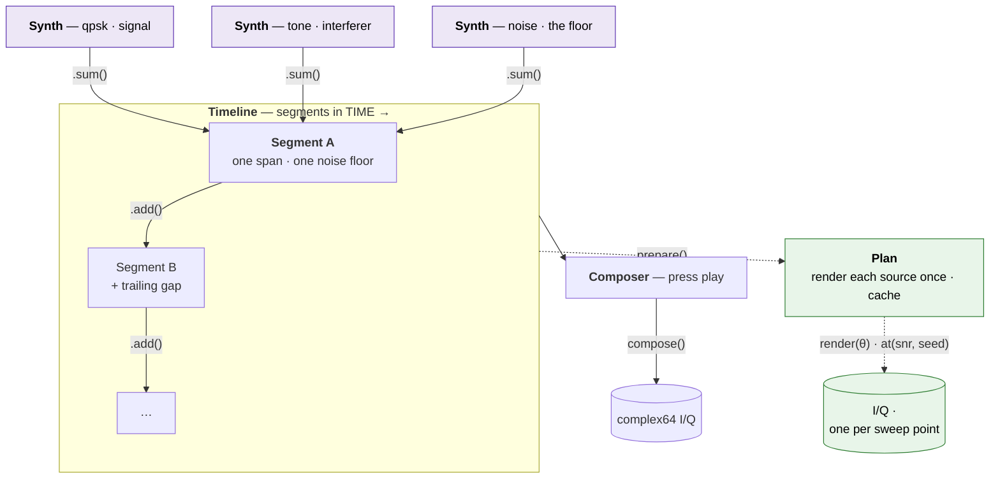

# Waveform Generator — `wfmgen`

doppler ships a C-first **waveform generator**: one declarative synth engine
(every algorithm in C, exactly once), exposed two ways that produce
**byte-identical** output —

- **`wfmgen`** — the command-line tool. A one-segment run is the simple
    single-waveform case.
- **`doppler.wfm`** — the same engine as a Python API, one import path.



!!! tip "The 30-second version"

    ```sh
    wfmgen --type qpsk --snr 12 --count 100000 -o capture.cf32   # 100k QPSK samples @ 12 dB Es/No
    wfmgen --type tone --freq 0.1 --count 4096                   # a 0.1·Fs tone → stdout (cf32)
    wfmgen --type pn --pn-length 9 --file-type csv -o pn.csv      # length-9 MLS as text
    ```

This guide is four pages:

| Page                      | The question it answers                                                            |
| ------------------------- | ---------------------------------------------------------------------------------- |
| **This one**              | What is the model, how do I run it, and what does a command look like?             |
| [Waveforms](waveforms.md) | What can I generate, and with what knobs? Types, levels, framing, coding, Doppler. |
| [Scenes](scenes.md)       | How do I put waveforms in time, sweep them, and stream them?                       |
| [Python API](python.md)   | How do I do all of that from Python instead?                                       |

Getting samples into a file and back out again is
[Capture I/O](../wfm-io/index.md) — a section of its own, because reading a
capture has nothing to do with generating one, and most captures worth reading
were not generated here. [Writing captures](../wfm-io/writing.md) holds the
`--sample-type` / `--file-type` / `--endian` / `--output` reference.

______________________________________________________________________

## Source and segment — the one distinction to get right

**A source is WHAT plays. A segment is WHEN.**

Everything else follows from that. Sources stack *upwards* — several playing
at once, into one receiver, over one span, sharing one noise floor. Segments
lay out *rightwards* — one span after another in time.



Stacked inside one box = **summed**, at the same instant. Box after box =
**sequenced**, one after the other. Those are the only two ways to combine
anything here, and they are the two verbs `.sum()` and `.add()`.

### The same thing has four names

A source is one waveform's recipe, and which word you meet depends only on
which API you are reading. This is the single most common stumble, because
the guide's own pages speak different dialects: the CLI and JSON pages say
*source*, the Python page says *Synth*.

| Where you are | What a source is called                                     | What a segment is called        |
| ------------- | ----------------------------------------------------------- | ------------------------------- |
| C API         | `wfm_source_t`                                              | `wfm_segment_t`                 |
| Scene JSON    | an entry in `"sum"`                                         | an entry in `"segments"`        |
| CLI           | the flags themselves — one run describes exactly one source | `--count` / `--off` on that run |
| Python        | `Synth`                                                     | `Segment`                       |

The CLI row is why a one-segment run needs no vocabulary at all: with one
source in one segment there is nothing to name, which is exactly the simple
case `wfmgen --type qpsk --count 100000` is.

______________________________________________________________________

## The ladder — the whole mental model

`wfmgen` has one job, turning a description of a signal into I/Q samples, but a
realistic description has layers: *what* a waveform is, *how loud* and *how
long* it plays, *what else* plays alongside it, and *what comes next*. Each
layer is an object, and they stack in a fixed ladder:

**`Synth` → `Segment` → `Timeline` → `Composer` → samples.**



Three Synths mix **at once** into Segment A (`.sum` — one column, one noise
floor); Segments line up **in time** into a Timeline (`.add` — one row); the
Composer presses play. The dashed branch is [`Plan`](scenes.md#prepare-once-sweep-many-plan),
a cache over a finished scene for when you need that scene many times.

| Object         | Is                                                                                                 | Adds                                        | Analogy                                                           |
| -------------- | -------------------------------------------------------------------------------------------------- | ------------------------------------------- | ----------------------------------------------------------------- |
| **`Synth`**    | one source's *recipe* — what a single waveform **is** (`type` + params, optional `symbols`/`bits`) | the signal itself                           | a single instrument's part                                        |
| **`Segment`**  | one or more Synths **summed**, over a **time span** (`num_samples`) + trailing gap (`off_samples`) | timing + mixing + one noise floor           | a bar of music — several instruments playing together for a while |
| **`Timeline`** | Segments **in sequence** (`.add`)                                                                  | order in time                               | the arrangement — bars back-to-back                               |
| **`Composer`** | **renders** a scene (a Segment or Timeline) to samples                                             | repeat / continuous / seed advance / output | the performance — pressing *play*                                 |

The two verbs are orthogonal: **`.sum()` mixes** sources over the *same* span
(one receiver, one sample rate, one shared noise floor); **`.add()` sequences**
segments in *time*, back-to-back. `.sum` stacks in one column, `.add` lays them
out along a row. Worked examples are in [Scenes](scenes.md).

### Why `Synth` exists when `Segment` does

Because a `Synth` is **reusable and standalone** — a pure recipe with no notion
of *when* or *how long*. You can pull samples from it directly with `.steps(n)`
(no Segment, no Composer — the notebook case), drop the *same* `Synth` into
several Segments at different levels, or mix several inside one Segment.

- **Just need samples of one waveform?** Build a `Synth`, call `.steps(n)`.
- **Need mixing, timing, sequencing, or a file type?** Wrap Synths in
    `Segment` → `Timeline` → `Composer`.

### Gotcha — where timing lives

Timing (`num_samples`, `off_samples`) belongs to a **`Segment`**, not a
`Composer`:

```python
from doppler.wfm import Synth, Segment, Composer

seg = Segment.sum(Synth(type="qpsk", sps=8), fs=1e6, num_samples=4096)
iq = Composer(seg).execute(4096)
```

Passing `num_samples`/`off_samples` to `Composer(...)` directly raises a
`TypeError` naming the offending keys — so the same message also catches a
misspelling rather than a conflict. (As a convenience,
`Composer(type="qpsk", num_samples=…)` builds a one-segment scene for you, but
you cannot pass both a prebuilt segment and segment kwargs.)

The CLI is the same ladder with a flatter surface: a bare `wfmgen --type …` is
a one-source, one-Segment render; `--from-file spec.json` describes a Timeline
of Segments; the tool *is* the Composer.

______________________________________________________________________

## Recipes

Copy-paste starting points. Each one below runs as written — they are executed
by the documentation gate, not just spell-checked.

```sh
# A clean tone at +100 kHz (1 MHz Fs), 1 Msample, 16-bit I/Q to a file
wfmgen --type tone --freq 1e5 --fs 1e6 --count 1000000 --sample-type ci16 -o tone.ci16

# Noisy BPSK at 6 dB Eb/No, as CSV for quick inspection
wfmgen --type bpsk --snr 6 --snr-mode ebno --count 2000 --file-type csv -o bpsk.csv

# A band-limited WCDMA-style QPSK downlink (RRC roll-off 0.22)
wfmgen --type qpsk --sps 8 --pulse rrc --rrc-beta 0.22 --count 100000 -o wcdma.cf32

# A length-9 MLS, primitive polynomial chosen automatically
wfmgen --type pn --pn-length 9 --sps 1 --file-type csv -o pn.csv

# Your own constellation (16-QAM here) from a raw cf32 file. The file is
# interleaved float32 I/Q -- make one however you like; this is the shortest way.
python3 -c "import numpy as np; g=np.array([-3,-1,1,3]); \
c=(g[:,None]+1j*g[None,:]).ravel()/np.sqrt(10); \
np.tile(c,64).astype(np.complex64).tofile('qam16.cf32')"
wfmgen --type symbols --symbols-file qam16.cf32 --sps 8 --pulse rrc -o qam.cf32
```

Two more that cannot run inside the docs gate — one generates without bound,
the other needs a live broker — but are otherwise copy-paste:

<!-- docs-snippet: no-exec=unbounded generation, and a live NATS broker -->

```sh
# Endless bursts, each at a random Doppler offset and a jittered gap
wfmgen --type bpsk --fs 1e6 --sps 8 --pn-length 7 \
       --freq 11200:12800 --count 8192 --off 4000:5600 \
       --continuous --realtime -o stream.cf32

# Stream continuous QPSK to NATS for a live receiver, paced to real time
wfmgen --type qpsk --snr 10 --continuous --realtime --output nats://127.0.0.1:4222/iq
```

A scene from a JSON file — the spec format and a runnable example are in
[Scenes](scenes.md#sequencing-segments-in-time):

<!-- docs-snippet: no-exec=the spec file is written and run on the Scenes page -->

```sh
wfmgen --from-file scenario.json --record run.json --file-type blue -o scene.blue
```

______________________________________________________________________

## Installation

```sh
pip install doppler-dsp        # → the `wfmgen` command + the doppler.wfm API
```

The wheel ships the self-contained `wfmgen` binary as package data and a
`wfmgen` console script — a thin `os.execv` shim over that same binary, so
argv, stdio and exit status all pass straight through. There is **no second CLI
implementation in Python**. To build from source instead:

<!-- docs-snippet: no-exec=clones the repository -->

```sh
git clone https://github.com/doppler-dsp/doppler && cd doppler
cmake -B build -DBUILD_PYTHON=ON && cmake --build build --target wfmgen_cli
# binary: build/native/src/wfmcompose/wfmgen
```

______________________________________________________________________

## See also

- [Gallery: wfmgen — one engine, every waveform](../../gallery/wfmgen.md) — the
    spectra/constellations behind each type, with the demo script.
- [Python: Source (NCO / LO / AWGN)](../../api/python-nco.md) — the
    building-block primitives the engine composes.
