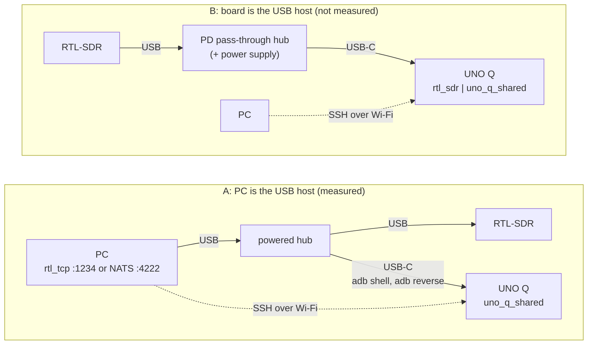

# uno-q — an RTL-SDR receive front end on a small ARM board

The first stages of a receiver fed by an RTL-SDR, as a downstream project:

```text
cu8 bytes ─→ U8ToF32 ─→ DDC (mix by −offset, decimate by rate) ─→ PSD
```

It was written for, and measured on, an **Arduino UNO Q** (Qualcomm QRB2210,
four Cortex-A53-class cores, Debian 13), but nothing in it is board-specific.
It builds and runs anywhere doppler does, which is how CI checks it. Copy the
directory as the starting point for an SDR front end.

## Three modes

| command                                                 | input                                   | what it does                                                                                                                                                                                                  |
| ------------------------------------------------------- | --------------------------------------- | ------------------------------------------------------------------------------------------------------------------------------------------------------------------------------------------------------------- |
| `uno_q_shared [flags]`                                  | none                                    | **Self-test.** Synthesises one second of what an RTL-SDR would send (a tone at `--offset` in noise, through a model of its 8-bit ADC), runs the chain and checks the result. Any failed check exits non-zero. |
| `uno_q_shared [flags] -` or `uno_q_shared [flags] FILE` | `cu8` on stdin, or a capture file       | **Live.** Reports throughput, CPU load, the strongest peaks and the level in the channel. Nothing is checked, because live RF is not known in advance.                                                        |
| `uno_q_shared [flags] --nats URL`                       | `ci8` frames from `uno_q_pub` over NATS | **NATS.** Counts lost and repeated frames from the wire header, then runs the same chain. Built when the doppler install has its stream component.                                                            |

| flag          | default   | meaning                                                                            |
| ------------- | --------- | ---------------------------------------------------------------------------------- |
| `--fs HZ`     | `2.4e6`   | input sample rate                                                                  |
| `--offset HZ` | `250e3`   | where the wanted channel sits relative to the tuned centre; the DDC mixes it to DC |
| `--rate R`    | `0.125`   | DDC output/input rate                                                              |
| `--n N`       | `1024`    | PSD frame length                                                                   |
| `--seconds S` | until EOF | live only: stop after `S` seconds of input                                         |
| `--nats URL`  | none      | NATS mode: receive from this endpoint                                              |
| `--pattern P` | `sub`     | NATS: `sub` (core pub/sub) or `pull` (JetStream work queue)                        |
| `--check`     | off       | NATS: apply the self-test's checks to what arrived                                 |

## Build and run

```sh
make build              # configure and compile
make run                # build, then self-test in both link modes
make clean
```

`PREFIX=<dir>` points at a doppler install (a `make package-c` tree or a
release tarball); `CPU_FLAGS=<flags>` adds compiler flags for this program.

## What the self-test checks

Every number is measured on the machine that runs it. Throughput is printed
and never asserted, because it is a property of the machine.

1. **The `cu8` bias is present before the DDC.** An RTL-SDR's zero sits at
    code 127.5, and `U8ToF32`'s fast `shift` mode centres on 128, so the
    converted stream reads 0.5/128 low. The self-test measures it:
    −0.003824 (I) and −0.003913 (Q), against −0.003906 predicted.
1. **The tone is mixed to DC**, within one bin.
1. **The in-channel SNR matches its prediction**, within 1 dB. The prediction
    is computed from the scene and the chain's own parameters: 48.33 dB
    predicted, 48.48 dB measured.
1. **The DDC filters the bias out.** Mixing moves the bias to `−offset`,
    outside the channel. Its image reads −62.1 dB against −62.0 dB of noise
    around it; unfiltered, it would read −45.2 dB.

Each check has been shown to fail when the thing it guards is broken:

| deliberate defect                           | caught by |
| ------------------------------------------- | --------- |
| mixing in the wrong direction               | 2 and 3   |
| the `midpoint` converter, which has no bias | 1         |
| noise 1.5× what the prediction assumes      | 3         |
| an ADC model centred on 128                 | 1         |
| `--rate 1`, so no decimation filter         | 4         |

Two lessons are built into how it measures:

- **Measure noise where the signal is.** `dp_psd_noise_floor()` is a median over
    the whole output band. The plain DDC uses an uncompensated CIC (see
    `ddc_core.h`), so the band isn't flat: −0.2 dB within ±0.1 of the output
    rate, −3.5 dB at ±0.25 and −12 dB near the edge. Against the band-wide
    median, the SNR read 3.6 dB too high.
- **Keep wideband channels in the flat part.** For the same reason, choose
    `--rate` so the channel fits within about ±0.1 of the output rate. For
    broadcast FM (±75 kHz) that's `--rate 0.25` (600 kSa/s), not `0.125`.

## On an Arduino UNO Q

Measured on 2026-09-26. The board runs Debian 13 on four Cortex-A53-class
cores (`/proc/cpuinfo` part `0x801`); GCC 14.2 and CMake 3.31 from Debian.

**Connecting to the board.**

The board has one USB-C port, and it can only report itself as a power sink.
So the port is either a **device link to a PC** (power, `adb`, and a
tunnel for samples) or a **host port on a power-delivery hub** (the dongle
plugs into the hub). Pick one; the build steps are the same.



**A. PC as the host.** The PC's USB port goes to a powered hub; the dongle
and the board's USB-C port go to two of the hub's other ports (a direct PC
port for either works too). The PC sees both, and the dongle stays on the
PC:

```sh
lsusb | grep -E 'RTL2838|UNO Q'     # the dongle and the board
adb devices                         # the board is listed as `device`
adb shell                           # a shell on the board
```

`adb reverse` carries samples to the board over the same cable (see
[Dongle on a PC](#live-input-from-an-rtl-sdr) and
[Over NATS](#over-nats-every-frame-accounted-for)), so the board needs no
network for the stream. If it is on Wi-Fi, `ssh arduino@<board-address>`
gives the same shell. Under `adb shell`, set `TMPDIR=/tmp` (see Board
notes).

**B. Board as the host.** The single USB-C port must carry power in and USB
data out at once, so this needs a USB-C hub or dock with **power-delivery
pass-through**: the hub takes the supply on its PD input, powers the board
over the same cable, and exposes its downstream ports to the board as host.
A plain bus-powered hub can't do this, and neither can an unpowered
adapter.

Arduino sells one for the board, the
[USB-C Hub (8-in-1)](https://thepihut.com/products/arduino-usb-c-hub-8-in-1)
(65 W power passthrough, a USB-C data port, USB-A 2.0 and 3.0 ports, 4K30
HDMI, 100 Mbps Ethernet, SD and TF readers). It needs external power on its
PD port. The dongle goes in a USB-A port (2.4 MSa/s is about 4.8 MB/s, well
inside even USB 2.0), and the Ethernet port gives the board a wired address
for SSH if Wi-Fi is a problem.

Nothing arrives over the cable to the PC, so the shell comes over the
network. Join the board to Wi-Fi once, then:

```sh
ssh arduino@<board-address>         # a fixed address avoids DHCP surprises
```

Whether the board takes the host role depends on the hub's PD negotiation,
which isn't something this project controls. Check that `lsusb` on the board
lists the dongle before relying on this setup. `arduino` is the board's
default user; the address is whatever your router or `nmcli` shows. If Wi-Fi
connects but gets no IPv4 address, see Board notes.

Either way, finish with the toolchain and build below, run on the board.

**Toolchain.** The board ships without one:

```sh
sudo apt install build-essential cmake ninja-build
```

**Install doppler** from a clone of this repository, then build this project
against it:

```sh
make package-c PREFIX=$HOME/.local                 # from doppler's root
make -C example-projects/uno-q PREFIX=$HOME/.local run
```

**Tuning.** `-march=native` does nothing on this board: GCC does not know the
core and resolves it to plain `armv8-a+crc+crypto` with no tuning. The
Cortex-A53 scheduling model is what helps, because the core is in-order.
Across 63 of doppler's C benchmarks, measured alternately against a portable
build, a `-mcpu=cortex-a53` build was slower on none by more than the ±5%
run-to-run noise, and faster on 13, by up to 32% on multiply-accumulate loops
(real FIR +25–32%). To build doppler that way:

```sh
make package-c PREFIX=$HOME/.local CMAKE_ARGS=-DCMAKE_C_FLAGS=-mcpu=cortex-a53
```

**Throughput of this chain**, from the self-test on one core: 20.0 MSa/s,
8.3× real time at 2.4 MSa/s (portable build). The desktop x86-64 machine
used for comparison ran it at 275 MSa/s.

**Benchmarks of the 2-D correlation detector and its parts.** `make bench`
times them through doppler's installed public API (`bench.c`), single
thread, and prints a table in this shape; re-run it on your board or build
(`make bench PREFIX=$HOME/.local-a53 CPU_FLAGS=-mcpu=cortex-a53`). Each case
reports its fastest of 60 rounds. The UNO Q columns were measured on
2026-10-04 with the release current on that date, CPU governor `schedutil`. "Portable" is the
default build; "A53" adds `-mcpu=cortex-a53` (see Tuning).

The last column is doppler's published portable build for that release on an AMD
Ryzen AI 9 465 (governor `performance`, boost on, pinned to the fastest
cores; [`benchmarks/published/`](../../benchmarks/published/)),
from the library's own benchmarks rather than `bench.c`.

| algorithm                         | case                      | UNO Q portable | UNO Q A53   | Ryzen AI 9 465 |
| --------------------------------- | ------------------------- | -------------- | ----------- | -------------- |
| `detector2d` (corr + ring + peak) | 16 × 1024 bins            | 6.4 MSa/s      | 6.4 MSa/s   | 100.2 MSa/s    |
|                                   | 128 × 128 bins            | 6.7 MSa/s      | 6.6 MSa/s   | 162.9 MSa/s    |
| `corr2d`                          | 16 × 2046, single-row ref | 3.1 MSa/s      | 3.1 MSa/s   | 76.0 MSa/s     |
|                                   | 16 × 2046, multi-row ref  | 2.5 MSa/s      | 2.5 MSa/s   | 60.9 MSa/s     |
| `fft2d` (cf32, forward)           | 256 × 256                 | 11.0 Mbin/s    | 11.3 Mbin/s | 390.3 Mbin/s   |
|                                   | 16 × 4096                 | 10.9 Mbin/s    | 10.6 Mbin/s | 223.8 Mbin/s   |
| `fft` (cf32, forward)             | n = 256                   | 67.8 Mbin/s    | 69.7 Mbin/s | 686.6 Mbin/s   |
|                                   | n = 4096                  | 34.3 Mbin/s    | 33.6 Mbin/s | 683.8 Mbin/s   |
|                                   | n = 65536                 | 6.7 Mbin/s     | 6.8 Mbin/s  | 551.8 Mbin/s   |
| `fir`, real taps                  | 15 taps                   | 24.9 MSa/s     | 32.1 MSa/s  | 393.7 MSa/s    |
|                                   | 63 taps                   | 7.2 MSa/s      | 9.5 MSa/s   | 91.1 MSa/s     |
|                                   | 255 taps                  | 1.9 MSa/s      | 2.5 MSa/s   | 17.5 MSa/s     |
| `fir`, complex taps               | 15 taps                   | 10.7 MSa/s     | 11.2 MSa/s  | 168.3 MSa/s    |
|                                   | 63 taps                   | 3.0 MSa/s      | 3.0 MSa/s   | 56.7 MSa/s     |
|                                   | 255 taps                  | 0.8 MSa/s      | 0.8 MSa/s   | 17.0 MSa/s     |

How to read it:

- **The detector runs about 2.7× faster than the dongle's 2.4 MSa/s on one
    core**, in either shape. `detector2d` is the `corr2d` transform plus a
    ring, a peak search and a noise estimate; the shape (16 × 1024 against
    128 × 128) moves it by under 10%. One UNO Q core is 16–24× slower than a
    Ryzen core on it.
- **The A53 build helps the real-tap FIR and little else.** Real-tap FIR
    gained 29–32% at every length; complex taps, the FFTs, `corr2d` and the
    detector did not move beyond run-to-run noise (about 5%).
- **A real-tap FIR costs 2.3–3.2× less per sample than a complex-tap one** on
    the same coefficients, so give a symmetric real filter real taps.
- **The `fft` n = 4096 row differs from doppler's own `bench_fft_core`**
    (22 Mbin/s there, 34 here). The cause wasn't investigated, so compare
    columns within one table rather than across tools.

**Board notes:**

- The CPU governor defaults to `schedutil`. For repeatable timing, run
    `echo performance | sudo tee /sys/devices/system/cpu/cpu*/cpufreq/scaling_governor`;
    it resets on reboot.
- If Wi-Fi connects but gets no IPv4 address, check the NetworkManager log for
    `acd conflict`. That means the router offered an address another device
    already holds. Reserve an address for the board on the router, or give it
    a fixed one with `nmcli`.
- Under `adb shell`, `TMPDIR` is `/data/local/tmp`, which doesn't exist on
    Debian. Set `TMPDIR=/tmp`, or use SSH.

## Over NATS: every frame accounted for

`librtlsdr` and `rtl_tcp` never report lost samples. doppler's own wire
header numbers every frame, so over NATS a missing frame is a gap in the
sequence and a redelivered one is a repeat, and the receiver counts both
exactly. The end-of-stream frame takes the next number, so loss at the tail
is counted too.

`uno_q_pub` puts the dongle on the wire. The wire has no unsigned-8
format, so it sends each code as `x - 128` (`ci8`). The receiver decodes
that with `I8ToF32`, which is bit-identical to `U8ToF32("shift")` on the
original bytes.

```sh
nats-server -js                                                  # a broker
rtl_sdr -f 100e6 -s 2.4e6 - | build/uno_q_pub --nats nats://127.0.0.1:4222/rtl --fs 2.4e6 --fc 100e6
build/uno_q_shared --nats nats://127.0.0.1:4222/rtl --offset -100e3 --rate 0.25 --seconds 10
```

Two patterns, with the same code on both ends:

| pattern                 | flags                     | delivery                                           | what a failure looks like                                                                                                                                      |
| ----------------------- | ------------------------- | -------------------------------------------------- | -------------------------------------------------------------------------------------------------------------------------------------------------------------- |
| **pub/sub** (default)   | `--pattern pub` / `sub`   | at-most-once, freshest data                        | a lost frame is a **gap** in the count                                                                                                                         |
| **JetStream push/pull** | `--pattern push` / `pull` | at-least-once, the broker keeps frames until acked | nothing lost across a consumer stall or broker restart; a frame the broker refused is counted by the **publisher**; a redelivery is dropped as a **duplicate** |

**Measured** (x86 PC, local broker):

- **A 1.5 s broker restart mid-stream:** pub/sub delivered 367 of 367 frames,
    because the publisher's reconnect buffer held the frames and the
    subscriber resubscribed. Push/pull delivered 367 of 367 after riding out
    one receive error, because the durable consumer resumed.
- **A 400 MB burst into a subscriber stalled for 5 s:** 6104 of 6104 frames on
    both patterns. doppler's subscriber queues without limit, so pub/sub
    loss comes from a lost connection or a link slower than the stream, not
    from a slow reader.
- **On the UNO Q**, with the dongle on the PC and the broker reached through
    `adb reverse tcp:4222 tcp:4222`: 733 frames of live FM, 0 lost, 0
    repeated. That's 10.01 s of input in 9.99 s at 46% of one core,
    against 32% for the same chain on a raw pipe; the difference is the
    NATS client and per-frame handling.

`make nats-check` runs both patterns end to end against a broker
(`NATS_URL`, default `nats://127.0.0.1:4222`). Each run is held to the
self-test's checks.

**The source rate needs a long window.** The receiver estimates it from the
headers' capture times. `rtl_sdr` hands over a USB transfer (four frames) at
a time, so the frames of one transfer carry nearly the same timestamp. Over
2 s the estimate read +1.4%; over 10 s it read −60 ppm.

### Watching it live

doppler's spectrum analyzer subscribes to the same stream:

```sh
doppler-specan --source socket --address nats://127.0.0.1:4222/rtl --web
```

It needs the `specan` and `specan-web` extras. The display centres on the
frequency the stream's header reports, unless you give `--center`.

## Live input from an RTL-SDR

Measured with a Nooelec NESDR SMArt v5 (R820T tuner). On any Linux host with
the dongle, first stop the kernel's DVB-T driver from claiming it: install
`rtl-sdr` (which usually ships a blacklist), or blacklist `dvb_usb_rtl28xxu`
yourself and unload it. `rtl_test -t` then finds the tuner.

**Dongle on the board.** The UNO Q has one USB-C port, and it can only report
itself as a power sink. To use the dongle directly, the board must be the USB
host of a power-delivery pass-through hub (see
[Connecting to the board](#on-an-arduino-uno-q), setup B), with the dongle on
the hub and SSH over Wi-Fi for control. Then:

```sh
rtl_sdr -f 99.8e6 -s 2.4e6 - | build/uno_q_shared --offset 100e3 --rate 0.25 -
```

**Dongle on a PC, stream to the board** (how this was measured). This works
when the board is a USB device of the PC, directly or through a hub. The PC
serves the dongle with `rtl_tcp`, and `adb reverse` carries the stream over
the same USB cable:

```sh
rtl_tcp -a 127.0.0.1 -f 100e6 -s 2.4e6        # on the PC
adb reverse tcp:1234 tcp:1234                 # on the PC
nc 127.0.0.1 1234 | tail -c +13 | build/uno_q_shared --offset -100e3 --rate 0.25 --seconds 5 -   # on the board
```

`tail -c +13` drops `rtl_tcp`'s 12-byte header. The link delivered
2.38 MSa/s to the board. With the dongle tuned to 100.0 MHz, a station at
99.9 MHz (`--offset -100e3`) was brought to DC at 32% of one core. The
dongle's own DC spike moved to +100 kHz, out of the channel, which is the
point of offset tuning.

**Two `rtl_tcp` quirks.** It prints "Signal caught, exiting!" each time a
client disconnects, yet keeps serving. And it sends the 12-byte header before
the samples, which `tail -c +13` removes.
