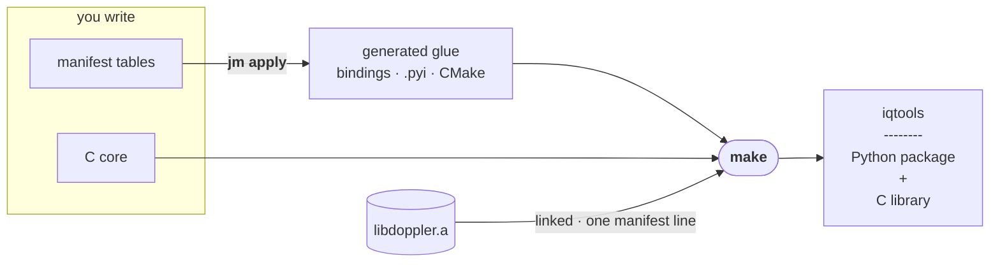
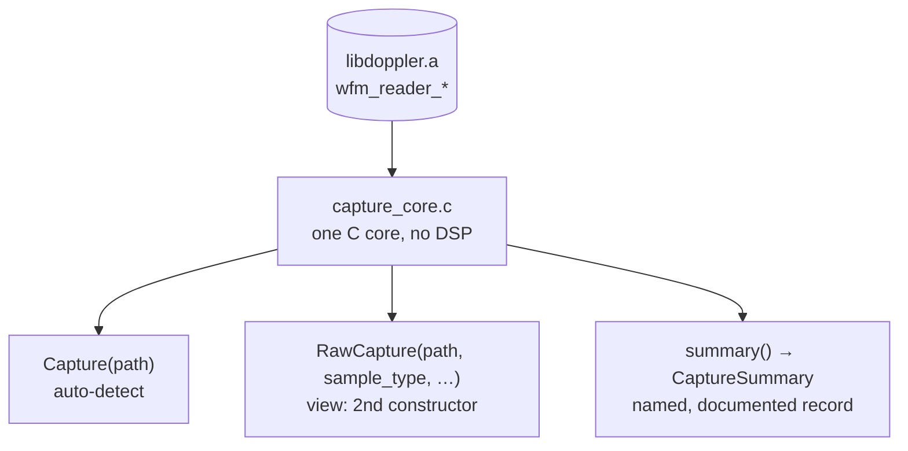

# iqtools — a downstream project built on doppler

Proof of how little it takes to build on doppler. `iqtools` is a real IQ-capture
reader — a Python package **and** a C library, fully typed, documented and
tested — and it is roughly **140 lines of C glue plus a few manifest tables**.
There is no hand-written CPython anywhere: `jm apply` generates every binding,
`.pyi`, per-module `CMakeLists.txt` and `__init__.py`. You write the C that is
genuinely yours and declare the rest.

It shows off three things a downstream project actually needs — each one
table-driven, none of them obvious from the docs alone:

1. **Link `libdoppler.a`** — the static library and public headers, from a build
    tree or an install. No doppler source is vendored, copied or rebuilt here.
1. **A second constructor, via a `view`** — one C core, two Python classes
    (`Capture` and `RawCapture`), a different way in, the methods shared verbatim.
1. **A documented result record** — `capture.summary()` returns a named
    `CaptureSummary`; its class, its `.pyi` and every field's docstring are
    generated, the field prose derived straight from `///<` comments in C.

Three manifest files drive it: `just-makeit.toml` (project + the shared enum),
`objects/capture.toml` (the object, its view and its record) and
`modules/capture.toml` (the module — and the one line that links doppler). The C
core and the tests are hand-written; see [Hand-owned files](#hand-owned-files).



You write only the two boxes on the left. Then two commands do the rest —
**`jm apply`** generates the glue and **`make`** builds and links it, with
`libdoppler.a` pulled in by the one manifest line that declares it.

______________________________________________________________________

## What it exposes, and why

doppler's `Reader` detects a capture's file type from its content — right for a
self-describing capture (BLUE, SigMF), and *impossible* for a headerless one.
`raw` and `csv` carry no sample type, no sample rate and no centre frequency,
so the reader has to fall back to defaults and cannot tell you it did.

That asymmetry is a constructor problem, which is exactly what a view is for:

| class        | constructor                                             | for                                                         |
| ------------ | ------------------------------------------------------- | ----------------------------------------------------------- |
| `Capture`    | `Capture(path)`                                         | a self-describing capture — let the file speak              |
| `RawCapture` | `RawCapture(path, sample_type=…, endian=…, fs=…, fc=…)` | a headerless capture — you supply what the file cannot hold |

One C core, one `.so`, one set of methods. Only the way in differs.

A third property, `metadata_source`, reports where `fs`/`fc` actually came
from — `"file"`, `"supplied"` or `"none"` — so a default can never be mistaken
for a reading.

### The difference is not cosmetic

Both classes opening the *same* 8192-sample ci16 raw file:

```text
$ ./build/tools/iq_info capture.raw ci16 2.4e6
  Capture      fs=         0.0 Hz  fc=  0.0 Hz  n=4096  source=none
  RawCapture   fs=   2400000.0 Hz  fc=  0.0 Hz  n=8192  source=supplied
```

`Capture` reports **half the samples** and no error: nothing in a raw file
states its sample type, so it decodes ci16 at the cf32 stride. `RawCapture`,
told the truth, recovers the real length. Both behaviours are pinned by tests
(`test_capture_gets_the_stride_wrong_on_a_headerless_file` is deliberate).

______________________________________________________________________

## Getting it, and building it

**Download the starter, extract it, build it.** That is the whole procedure —
there is no doppler to install first, nothing to fetch at configure time, and
no path to point `cmake` at. The tarball ships doppler *inside it*.

<!-- doc-version:start -->

```bash
VER=0.43.1
PLAT=linux-x86_64          # or linux-aarch64, macos-arm64

curl -fsSL -O https://github.com/doppler-dsp/doppler/releases/download/v$VER/doppler-starter-$VER-$PLAT.tar.gz
tar xzf doppler-starter-$VER-$PLAT.tar.gz
cd iqtools

cmake -B build . -DBUILD_PYTHON=OFF
cmake --build build -j
ctest --test-dir build
```

<!-- doc-version:end -->

(That version is generated from doppler's `pyproject.toml` by
`make docs-relink` and gated by `docs-check`, so it cannot fall behind a
release.)

The asset is `doppler-starter-…` and the directory inside it is `iqtools`:
the first says what you are downloading, the second is this project's own name
— its package, its manifests and its README all use it. **Rename the directory
and it is your project**; the manifests, the C core and the tests are all yours
to edit from there.

`find_package(doppler REQUIRED)` resolves against the bundled copy because the
project prepends it to `CMAKE_PREFIX_PATH` — one `if(EXISTS ...)` block in
`CMakeLists.txt`, above the manifest-owned section.

What is inside:

```text
iqtools/
├── CMakeLists.txt            yours
├── just-makeit.toml          the manifests that generate the glue
├── objects/  modules/
├── native/                   the C core and tests you write
├── src/iqtools/              the Python package jm generates
└── third_party/doppler/
    ├── lib/libdoppler.a      linked automatically
    ├── lib/cmake/doppler/    what find_package resolves
    ├── lib/pkgconfig/        for builds that are not CMake
    └── include/              doppler's public headers
```

### The Python half — also no root, also in-tree

`-DBUILD_PYTHON=OFF` above keeps the first build dependency-free. The Python
half needs one more thing, and it is **not** a system `-dev` package:

```bash
make setup        # in-tree .venv, from pyproject.toml
make test         # builds the extension, runs CTest and pytest
```

`Python.h` ships with the interpreter, so the only thing a stock Python is
missing to compile this extension is **NumPy's headers** — and NumPy is a
wheel. Measured, on a machine with no `-dev` package installed:

```text
Could NOT find Python3 (missing: Python3_NumPy_INCLUDE_DIRS NumPy)
```

That is the whole gap. `make setup` closes it in `.venv/`, next to the
project, with no privileges and nothing written outside the directory you
extracted.

It does that with `pip install -e ".[test]"` rather than a list of package
names, because the names are already declared and a recipe that repeats them
is a second place to forget one. NumPy is declared **three times over** —
`[build-system] requires`, `[project] dependencies`, and
`find_package(Python3 ... NumPy)` in `CMakeLists.txt`, which is what puts
`Python3::NumPy` on the extension's link line. The `[test]` extra adds what
the suite needs and the build does not: `pytest`, and **`doppler-dsp`** — the
suite writes its fixtures with doppler's Python writer and reads them back
through this project's façade, which is exactly what makes it worth running.
(The distribution is `doppler-dsp`. Plain `doppler` on PyPI is an unrelated
SQL migration tool, and installing it is a confusing five minutes.)

`bootstrap.toml` still declares the apt/brew/pacman names, and
`jbx install-deps -g dev` still installs them. That path is
`sudo <package-manager>` by construction, with no notion of a prefix — right
for a CI image or a machine you administer, wrong for someone who just
unpacked a tarball.

### Using a doppler you already have

An explicit `-Ddoppler_DIR` beats the bundled copy, and an installed doppler
found on the default prefixes is used when `third_party/doppler/` is absent —
which is the case if you took this project from doppler's own source tree
rather than from a release:

```bash
cmake -B build . -DCMAKE_PREFIX_PATH=$HOME/.local/doppler
```

### If your project is not CMake

The bundle ships a pkg-config file, so nothing here is CMake-specific:

```bash
export PKG_CONFIG_PATH=$PWD/third_party/doppler/lib/pkgconfig

# shared
cc myapp.c $(pkg-config --cflags --libs doppler) -o myapp

# static — name the archive to get a binary with no doppler runtime dependency
cc myapp.c -I$PWD/third_party/doppler/include \
   $PWD/third_party/doppler/lib/libdoppler.a -lm -lpthread -o myapp
```

`-ldoppler` resolves to the **shared** library when both are present, so naming
`libdoppler.a` explicitly is how you link it statically. `-lm` and `-lpthread`
are doppler's only runtime dependencies.

> **If your doppler is too old, `cmake` says so and stops.** Only reachable when
> you point at your own doppler — a bundled one is by construction the version
> this project was packaged against. The configure step probes for the reader
> capability this example needs and fails with both the reason and the fix.
> Nothing here names a version, so nothing here goes stale.
>
> The probe is by symbol rather than by version, because a too-old doppler
> **links perfectly well**: `wfm_reader_get_fc` has existed for ages and simply
> returns 0.0. Before the check, the example built clean and failed a test at
> `capture_get_fc (obj) == FC`, which tells a newcomer nothing.

## Running it

```bash
ctest --test-dir build            # the C tests
./build/tools/iq_info capture.blue
```

With `make setup` done, `make test` runs both halves — CTest and the Python
suite — against the in-tree venv, and is the single command worth remembering.

______________________________________________________________________

## How the wiring works

**Linking doppler is one line, in the manifest** (`modules/capture.toml`):

```toml
[module.capture]
objects = ["capture"]
extra_link_libs = ["doppler::doppler-static", "m"]
```

`doppler::doppler-static` is an imported CMake target from the
`find_package(doppler REQUIRED)` that `[project] find_packages = ["doppler"]`
generates into the root `CMakeLists.txt`. It carries its own
`INTERFACE_INCLUDE_DIRECTORIES`, so there is no include path to keep in sync.
Swap it for `doppler::doppler` to link the shared library instead.

**The view is one table** (`objects/capture.toml`):

```toml
[[capture.views]]
class_name = "RawCapture"
create_fn = "capture_open_raw"
init_params = [
  { name = "path", type = "path", required = true },
  { name = "sample_type", type = "string_enum:cf32,cf64,ci32,ci16,ci8", default = "ci16" },
  ...
]
```

jm injects the `capture_open_raw` prototype into `capture_core.h` itself; you
write that one C function, and the second Python class appears.

**The record is a table and three comments.** `capture.summary()` is a
`single = true` method (`objects/capture.toml`):

```toml
[[capture.methods]]
name = "summary"
single = true
record_name = "CaptureSummary"
result_fields = [
  { name = "num_samples", type = "size_t" },
  { name = "fs_hz", type = "double" },
  { name = "fc_hz", type = "double" },
]
```

The C kernel returns the struct by value; jm generates the `PyStructSequence`
class, its `.pyi`, and the docstrings. The field prose is *not* in the manifest
— it derives from the `///<` comments on `capture_summary_t`, which lives in its
own header that `capture_core.h` includes. just-makeit follows the include and
reads the member docs across it (gh-724), so each field is documented once, in
C, and lands on **both** faces:

```pycon
>>> s = Capture("capture.blue").summary()
>>> s
CaptureSummary(num_samples=8192, fs_hz=2400000.0, fc_hz=1200000000.0)
>>> s.fs_hz                        # named and typed, not tuple[1]
2400000.0
>>> type(s).fs_hz.__doc__          # documented at runtime, from the C ///<
'Sample rate (Hz); 0 if the file never stated it.'
```

Add a field by adding a struct member with a `///<` and a `result_fields` row —
no CPython, no docstring plumbing.

**The C core owns no DSP.** `capture_core.c` is ~140 lines, all of it
forwarding into `wfm_reader_*`. The state struct holds doppler's opaque handle
plus the supplied metadata — `no_state = "true"` in the manifest is what hands
that struct to you rather than having jm infer one.

One core, three ways in and out — every arrow below is generated:



### Hand-owned files

| path                                                                                                    | owner                                      |
| ------------------------------------------------------------------------------------------------------- | ------------------------------------------ |
| `objects/*.toml`, `modules/*.toml`, `just-makeit.toml`                                                  | you — the source of truth                  |
| `native/inc/capture/capture_core.h`                                                                     | you (jm injects prototypes into it)        |
| `native/inc/capture/capture_summary.h`                                                                  | you — the record struct + its `///<` docs  |
| `native/src/capture/capture_core.c`                                                                     | you — sacred, `jm apply` never rewrites it |
| `native/tests/`, `tools/`                                                                               | you                                        |
| `native/src/capture/capture_ext*.c`, `src/iqtools/**/*.pyi`, `__init__.py`, per-module `CMakeLists.txt` | **jm** — regenerated; do not edit          |

`add_subdirectory(tools)` sits outside every jm marker block in the root
`CMakeLists.txt` and survives `jm apply` untouched (verified: a re-apply on a
clean tree reports *"Project already matches"* and leaves the file
byte-identical). Content *inside* the `# ── External deps` markers does not —
that region is regenerated from `find_packages`, which is why doppler is
located declaratively rather than by hand-editing CMake.

______________________________________________________________________

## Two things worth knowing

- **`_ext_<obj>.c` fragments are sacred.** A fresh `jm apply` *adds* a new
    method or record to a fragment, but it will not rewrite generated code that
    is already there — so to pick up a change to an existing method (or to
    regenerate a whole method cleanly), delete the fragment and re-apply. That
    is how `CaptureSummary` was added: `objects/capture.toml` grew a method,
    the fragment was deleted, and `jm apply` rebuilt it — `capture_core.c` and
    the tests untouched.
- **This example does not set `[project] c_style`.** `jm apply` would format
    the regenerated `*_ext.c` aggregator while `jm status --check` compares
    against an *unformatted* regeneration, so the drift gate could never pass
    ([jm#635](https://github.com/just-buildit/just-makeit/issues/635)). The
    aggregator stays in jm's own style and is excluded from clang-format
    (`_ext\.c$`) — the same posture doppler itself takes. The per-object
    fragments *are* formatted; jm treats their bodies as sacred and does not
    diff them, so that causes no drift.

______________________________________________________________________

## How this is gated

The example is built and tested by doppler's own CI, so it cannot rot:

| gate                                  | what it covers                                                                     | where it runs                                                                                      |
| ------------------------------------- | ---------------------------------------------------------------------------------- | -------------------------------------------------------------------------------------------------- |
| `make test-example-downstream`        | configure + build + CTest, **`BUILD_PYTHON=OFF`**                                  | inside `make test-examples` — ubuntu, macOS, **and the glibc 2.28 container**, which has no Python |
| `make test-example-downstream-python` | builds the extension, runs this project's pytest                                   | inside `make test-examples-python` — the Python matrix job                                         |
| `make drift-check`                    | `jm status --check` **for this project's own manifest**                            | the `jm manifest drift gate` job                                                                   |
| `make test-starter-tarball`           | packs the starter, extracts it **outside the repo**, builds it with no prefix flag | wherever the release artifacts are built                                                           |

The C half is deliberately Python-free so the question that matters most —
*can a downstream project link `libdoppler.a`?* — is answered on three
platforms including an ancient glibc, not just where NumPy happens to exist.

`test-example-tarball` answers a different question, which is why it is not a
duplicate: **does the thing people download work?** It builds nothing from
this source tree — it unpacks the shipped archive somewhere unrelated and runs
the README's own commands, so a packaging mistake (a bundle missing its
`libdoppler.a`, a stale `git archive`) fails there and nowhere else.

The drift gate uses **doppler's pinned jm** (`uv run --project <repo>`), so
this example cannot silently document a jm version doppler is not on.

______________________________________________________________________

## Layout

`(you)` = hand-written source of truth; `(jm)` = generated by `jm apply`.

```text
iqtools/
├── just-makeit.toml             project + the metadata_source enum          (you)
├── objects/capture.toml         the object, its view and its record         (you)
├── modules/capture.toml         the module — links doppler::doppler-static  (you)
├── native/
│   ├── inc/capture/
│   │   ├── capture_core.h        state typedef; jm injects prototypes here   (you)
│   │   └── capture_summary.h     the CaptureSummary record + its ///< docs   (you)
│   ├── src/capture/
│   │   ├── capture_core.c        ~140 lines of glue over wfm_reader_*        (you)
│   │   ├── capture_ext.c         binding aggregator                          (jm)
│   │   └── capture_ext_*.c       per-object CPython bindings                 (jm)
│   └── tests/                    C tests (fixtures via doppler's writer)     (you)
├── tools/iq_info.c              C demo — links libdoppler.a, no Python       (you)
└── src/iqtools/capture/
    ├── __init__.py              re-export shim                               (jm)
    ├── capture.pyi              typed + documented stubs                     (jm)
    └── tests/                   Python tests                                 (you)
```
