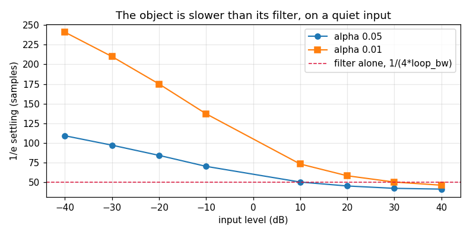
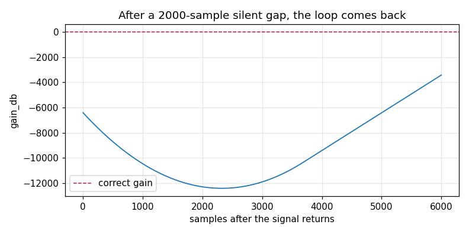
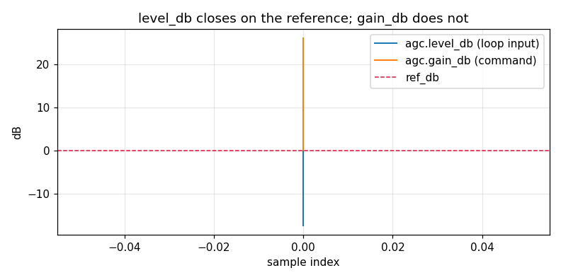

# AGC — validation report

*Generated by `validate.py`. Do not hand-edit.*

## 1. The object

A log-domain feedback AGC: it gains the stream, measures the output power with an EMA detector, and integrates the dB error onto the gain. It is what makes a timing detector's construct-time slope mean what it says, and it is first in a receiver's chain, so a level error it leaves behind is not correctable further along.

Design and API, not restated here:

- `native/inc/agc/agc_core.h` — the SSOT for every claim
- `native/tests/test_agc_core.c` §1-§24 — the C certification
- [AGC design](../../../../../../docs/design/agc.md) — why the filter is in dB and the detector is not, and what the loop cannot know
- `doppler.agc.AGC` — the Python face measured below

**What Python cannot reach.** The detector state `p_avg` is not exposed, so the loop's *input* is only observable through the `level_db` telemetry probe (§2.7). The totality of `agc_exp10_` / `agc_log10_` and the `saturate` NaN direction are C-only by construction — they are internal — and are certified in C §15, §16 and §18.

## 2. Characterisation

Measured behaviour. No verdicts here — those are section 3.

### 2.1 Settling against input level (C §20)

The header's `1/(4*loop_bw)` time constant belongs to the loop FILTER. The object is slower on a quiet input, because the detector is inside the loop and measures in power, so a quiet level's dB reading approaches from the wrong side of a concave log. 1/e settling, swept across 80 dB of input level:

An input already AT the reference is excluded, and the exclusion is not a convenience: its initial error is zero, so "time to fall to 1/e of the initial error" is a question with no answer — any threshold is already met, or met only on an exact float equality the loop's dither never satisfies. The on-target case is measured as a transient bound instead, in §2.3.

| input (dB) | tau, alpha 0.05 | tau, alpha 0.01 |
|---|---|---|
| +40 | 41 | 46 |
| +30 | 42 | 50 |
| +20 | 45 | 58 |
| +10 | 50 | 73 |
| -10 | 70 | 137 |
| -20 | 84 | 175 |
| -30 | 97 | 210 |
| -40 | 109 | 241 |

Predicted from the filter alone: 50 samples. The loud end sits below it and the quiet end above, and the spread widens as the detector is slowed: 2.66x at alpha 0.05 against 5.24x at alpha 0.01.

### 2.2 Settling against loop bandwidth (C §20)

The same measurement against bandwidth, at one level so the detector's contribution is common to every row and cancels.

| loop_bw | predicted 1/(4*bw) | measured tau | tau / predicted |
|---|---|---|---|
| 0.01 | 25 | 24 | 0.96 |
| 0.005 | 50 | 45 | 0.90 |
| 0.0025 | 100 | 89 | 0.89 |
| 0.00125 | 200 | 186 | 0.93 |

### 2.3 The seed produces no transient (C §21)

`create()` seeds the detector with the REFERENCE power, so a stream that arrives already on target moves the loop nowhere. Measured as the largest excursion over 4000 on-target samples:

| ref_db | worst \|gain_db\| over 4000 on-target samples |
|---|---|
| -12 | 0.0000 |
| -6 | 0.0000 |
| +0 | 0.0009 |
| +6 | 0.0076 |
| +12 | 0.0074 |

### 2.4 One malformed sample (C §13)

The detector's input is the object's one safety boundary. Before it was guarded, a single non-finite sample drove the detector non-finite permanently — a following normal sample did not recover it, and the object was dead for the rest of the run.

| sample | state finite after | loop works after |
|---|---|---|
| +Inf real | yes | yes |
| +Inf imag | yes | yes |
| NaN real | yes | yes |
| NaN imag | yes | yes |

### 2.5 A silent gap, and what a returning signal costs (C §14)

Silence drives the detector to its floor and the filter integrates a constant error. The wind-up is self-limiting: the gain climbs until the applied gain overflows, the guard reads the resulting non-finite power as maximally loud, and the loop is driven back. Recovery therefore does not grow with gap length.

| silent gap | state finite | samples to recover |
|---|---|---|
| 100 | yes | 199 |
| 1,000 | yes | 8,599 |
| 3,000 | yes | 6,594 |
| 10,000 | yes | 8,226 |

### 2.6 The converged gain is the level, inverted (C §2, §4)

Across 80 dB of input the loop settles on exactly the gain that puts the output at the reference. This is the property the whole object exists to provide, and it is level-INdependent even though §2.1's settling time is not.

| input (dB) | gain (dB) | input + gain (dB) |
|---|---|---|
| +40 | -40.000 | +0.000 |
| +30 | -29.993 | +0.001 |
| +20 | -19.999 | +0.001 |
| +10 | -9.994 | +0.000 |
| -10 | +10.008 | +0.002 |
| -20 | +20.001 | +0.001 |
| -30 | +30.012 | +0.006 |
| -40 | +40.001 | +0.001 |

### 2.7 `level_db` is the zero-referenced one (C §12)

The detector's state is not a Python property, so telemetry is the only way to watch the loop's INPUT. That is also the reason to prefer it: `level_db` closes on `ref_db` whatever the signal's true level, while `gain_db` settles to an offset that cannot be judged without knowing that level.

| probe | first | last | closes on |
|---|---|---|---|
| `agc.level_db` | -1.78 dB | +0.00 dB | the reference (0 dB) |
| `agc.gain_db` | +0.14 dB | +26.02 dB | an input-dependent offset |

### 2.8 `gain_update_period` amortises without moving the answer

P > 1 refreshes the loop-filter command once per P samples with the step scaled by P, so the integrator advances at the same per-sample rate (C §19).

| gain_update_period | converged gain (dB) |
|---|---|
| 1 | -19.9989 |
| 8 | -19.9989 |
| 32 | -19.9987 |

## 3. Review

Findings, with verdicts. Limits are section 4.

## 4. Limits

Claims a caller may rely on. A failure here is a regression, not a new finding — every one is asserted by `src/doppler/agc/tests/test_validation_limits.py`, which runs this same `build()`.

## 5. Summary

- **6 findings**, 3 of them gaps or confirmed defects: F3, F4, F6
- **16/16 limits** hold
- Raw sweeps: `data/settling.csv`, `data/converged_gain.csv`, `data/telemetry.csv`
