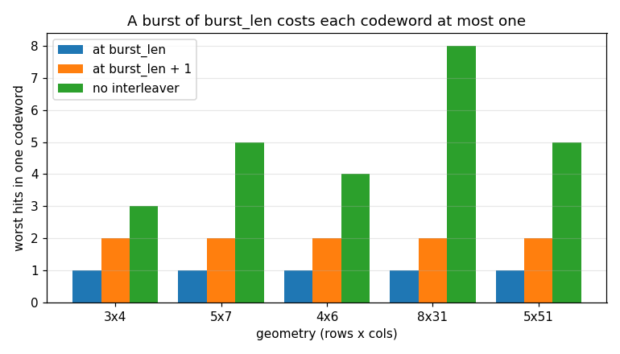
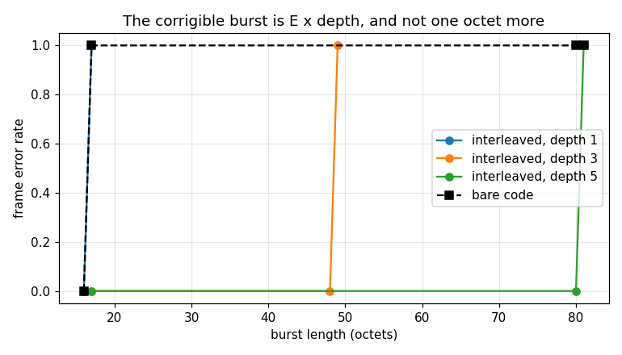

# Interleaver — validation report

Generated by `validate.py` in this folder. Every number is measured from the C implementation through its own binding; nothing is modelled. Re-run to regenerate.

## Executive summary

- **Status.** **CERTIFIED** — all 20 limits hold.
- **Findings.** 8 recorded, 2 still open: F7, F8.

**What a caller most needs to know**

- **Size the geometry from the code, not from the frame.** `rows` is the longest burst fully spread and `cols` is the codeword length, so an outer code correcting `t` units survives a burst of `t * rows` — measured exactly, at 16 octets bare against 80 at depth 5 (§2.4).
- **And the bound bites.** One octet past `E * rows` the frame is lost. An interleaver multiplies the burst a link survives by the depth; it does not remove the limit, and a design that budgets for more is budgeting for nothing (§2.3, §2.4).
- **Match `unit_bits` to the code's symbol.** At the bound, octet units correct and bit units do not: bit-interleaving a symbol-oriented code spreads a burst inside symbols that are already wrong (§2.5).
- **Both ends must be configured with the same three numbers, and nothing checks it.** A mismatched receiver raises nothing and returns the right length with up to 91% of positions wrong (§2.8, F3).
- **De-interleave the LLRs, not the bits.** The soft path is the same permutation and moves values bit-for-bit, so an outer decoder can have its confidence intact; slicing first throws away most of what the outer code is for (§2.6).
- **The evidence is younger than the object.** The object's own permutation direction and its entire receive face were unpinned in C until this certification — a transposed geometry passed all 155 C tests (F1, F2).

## 1. The object

A block interleaver, held as an object. The transform is `dp_interleave.h` — header-only, stateless, shared with the frame stage — and every method here calls it; what the object adds is that the geometry is DECLARED rather than inferred from whatever length arrives. That is the whole design: a block interleaver only works if the two ends of a link agree on the permutation, and deriving `cols` from the input length means a truncated frame silently produces a DIFFERENT permutation instead of an error.

Design and API, not restated here:

| page | owns |
|---|---|
| `native/inc/interleaver/interleaver_core.h` | the SSOT for every claim below |
| `native/inc/dp_interleave.h` | the permutation itself, and why the unit is a parameter |
| [Interleaving](../../../../../../docs/design/interleaving.md) | what it buys, the three ways to get it wrong, where it sits in a frame |
| `native/tests/test_interleaver_core.c` | the object's C certification |
| `native/tests/test_dp_interleave.c` | the permutation's C certification, against its index map |
| `native/validation/interleave_burst_gain.c` | the coding gain in C, over the same RS(255,223) |
| `src/doppler/examples/interleave_burst_demo.py` | the runnable demonstration, with the bound asserted |

### Claim coverage — every prose claim in the header

Header first: enumerate what the header asserts, ask of each whether a C assertion pins it, and only then measure it through the binding. `NEW` marks a C section this certification added — four of them, because the object's own direction was unpinned (§3 F1) and its receive face was untested (§3 F2).

| # | claim in `interleaver_core.h` | C test | here |
|---|---|---|---|
| C1 | every method calls `dp_interleave.h`, at the held geometry | `applies_the_kernels_permutation` (NEW) | §2.1 |
| C2 | `create` refuses a zero or overflowing geometry | `refuses_a_degenerate_geometry` | §2.7 |
| C3 | `create_rx` is identical construction, same refusals | `the_receive_face_is_the_same_geometry` (NEW) | §2.8 |
| C4 | `block_bits` is `rows * cols * unit_bits` | `geometry_readbacks` | §2.2 |
| C5 | `burst_len` is `rows`; `separation` is `cols` | `geometry_readbacks` | §2.2 |
| C6 | a burst of `burst_len` units touches each codeword once | `burst_of_burst_len_hits_each_codeword_once` (NEW) | §2.3 |
| C7 | an outer code correcting `t` survives `t * burst_len` | `interleave_burst_gain.c` | §2.4 |
| C8 | the unit must match the code's symbol | `interleave_burst_gain.c` | §2.5 |
| C9 | `*_max_out` is the identity, for any length | `geometry_readbacks` | §2.2 |
| C10 | `deinterleave` undoes `interleave` over the same geometry | `round_trips_over_several_blocks` | §2.1 |
| C11 | the soft path is the same permutation over floats | `soft_deinterleave_matches_the_hard_one` | §2.6 |
| C12 | a partial block is REFUSED, never padded or truncated | `a_partial_block_is_refused` | §2.7 |
| C13 | `reset` is a no-op and the geometry survives it | `reset_changes_nothing` | §2.7 |
| C14 | stateless: nothing survives between calls | `nothing_survives_between_calls` (NEW) | §2.7 |
| C15 | a geometry mismatch is not an error, it is garbage | — | §2.8 (NEW) |

**What Python cannot reach.** One path: the `max_out` refusal. The C entry points take a caller's buffer and return 0 when it is too small, while the binding allocates the output itself from `interleave_max_out`, so that branch is unreachable from Python by construction. It is certified in C (`a_partial_block_is_refused`) and recorded as §3 F6.

## 2. Characterisation

Measured, no verdicts — those are §3. Each heading names the C section it tracks where one exists; the numbering here is this report's own, because a section routinely merges several C ones.

### 2.1 The permutation, against a truth that is not doppler's

Write by rows into a `rows x cols` matrix of `unit_bits`-wide units, read back by columns. Scored against `numpy`'s reshape and transpose — an external truth, so this cannot pass by agreeing with the other entry point. The `discriminates` column is the precondition: it asserts the transposed geometry is a DIFFERENT answer, without which agreeing with the truth would prove nothing about the direction (§3 F1).

| geometry | unit_bits | block_bits | == numpy truth | discriminates | round trips |
|---|---|---|---|---|---|
| 3x4 | 1 | 12 | yes | yes | yes |
| 5x7 | 1 | 35 | yes | yes | yes |
| 4x6 | 2 | 48 | yes | yes | yes |
| 8x31 | 1 | 248 | yes | yes | yes |
| 5x51 | 8 | 2040 | yes | yes | yes |

Many blocks in one call are permuted independently, which a single-block measurement cannot see: over five blocks of the `4x6` geometry the object's answer equals the truth applied block-by-block, so nothing crosses a boundary.

### 2.2 The link budget the object hands back

`burst_len` and `separation` are not diagnostics — they are the two numbers a caller sizes an outer code against, and §2.3 and §2.4 measure what they promise. `max_out` is swept rather than sampled because the binding asks it to SIZE the output for whatever length arrived, including lengths the transform will then refuse.

| geometry | unit_bits | block_bits | burst_len | separation | units/block |
|---|---|---|---|---|---|
| 3x4 | 1 | 12 | 3 | 4 | 12 |
| 5x7 | 1 | 35 | 5 | 7 | 35 |
| 4x6 | 2 | 48 | 4 | 6 | 24 |
| 8x31 | 1 | 248 | 8 | 31 | 248 |
| 5x51 | 8 | 2040 | 5 | 51 | 255 |

### 2.3 A burst of `burst_len` hits each codeword once (C §NEW)

The invariant the object exists for, measured through the binding at the level a link designer reasons about: a run of consecutive units on the WIRE, de-interleaved, and counted per codeword — a codeword being one row of `separation` input units. Every start position of every block is swept, not sampled: the interesting ones straddle a column boundary.

Three columns, because the good case alone is not evidence. The bound must BITE one unit later, or `burst_len` would be a conservative figure rather than the exact one the header claims; and the un-interleaved control shows what the same burst costs with no interleaver at all.

| geometry | unit_bits | burst_len | worst hits at burst_len | at burst_len+1 | no interleaver |
|---|---|---|---|---|---|
| 3x4 | 1 | 3 | 1 | 2 | 3 |
| 5x7 | 1 | 5 | 1 | 2 | 5 |
| 4x6 | 2 | 4 | 1 | 2 | 4 |
| 8x31 | 1 | 8 | 1 | 2 | 8 |
| 5x51 | 8 | 5 | 1 | 2 | 5 |

### 2.4 The coding gain, over a real outer code

§2.3 counts hits per codeword; this measures what they cost. `depth` codewords of RS(255,223) — one per interleaver row, correcting E = 16 symbol errors each — are encoded independently, interleaved at `unit_bits = 8`, hit with a burst of consecutive octets on the wire, and decoded. The prediction is exact rather than directional: the corrigible burst is E x depth octets, and not one octet more.

Depth 1 is the control that makes the rest mean something. Interleaving a SINGLE codeword buys nothing at all — Reed-Solomon corrects any E symbol errors wherever they fall — so its two columns must agree everywhere, and any gain shown at depth 1 would be a measurement artefact rather than the transform.

| depth | burst (octets) | FER bare | FER interleaved |
|---|---|---|---|
| 1 | 16 | 0.000 | 0.000 |
| 1 | 17 | 1.000 | 1.000 |
| 3 | 16 | 0.000 | 0.000 |
| 3 | 17 | 1.000 | 0.000 |
| 3 | 48 | 1.000 | 0.000 |
| 3 | 49 | 1.000 | 1.000 |
| 5 | 16 | 0.000 | 0.000 |
| 5 | 17 | 1.000 | 0.000 |
| 5 | 80 | 1.000 | 0.000 |
| 5 | 81 | 1.000 | 1.000 |

The bound is the honest half. An interleaver does not make a link immune to bursts; it multiplies the length the link survives by exactly the depth — 16 octets bare, 80 at depth 5 — and one octet past that the frame is lost.

### 2.5 The unit is a parameter, and it is load-bearing

`unit_bits` decides what gets spread. Interleaving OCTETS spreads a burst across the codewords of a symbol-oriented code; interleaving BITS inside such a code spreads it within symbols that are already wrong. Measured at the E x depth bound, where the difference is worth exactly one symbol per codeword — the difference between correcting and not.

| unit_bits | burst (octets) | FER |
|---|---|---|
| 8 | 80 | 0.000 |
| 1 | 80 | 0.750 |

The mechanism is ALIGNMENT rather than magnitude, and the measurement is what settles that: each codeword receives its share of the burst as a contiguous run either way, so the counts are within one symbol. At `unit_bits = 8` each codeword gets whole symbols; at 1 the run is not symbol-aligned and can touch one more at each end, which is invisible until the burst is at the bound — precisely where it decides the frame.

### 2.6 The soft path — the receive side that matters

`dsss_burst_receiver`'s LLRs span a whole frame and an outer decoder wants them de-interleaved BEFORE it runs; slicing to hard bits first throws away the confidence the soft output exists to carry. So the property to certify is not that the soft path is close to the hard one — it is that the soft path is the SAME permutation and moves values without touching them.

| property | result |
|---|---|
| soft output == the numpy truth over floats | exact |
| soft output == the hard permutation applied to the LLRs | identical |
| +/-inf, NaN and -0.0 arrive bit-for-bit | yes |

There is no `interleave_soft`, and its absence is the design rather than a gap: a transmitter has bits, not LLRs (§3 F5).

### 2.7 What it refuses, and what it carries between calls

A partial block is REFUSED — never padded, never truncated to the whole blocks it could manage. Truncating is the dangerous one: it returns a plausible shorter frame and says nothing, and the receiver de-interleaves it into a different permutation. Every method is checked, because a guard on two of three is the shape where the soft path keeps working after the hard one is fixed.

| call | length | case | outcome |
|---|---|---|---|
| `interleave` | 11 | one bit short of a block | ValueError |
| `interleave` | 13 | one bit past a block | ValueError |
| `interleave` | 0 | empty input | ValueError |
| `deinterleave` | 13 | one bit past a block | ValueError |
| `deinterleave_soft` | 13 | one value past a block | ValueError |
| `deinterleave_soft` | 0 | empty input | ValueError |
| `Interleaver()` | 0x4x1 | zero rows | ValueError |
| `Interleaver()` | 4x0x1 | zero cols | ValueError |
| `Interleaver()` | 4x4x0 | zero unit_bits | ValueError |

The message names the block size — *`interleave: length 13 is not a whole number of blocks of block_bits = 12`* — which is the number a caller needs to fix their framing, and is not derivable from the exception type.

**Nothing survives between calls.** The sentence that exempts this object from the state-serialization standard every other stateful object obeys, and its only observable is that the same input answers the same way regardless of history. Measured across a successful call, a refused one, the inverse direction and a `reset`.

Same input, same answer after four intervening calls: **yes**. `reset()` is a documented no-op, and the geometry survives it — a reset that cleared THAT would leave every later call refusing, which is the failure a "does nothing" function can still have.

### 2.8 The two faces, and the geometry they must agree on

`Deinterleaver` is a VIEW over one core, not a second object: `rows`, `cols` and `unit_bits` are exactly what the two ends of a link must agree on, so one core means one definition of the geometry to get right. It exists because the two ends are written by different people — someone working the receive side reaches for a `Deinterleaver`, and a class findable only under the transmit name is a class they do not find.

| property | result |
|---|---|
| the two faces read back one geometry | yes |
| what the transmit face interleaved, the receive face undoes | yes |
| `interleave` is absent from the receive face | yes |

The absent forward method is deliberate: a receive-only face that can silently run the forward direction is a footgun.

**A mismatch between the ends is not an error.** The object holds the geometry so a caller cannot infer it from a length — but nothing checks that the far end chose the same numbers, and there is nothing on the wire that could. A receiver with the wrong geometry de-interleaves into a different permutation and hands the decoder plausible garbage, silently, at the same length (§3 F3).

| receiver's geometry | rows x cols x unit | length out | positions wrong |
|---|---|---|---|
| rows and cols exchanged | 7x5x2 | 70 | 91.4% |
| depth never configured | 1x35x2 | 70 | 91.4% |
| bit units, not pairs | 10x7x1 | 70 | 85.7% |

Same length, no exception, most positions wrong. This is why the geometry is a link parameter to be agreed once and configured at both ends, and why the object refuses to infer it.

## 3. Review — findings, with verdicts

- **F1 · FIXED** — **The object's own permutation was unpinned in C.** Transposing its three calls into `dp_interleave.h` — `state->cols, state->rows` for `state->rows, state->cols` — left the ENTIRE C suite green, all 155 tests, because a transposed block interleave is still a permutation, still inverts, still permutes each block within itself and still moves something. Every assertion in `test_interleaver_core.c` survived it, and so did `test_dp_interleave.c`, which certifies the kernel the object was no longer calling correctly. Closed by comparing the object against that kernel rather than against its own inverse, plus a precondition that the transposed geometry is a different answer (§2.1) — the file header had claimed this check for the whole of its life without carrying it.

- **F2 · FIXED** — **The receive face had zero C coverage.** `interleaver_create_rx` — the whole reason `Deinterleaver` is a view over one core — had no mentions in `test_interleaver_core.c` at all; the header's claim of identical construction and identical refusals was evidenced by the fact that one line of C reads like it. It is now checked ACROSS the two faces (a transmit-face interleave undone by a receive-face object), which is the property the link actually needs, and its refusals are checked separately because a second constructor is a second place to forget them (§2.8).

- **F3 · BY DESIGN** — **A geometry mismatch is silent, and expensive.** A receiver holding different numbers returns an array of the right length with up to 91% of positions wrong, and raises nothing (§2.8) — there is no field on the wire that could carry the geometry, so this is a property of block interleaving rather than of this implementation. It is also the reason the object refuses to infer `cols` from the input length: an inferred geometry turns a truncated frame into this failure automatically.

- **F4 · BY DESIGN** — **A partial block is refused rather than padded or truncated.** Padding changes the length and a receiver de-interleaving the padded block recovers different bits; truncating to the whole blocks available returns a plausible short frame with no error anywhere. Refusing is the only one of the three a caller can detect, and the message names `block_bits` so it can be fixed (§2.7).

- **F5 · BY DESIGN** — **There is no `interleave_soft`, and no state to serialize.** A transmitter has bits, not LLRs, so the soft face is receive-only (§2.6). Statelessness is the same kind of claim: interleaving is per-frame, carrying a partial block across frames would add frame-latency and break per-frame decoding, so a call takes a whole number of blocks or is refused — which leaves nothing to checkpoint, the exemption `docs/design/state-serialization.md` grants a pure converter. Measured as history-independence in §2.7 rather than argued, because that is the only observable the claim has.

- **F6 · C-ONLY** — **The `max_out` refusal cannot be reached from Python.** The C entry points take the caller's buffer and return 0 when it has no room for the whole input; the binding sizes the output itself from `interleave_max_out`, so no Python caller can present a short one. Certified in `test_interleaver_core.c`'s `a_partial_block_is_refused` instead, which is also where the NULL-argument refusals live.

- **F7 · GAP** — **The view's two docstrings do not agree, and the stub has the wrong one.** jm derives a class docstring from `create()`'s doxygen, but a VIEW's runtime `tp_doc` gets a placeholder rather than its own `create_fn`'s (just-makeit#1160), so doppler hand-writes `Deinterleaver`'s in the sacred fragment. The `.pyi` stub, meanwhile, gets what jm derives — and for a view that is the PARENT's `create()`. Measured from the two live sources: they disagree, and the stub opens “Build an interleaver over a rows x cols block of unit_bits units.” — the TRANSMIT face's sentence, on the receive class, with no mention that `interleave` is deliberately absent. A type checker and an IDE read that one; `help()` reads the hand-written one. The fragment's own comment used to claim the stub was derived from `interleaver_create_rx`; this is the measurement that found it untrue. Retire the hand-written block when the fix ships.

- **F8 · GAP** — **The refusals are ten hand-written raise sites.** A kernel refusal is a 0 return, and jm has no declarative hook for it: `error`/`status_return` apply to an int-returning method, and a `variable_output` one has no status to carry (just-makeit#1159). So each of the five methods across the two faces carries the same hand-written `PyErr_Format` twice — once on the `out=` path and once on the allocating one — and a sixth method added tomorrow would return an empty array instead. The behaviour is right (§2.7) and the duplication is what is filed.

## 4. Limits — the certified envelope

Claims a caller may rely on. A failure here is a regression, not a new finding. Every one is asserted by `src/doppler/coding/tests/test_validation_limits.py`.

| verdict | claim |
|---|---|
| PASS | the object writes by rows and reads by columns, matching numpy's reshape-transpose over every geometry and both block counts |
| PASS | the transposed geometry is a DIFFERENT answer, and the round trip returns the input exactly |
| PASS | block_bits == rows*cols*unit_bits, burst_len == rows, separation == cols |
| PASS | all three *_max_out are the identity for every length, including 0 and lengths the transform refuses |
| PASS | a burst of burst_len consecutive wire units touches each codeword at most once, at every start position of every geometry |
| PASS | one unit past burst_len some codeword takes two — the bound is exact, not conservative |
| PASS | un-interleaved, the same burst lands up to 8 hits in ONE codeword (the control) |
| PASS | depth 1: the corrigible burst is E*depth = 16 octets |
| PASS | depth 3: the corrigible burst is E*depth = 48 octets |
| PASS | depth 5: the corrigible burst is E*depth = 80 octets |
| PASS | at depth 1 the interleaved and bare frame error rates are identical: interleaving a single codeword buys nothing (the control) |
| PASS | at E*depth octets the frame survives; at one octet more it does not, for every depth measured |
| PASS | at the E*depth bound, unit_bits=8 corrects and unit_bits=1 does not — the unit must match the code's symbol |
| PASS | the soft path is the same permutation as the hard one, exactly |
| PASS | +/-inf, NaN and -0.0 arrive bit-for-bit: the soft path moves values, it does not compute with them |
| PASS | every method refuses a partial block, an empty input and a zero geometry, and nothing survives between calls |
| PASS | the refusal names block_bits, the number a caller needs to fix their framing |
| PASS | the receive face reads back one geometry with the transmit face and undoes what it interleaved |
| PASS | `interleave` is absent from Deinterleaver — a receive-only face cannot silently run the forward direction |
| PASS | a mismatched geometry is NOT refused and returns the right length with up to 91% of positions wrong |

## 5. Summary

- **8 findings**, 2 of them gaps or confirmed defects: F7, F8
- **20/20 limits** hold
- Raw sweep: `data/coding_gain.csv`
