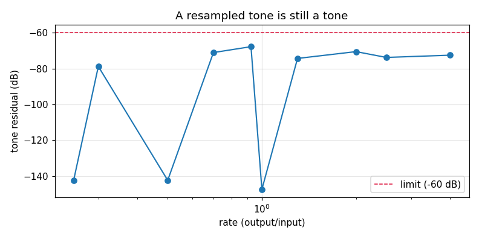
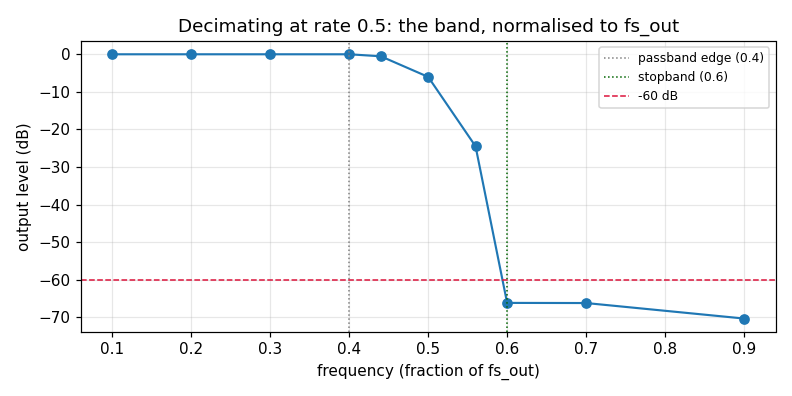
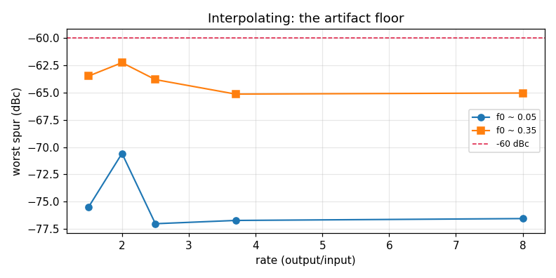
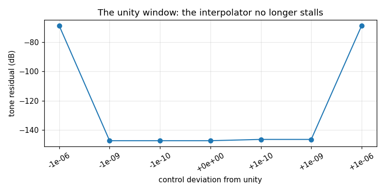

# resamp — validation report

*Generated by `validate.py`. Do not hand-edit.*

## 1. The object

A polyphase resampler with a **dual-mode engine**: output-driven for `rate >= 1` (interpolation) and an input-driven **transposed** form for `rate < 1` (decimation), where the delay line holds output samples and inputs accumulate across one output interval. The control port is the exception — it rides the interpolating structure at *every* rate, because that is the only one of the two steerable through unity in both directions, which is what closing a timing loop requires.

Design and API, not restated here:

- `native/inc/resamp/resamp_core.h` — the SSOT for every claim
- `native/tests/test_resamp_core.c` — §1-§20, where every claim below is actually certified
- [Resampler design](../../../../../../docs/design/RESAMPLER.md)
- `doppler.resample.Resampler` — the Python face measured here

Built-in bank: **4096 phases x 19 taps** (Kaiser, 60 dB, 0.4/0.6 normalised pass/stop).

**This report does not test the algorithm.** doppler is a C library and its claims are certified in C; every section here names the C section it tracks and measures the same property through the binding, which is what proves the binding delivers it. Where the binding cannot reach a claim at all, §2.9 says so instead of quietly omitting it.

## 2. Characterisation

### 2.1 Tone purity across the rate range (C §3, §4)

The gate that catches the accumulator, and the one that was silently 55-60 dB down while every unity-rate test in the suite passed. It needs no timing convention, so it cannot beg the question a comparison against a reference implementation would.

| rate | outputs | vs `rate x n` | tone residual (dB) |
|---|---|---|---|
| 0.25 | 1024 | +0.0 | -142.5 |
| 0.3 | 1228 | -0.8 | -78.8 |
| 0.5 | 2048 | +0.0 | -142.3 |
| 0.7 | 2867 | -0.2 | -71.1 |
| 0.923 | 3780 | -0.6 | -67.8 |
| 1 | 4096 | +0.0 | -147.4 |
| 1.3 | 5325 | +0.2 | -74.4 |
| 2 | 8192 | +0.0 | -70.6 |
| 2.5 | 10241 | +1.0 | -73.8 |
| 4 | 16384 | +0.0 | -72.6 |

Two populations, and the split is structural rather than a quality gradient: where `1/rate` is a whole number of samples (0.25, 0.5, 1.0) the fractional part is exactly zero, one arm is selected forever, and the residual sits at the float32 floor. Every other rate interpolates between arms and pays the bank's own error.

### 2.2 The counting law (C §5, §11)

Output count is the integral of the rate, independent of the bank and the tone. Every rate above lands within one sample of `rate x n` — the whole tolerance available, since a fractional rate leaves a partial output period outstanding at the end of any finite block. C §11 pins the same law at the level below, where one wrap of the control accumulator buys one **input** interval.

### 2.3 DC gain (C §13)

| rate | measured DC gain | error vs 1.0 |
|---|---|---|
| 0.25 | 1.000249 | +2.49e-04 |
| 0.5 | 1.000293 | +2.93e-04 |
| 1 | 1.000586 | +5.86e-04 |
| 2 | 1.000293 | +2.93e-04 |
| 4 | 1.000249 | +2.49e-04 |

`resamp_dc_gain()` **computes** arm 0's tap sum (1.000586, C §13) and has no Python binding, so this is the realised response measured through `execute`. They agree at unity, where only arm 0 is ever selected, and differ below it: a non-unity rate visits every arm, so the realised gain is the arm average. The spread is 3.4e-4.

### 2.4 Decimating: the stopband, normalised to fs_out (C §17)

Decimating, the filter protects the **lower** of the two rates, which is the output — so the bank's advertised 0.4/0.6 cutoffs are fractions of `fs_out`, and land at `0.4 x rate` and `0.6 x rate` on the input grid a caller actually feeds. Swept here at rate 0.5, so 0.4 of fs_out is input-normalised 0.20 and 0.6 of fs_out is 0.30.

| freq (of fs_out) | of fs_in | output level (dB) |
|---|---|---|
| 0.10 | 0.050 | 0.0 |
| 0.20 | 0.100 | 0.0 |
| 0.30 | 0.150 | 0.0 |
| 0.40 | 0.200 | 0.0 |
| 0.44 | 0.220 | -0.5 |
| 0.50 | 0.250 | -6.0 |
| 0.56 | 0.280 | -24.5 |
| 0.60 | 0.300 | -66.2 |
| 0.70 | 0.350 | -66.2 |
| 0.90 | 0.450 | -70.4 |

The -6 dB at 0.5 of fs_out is **the rule applied at its own edge**, not a stopband failure: that frequency is the output Nyquist, where the passband and its first image meet and each contributes half.

### 2.5 Interpolating: the artifact floor (C §17b)

The same bank, its other face. Interpolating, the lower rate is the **input**, so the 60 dB stopband becomes an anti-imaging filter — and the structure manufactures its own probe, since interpolation replicates the input spectrum at every multiple of `fs_in`. The rule is a floor, not a level at predicted frequencies: **any artifact above -60 dBc anywhere in the rejection band fails**, which is what makes fractional rates measurable at all — there the images do not sit still in the output grid.

Measured with `ToneMeasure.worst_spur_dbc` on a coherent tone, so the carrier's own leakage cannot masquerade as a spur.

**Stricter than C §17b, and deliberately so.** The C scan walks the rejection band `0.6/R .. Nyquist`; `worst_spur_dbc` is the worst spur *anywhere* in the spectrum. Where the band happens to be empty the two part company — at rate 1.5 with the mid-band tone the C floor reads -154 dBc and this reads -75.5, because the worst artifact is inside the passband where the C scan does not look. Everywhere else they agree within ~2 dB. Read a difference here as the wider search, not as a disagreement.

| rate | worst spur, f0~0.05 (dBc) | worst spur, f0~0.35 (dBc) |
|---|---|---|
| 1.5 | -75.5 | -63.5 |
| 2 | -70.6 | -62.3 |
| 2.5 | -77.0 | -63.8 |
| 3.7 | -76.7 | -65.1 |
| 8 | -76.6 | -65.0 |

The near-edge tone is the whole measurement: it is where the images crowd the transition. C §17b's sabotage makes the point numerically — widening the bank's transition takes the 0.35 tone to -6 dBc while the 0.05 tone barely moves, so a test carrying only the mid-band tone would pass a bank with no usable stopband.

### 2.6 `execute` vs `execute_ctrl`: a delay, not a defect (C §18)

`execute` dispatches on rate and uses the transposed decimator below unity; `execute_ctrl` rides the interpolator at every rate. So with a zero control they are bit-identical at and above unity and **must** differ below it. The difference is large — order unity against a unit-amplitude signal — which reads alarming until both are projected: each is a clean tone, and what separates them is **group delay**, not quality.

| rate | `execute` structure | identical | count delta | max abs diff | implied delay (out samples) |
|---|---|---|---|---|---|
| 0.5 | transposed decimator | **no** | +0 | 1.775 | +3.250 |
| 0.7 | transposed decimator | **no** | +1 | 0.708 | +1.150 |
| 1 | interpolator | yes | +0 | 0.000 | -0.000 |
| 2 | interpolator | yes | +0 | 0.000 | -0.000 |

### 2.7 The unity window (C §8)

Zero Doppler **is** rate 1.0, so a closing-then-opening geometry ramps the control straight through it. A private `(uint32_t)(frac * 2^32 + 0.5)` used to round past 2^32 into the undefined cast and stall the interpolator for a deviation in `(0, 1.16e-10]`. This sweep is the regression evidence.

| ctrl delta | outputs | tone residual (dB) |
|---|---|---|
| -1e-06 | 4096 | -68.7 |
| -1e-09 | 4096 | -147.4 |
| -1e-10 | 4096 | -147.4 |
| +0e+00 | 4096 | -147.4 |
| +1e-10 | 4097 | -146.5 |
| +1e-09 | 4097 | -146.5 |
| +1e-06 | 4097 | -68.7 |

### 2.8 The control port takes a real `double`

| ctrl dtype | accepted |
|---|---|
| float64 | yes |
| float32 | yes |
| Python list | yes |
| complex64 | **TypeError** |

A rate deviation is real and the port now says so — `double`, matching `execute_ctrl_push`'s scalar and the `double` the base rate is configured in. It was `complex64`, so half of every element was read and discarded with no error and no warning (F2). Anything numpy can safely widen to float64 is accepted; **`complex64` is now a `TypeError`**, because discarding an imaginary part is exactly the silent narrowing this removed and numpy will not make that cast on a caller's behalf.

### 2.9 The control accumulator is observable (C §10-§12)

| state | `ctrl_acc` |
|---|---|
| fresh | 0.000000 |
| steered off-rate (ctrl = 0.01) | 0.039604 |
| settled at an exact rate (ctrl = 0) | 0.000000 |
| driven through `execute()` instead | 0.000000 |

`mu` is the fractional delay applied to the stream and `floor(mu * num_phases)` is the arm the NEXT output reads. A steady value means the loop has settled on a sampling phase; one that slews and wraps means a residual RATE error, one input interval per wrap. The last row is the trap the property's own docstring warns about: this reports the CONTROL accumulator, so it stays 0.0 for a caller driving the object through `execute()`, whose free-running phase is a different accumulator with no accessor.

### 2.10 Serialized state round-trip (C §6)

| rate | resumes bit-exactly |
|---|---|
| 0.5 | yes |
| 0.7 | yes |
| 2 | yes |

### 2.11 Claims the binding cannot reach (C-ONLY)

`Resampler` binds `execute`, `execute_ctrl`, `rate`, `ctrl_acc`, `num_phases`, `num_taps`, `reset` and the state triplet. Four public C entry points still have no binding, so their claims are certified by the C suite alone:

| C entry point | claim | C evidence |
|---|---|---|
| `resamp_dc_gain` | arm 0's tap sum answers for every arm | §13 |
| `resamp_set_rate` | retune preserves the accumulator and the delay line | §15 |
| `resamp_execute_ctrl_push` | single-input streaming form, `double` control | §8, §10-§12 |
| `resamp_interp_inputs_needed` | the streaming contract: exactly this many inputs, no over- or under-production | §7, §20 |

## 3. Review

| tag | verdict | summary |
|---|---|---|
| F1 | FIXED | The control port's only observable had no Python binding. |
| F2 | FIXED | The block control port was typed `complex64` while its own streaming twin took a `double`, so half of every ctrl array was read and discarded silently. |
| F3 | FIXED | `resamp_get_ctrl_acc`'s docblock described the wrong structure. |
| F4 | FIXED | The same docblock stated the slip unit as output periods: 'one cycle of wrap is one output period of slip'. |
| F5 | BY DESIGN | `execute` and `execute_ctrl` differ below unity by GROUP DELAY, not quality (§2. |
| F6 | BY DESIGN | The -6 dB at the output Nyquist (§2. |
| F7 | FIXED | The unity window. |
| F8 | FIXED | `resamp_dc_gain` named arm 0's tap sum without saying so, but the realised DC gain at a non-unity rate is the arm average (§2. |
| F9 | FIXED | `resamp_interp_inputs_needed`'s docblock UNDERSTATED its own guarantee. |

## 4. Limits

Claims a caller may rely on. A failure here is a regression, not a new finding — every one is asserted by `src/doppler/resample/tests/test_validation_limits.py`, which runs this same `build()`.

## 5. Summary

- **9 findings**, 0 of them gaps or confirmed defects — none left
- **14/14 limits** hold
- Raw sweeps: `data/tone_purity.csv`, `data/decim_band.csv`, `data/image_floor.csv`, `data/unity_seam.csv`
