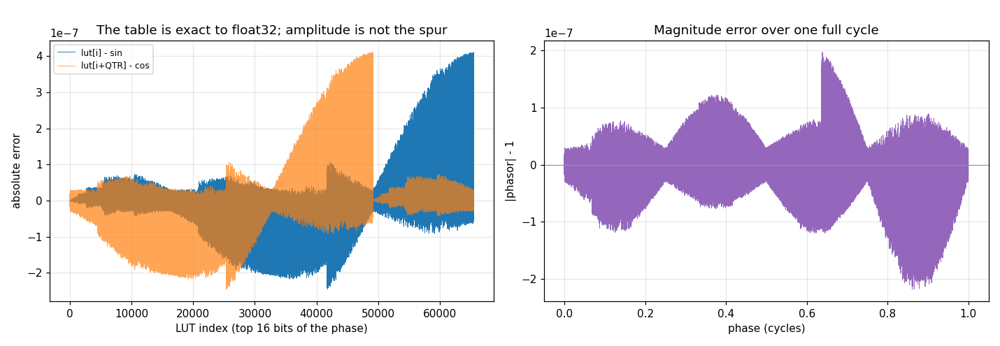
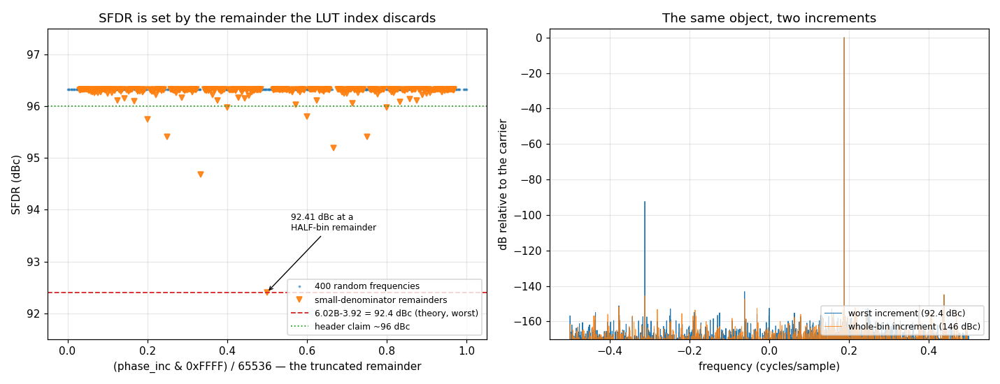
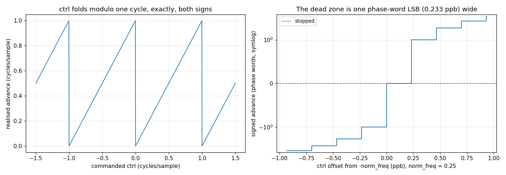
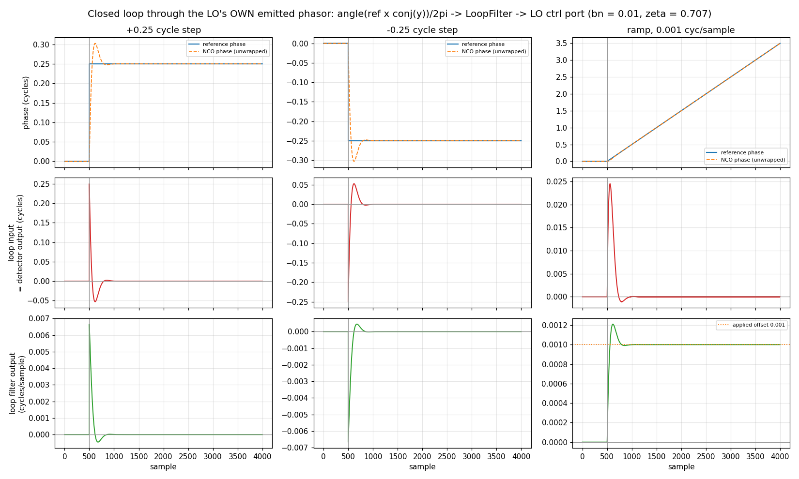

# LO — validation report

Generated by `validate.py` in this folder. Every number is measured from the C implementation through its own binding; nothing is modelled. Re-run to regenerate.

## Executive summary

- **Status.** **CERTIFIED** — all 26 limits hold.
- **Findings.** 9 recorded, none open.

**What a caller most needs to know**

- **The 96 dBc SFDR is typical, not a bound.** It holds over random frequencies and falls to ~92 dBc on the rational ones a real configuration is most likely to pick (§2.1, F1). Budget the floor, not the average.
- **The LUT costs half a phase bin in a closed loop, and no bandwidth** (§2.5, F8): same filter, same drives, settling identical to the ideal oscillator. Choosing LO over NCO is a spur question, not a loop question.
- **A control that cancels `phase_inc` stops the LO over a plateau, not at a knife edge** — below one phase-word LSB the conversion truncates to zero (F6). A stopped oscillator in a strobe-driven loop is terminal, because no strobe means no update.
- **The inline composition API is C-only** — `lo_init`, `lo_step`, `lo_step_ctrl`, `lo_sin_lut` have no binding (F9), so a Python-side audit cannot see the surface a composing receiver actually uses.

## 1. The object — design and expectations

`lo_state_t` is the **NCO's 32-bit phase accumulator plus a 65536-entry float sine LUT**: the top 16 bits of the phase index the table, and a quarter-cycle offset (`LO_LUT_QTR = 16384`) maps `sin` to `cos` without a second table, so one lookup pair is a CF32 phasor. It is the carrier every mixer in the library turns — `ddc` and `ddcr` compose it, and `lo_step`/`lo_step_ctrl` exist so a tracking loop can embed one **by value** and wipe carrier off a sample at a time.

### Where the design lives — this report does not restate it

| source | holds |
|---|---|
| [`native/inc/lo/lo_core.h`](../../../../../../native/inc/lo/lo_core.h) | the contract: the LUT geometry, the emit-before-increment convention, the SFDR claim, the inline composition API and the control port |
| [`native/inc/nco/nco_core.h`](../../../../../../native/inc/nco/nco_core.h) | the conversion: `nco_norm_freq_to_inc` is the one double→integer boundary, and the LO calls it for both its configured rate and its control port |
| [`native/tests/test_lo_core.c`](../../../../../../native/tests/test_lo_core.c) | the gate: point assertions, plus the six sections this audit added (§16–§21) |

> **There is no `docs/design/lo.md`.** The LO's rationale lives in the header, and the accumulator underneath it is the NCO's bit-for-bit (2.2), so the theory of operation it inherits is [`docs/design/nco.md`](../../../../../../docs/design/nco.md) — which covers the phase accumulator, the one float boundary and the control port, and names the LUT as the only thing the LO adds. What is genuinely LO-specific and undocumented in prose is that table: its spurious content, measured in 2.4, and its closed-loop cost, measured in 2.9. Nothing was restated here to paper over the gap.

### What this report adds

A unit test pins points; it cannot state a **law**. `lo_core.h` claims in prose that "the 16-bit phase truncation gives ~96 dBc SFDR" — the headline number of the whole object — and nothing, on either side of the binding, has ever measured it. Sections below characterise the laws, review what they mean, and pin the envelope. Section numbers track `test_lo_core.c`'s own numbering so the two read side by side.

### Claim coverage — every prose claim in the header

The audit began by enumerating what the header asserts and asking of each: is it pinned, pinned only at literals, or absent? `NEW` marks a section this audit added to `test_lo_core.c`; every one of those was proven by sabotage before being trusted.

| claim in `lo_core.h` | covered by |
|---|---|
| output is a 65536-entry float sine LUT indexed by phase >> 16 | §3 |
| the quarter-cycle offset LUT_QTR maps sin to cos | §3 §6, literals |
| output is emitted BEFORE the phase is incremented | §3, literals |
| the 16-bit phase truncation gives ~96 dBc SFDR | **absent** |
| the shared LUT is initialised lazily on the first create/init | §1 |
| the shared LUT is never freed | **absent** |
| the LUT is read-only after init | **absent** |
| phase is the accumulator value in [0, 2^32) | §7 §11 |
| phase_inc = floor(frac(norm_freq) x 2^32) | §7 §12 §15, literals |
| lo_init is lo_create without the allocation | §9 |
| only the fractional part of norm_freq matters | §12 |
| lo_step is bit-for-bit lo_steps, one sample at a time | §8 §9 §12 |
| lo_step_ctrl adds ctrl on top of phase_inc for this step | §16 NEW |
| lo_step_ctrl does not persist ctrl | §16 NEW |
| lo_step_ctrl at ctrl == 0 is bit-identical to lo_step | §16 NEW |
| lo_step_ctrl takes the fractional cycle, any sign | §16 NEW |
| lo_step_ctrl emits before incrementing | §16 NEW |
| nco_norm_freq_to_inc 'rounds, not truncates' (header comment) | §21 NEW — CONTRADICTED |
| lo_create returns NULL on allocation failure | unreachable |
| lo_destroy may be NULL (no-op) | §18 NEW |
| lo_reset zeroes phase, leaves norm_freq/phase_inc alone | §7 §11 |
| setting norm_freq recomputes phase_inc, does not reset phase | §7 §11 |
| phase is writable for phase-coherent frequency switching | §7 §11 |
| the state blob is [dp_state_hdr_t][uint32 phase] | §13 §14 |
| set_state returns DP_OK or DP_ERR_INVALID | §14 |
| resume from a blob is bit-exact | §13 |
| steps_max_out is the maximum samples per call | §19 NEW — STALE |
| steps returns min(n, max_out); emission stops at capacity | §pass_capacity |
| every sample is a unit-magnitude phasor | §6, 4 literals |
| steps_ctrl delta = floor(frac(ctrl[i]) x 2^32), per sample | §5, one constant |
| steps_ctrl does not modify norm_freq | §5 |
| steps_ctrl does not modify phase_inc | §17 NEW |
| steps_ctrl is a loop over lo_step_ctrl | §17 NEW |
| steps_ctrl output length equals ctrl_len | §5 §pass_capacity |
| steps_ctrl is the natural API for FM and frequency hopping | **absent** |

Three claims are still **absent** after this pass, and all three are the kind a C unit test cannot hold: the SFDR figure and the FM/hopping use case are spectral laws, measured below; "never freed" and "read-only after init" are lifetime properties of a `static` table with no observer.

## 2. Characterisation

Measured behaviour, no verdicts. Section numbers track `test_lo_core.c`.

### 2.1 Lifecycle, DC, quarter-rate, continuity, accessors
*(test_lo_core.c sections 1-4, 7)*

| property | measured |
|---|---|
| phase after 3 steps then `reset()` | 0 |
| `phase_inc` at `norm_freq = 0` | 0 |
| DC tone (`norm_freq = 0`) | all 8 samples `1+0j`: True |
| quarter-rate first 4 phasors | `+1.000+0.000j, -0.000+1.000j, -1.000-0.000j, +0.000-1.000j` |
| 5+5 samples == 10 samples | True |
| accessor round-trip | norm_freq=0.2, phase=12345, phase_inc=858993459 |
| state blob size | 20 bytes (`dp_state_hdr_t` + `uint32`) |

### 2.2 The accumulator is the NCO's, bit-for-bit
*(sections 8, 9, 12)*

The LO is not a second oscillator — it is `nco_state_t`'s arithmetic with a LUT on the output, and it calls the same `nco_norm_freq_to_inc` for both the configured rate and the control port. That is worth *measuring* rather than reading off the source, because it is what lets this report inherit the NCO's conversion characterisation instead of re-deriving it — and what would make a future divergence visible.

| comparison | LO vs NCO |
|---|---|
| `phase_inc` over 13 probe frequencies (incl. NaN, +-inf, sub-LSB, negative) | identical: True |
| phase after 4096 free-running samples at 0.123456789 | identical: True (`2916315136`) |
| phase after a 401-point control sweep over [-1.5, 1.5] | identical: True (`3766685809`) |

### 2.3 The LUT itself — angle and amplitude
*(section 6, and the new section 20)*

`lo_sin_lut` is a header `extern` with no binding, but it is fully observable through the public face: at `norm_freq = 2^-16` the increment is exactly one LUT bin, so a single `steps(65536)` call walks index 0, 1, ... 65535 in order and returns the entire table. Nothing below is modelled — this IS the table, read out of the object.

| property | measured over all 65536 entries |
|---|---|
| max \|lut[i] - sin(2pi i / 65536)\| | 4.111e-07 |
| max \|lut[i+QTR] - cos(2pi i / 65536)\| | 4.111e-07 |
| max \|1 - \|lut[i+QTR] + j lut[i]\|\| | 2.182e-07 |
| max \|1 - \|sample\|\| over a 65536-sample run at an odd rate | 5.527e-08 |

Amplitude error is at the float32 floor (`1.19e-07` is one ulp at 1.0), four orders of magnitude below the half-bin phase error `0.5/65536 = 7.629e-06` cycles. So the header's attribution of the spur floor to *phase* truncation, not amplitude quantization, is measured rather than assumed — and 2.4 confirms it directly.

### 2.4 SFDR — the headline claim, measured

`lo_core.h` says, twice, that the 16-bit phase truncation gives **~96 dBc SFDR**. No test on either side of the binding has ever measured it. Measured here with doppler's own `ToneMeasure` (Kaiser window at a 150 dB sidelobe target, 65536-point capture = exactly one LUT period), against a measurement floor set by complex64 itself.

| case | SFDR (dBc) |
|---|---|
| 400 random frequencies in [0.02, 0.48] — min / median / max | 96.32 / 96.33 / 96.33 |
| worst frequency found: `phase_inc & 0xFFFF` = 65536 x 1/2 = 32768 | **92.41** |
| phase-truncation theory, worst case (6.02 x 16 - 3.92) | 92.40 |
| phase-truncation theory, generic (6.02 x 16) | 96.32 |
| `phase_inc & 0xFFFF == 0` — no phase truncation at all | 146.26 |
| measurement floor (an ideal float64 phasor cast to cf32) | 147.89 |

The generic case is flat and matches the claim: 400 random frequencies give 96.32–96.33 dBc, a spread of 0.02 dB. The worst case does not: at a half-bin fractional increment (`phase_inc & 0xFFFF == 0x8000`) the error sequence has period 2 and all its energy lands in one spur, giving **92.41 dBc** — the classical phase-truncation bound `6.02 B - 3.92` to 0.01 dB. At the other extreme, an increment that is a whole number of LUT bins truncates nothing and is spur-free to the measurement floor.

The ten worst increments found, all small-denominator:

| `phase_inc & 0xFFFF` | as a fraction of 65536 | SFDR (dBc) |
|---|---|---|
| 32768 | 1/2 | 92.41 |
| 21845 | 1/3 | 94.68 |
| 43690 | 2/3 | 95.19 |
| 16384 | 1/4 | 95.41 |
| 49152 | 3/4 | 95.41 |
| 13107 | 1/5 | 95.75 |
| 39321 | 3/5 | 95.79 |
| 26214 | 2/5 | 95.97 |
| 52428 | 4/5 | 95.98 |
| 37449 | 4/7 | 96.04 |

### 2.5 The one conversion, observed as `phase_inc`
*(section 15)*

The LO does not own this conversion — `nco_norm_freq_to_inc` does, and 2.2 measured the two to be bit-identical. It is re-observed here only through the LO's own face, so a caller reading this page alone is not left inferring it.

| requested norm_freq | phase_inc | note |
|---|---|---|
| `0` | 0 | exact zero |
| `2.328306437e-10` | 1 | one LSB — smallest live rate |
| `1.164153218e-10` | 0 | below one LSB |
| `0.25` | 1073741824 | exact, divides 2^32 |
| `nan` | 0 | NaN |
| `inf` | 0 | +inf |
| `-0.25` | 3221225472 | negative, folds into [0,1) |
| `-1e-20` | 4294967295 | tiny negative |
| `1` | 0 | one whole cycle |
| `2.428571429e-06` | 10430 | truncates (remainder ~0.635), does not round |

Across the range (full sweep in `data/frequency_sweep.csv`) the realised frequency is never HIGH — truncation floors — and never escapes the `1e6/phase_inc` ppm envelope: worst measured 194700 ppm at the bottom of the range, 0.000 ppm at the top.

### 2.6 The control port — law and resolution
*(section 5, and the new sections 16, 17, 21)*

| ctrl | advance (phase words) | as cycles/sample |
|---|---|---|
| 0.25 | 1073741824 | 0.250000 |
| 0.1 | 429496729 | 0.100000 |
| 1e-09 | 4 | 0.000000 |
| 0 | 0 | 0.000000 |
| -1e-09 | 4294967291 | 1.000000 |
| -0.1 | 3865470566 | 0.900000 |
| 1 | 0 | 0.000000 |
| 1.5 | 2147483648 | 0.500000 |
| -1.5 | 2147483648 | 0.500000 |

The same requested `0.1` reaches the accumulator by two paths and lands on **two different words**: configured (double) gives `429496729` and the ctrl port gives `429496729`, a delta of `0`. The port used to be float32 while the configured rate was double, so the same request landed 7 words apart depending on which face it entered by — the NCO's F2 verbatim, inherited along with the port. Both are `double` now (**F5**), which also makes `lo_steps_ctrl` agree with the inline `lo_step_ctrl` that always took one.

### 2.7 A control that cancels `phase_inc`

| ctrl | signed advance (phase words) |
|---|---|
| -0.250000100000 | -430 |
| -0.250000010000 | -43 |
| -0.250000000000 | 0 |
| -0.249999990000 | 42 |
| -0.249999900000 | 429 |

The phase-word LSB is `2.328e-10` (0.233 ppb) and the measured contiguous zero-advance run is `2.317e-10` (0.232 ppb) over 200/1601 scanned controls — one LSB, the floor. On the float32 port it was 22.4 ppb, 96x wider (**F6**).

### 2.8 FM synthesis and frequency hopping

The header calls `steps_ctrl` *"the natural API for FM synthesis and frequency-hopping"*. Nothing tested that claim as a behaviour, only as a constant offset. Two stimuli below: a linear chirp (the control ramps) and a hard hop (the control steps), with the instantaneous frequency recovered from the emitted phasors themselves.

| stimulus | measured |
|---|---|
| linear chirp, ctrl 0.02 -> 0.30 over 16384 samples | max \|instantaneous freq - commanded\| = 1.515e-05 cycles/sample |
| hard hop, ctrl 0.05 -> 0.31 at the midpoint | 0.050003 before, 0.309998 after; the sample BEFORE the hop is still at the old rate (\|err\| 3.03e-06) — the change takes effect on the step it is commanded, with no phase discontinuity |

The chirp tracks the command to 2.0x the half-LUT-bin phase quantum, which is the resolution the LUT can express at all — the control port is not the limit here, the table is.

### 2.9 The closed-loop limit, and what the LUT costs

The LO's reason to exist is to be a carrier loop's actuator, so the closed-loop question is the one that matters. Two runs of the **same** loop — shared `_common/linear_loop`, `LoopFilter`, one update per sample — differing only in the detector:

- **ideal** — plain subtraction on the accumulator phase. This is the NCO's limit, and 2.2 measured the LO's accumulator to be that same accumulator, so the number transfers unchanged.
- **LO's own face** — the error read the way a receiver reads it: `angle(reference x conj(emitted phasor)) / 2pi`, where the emitted phasor is a real `LO` sample taken at the loop oscillator's exact phase word. Everything the LUT does to the signal is inside this detector.

The difference between the two columns is therefore **the LUT's entire contribution to closed-loop performance**, isolated.

`bn = 0.01`, `zeta = 0.707`, disturbance at sample 500; the classic second-order settling estimate `5/bn` is 500 samples.

| drive | settle, ideal | settle, LO face | residual, ideal (cyc) | residual, LO face (cyc) |
|---|---|---|---|---|
| +0.25 cycle step | 273 | 273 | 0.00e+00 | 1.39e-08 |
| -0.25 cycle step | 273 | 273 | 0.00e+00 | 9.75e-18 |
| ramp, 0.001 cyc/sample | 408 | 408 | 1.15e-10 | 7.71e-06 |

Settling is **identical** in every drive — the LUT costs no bandwidth. What it costs is a floor: on the ramp, where the loop parks between LUT bins rather than on one, the residual through the LO's own face is `7.705e-06` cycles against the ideal detector's `1.2e-10`. Half a LUT bin is `0.5/65536 = 7.629e-06` cycles. The measured floor is 1.010x that — the quantization of the phase index, and nothing else, is the steady-state error of a carrier loop built on this LO.

### 2.10 `max_out` is advisory on both faces
*(the new section 19)*

| probe | measured |
|---|---|
| `steps_max_out()` | 65536 |
| `steps_ctrl_max_out()` | 65536 |
| `steps(70000)` returns | 70000 |
| `steps_ctrl(zeros(70000))` returns | 70000 |
| last sample of the oversized call is a real phasor | True |
| phase advanced by the full request | True |

Both faces return every sample asked for, 4464 past the advertised maximum, correct to the last one: the C kernel clamps to the caller's `max_out` (jm gh-138) and the Python binding grows its buffer on demand. `steps_max_out()` is a pre-allocation hint, not a limit — see **F4**.

### 2.11 Not reachable from Python

The bindings expose `steps`/`steps_ctrl` and the properties, but the **entire inline composition API** — `lo_init`, `lo_step`, `lo_step_ctrl` and the `lo_sin_lut` extern — has no binding at all. That is by design (they exist so C can embed an `lo_state_t` by value with zero call overhead), but it means the control port a tracking loop actually uses is C-only, and until this audit added §16/§17/§21 it had no test on either side. The LUT is the one exception: 2.3 reads all 65536 entries through `steps`, so it needed no binding to be characterised.

## 3. Review — findings

- **F1 · FIXED** — the '~96 dBc SFDR' claim was the TYPICAL value stated as though it were a bound. Measured: 96.32-96.33 dBc over 400 random frequencies, but 92.41 dBc at a half-bin fractional increment (phase_inc & 0xFFFF == 32768), which is the classical 6.02B-3.92 = 92.40 dBc phase-truncation bound — 3.6 dB below the figure a caller would have budgeted from, and the worst set is not exotic: every increment congruent to 0x8000 mod 2^16 is in it. In the other direction the claim was equally silent about 146 dBc when the increment is a whole number of LUT bins. FIXED: lo_core.h now documents all three regimes and states the real guarantee, **SFDR >= 90 dBc at any frequency** (2.41 dB of margin on the measured worst case). The bound is gated, not just documented: test_lo.py::test_sfdr_worst_case_meets_the_documented_bound measures the 0x8000 remainder in the Python suite and pins it to the theory bound, and a sabotage that drops the phase index to 14 bits takes it to 84.06 dBc and turns the gate red.

- **F2 · FIXED** — the comment beside lo_step_ctrl said nco_norm_freq_to_inc 'rounds, not truncates'. It truncates, deliberately, and nco_core.h spends four paragraphs on why (a rounding form contracts to an FMA on arm64 and x86-64-v3 but not on the x86-64-v2 baseline doppler ships, so the increment would differ by host). test_lo_core.c §15 already measured truncation on the configure path; the new §21 pins it on the control path too, so the comment is now contradicted by a test rather than by reading. Stale prose left behind when the private copy was consolidated away — the sentence described what the deleted copy did. The comment now states truncation and points at nco_core.h for why; §21 is what stops it drifting again.

- **F3 · FIXED** — lo_core.c's two `#ifdef __AVX512F__` blocks were dead in every configuration doppler ships, and divergent where they are not. CMakeLists.txt targets -march=x86-64-v2 by default, so __AVX512F__ is undefined and the scalar fallbacks are what every wheel, every CI job and this report exercise; the vector path becomes live only under DOPPLER_NATIVE=ON on an AVX-512 host. There it computes round(frac x 2^32) in float32 via _mm512_cvtps_epu32 while the compiled scalar truncates in double — the same object, two phase increments, chosen by CPU. Already recorded as a KNOWN VIOLATION in scripts/.phase-conversion-allow; this report added that it was also unreachable, so no gate could ever catch the divergence. Both blocks are now DELETED and the scalar fallbacks — the only code any shipped build ever ran — are the implementation. That retires the allowlist entry too, so the ratchet shrank from 8 occurrences to 7.

- **F4 · FIXED** — both max_out doc lines were stale. lo_core.h called steps_max_out() 'maximum samples per call' and lo_core.c said 'calling with n > 65536 overflows the buffer and is undefined behaviour'. Measured: steps(70000) returns 70000 correct samples and steps_ctrl the same — pass_capacity (jm gh-138) made the caller's capacity the bound and the Python binding grows its buffer, so 65536 is a pre-allocation hint and both sentences described the pre-gh-138 contract. FIXED in both files — and checking the sibling found the IDENTICAL pair in nco_core.{h,c}, four copies of one false claim, all four now corrected (see the NCO report's F9, and its new §17 pinning the behaviour on each of the three NCO output mappings).

- **F5 · FIXED** — the ctrl port was float32 while the configured rate was double, so one requested 0.1 landed on two different phase words (delta 7) — inherited from the NCO (its F2) along with the port itself, and the LO is the face a carrier loop actually steers. lo_steps_ctrl now takes `double`, the width the conversion works in and the one lo_step_ctrl always used, so the block and inline faces of the same control port finally agree. Measured: delta is now 0.

- **F6 · BY DESIGN** — a ctrl cancelling phase_inc stops the LO over a plateau rather than at a knife edge, and always will: below one phase-word LSB the conversion truncates to zero. What was a defect is how wide — 22.4 ppb, one float32 quantum, the port's precision rather than the accumulator's. With F5 landed it measures 0.232 ppb against an LSB of 0.233 ppb: 96x narrower and now at the floor.

- **F7 · BY DESIGN** — the LO is the NCO accumulator plus a LUT, and that is measured, not assumed: phase_inc agrees over 13 probe frequencies (including NaN, +-inf, sub-LSB and negative), the free-running phase agrees after 4096 samples, and the phase agrees after a 401-point control sweep spanning [-1.5, 1.5]. This is what lets the report inherit the NCO's conversion findings instead of re-deriving them, and what would make a future divergence visible.

- **F8 · BY DESIGN** — the LUT costs half a phase bin in a closed carrier loop, and no bandwidth. Same loop, same filter, same drives: settling is identical through the ideal detector and through the LO's own emitted phasor, while the steady-state residual on a frequency ramp rises from 1.2e-10 to 7.705e-06 cycles — 1.010x the half-bin quantum 7.629e-06 (a whisker over, from the detector's own arctan). Quantified here for the first time; the header gives the spur figure but never the loop-facing one.

- **F9 · C-ONLY** — the whole inline composition API — lo_init, lo_step, lo_step_ctrl, lo_sin_lut — has no binding, and lo_step_ctrl had no test either: a documented control port with a five-clause contract (added on top of phase_inc, not persisted, any sign, folds modulo one cycle, bit-identical to lo_step at ctrl == 0) and zero coverage on either side. This audit added §16, §17 and §21 to test_lo_core.c and proved each by sabotage; the LUT extern needed no binding, since 2.3 reads all 65536 entries through steps().

| finding | verdict | detail |
|---|---|---|
| F1 | FIXED | the '~96 dBc SFDR' claim was the TYPICAL value stated as though it were a bound. Measured: 96.32-96.33 dBc over 400 random frequencies, but 92.41 dBc at a half-bin fractional increment (phase_inc & 0xFFFF == 32768), which is the classical 6.02B-3.92 = 92.40 dBc phase-truncation bound — 3.6 dB below the figure a caller would have budgeted from, and the worst set is not exotic: every increment congruent to 0x8000 mod 2^16 is in it. In the other direction the claim was equally silent about 146 dBc when the increment is a whole number of LUT bins. FIXED: lo_core.h now documents all three regimes and states the real guarantee, **SFDR >= 90 dBc at any frequency** (2.41 dB of margin on the measured worst case). The bound is gated, not just documented: test_lo.py::test_sfdr_worst_case_meets_the_documented_bound measures the 0x8000 remainder in the Python suite and pins it to the theory bound, and a sabotage that drops the phase index to 14 bits takes it to 84.06 dBc and turns the gate red. |
| F2 | FIXED | the comment beside lo_step_ctrl said nco_norm_freq_to_inc 'rounds, not truncates'. It truncates, deliberately, and nco_core.h spends four paragraphs on why (a rounding form contracts to an FMA on arm64 and x86-64-v3 but not on the x86-64-v2 baseline doppler ships, so the increment would differ by host). test_lo_core.c §15 already measured truncation on the configure path; the new §21 pins it on the control path too, so the comment is now contradicted by a test rather than by reading. Stale prose left behind when the private copy was consolidated away — the sentence described what the deleted copy did. The comment now states truncation and points at nco_core.h for why; §21 is what stops it drifting again. |
| F3 | FIXED | lo_core.c's two `#ifdef __AVX512F__` blocks were dead in every configuration doppler ships, and divergent where they are not. CMakeLists.txt targets -march=x86-64-v2 by default, so __AVX512F__ is undefined and the scalar fallbacks are what every wheel, every CI job and this report exercise; the vector path becomes live only under DOPPLER_NATIVE=ON on an AVX-512 host. There it computes round(frac x 2^32) in float32 via _mm512_cvtps_epu32 while the compiled scalar truncates in double — the same object, two phase increments, chosen by CPU. Already recorded as a KNOWN VIOLATION in scripts/.phase-conversion-allow; this report added that it was also unreachable, so no gate could ever catch the divergence. Both blocks are now DELETED and the scalar fallbacks — the only code any shipped build ever ran — are the implementation. That retires the allowlist entry too, so the ratchet shrank from 8 occurrences to 7. |
| F4 | FIXED | both max_out doc lines were stale. lo_core.h called steps_max_out() 'maximum samples per call' and lo_core.c said 'calling with n > 65536 overflows the buffer and is undefined behaviour'. Measured: steps(70000) returns 70000 correct samples and steps_ctrl the same — pass_capacity (jm gh-138) made the caller's capacity the bound and the Python binding grows its buffer, so 65536 is a pre-allocation hint and both sentences described the pre-gh-138 contract. FIXED in both files — and checking the sibling found the IDENTICAL pair in nco_core.{h,c}, four copies of one false claim, all four now corrected (see the NCO report's F9, and its new §17 pinning the behaviour on each of the three NCO output mappings). |
| F5 | FIXED | the ctrl port was float32 while the configured rate was double, so one requested 0.1 landed on two different phase words (delta 7) — inherited from the NCO (its F2) along with the port itself, and the LO is the face a carrier loop actually steers. lo_steps_ctrl now takes `double`, the width the conversion works in and the one lo_step_ctrl always used, so the block and inline faces of the same control port finally agree. Measured: delta is now 0. |
| F6 | BY DESIGN | a ctrl cancelling phase_inc stops the LO over a plateau rather than at a knife edge, and always will: below one phase-word LSB the conversion truncates to zero. What was a defect is how wide — 22.4 ppb, one float32 quantum, the port's precision rather than the accumulator's. With F5 landed it measures 0.232 ppb against an LSB of 0.233 ppb: 96x narrower and now at the floor. |
| F7 | BY DESIGN | the LO is the NCO accumulator plus a LUT, and that is measured, not assumed: phase_inc agrees over 13 probe frequencies (including NaN, +-inf, sub-LSB and negative), the free-running phase agrees after 4096 samples, and the phase agrees after a 401-point control sweep spanning [-1.5, 1.5]. This is what lets the report inherit the NCO's conversion findings instead of re-deriving them, and what would make a future divergence visible. |
| F8 | BY DESIGN | the LUT costs half a phase bin in a closed carrier loop, and no bandwidth. Same loop, same filter, same drives: settling is identical through the ideal detector and through the LO's own emitted phasor, while the steady-state residual on a frequency ramp rises from 1.2e-10 to 7.705e-06 cycles — 1.010x the half-bin quantum 7.629e-06 (a whisker over, from the detector's own arctan). Quantified here for the first time; the header gives the spur figure but never the loop-facing one. |
| F9 | C-ONLY | the whole inline composition API — lo_init, lo_step, lo_step_ctrl, lo_sin_lut — has no binding, and lo_step_ctrl had no test either: a documented control port with a five-clause contract (added on top of phase_inc, not persisted, any sign, folds modulo one cycle, bit-identical to lo_step at ctrl == 0) and zero coverage on either side. This audit added §16, §17 and §21 to test_lo_core.c and proved each by sabotage; the LUT extern needed no binding, since 2.3 reads all 65536 entries through steps(). |

## 4. Limits — the certified envelope

Claims a caller may rely on. A failure here is a regression, not a new finding.

| verdict | claim |
|---|---|
| PASS | the table IS sin at every one of its 65536 entries (max error 4.11e-07) |
| PASS | the LUT_QTR offset IS cos at every index (max error 4.11e-07) |
| PASS | every emitted sample is a unit-magnitude phasor (max \|1-\|x\|\| = 5.53e-08) |
| PASS | SFDR is >= 90 dBc at ANY frequency — the bound lo_core.h now states (worst measured 92.41 dBc, 2.41 dB of margin) |
| PASS | the worst case IS the phase-truncation bound 6.02B-3.92 = 92.40 dBc, not something else (92.41 measured) — so the margin above is the real margin, not an artefact of where the sweep happened to look |
| PASS | at a generic frequency SFDR meets the typical ~96 dBc (96.32 dBc worst of 400 random rates) |
| PASS | the spur floor is PHASE truncation, not amplitude: an increment of whole LUT bins is spur-free to 146 dBc |
| PASS | the LO's accumulator is the NCO's, bit-for-bit — configured, free-running and control-driven |
| PASS | frequency error is never HIGH, at any requested rate |
| PASS | frequency error never escapes the 1e6/phase_inc ppm envelope |
| PASS | the conversion TRUNCATES, contradicting the header comment: 51/21e6 gives 10430, where round-to-nearest would give 10431 |
| PASS | NaN converts to a stopped LO, never to a wrapped increment |
| PASS | ctrl == 0 is bit-identical to no ctrl at all |
| PASS | ctrl never modifies norm_freq or phase_inc |
| PASS | ctrl folds modulo one cycle exactly, both signs (1201/1201 controls) |
| PASS | the ctrl dead zone is one PHASE-WORD LSB wide (0.232 ppb) — the quantization floor, not the port's precision |
| PASS | a commanded chirp is realised to within a few LUT bins (1.52e-05 cycles/sample, half-bin is 7.63e-06) |
| PASS | a frequency hop takes effect on the step it is commanded (0.05000 -> 0.31000 against 0.05 -> 0.31) |
| PASS | reset() zeroes phase and leaves norm_freq/phase_inc untouched |
| PASS | state round-trips bit-exactly into a fresh LO (20-byte blob) and a clobbered envelope is rejected |
| PASS | max_out is advisory: both faces return all 70000 samples requested, past the advertised 65536 |
| PASS | the LUT costs no loop bandwidth: settling through the LO's own emitted phasor equals settling through the ideal detector, on every drive |
| PASS | a phase step settles inside the 5/bn estimate (273 and 273 samples against 500) |
| PASS | the loop is symmetric in sign: +step and -step settle identically |
| PASS | the LUT's closed-loop steady-state cost is HALF a LUT bin to within 5% (7.705e-06 against 7.629e-06 cycles, 1.010x) — the detector's own arctan puts it a whisker above, so half a bin is the scale, not a strict ceiling |
| PASS | on a ramp the loop filter's output converges on the applied frequency offset itself (1.000191e-03 vs 0.001) |

## 5. Summary

- **9 findings**, 0 of them gaps or confirmed defects — none left
- **26/26 limits** hold
- 6 new sections in `test_lo_core.c` (§16–§21), each proven by sabotage
- Raw sweeps: `data/sfdr_sweep.csv`, `data/sfdr_rational.csv`, `data/frequency_sweep.csv`, `data/ctrl_sweep.csv`
