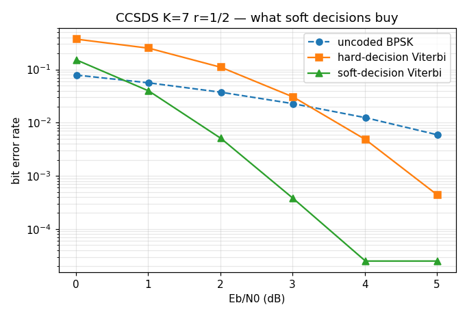
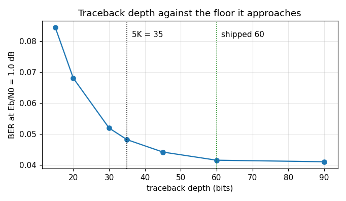

# conv — validation report

Generated by `validate.py` in this folder. `conv` has no Python binding, so every number is measured by `native/validation/conv_certify.c` and rendered here; nothing is modelled. Re-run to regenerate.

## Executive summary

- **Status.** **CERTIFIED** — all 7 limits hold.
- **Findings.** 3 recorded, none open.

**What a caller most needs to know**

- **Ship traceback depth 60, not the textbook `5*K = 35`** — 35 sits measurably above the achievable floor at the operating point where depth still matters, and 60 is within a few percent of it (§2.3, F1). The design page's *magnitude* for that gap does not reproduce; its decision does.
- **Feed the decoder soft decisions or do not code at all.** Below Eb/N0 ~3.5 dB a hard-decision Viterbi is worse than an uncoded link, because the rate costs 3.01 dB of Eb that a two-level input does not buy back (§2.2, F3).
- **Node sync decides on a margin near 0.22, not 0.5.** A maximum-likelihood search decodes a misaligned stream to the nearest codeword rather than to noise, so a threshold placed at half the symbols never fires (§2.4, F4).
- **Size the node-sync window for the job.** The phase decision holds at 250 bits; the in-sync statistic only becomes a channel estimate — the property that lets it also serve lock detection — at a thousand bits or more, where it tracks the delivered symbol error rate to within 25 % (§2.4).
- **The evidence is C, and that is the design.** `conv` has no Python face and should not grow one to be certified; this report renders a C harness rather than exercising a binding (F2).

# conv — certification evidence

## 1. The object

Convolutional codes as a DESCRIPTION — a constraint length, an output count, a generator polynomial per output and which outputs are inverted — with one encoder, one maximum-likelihood decoder and one node synchronizer all reading it. CCSDS's K = 7 rate-1/2 code is a configuration of it and is what every number here is measured on.

Design and API, not restated here:

- `native/inc/conv/conv_core.h` — the SSOT for every claim below
- `native/tests/test_conv_core.c` — the C certification
- [The Viterbi Decoder](../../../../../docs/design/viterbi.md) — the trellis, the branch metric, the traceback depth and node synchronization
- `native/validation/conv_certify.c` — the sweeps below

### Claim coverage — every prose claim in the header

The campaign's order is header first. This table is the inventory that produced four new C sections: `conv_outputs` and `conv_next_state` had **zero** mentions, the LLR sign convention was pinned only against the test's own helper, `d_free` was an open unknown, and one claim was off by one.

**Two headers and two test files, since doppler#893.** `viterbi` became its own declared component, so the decoder's claims left `conv_core.h` for `viterbi_core.h` and its C sections left `test_conv_core.c` for `test_viterbi_core.c`, keeping their numbers. The `C section` column says which file each row is in. This report still covers both because the encoder and the decoder are only meaningful against each other -- a decoder matched to a wrong encoder decodes perfectly and interoperates with nothing -- but `viterbi` is owed a certification of its own, which is [#894](https://github.com/doppler-dsp/doppler/issues/894).

| # | claim in the header | C section | here |
|---|---|---|---|
| C1 | `conv_outputs` is the one expression both directions read | §2b | F2 |
| C2 | output `j` is bit `j` of the word and the `j`-th symbol emitted | §2b (NEW) | — |
| C3 | `invert` bit `j` inverts output `j`; CCSDS inverts G2 | §2 | — |
| C4 | a state IS the `k-1` previous inputs, newest in the high stage | §2b (NEW) | — |
| C5 | polynomials are written as the standard writes them | §2 | — |
| C6 | `conv_code_valid` refuses every out-of-range field | §1 | — |
| C7 | `conv_states` is `2^(k-1)` | §1 | — |
| C8 | the encoder is continuous across calls | §3 | — |
| C9 | `conv_encode` refuses an invalid code or a short buffer, untouched | §7 | — |
| C10 | positive LLR means symbol 0, agreeing with a hard slicer | viterbi §5b | — |
| C11 | a positive scale cannot move the maximum-likelihood path | viterbi §5 | — |
| C12 | `depth-1` branches are owed, then one bit per `n` symbols | viterbi §4, §5b | — |
| C13 | `viterbi_decode` refuses a non-multiple or a short buffer | viterbi §7 | — |
| C14 | `d_free = 10` for the CCSDS code | viterbi §6d | F1 |
| C15 | traceback depth 60 is measured, not a rule of thumb | — | §2.3 |
| C16 | soft decisions are worth about 2 dB | — | §2.1, §2.2 |
| C17 | in sync, the re-encode disagreement IS the channel SER | viterbi §6b, §6c | §2.4 |
| C18 | the decoder resumes bit-exactly from a blob | viterbi §8 | — |

**What Python cannot reach: the encoder.** `conv` has no binding, so unlike every other report in this campaign the evidence here is a C harness rendered by Python rather than a binding exercised by it. That is no longer true of either direction -- `doppler.coding.Viterbi` and `ConvEncoder` both exist now -- but this report was built against the C harness and is left that way rather than half converted; the binding's own contract is exercised in `src/doppler/viterbi/tests/` and the state round trip in the shared matrix. The `here` column points at what this report adds — the statistical behaviour no single assertion can hold — and `—` means the C section is the whole evidence and needs no help.

## 2. Characterisation

Every number below is `native/validation/conv_certify.c`'s, at 120 000 information bits per point, on CCSDS's K = 7 rate-1/2 code. Es/N0 is at the matched-filter output; Eb/N0 is that plus 3.01 dB, because the code spends two channel symbols per information bit and a coding claim that does not pay for its rate is not a coding claim.

### 2.1 Soft, hard and uncoded, against Eb/N0 (C §6)

| Es/N0 dB | Eb/N0 dB | soft | hard | uncoded BPSK |
|---|---|---|---|---|
| -3.0 | 0.01 | 1.507e-01 | 3.713e-01 | 7.840e-02 |
| -2.0 | 1.01 | 3.943e-02 | 2.513e-01 | 5.607e-02 |
| -1.0 | 2.01 | 5.044e-03 | 1.098e-01 | 3.733e-02 |
| 0.0 | 3.01 | 3.752e-04 | 3.039e-02 | 2.275e-02 |
| 1.0 | 4.01 | < 2.5e-05 (0 errors) | 4.819e-03 | 1.242e-02 |
| 2.0 | 5.01 | < 2.5e-05 (0 errors) | 4.335e-04 | 5.904e-03 |

The soft column is what the decoder is for. The hard column is the same decoder over a two-level input — the difference is the INPUT, not a second algorithm — and the uncoded column is the closed form `Q(sqrt(2 Eb/N0))`, which needs no measurement at all.

### 2.2 What soft decisions buy, and the crossover hard has (NEW)

Hard decisions cost between 2.5x and 81x the error rate over the measured range, the ratio growing with Eb/N0 because soft information is worth more where the decoder is nearly right.

**A hard-decision Viterbi is worse than no coding at all below Eb/N0 ~ 4.0 dB** — the rate-1/2 code spends 3.01 dB of Eb to buy back less than that from a quantised input. That is the measurement behind the soft-decision design in `docs/design/mpsk.md` existing and behind soft demapping landing before the decoder did.

### 2.3 Traceback depth, where the parameter can be seen

| depth | BER at Eb/N0 = 1.0 dB | above the floor |
|---|---|---|
| 15 | 8.4443e-02 | +106% |
| 20 | 6.8119e-02 | +66% |
| 30 | 5.1954e-02 | +27% |
| 35 | 4.8205e-02 | +17% |
| 45 | 4.4200e-02 | +8% |
| 60 | 4.1562e-02 | +1% |
| 90 | 4.1064e-02 | +0% |

Swept at Eb/N0 = 1.0 dB, and the operating point is the whole reason the table says anything: a first attempt at Eb/N0 = 4 dB returned **zero errors in 120 000 bits at every depth from 30 up**, which measures the run length rather than the parameter.

### 2.4 Node synchronization — the separation it decides on (C §6b)

| Es/N0 dB | window (bits) | in sync | channel SER | wrong phase | margin |
|---|---|---|---|---|---|
| -2.0 | 250 | 0.0820 | 0.1306 | 0.2487 | 0.1667 |
| -2.0 | 500 | 0.1390 | 0.1306 | 0.2779 | 0.1390 |
| -2.0 | 1000 | 0.1209 | 0.1306 | 0.2290 | 0.1081 |
| -2.0 | 2000 | 0.1289 | 0.1306 | 0.2233 | 0.0944 |
| 0.0 | 250 | 0.0529 | 0.0786 | 0.1958 | 0.1429 |
| 0.0 | 500 | 0.0695 | 0.0786 | 0.2369 | 0.1674 |
| 0.0 | 1000 | 0.0809 | 0.0786 | 0.2220 | 0.1411 |
| 0.0 | 2000 | 0.0730 | 0.0786 | 0.2452 | 0.1723 |
| 2.0 | 250 | 0.0159 | 0.0375 | 0.1825 | 0.1667 |
| 2.0 | 500 | 0.0410 | 0.0375 | 0.1788 | 0.1378 |
| 2.0 | 1000 | 0.0346 | 0.0375 | 0.2359 | 0.2013 |
| 2.0 | 2000 | 0.0418 | 0.0375 | 0.2305 | 0.1888 |

**The window that DECIDES and the window that ESTIMATES are not the same size.** The margin holds up at 250 bits — the separation is wide and a phase decision only has to pick the larger gap — but the in-sync column is a rate over roughly `2*(window - depth)` symbols, which at 250 bits and Es/N0 = 2 dB is about 130 symbols carrying two expected errors. The 0.0159 in that row is Poisson noise around 0.0375, not a bias. Size for the decision at a few hundred bits; size for a channel estimate at a thousand or more.

In sync the disagreement fraction tracks the CHANNEL's symbol error rate, which is the property that lets one statistic serve node sync, lock detection and a channel estimate at once (`docs/design/fec-receive.md` §3). The wrong hypothesis sits near 0.22 rather than near 0.5 — a maximum-likelihood search finds whatever codeword agrees best with a stream that is not on its trellis, so the coin-flip intuition is wrong by more than a factor of two.

## 3. Review

- **F1 · FIXED** — `docs/design/viterbi.md` §4 quoted `5*K = 35` at **33 % above the BER floor (0.04178 vs 0.03137)**, from an uncommitted prototype. Measured here at the same Eb/N0 over four times the bits: **17 %** (0.0482 against a floor of 0.0411), with every level ~30 % higher — about what a fraction of a dB of Es/N0 convention is worth on a curve this steep. The design page now carries this table and says the prototype's is superseded. The decision it drove is unchanged: 35 is short of the floor, 60 is on it.

- **F2 · C-ONLY** — Every claim in §1's table is verified in C and NONE of it is reachable from Python, because `conv` has no binding. That is the component's design rather than a gap in the evidence: the callers are `ccsds_tm` and any receiver that wants a trellis, both of them C. This report is the first in the campaign whose evidence layer is a C harness rendered by Python rather than a binding exercised by it.

- **F4 · BY DESIGN** — The wrong node-sync hypothesis scores ~0.22 of symbols, not ~0.5 (§2.4). A maximum-likelihood search returns the codeword that agrees best with whatever it is given, so a misaligned stream is not decoded to noise — it is decoded to the nearest codeword, which agrees with about three quarters of it. Any threshold placed at 'half the symbols' would never fire.

## 4. Limits

Claims a caller may rely on, asserted by this run.

| verdict | claim |
|---|---|
| PASS | soft-decision BER at Eb/N0 = 3.01 dB is <= 1e-3 (measured 3.75e-04) |
| PASS | soft decisions are worth at least 10x the error rate from Eb/N0 2 dB up |
| PASS | hard-decision decoding is WORSE than uncoded at Eb/N0 = 1 dB (0.251 against 0.056) |
| PASS | the shipped traceback depth of 60 is within 5 % of the floor (measured 1.2 %) |
| PASS | 5*K = 35 is measurably above that floor, so the textbook depth is not enough for this code (measured 17 % above) |
| PASS | node sync separates its hypotheses by at least 5 % of the symbols scored, at every window from 250 bits and every Es/N0 from -2 dB (worst measured 0.094) |
| PASS | in sync, the disagreement fraction is the channel symbol error rate to within 25 % once at least 1000 bits are scored (worst 11 %) — see §2.4 for why the shorter windows cannot support this claim |

## 5. Summary

- **3 findings**, 0 of them gaps or confirmed defects — none left
- **7/7 limits** hold
- Raw sweeps: `data/ber.csv`, `data/depth.csv`, `data/nodesync.csv`
