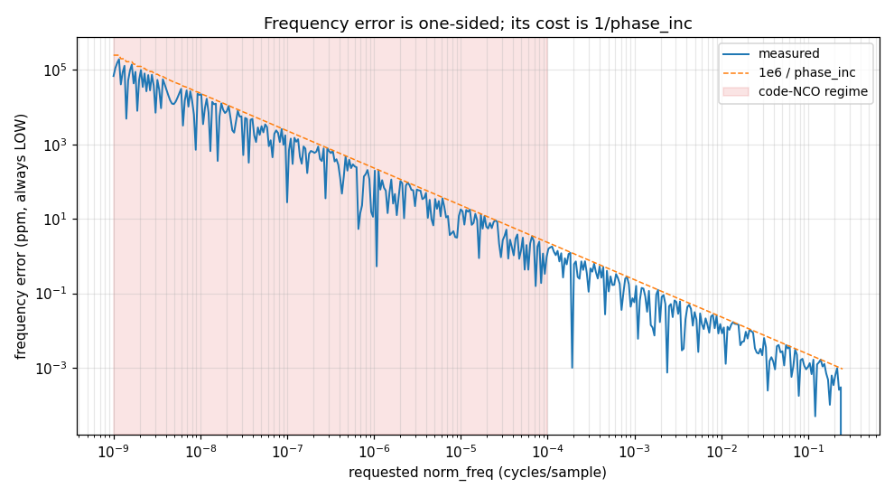
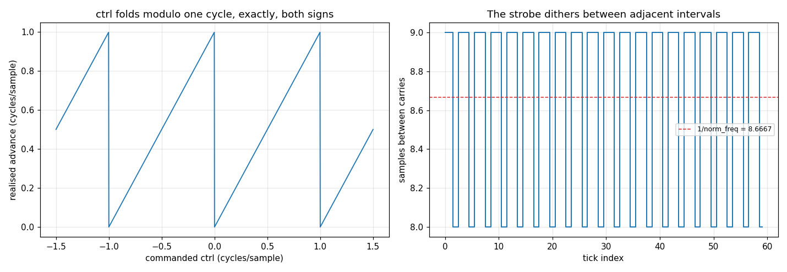
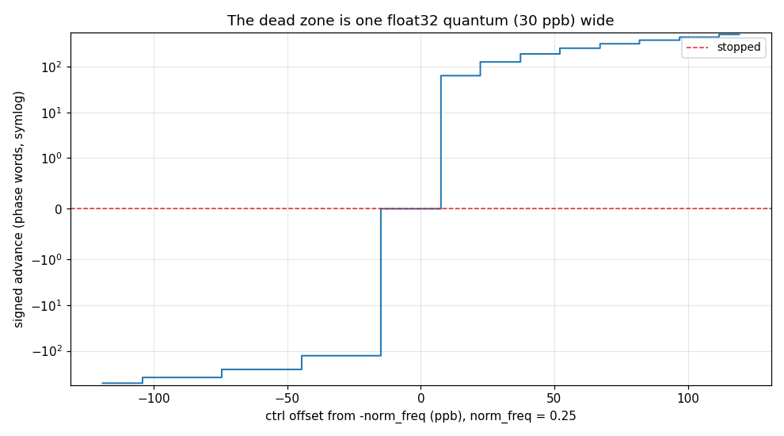
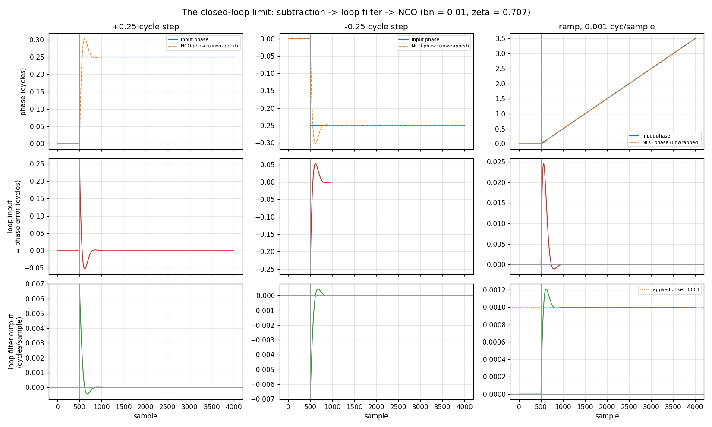

# NCO — validation report

Generated by `validate.py` in this folder. Every number is measured from the C implementation through its own binding; nothing is modelled. Re-run to regenerate.

## 1. The object — design and expectations

`nco_state_t` is a **32-bit phase accumulator**: a register advancing by `phase_inc` every sample, wrapping naturally at 2^32. It is the primitive every steered thing in the library stands on — `symsync`, `dll` and `resamp` embed it **by value**, so its behaviour is their behaviour.

### Where the design lives — this report does not restate it

| source | holds |
|---|---|
| [`docs/design/nco.md`](../../../../../docs/design/nco.md) | the rationale: why one conversion site, why truncation, why the event is signed, what was tried and removed |
| [`native/inc/nco/nco_core.h`](../../../../../native/inc/nco/nco_core.h) | the contract: the two layers, the two faces over one fold, the three output mappings and their `_ctrl` variants |
| [`native/tests/test_nco_core.c`](../../../../../native/tests/test_nco_core.c) | the gate: point assertions, with `volatile` where constant-folding would hide the bug |

The one-line orientation, so this page stands alone: the design is stratified into a **float boundary** (`nco_phase_units`, the only double→integer conversion in the family — C99 6.3.1.4 leaves an out-of-range conversion undefined, so confining the cast is structural) over **integer arithmetic C99 defines outright** (6.2.5p9, 7.20.1.1), which is why all the care lives in the first layer. Everything else is in the sources above.

### What this report adds

A unit test pins points; it cannot state a **law**. `nco_core.h` claims in prose that the frequency error is "at most one step low and never high" — nothing checks that as a property. Sections below characterise the laws, review what they mean, and pin the envelope. Section numbers track `test_nco_core.c`'s own numbering so the two read side by side.

> **Note on provenance.** `docs/design/nco.md` does not exist on this branch — it is a residual still stranded in PR #647, so the link above dangles. The signed carry/borrow rule and test sections §14–16 from that same PR **have** now landed here (see **F7**), applied by hand rather than cherry-picked because a later commit reshaped the same function and main carries a `resamp` paragraph #647 predates.

## 2. Characterisation

Measured behaviour, no verdicts. Section numbers track `test_nco_core.c`.

### 2.1 Lifecycle, zero, quarter-rate, continuity, accessors
*(test_nco_core.c sections 1-4, 7)*

| property | measured |
|---|---|
| phase after `reset()` | 0 |
| `phase_inc` at `norm_freq = 0` | 0 |
| quarter-rate first 4 phases | `[0, 1073741824, 2147483648, 3221225472]` |
| 5+5 samples == 10 samples | True |
| accessor round-trip | norm_freq=0.2, phase=12345, phase_inc=858993459 |

### 2.2 `nmax` scaling maps `[0, 2^32)` onto `[0, nmax)`
*(sections 5, 9)*

| nmax | min | max | distinct | == floor(phase/2^32 · nmax) |
|---|---|---|---|---|
| 2 | 0 | 1 | 2 | True |
| 10 | 0 | 9 | 10 | True |
| 256 | 0 | 255 | 256 | True |
| 1000 | 0 | 999 | 1000 | True |
| 65536 | 0 | 65535 | 1014 | True |

### 2.3 The carry — one per cycle, and its cadence
*(sections 6, 10)*

| norm_freq | carries in 4096 | expected |
|---|---|---|
| 0.25 | 1024 | 1024 |
| 0.1 | 409 | 409 |
| 0.5 | 2048 | 2048 |

At the irrational rate `0.115384615` the strobe intervals are `[8, 9]` with mean `8.666667` against `1/norm_freq = 8.666667` — it dithers between two adjacent integers, which is the resampler's whole basis.

Driven at 1.30 cycles/sample (`norm_freq` 0.6 + `ctrl` 0.7) the flag reports `16/16` with distinct values `[1]` — it is a flag, not a counter, and cannot report two wraps in one sample.

### 2.4 The carry under a **negative** control

Drive a stopped NCO (`norm_freq = 0`) with a constant negative `ctrl`. The intent is a slow **backward** rate, so crossings should occur at `|ctrl|` per sample. This is the case that was wrong until the signed rule landed: the fold takes bipolar to unipolar before the add, so a bare carry test saw the accumulator running **forward** at `1 - |ctrl|` and fired at that rate instead. The last column is what the flag used to report.

| ctrl | intended rate | measured carries/sample | measured vs intended | old (folded) rate |
|---|---|---|---|---|
| -0.1 | 0.1000 | 0.1000 | 1.000x | 0.9000 |
| -0.25 | 0.2500 | 0.2500 | 1.000x | 0.7500 |
| -0.4 | 0.4000 | 0.4000 | 1.000x | 0.6000 |
| -0.01 | 0.0100 | 0.0100 | 1.001x | 0.9900 |

### 2.5 The one conversion, observed as `phase_inc`
*(sections 12, 13)*

| requested norm_freq | phase_inc | note |
|---|---|---|
| `0` | 0 | exact zero |
| `2.328306437e-10` | 1 | one LSB — smallest live rate |
| `1.164153218e-10` | 0 | below one LSB |
| `0.25` | 1073741824 | exact, divides 2^32 |
| `nan` | 0 | NaN |
| `inf` | 0 | +inf |
| `-inf` | 0 | -inf |
| `-0.25` | 3221225472 | negative, folds into [0,1) |
| `-1e-20` | 4294967295 | tiny negative |
| `1` | 0 | one whole cycle |

Across the range (full sweep in `data/frequency_sweep.csv`):

| norm_freq | phase_inc | error (ppm) | 1/inc bound (ppm) |
|---|---|---|---|
| 1.024e-08 | 43 | -22244.884 | -23255.814 |
| 1.023e-06 | 4392 | -196.974 | -227.687 |
| 1.022e-04 | 438790 | -1.586 | -2.279 |
| 1.020e-02 | 43829542 | -0.008 | -0.023 |
| 9.955e-02 | 427560882 | -0.001 | -0.002 |

### 2.6 The control port — law and resolution
*(section 8)*

| ctrl | advance (phase words) | as cycles/sample |
|---|---|---|
| 0.25 | 1073741824 | 0.250000 |
| 0.1 | 429496736 | 0.100000 |
| 1e-09 | 4 | 0.000000 |
| 0 | 0 | 0.000000 |
| -1e-09 | 4294967291 | 1.000000 |
| -0.1 | 3865470560 | 0.900000 |
| 1 | 0 | 0.000000 |
| 1.5 | 2147483648 | 0.500000 |
| -1.5 | 2147483648 | 0.500000 |

The same requested `0.1` reaches the accumulator by two paths and lands on **two different words**: configured (double) gives `429496729`, the ctrl port (float32) gives `429496736`, a delta of `7`. `float32(0.1)` is `0.10000000149011612` against `0.10000000000000001`.

### 2.7 A control that cancels `phase_inc`

| ctrl | signed advance (phase words) |
|---|---|
| -0.250000100000 | -384 |
| -0.250000010000 | 0 |
| -0.250000000000 | 0 |
| -0.249999990000 | 64 |
| -0.249999900000 | 448 |

The float32 quantum at `0.25` is `2.98e-08` (29.8 ppb). The measured contiguous zero-advance run is `2.235e-08` (22.4 ppb) over 151/1601 scanned controls.

### 2.9 The closed-loop limit — a trivial linear loop

Everything above characterises the NCO open-loop. This closes the simplest possible loop around it: **subtraction** as the phase detector, a `LoopFilter` on the error, its control driving the NCO's ctrl port. No discriminator shape, no gain to normalise, no noise — the error IS the input phase minus the NCO phase.

That is the point. A real detector reports the error through some S-curve with finite slope, self-noise and a pull-in range; this one reports it exactly. So the numbers below are the **limit on closed-loop behaviour** — the best any loop built on this NCO can do, and the reference a real detector's performance is a deduction from.

`bn = 0.01`, `zeta = 0.707`, one update per sample, disturbance at sample 500. The classic settling estimate for a second-order loop is `5/bn` = 500 samples. Error wrapped to `[-0.5, 0.5)`, so the detector is linear while the error stays inside half a cycle.

| drive | peak |error| (cyc) | settle (samples after disturbance) | residual |error| (cyc) | final control (cyc/sample) |
|---|---|---|---|---|
| +0.25 cycle step | 0.25000 | 273 | 0.00e+00 | 2.2671e-10 |
| -0.25 cycle step | 0.25000 | 273 | 0.00e+00 | 6.0455e-12 |
| ramp, 0.001 cyc/sample | 0.02451 | 408 | 1.15e-10 | 1.0000e-03 |

Both steps settle identically, which is the symmetry a linear loop must have. On the ramp the loop filter's output converges on the applied frequency offset itself — `1.000000e-03` against `0.001` — which is the type-2 integrator absorbing a constant frequency error and leaving no steady-state phase error behind. A type-1 loop would sit at a fixed offset instead.

### 2.10 Not reachable from Python

*(section 11)* The bindings expose the batch `steps_u32*` forms but not the single-sample `nco_step_u32*` primitives, so the claim that each batch stepper is exactly a loop over its single-sample counterpart cannot be checked here. It remains `test_nco_core.c`'s alone — reported, not silently skipped.

## 3. Review — findings

| finding | verdict | detail |
|---|---|---|
| F1 | BY DESIGN | the frequency error is one-sided and tracks the 1/phase_inc envelope. Correct — but the consequence is unstated: 194700 ppm at the bottom of the range against 0.000 ppm at the top. Same conversion, five orders of magnitude apart in cost, and a code NCO lives at the expensive end. |
| F2 | GAP | the ctrl port is float32 while the configured rate is double, so one requested 0.1 lands on two different phase words (delta 7). Nothing documents which resolution a tracking loop is steering at. |
| F3 | GAP | a ctrl cancelling phase_inc stops the NCO over a PLATEAU 22 ppb wide (one float32 quantum), not a knife edge. A loop settling near -phase_inc parks in a dead zone it cannot steer out of by fractions. |
| F4 | GAP | the two faces of the conversion diverge at infinity: nco_phase_units(+inf) is pinned at 4294967295 (saturate), but the object folds first, fmod(inf,1.0) is NaN, and NCO(inf).phase_inc is 0 (stopped). Only the primitive's side is asserted anywhere. |
| F5 | GAP | 4 nonsense frequency requests (NaN, +inf, -inf, sub-LSB) produce a silently stopped oscillator that create() reports as success — distinct from 0.0/-0.0/1.0/2.0, which are stopped correctly (DC, and whole cycles aliasing to DC). |
| F6 | BY DESIGN | the carry is a flag, not a counter: at 1.30 cycles/sample it reports 16/16 and cannot say 'two wraps'. Correct for a strobe, and the reason a resampler keeps its own accounting. |
| F7 | FIXED | the control port's event is now signed by the COMPOSITE rate, formed as `norm_freq + ctrl` in cycles before either term is folded. Under a negative control the flag now fires at the intended rate — at ctrl=-0.01, 0.0100 against an intended 0.0100 — where the old bare-carry test fired at the folded rate 0.9900. Not a discovery: this was already fixed and documented in PR #647 and the conversion consolidation landed on main without it. Applied here by hand (a later commit reshaped the same function, and main carries a `resamp` paragraph #647 predates), together with that PR's §14-16 — an independent long-double oracle over 10 base rates x 6 control trajectories, both signs. Reverting the rule now produces 279 failures. |
| F8 | C-ONLY | nco_steer_scale landed alongside the signed rule — bound the REQUEST so the conversion is a safety net rather than the active path. It is a header inline with no binding, so this report cannot exercise it; test_nco_core.c §16 does, including the case that motivated it (a control below -1 makes the raw scale negative, which an honest conversion floors to 0 — a stopped NCO that never strobes again). |

## 4. Limits — the certified envelope

Claims a caller may rely on. A failure here is a regression, not a new finding.

| verdict | claim |
|---|---|
| PASS | frequency error is never HIGH, at any requested rate |
| PASS | frequency error never escapes the 1e6/phase_inc ppm envelope |
| PASS | the usable frequency floor is exactly one LSB (2.3283e-10 cycles/sample); below it the oscillator is stopped |
| PASS | NaN converts to a stopped NCO, never to a wrapped increment |
| PASS | the fold never hands the cast a 1.0: a tiny negative rate steps one word BACK, it does not stick |
| PASS | ctrl == 0 is bit-identical to no ctrl at all |
| PASS | ctrl never modifies norm_freq or phase_inc |
| PASS | ctrl folds modulo one cycle exactly, both signs (1201/1201 controls) |
| PASS | the ctrl dead zone is one float32 quantum wide (22.4 ppb) — bounded, not unbounded |
| PASS | at an irrational rate the strobe dithers between two adjacent intervals [8, 9] whose mean is 1/norm_freq |
| PASS | scaled output never leaves [0, nmax) |
| PASS | under a NEGATIVE control the event fires at the intended |ctrl| rate, not the folded 1-|ctrl| — the composite's sign decides |
| PASS | a phase step settles inside the 5/bn estimate (273 and 273 samples against 500) |
| PASS | the loop is symmetric in sign: +step and -step settle identically |
| PASS | a phase step leaves NO steady-state error (residual 0.0e+00 cycles) |
| PASS | a frequency ramp leaves NO steady-state PHASE error (residual 1.2e-10 cycles) — the type-2 integrator absorbs it |
| PASS | on a ramp the loop filter's output converges on the applied frequency offset itself (1.000000e-03 vs 0.001) |

## 5. Summary

- **8 findings**, 4 of them gaps or confirmed defects: F2, F3, F4, F5
- **17/17 limits** hold
- Raw sweeps: `data/frequency_sweep.csv`, `data/ctrl_sweep.csv`
