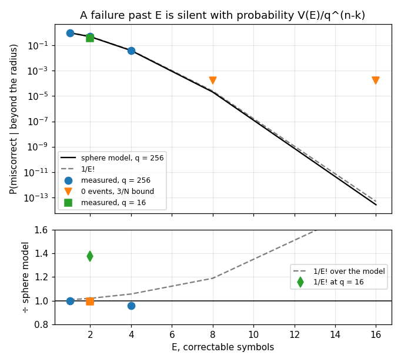
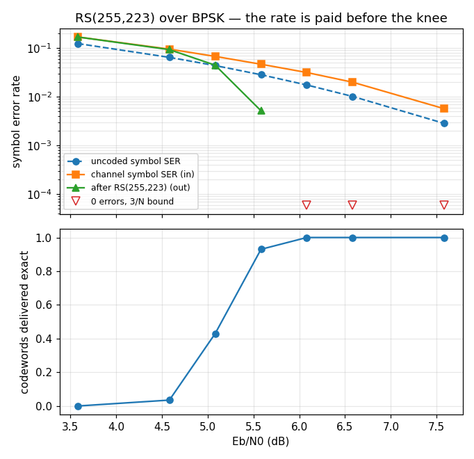

# rs — validation report

Generated by `validate.py` in this folder. `rs` has no Python binding, so every number is measured by `native/validation/rs_certify.c` and rendered here; nothing is modelled except the two closed forms it is compared against. Re-run to regenerate.

## Executive summary

- **Status.** **CERTIFIED** — all 11 limits hold.
- **Findings.** 4 recorded, none open.

**What a caller most needs to know**

- **A failure past `E` is silent with probability `V(E)/q^(n-k)`, and that number does not depend on how bad the damage is.** At `E = 1` almost every uncorrectable word is miscorrected (0.99); at `E = 16` it is 2.6e-14. Choose the parity count for the detection you need, not only for the correction (§2.2, F3).
- **Do not read `1/E!` off a textbook — use `V(E)/q^(n-k)`.** The rule is high by 37 % on a small field (RS(15,11), exact value 0.364) and by 83 % at CCSDS's `E = 16`, which is the configuration this tree ships (§2.2, F4).
- **Below the knee the outer code's product is detection, not repair.** At Es/N0 = 4.0 dB RS(255,223) fixes about 2 % of the broken symbols, delivers a worse symbol error rate than no coding at all, and refuses 193 of 200 codewords — which is the useful output at that SNR (§2.4).
- **One decibel is the whole knee.** From Es/N0 = 4.5 dB to 5.5 dB the code goes from breaking even to delivering every codeword byte-exact with zero residual symbol errors (§2.4).
- **The CCSDS shape is not a special case.** The same code with `j0 = 112` and `s = 11` over a different field delivers outcome for outcome the same result as the textbook one, which is the measurement behind `rs` and `ccsds_tm` being separate files (§2.3).
- **The evidence is C, and that is the design.** `rs` has no Python face and should not grow one to be certified (F2).

# rs — certification evidence

## 1. The object

A Reed-Solomon code as a DESCRIPTION — a symbol width, a field polynomial, a parity count, a first root and a root stride — with one encoder, one syndrome routine and one correcting decoder all reading it. CCSDS 131.0-B-3's (255,223) is a configuration of it, and this report measures that configuration beside a textbook one to show the difference is the table.

Design and API, not restated here:

- `native/inc/rs/rs_core.h` — the SSOT for every claim below
- `native/tests/test_rs_core.c` — the C certification
- [Reed-Solomon](../../../../../docs/design/reed-solomon.md) — the algebra, the two offsets a textbook omits, and what a decode refusal does and does not mean
- `native/validation/rs_certify.c` — the sweeps below

### Claim coverage — every prose claim in the header

The campaign's order is header first. This table is the inventory that produced seven new C sections — the derived sizes and the declared range had **zero** assertions, the parity was pinned only against the syndromes that share its convention, and 'carries no running state' was pinned by nothing at all — and one claim that was not unpinned but false (C2).

| # | claim in `rs_core.h` | C section | here |
|---|---|---|---|
| C1 | one description; encoder, checker and decoder cannot disagree | §2, §2b, §3b | §2.3 |
| C2 | point it at any code a caller brings — DVB, RS(15,11) | §1b | F1 |
| C3 | `field_poly` must be primitive, and `rs_init` refuses | §1, §1b | — |
| C4 | `gcd(root_stride, n) = 1`, or the code corrects fewer errors | §1, §1c (NEW) | — |
| C5 | symbols are packed one per byte, top bits clear at `J < 8` | §3c (NEW) | — |
| C6 | `k` information then `nroots` parity; index `i` carries `x^(n-1-i)` | §2b (NEW), §3b (NEW) | — |
| C7 | the conventional basis throughout | — (ccsds_tm's) | — |
| C8 | the declared range: `J` in 2..8, `nroots` in 2..64 | §1, §1b (NEW) | — |
| C9 | `n = 2^J-1`, `k = n-nroots`, `E = nroots/2` | §1b (NEW) | — |
| C10 | it carries no running state; every function takes it `const` | §8 (NEW) | — |
| C11 | `rs_code_valid` checks the ranges, evenness and the stride | §1, §1b | — |
| C12 | ...and deliberately does NOT check primitivity | §1b (NEW) | — |
| C13 | `gen[i]` is the coefficient of `x^i`, monic, degree `2E` | §2 | — |
| C14 | exposed because standards publish it (Annex G) | `test_ccsds_tm_rs.c` | — |
| C15 | systematic: the information is not touched | §3 | — |
| C16 | the parity IS `info(x)*x^nroots mod g(x)`, high order first | §2b (NEW) | — |
| C17 | `S_m = C(a^(s*(j0+m)))`, all zero IS being a codeword | §3, §3b (NEW) | — |
| C18 | corrects up to `E` symbol errors, in place | §4, §4b (NEW), §7 | §2.1 |
| C19 | it refuses or returns a codeword — no third outcome | §5 | §2.1 |
| C20 | a refusal is not the claim 'more than E'; it can miscorrect | §4 | §2.2, F3 |
| C21 | a refused word is left untouched | §5 | — |
| C22 | returns the count repaired, 0 for a clean word, -1 to refuse | §4, §4b, §6 | §2.1 |

**What Python cannot reach: all of it.** `rs` has no binding, so the evidence here is a C harness rendered by Python rather than a binding exercised by it. The `here` column points at what this report adds — the behaviour that is a probability rather than an assertion — and `—` means the C section is the whole evidence and needs no help.

## 2. Characterisation

Every number below is `native/validation/rs_certify.c`'s, at 6000 trials per (code, error count) point and 200 codewords per channel point. The sphere sweep places its own error patterns, with the generator `test_rs_core.c` places them with; the channel sweep is the library's — bits from `pn`, symbols from `mpsk_map`, noise from `awgn`, decisions from `mpsk_soft_demap`.

### 2.1 Past the guaranteed radius (C §4, §4b, §5)

| code | errors | corrected | refused | miscorrected |
|---|---|---|---|---|
| RS(255,253) E=1 | 1 | 1.0000 | < 5.0e-04 | < 5.0e-04 |
|  | 2 | < 5.0e-04 | 0.0085 | 0.9915 |
|  | 3 | < 5.0e-04 | 0.0082 | 0.9918 |
|  | 5 | < 5.0e-04 | 0.0088 | 0.9912 |
| RS(255,251) E=2 | 2 | 1.0000 | < 5.0e-04 | < 5.0e-04 |
|  | 3 | < 5.0e-04 | 0.5167 | 0.4833 |
|  | 4 | < 5.0e-04 | 0.5127 | 0.4873 |
|  | 9 | < 5.0e-04 | 0.5048 | 0.4952 |
| RS(255,247) E=4 | 4 | 1.0000 | < 5.0e-04 | < 5.0e-04 |
|  | 5 | < 5.0e-04 | 0.9648 | 0.0352 |
|  | 6 | < 5.0e-04 | 0.9632 | 0.0368 |
|  | 17 | < 5.0e-04 | 0.9583 | 0.0417 |
| RS(255,239) E=8 | 8 | 1.0000 | < 5.0e-04 | < 5.0e-04 |
|  | 9 | < 5.0e-04 | 1.0000 | < 5.0e-04 |
|  | 10 | < 5.0e-04 | 1.0000 | < 5.0e-04 |
|  | 33 | < 5.0e-04 | 1.0000 | < 5.0e-04 |
| RS(255,223) E=16 | 16 | 1.0000 | < 5.0e-04 | < 5.0e-04 |
|  | 17 | < 5.0e-04 | 1.0000 | < 5.0e-04 |
|  | 18 | < 5.0e-04 | 1.0000 | < 5.0e-04 |
|  | 65 | < 5.0e-04 | 1.0000 | < 5.0e-04 |
| RS(255,223) CCSDS-shaped E=16 | 16 | 1.0000 | < 5.0e-04 | < 5.0e-04 |
|  | 17 | < 5.0e-04 | 1.0000 | < 5.0e-04 |
|  | 18 | < 5.0e-04 | 1.0000 | < 5.0e-04 |
|  | 65 | < 5.0e-04 | 1.0000 | < 5.0e-04 |
| RS(15,11) E=2 | 2 | 1.0000 | < 5.0e-04 | < 5.0e-04 |
|  | 3 | < 5.0e-04 | 0.7050 | 0.2950 |
|  | 4 | < 5.0e-04 | 0.6313 | 0.3687 |
|  | 9 | < 5.0e-04 | 0.6462 | 0.3538 |

The first row of each code is the guaranteed radius, and it is there as an anchor rather than as news: `E` errors are corrected in every one of 6000 trials at every configuration, which is what C §4 and §4b assert by construction. Everything below it is the header's careful sentence made measurable — *a refusal is not the same claim as more than `E` errors*.

Across all 168000 decodes the harness ran, the number that returned something which was neither a refusal nor a codeword is **0**. C §5 pins that as a property of the key equation over error patterns from 0 to `n`; this is the same claim at 168k samples and it is the reason the two columns beside `corrected` account for every remaining outcome.

### 2.2 The miscorrection rate belongs to E, not to the damage

| code | E | E+1 errors | E+2 | 4E+1 | sphere model | 1/E! |
|---|---|---|---|---|---|---|
| RS(255,253) E=1 | 1 | 0.9915 | 0.9918 | 0.9912 | 0.9922 | 1.0000 |
| RS(255,251) E=2 | 2 | 0.4833 | 0.4873 | 0.4952 | 0.4903 | 0.5000 |
| RS(255,247) E=4 | 4 | 0.0352 | 0.0368 | 0.0417 | 0.0394 | 0.0417 |
| RS(255,239) E=8 | 8 | < 5.0e-04 | < 5.0e-04 | < 5.0e-04 | 2.1e-05 | 2.5e-05 |
| RS(255,223) E=16 | 16 | < 5.0e-04 | < 5.0e-04 | < 5.0e-04 | 2.6e-14 | 4.8e-14 |
| RS(255,223) CCSDS-shaped E=16 | 16 | < 5.0e-04 | < 5.0e-04 | < 5.0e-04 | 2.6e-14 | 4.8e-14 |
| RS(15,11) E=2 | 2 | 0.2950 | 0.3687 | 0.3538 | 0.3639 | 0.5000 |

**Two readings, and the second is the one a link budget needs.**

First, the rate barely moves as the damage grows. From `E+1` errors to `4E+1` it changes by under a quarter at every code that miscorrects measurably, against a range of error counts that spans a factor of four. A word past the radius is, to the decoder, very nearly an arbitrary point of the space; whether it lands in some codeword's sphere is a question about the spheres, not about how far it travelled to get there. **So a link cannot escape a silent failure by being much worse than `E`** — see F3.

The residual movement has a direction, and it is the model's own assumption showing: the `E+1` column is systematically the lowest of the three, because a word one symbol outside the radius is not yet arbitrary — it still remembers where it came from. By `4E+1` it does not, and the measurement sits on the model.

Second, that model is exact and `1/E!` is not. The probability is the fraction of the space the decoding spheres fill, `V(E) / q^(n-k)`; `1/E!` is what is left after substituting `C(n,E) ~ n^E/E!` and `n ~ q`, and **both substitutions cost something.** The rule runs high on two independent axes, and the lower panel above is the only place either is visible:

- **With E**, because `C(n,E) ~ n^E/E!` decays as `E` grows against `n`. At `q = 256` the rule is 2 % high at `E = 2` and **83 % high at CCSDS's `E = 16`** — the configuration the tree actually ships.
- **With a small field**, because `n ~ q` is `255/256` at `J = 8` and `15/16` at `J = 4`. RS(15,11) measures 0.361 against a model of 0.364 and a textbook 0.50: 37 % high at an `E` where the first axis costs only 2 % (F4).

Neither error changes a decision on its own — a factor of two on a probability of 2.6e-14 is still never — but the rule is quoted as though it were the answer, and it is the kind of number that gets carried into a budget where the exponent is smaller.

The rows that read `< 5.0e-4` are the honest limit of a per-push sweep: the model puts them at 2.1e-05 and 2.6e-14, and no Monte-Carlo that has to finish in three seconds will ever see the second one. What 6000 clean trials do establish is the claim a caller acts on — that at `E >= 8` a failure past the radius is a **refusal**.

### 2.3 One code, two shapes — the header's central claim (NEW)

| errors | textbook corrected | CCSDS-shaped corrected | textbook refused | CCSDS-shaped refused |
|---|---|---|---|---|
| 16 | 6000/6000 | 6000/6000 | 0 | 0 |
| 17 | 0/6000 | 0/6000 | 6000 | 6000 |
| 18 | 0/6000 | 0/6000 | 6000 | 6000 |
| 65 | 0/6000 | 0/6000 | 6000 | 6000 |

`0x1D`/`j0 = 1`/`s = 1` against `0x87`/`j0 = 112`/`s = 11`: a different field, a different first root and a stride of eleven, delivering outcome for outcome the same result. That is the file's opening claim — *the arithmetic is identical and only the table changes* — and no assertion can make it, because each shape decodes its own encoder perfectly whether or not the other exists. It takes two codes measured side by side.

It is also the claim that fails LOUDLY when it fails: the two factors `docs/design/reed-solomon.md` §4 calls out — the `j0` substitution before Berlekamp-Massey and the `X^-(j0-1)` in Forney — are 1 for the textbook row and neither is 1 for the CCSDS row. A decoder that omitted them would sit at 6000/6000 in the left column and 0/6000 in the right.

### 2.4 On a real channel: where the outer code starts paying

| Es/N0 dB | Eb/N0 dB | symbol SER in | symbol SER out | uncoded SER | codewords good | refused |
|---|---|---|---|---|---|---|
| 3.0 | 3.58 | 0.1683 | 1.68e-01 | 0.1234 | 0/200 | 200 |
| 4.0 | 4.58 | 0.0948 | 9.27e-02 | 0.0643 | 7/200 | 193 |
| 4.5 | 5.08 | 0.0673 | 4.44e-02 | 0.0436 | 86/200 | 114 |
| 5.0 | 5.58 | 0.0465 | 5.16e-03 | 0.0283 | 186/200 | 14 |
| 5.5 | 6.08 | 0.0314 | 0.00e+00 | 0.0174 | 200/200 | 0 |
| 6.0 | 6.58 | 0.0199 | 0.00e+00 | 0.0102 | 200/200 | 0 |
| 7.0 | 7.58 | 0.0057 | 0.00e+00 | 0.0028 | 200/200 | 0 |

RS(255,223) over BPSK, hard decisions, 200 codewords a point. The code spends 0.58 dB of Eb on its rate, so the uncoded column is read at the SAME Eb/N0 rather than the same Es/N0 — the comparison a caller is actually choosing between.

**Below Es/N0 ~ 4.5 dB the outer code delivers a WORSE symbol error rate than no coding at all**, for the same reason a hard-decision Viterbi does in `conv`'s §2.2: the rate is paid up front and a code that cannot clear the channel buys nothing back. The knee is about a decibel wide, and one decibel past it the output is clean.

**Below the knee the value is the REFUSAL, not the correction.** At Es/N0 = 4.0 dB the code repairs about 2 % of the broken symbols and refuses 193 of 200 codewords: almost nothing is fixed, and almost everything wrong is *known* to be wrong. That is the number `ccsds_tm_frame_rx_t` reports counts for, and it is why a receiver that treats a refusal as a failure and a correction as a success is reading the outer code backwards at exactly the SNR where it matters.

Silent failures on this channel: **0** in 1400 codewords. At `E = 16` the sphere model puts a miscorrection at 2.6e-14, so a run that produced one would be evidence of a defect rather than of bad luck (§2.2).

## 3. Review

- **F1 · FIXED** — `rs_core.h` offered RS(204,188) as a configuration to point the file at — *point this at RS(204,188) for DVB* — and it cannot be done. `n` is `2^J - 1` by construction, so DVB's code is a SHORTENED RS(255,239): the mother code with 51 leading zeros the sender never transmits. `docs/design/reed-solomon.md` said the same thing in §1 while its own §7 listed shortened codes as not implemented, tracking the virtual fill as [gh-813](https://github.com/doppler-dsp/doppler/issues/813); the two halves of one page disagreed. Both now name the mother code and say why the shortened one is a different question. This is what step 1 is for: the claim was not unpinned, it was false, and no amount of testing the code would have found it.

- **F2 · C-ONLY** — Every claim in §1's table is verified in C and none of it is reachable from Python, because `rs` has no binding. That is the component's design rather than a gap in the evidence: the caller is `ccsds_tm`, and it is C. `rs` is the second component certified on the C-only track `conv` opened, and the first to use it for a component whose interesting behaviour is a probability rather than a curve.

- **F3 · BY DESIGN** — The miscorrection rate does not fall as the damage grows (§2.2): at `4E+1` errors it is within a quarter of its value at `E+1`, across a four-fold range of error counts. This reads as a defect because the intuition is that a badly broken word is obviously broken, and the intuition is wrong — a word past the radius is an arbitrary point of the space, and whether it lands in a decoding sphere is a question about the spheres. The consequence is the one the header states: a decode reports a COUNT and not a verdict, because a caller cannot infer 'many errors' from a correction, and the protection is accounting one layer up.

- **F4 · FIXED** — `test_rs_core.c`'s refusal gate carried its rationale as *with probability ~1/E! for random errors ... at E = 2 it is a coin toss*, and cited `1/16! ~ 5e-14` for the CCSDS code. `1/E!` is what is left of the exact `V(E)/q^(n-k)` after two approximations, and each costs more than the comment implies: it is 37 % high at RS(15,11), the configuration the comment used as its example (the rate there is 0.361, against 0.50 from the rule and 0.364 from the exact form the measurement lands on), and 83 % high at `E = 16`, the configuration the tree ships — 5e-14 against an exact 2.6e-14. The gate's own floor was never in danger; it sits at 32 of 64, which the exact model puts more than two standard deviations away. What was wrong was the number a reader takes away, at both ends of the table. The comment now carries the exact form and points here for the measurement (§2.2).

## 4. Limits

Claims a caller may rely on, asserted by this run.

| verdict | claim |
|---|---|
| PASS | E symbol errors are corrected in every trial, at all 7 configurations (42000 words, zero failures) |
| PASS | a decode never returns a non-codeword — 168000 decodes across every code and every error count, zero third outcomes |
| PASS | where it is measurable, the miscorrection rate is the sphere model V(E)/q^(n-k) to within 15 % (worst 11 %, over 9 points at q = 256) |
| PASS | the same model holds on the small field where 1/E! does not: RS(15,11) measures 0.361 against a model of 0.364 and a textbook 1/E! of 0.500 |
| PASS | the miscorrection rate is flat in the error count — at 4E+1 errors it is within 30 % of its value at E+1 (worst 20 %), so being far past the radius does not make a failure detectable |
| PASS | at E >= 8 a failure past the radius is a REFUSAL: zero silent miscorrections in 54000 words beyond the radius, over three codes |
| PASS | the textbook and CCSDS-shaped (255,223) codes deliver outcome for outcome the same result — a different field, first root and stride change the table and not the arithmetic |
| PASS | from Es/N0 = 5.5 dB (Eb/N0 = 6.08 dB) every codeword is delivered byte-exact — 600 of 600, zero residual symbol errors |
| PASS | at Es/N0 = 4.0 dB the coded symbol error rate is WORSE than uncoded at the same Eb/N0 (0.0927 against 0.0643) — the rate is paid before the knee |
| PASS | and it says so: 193 of 200 codewords are REFUSED there, so what the outer code delivers below the knee is detection rather than repair |
| PASS | no codeword is ever silently miscorrected on the measured channel (0 of 1400), which is what E = 16 buys |

## 5. Summary

- **4 findings**, 0 of them gaps or confirmed defects — none left
- **11/11 limits** hold
- Raw sweeps: `data/sphere.csv`, `data/channel.csv`
