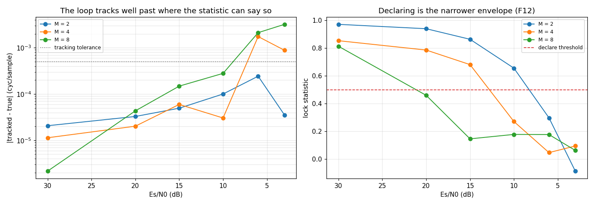
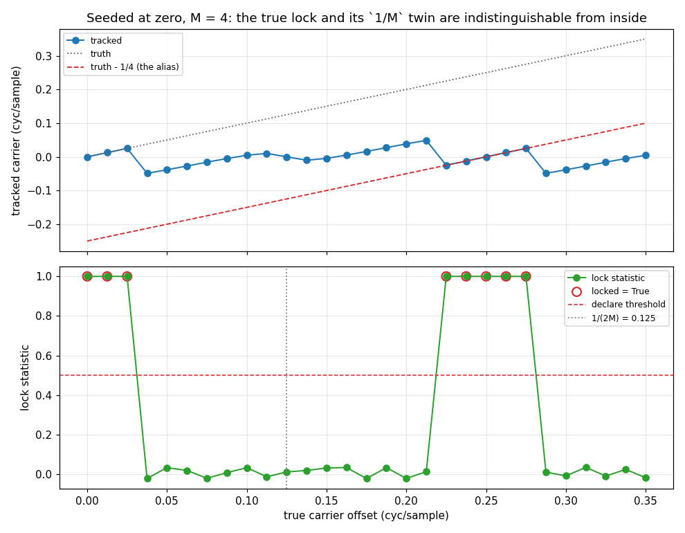
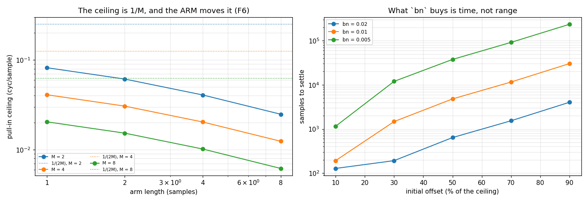
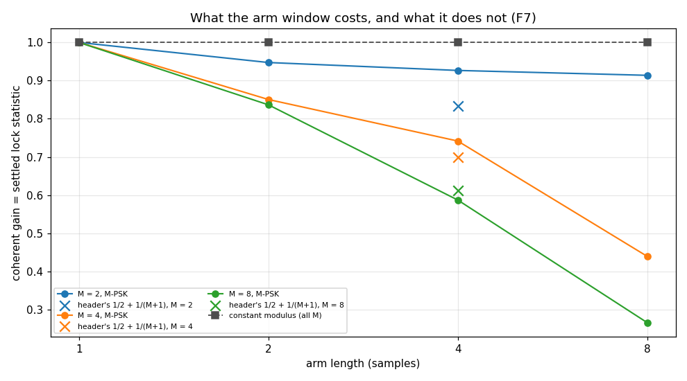
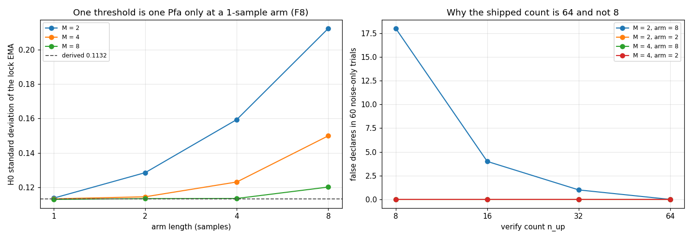

# CarrierNda — validation report

Generated by `validate.py` in this folder. Every number is measured from the C implementation through its own binding; nothing is modelled. Re-run to regenerate.

## 1. The object — design and expectations

`carrier_nda_state_t` is **carrier recovery that needs neither data nor symbol timing**. Per sample it de-rotates the input with an integer-phase NCO, slides a free-running I/Q boxcar of `sps/n` samples, and runs an M-th-power discriminator on the window average — raising the arm sample to the Mth power strips the M-PSK modulation, leaving M times the carrier phase. That is what lets it acquire a bare carrier, or a modulated one before timing lock, and it is why the same mechanism costs an M-fold ambiguity in phase **and in frequency**.

### Where the design lives — this report does not restate it

| source | holds |
|---|---|
| [`native/inc/carrier_nda/carrier_nda_core.h`](../../../../../../native/inc/carrier_nda/carrier_nda_core.h) | the contract: the acquisition bounds and which one is silent, what the arm window costs, the threshold chain, and why the verify count is not derived from it |
| [`native/tests/test_carrier_nda_core.c`](../../../../../../native/tests/test_carrier_nda_core.c) | the gate: sections 1-9 from the object's own landing, 14 and 15 added by this audit and each proved by sabotage |
| [`native/validation/`](../../../../../../native/validation/) | the C harnesses that reach what no binding does — `carrier_nda_scurve.c` (the discriminator's exact form), `carrier_nda_lock.c` (the statistic's H0/H1 laws), `carrier_nda_pullin.c` and `carrier_nda_step_response.c` |
| [`docs/design/mpsk.md`](../../../../../../docs/design/mpsk.md) | the rationale: the discriminator's canonical definition, where it reads, and the false-lock geometry |
| [`docs/design/lock-detect.md`](../../../../../../docs/design/lock-detect.md) | why a verify count sized on a per-look Pfa is wrong wherever the looks are correlated — tree-wide |

### What this report adds

A unit test pins points; it cannot state a **law**. The header asserts in prose that the acquisition window scales as `1/M`, that violating one bound is loud and violating the other is silent, that the arm window costs a stated coherent gain, and that one threshold means one false-alarm rate at every M. Nothing measured any of them. This report characterises each as a law across the axes it is claimed on — M, the arm length, `bn`, the carrier offset, the input level and Es/N0 — reviews what they mean, and pins the envelope.

The header explicitly delegates one of them: *"A caller choosing `n` is choosing a sensitivity loss, and the validation report is the evidence for what each choice costs."* That is §2.6.

### Claim coverage — every prose claim in the header

The campaign's order is header first: enumerate what the header asserts, then ask of each whether it is pinned, pinned only at literals, or absent. `NEW` marks a `test_carrier_nda_core.c` section this audit added; each was proved by sabotaging the implementation and watching it go red before it was trusted. **C-ONLY** marks a claim no binding can reach — chiefly everything about `carrier_nda_disc` itself, which is `JM_FORCEINLINE` and has no Python face (**F10**).

| # | claim in `carrier_nda_core.h` | covered by |
|---|---|---|
| C1 | locks with no data and no symbol timing — a bare carrier, or a modulated carrier before timing lock | C §4 §5 + §2.1 |
| C2 | per sample: NCO wipe-off, a free-running I/Q boxcar of `sps/n` samples, one output per input — no rate change | C §2 + §2.1 |
| C3 | the M-th power strips the data, so the discriminator is independent of the symbols and of symbol timing | C §3 §5 + §2.1 §2.6 |
| C4 | `phase_error` = `Im((z/\|z\|)^M)` scaled 1, 1/2, 1/4 so the S-curve slope at lock is 2 for every M | **C-ONLY** — C §3 + `carrier_nda_scurve.c`; see F10 |
| C5 | `lock_signal` = `Re((z/\|z\|)^M)`, bounded in +-1 at every M and every input scale | **C-ONLY** — C §14 NEW (with a vacuity precondition) |
| C6 | under H0 the per-look variance is 1/2 for EVERY M, so one `lock_thresh` is one Pfa at every order | C §15 NEW + §2.7 — holds per-look; **NOT** through the arm, see F8 |
| C7 | the threshold chain: alpha = 0.05 -> N_eff = 39, sd_H0 = 0.1132, shipped 0.5 = eta 4.416 | C §15 NEW + §2.7 — alpha re-derived here from `det_ema_alpha` |
| C8 | the verify count is NOT sized by that Pfa and must not be; n_up = 8 false-locked 4 trials in 30, 64 was clean over 300 | §2.8 — reproduced, and localised to a geometry, see F8 |
| C9 | both outputs divide out the detector's own amplitude law, so the loop gain is invariant to input scale (1e-5 to 1e15, 6.5e-7 rel) | C §9 (the detector, exact) + §2.9 (the loop, 8 decades) |
| C10 | there is no AGC in this loop and none is wanted | C §9 + §2.9 — the claim that retired it |
| C11 | acquisition bound 1: loop capture, roughly `k*bn/M`, where pull-in is prompt — violating it is LOUD | §2.3 §2.4 §2.5 — LOUD confirmed; `k*bn/M` bounds TIME, see F6 |
| C12 | acquisition bound 2: the aliasing ceiling `1/(2M)` cyc/sample, with stable false locks spaced `1/M` apart — violating it is SILENT | §2.3 — spacing exact; the ceiling is never what binds, see F6 |
| C13 | both bounds scale as `1/M`, so 8PSK needs four times tighter tuning than BPSK at the same bandwidth | §2.4 — exact to four digits at every arm length |
| C14 | nothing else in the loop depends on the update rate, so it is free margin for whoever picks it | §2.4 — the ARM also moves the ceiling, see F6 |
| C15 | `n` sets the arm to `sps/n` samples and the window is not free: coherent gain falls as it widens | §2.6 — direction confirmed |
| C16 | for the half-symbol arm the gain is `1/2 + 1/(M+1)` — 5/6, 7/10, 11/18 — against unity for constant modulus | §2.6 — unity confirmed; the closed form does **not** reproduce, F7 |
| C17 | `bn` is in cycles per sample and n-invariant: the arm emits every sample, so `n` only sets the window length | C §7 + §2.10 |
| C18 | the tracked carrier is the NCO centre plus the loop integrator; the instantaneous command is `get_nco_freq` | **C-ONLY** — unreachable from Python, see F9 |
| C19 | lifecycle: m in {2,4,8}, `sps % n == 0`, `sps/n <= BOXCAR_MAX_LEN`; init == create; destroy may be NULL | C §1 §2 + §2.11 |
| C20 | `reset` re-seeds to the create-time frequency with zero phase and clears arm, integrator, lock EMA and lock decision; config survives | C §6 + §2.11 |
| C21 | four telemetry probes at the sample rate, `decim` the throttle, and the attach fails WHOLE | C telemetry + §2.11 |
| C22 | pointer-free POD state: a whole-struct snapshot resumes the loop exactly, and the envelope rejects a clobbered blob | C serializable + §2.11 |
| C23 | a NaN or degenerate arm sample yields zero, never a NaN into the loop filter | **C-ONLY** — C §9 (`carrier_nda_disc(0)` is exactly zero) |
| C24 | the M-fold ambiguity is resolved downstream; the loop resolves to one of m carrier phases | §2.1 §2.3 — and the unstable equilibrium it implies, F11 |

## 2. Characterisation

Measured behaviour, no verdicts. Section numbers in *(italics)* track `test_carrier_nda_core.c`; this report's own numbering is sequential and does not mirror it, because one section here routinely merges several there.

### 2.1 Cold start with no data and no symbol timing
*(sections 2, 4, 5)*

The capability the object exists for. Every row starts from `init_norm_freq = 0` against a true carrier of `0.001` cycles/sample, at the shipped geometry (`sps = 8`, `n = 4`, so a 2-sample arm) and `bn = 0.01`. The modulated rows carry random M-PSK with **no timing alignment of any kind** — the arm is free-running and knows nothing of symbol boundaries.

| M | stimulus | tracked (cyc/sample) | error | lock | locked | residual in output | one out per in |
|---|---|---|---|---|---|---|---|
| 2 | unmodulated tone | 0.001000 | -6.53e-09 | +1.0000 | yes | +2.4e-14 | yes |
| 2 | M-PSK, rect | 0.001001 | +5.85e-07 | +0.9474 | yes | -2.2e-11 | yes |
| 2 | M-PSK, RRC 0.35 | 0.001000 | -3.45e-08 | +1.0000 | yes | -2.3e-11 | yes |
| 4 | unmodulated tone | 0.001000 | -9.51e-09 | +1.0000 | yes | -1.5e-13 | yes |
| 4 | M-PSK, rect | 0.001000 | +1.08e-09 | +0.8505 | yes | +1.2e-10 | yes |
| 4 | M-PSK, RRC 0.35 | 0.001048 | +4.83e-05 | +0.5245 | yes | -3.0e-04 | yes |
| 8 | unmodulated tone | 0.001000 | -9.29e-09 | +1.0000 | yes | -1.5e-13 | yes |
| 8 | M-PSK, rect | 0.001000 | -1.24e-07 | +0.8366 | yes | +7.7e-10 | yes |
| 8 | M-PSK, RRC 0.35 | 0.001029 | +2.88e-05 | +0.3828 | **no** | +4.0e-04 | yes |

**Every configuration acquires**, on data it has never been told the timing of, to within 4.8e-05 cycles/sample. On the constant-modulus and rect-pulse rows the de-rotated stream `steps()` returns is left carrier-free to the float floor. The residual column is measured by limiting the output and raising it to the Mth power — the discriminator's own construction — because a line fitted to the raw phase of a modulated stream measures the data rather than the carrier, and reported 8.1e-4 of "residual" on a row whose frequency was correct to 1.2e-7 until it was changed.

An RRC-shaped stream is the outlier and it is charged twice. Its steady-state accuracy drops by four orders — the M-th power of a pulse-shaped sample carries the pulse's own amplitude excursions into the discriminator — and its lock statistic falls far enough that M = 8 does not declare at all while M = 4 clears the threshold by 5%. Acquisition is unaffected. That the loop can be working while `locked` says otherwise is the subject of §2.2, and it is the single most important thing a caller can take from this report.

The discriminator's own claims — the `{1, 1/2, 1/4}` scaling, the S-curve slope of 2, the `+-1` bound, the exact zero on a degenerate sample — are **C-ONLY** (**F10**). `carrier_nda_disc` is `JM_FORCEINLINE` and no binding reaches it, so measuring the loop and reporting it as the detector would be measuring whatever the binding happens to expose. `test_carrier_nda_core.c` sections 3, 9 and 14 and `native/validation/carrier_nda_scurve.c` carry them instead.

### 2.2 Tracking and declaring are two different envelopes

The loop pulls the frequency in long after the lock statistic has stopped being able to say so. Measured on rect M-PSK at the shipped geometry, sweeping Es/N0 — the tracked-frequency error and the lock statistic side by side.

| M | Es/N0 (dB) | \|freq error\| | tracking | lock | locked |
|---|---|---|---|---|---|
| 2 | 30 | 2.1e-05 | yes | +0.9702 | yes |
| 2 | 20 | 3.3e-05 | yes | +0.9388 | yes |
| 2 | 15 | 4.9e-05 | yes | +0.8627 | yes |
| 2 | 10 | 1.0e-04 | yes | +0.6552 | yes |
| 2 | 6 | 2.4e-04 | yes | +0.2977 | no |
| 2 | 3 | 3.5e-05 | yes | -0.0856 | no |
| 4 | 30 | 1.1e-05 | yes | +0.8526 | yes |
| 4 | 20 | 2.0e-05 | yes | +0.7853 | yes |
| 4 | 15 | 6.0e-05 | yes | +0.6806 | yes |
| 4 | 10 | 3.0e-05 | yes | +0.2713 | no |
| 4 | 6 | 1.7e-03 | **no** | +0.0476 | no |
| 4 | 3 | 8.8e-04 | **no** | +0.0953 | no |
| 8 | 30 | 2.2e-06 | yes | +0.8125 | yes |
| 8 | 20 | 4.3e-05 | yes | +0.4596 | no |
| 8 | 15 | 1.5e-04 | yes | +0.1466 | no |
| 8 | 10 | 2.8e-04 | yes | +0.1784 | no |
| 8 | 6 | 2.1e-03 | **no** | +0.1775 | no |
| 8 | 3 | 3.2e-03 | **no** | +0.0633 | no |

Of 18 points swept, 14 track and only 8 declare. The gap is the object's honest sensitivity statement, and it widens with M: the M-th power multiplies the noise-induced phase excursion by M, so the coherent gain the statistic is built from collapses at high order long before the loop, which integrates, gives up. `docs/design/mpsk.md` already rules that `lock`/`locked` are **telemetry and user reassurance, never control**; this table is the measurement that rule needs to be more than an assertion (**F12**).

### 2.3 The capture map — every `k/M` is a stable lock

The header names two acquisition bounds and says the second one fails silently. Sweeping the true carrier from DC past the first alias, with the loop always seeded at zero, shows the whole structure at once.

| true carrier | tracked | error | lock | which lock |
|---|---|---|---|---|
| 0.00000 | +0.000000 | +0.00000 | +1.0000 | TRUE |
| 0.01250 | +0.012500 | +0.00000 | +1.0000 | TRUE |
| 0.02500 | +0.025000 | +0.00000 | +1.0000 | TRUE |
| 0.22500 | -0.025000 | -0.25000 | +1.0000 | **false, off by 1/4** |
| 0.23750 | -0.012500 | -0.25000 | +1.0000 | **false, off by 1/4** |
| 0.25000 | +0.000000 | -0.25000 | +1.0000 | **false, off by 1/4** |
| 0.26250 | +0.012500 | -0.25000 | +1.0000 | **false, off by 1/4** |
| 0.27500 | +0.025000 | -0.25000 | +1.0000 | **false, off by 1/4** |

Three regimes, and the middle one is the only safe failure. Below the capture edge the loop tracks the carrier exactly. Beyond it there is a wide **loud** dead zone: the frequency walks, `lock` sits at the noise level and `locked` never asserts — unmistakable in telemetry. Then, centred on `1/M` and with the *same capture width as the true one*, a second stable lock: the tracked frequency is wrong by exactly `1/M` and the lock statistic reads +1.0000. Nothing self-referenced detects that. The constellation is stationary, so EVM and blind moment estimators look clean, and the object's own lock statistic — which is measuring the M-th power, and the M-th power really has converged — is at its ceiling.

The header's `1/(2M)` is the ambiguity midpoint rather than a cliff: `1/(2M)` = 0.125 for M = 4 lands in the middle of the dead zone, equidistant from the true lock and the false one. What a caller must satisfy is stricter and simpler — be inside the capture band of the TRUE carrier (§2.4), which at the shipped geometry is several times narrower than `1/(2M)`.

### 2.4 The pull-in ceiling — exactly `1/M`, and the arm sets it

The capture edge of §2.3, measured across M and arm length at `bn = 0.02`, on a 200 000-sample budget. `bn` is deliberately wide here: §2.5 shows the edge saturates above a knee, so this is the structural ceiling rather than a bandwidth-limited one.

| arm length (samples) | M = 2 | M = 4 | M = 8 | M x edge | vs the 1/(2M) ceiling, M = 4 |
|---|---|---|---|---|---|
| 1 | 0.08211 | 0.04106 | 0.02051 | 0.1640 - 0.1642 | 3.0x |
| 2 | 0.06136 | 0.03066 | 0.01533 | 0.1226 - 0.1227 | 4.1x |
| 4 | 0.04081 | 0.02041 | 0.01020 | 0.0816 - 0.0816 | 6.1x |
| 8 | 0.02490 | 0.01245 | 0.00620 | 0.0496 - 0.0498 | 10.0x |

**`M x edge` is constant to four digits at every arm length**, so the `1/M` law the header states for both bounds is exact rather than approximate: the worst spread across M at a fixed arm is 0.37%. An 8PSK caller really does need four times tighter tuning than a BPSK one at the same bandwidth.

The arm length moves it too, and the header does not say so. A 1-sample arm reaches 0.04106 at M = 4 and an 8-sample arm only 0.01245 — a factor of 3.3 — while the header assigns `n` a sensitivity cost alone and says *"nothing else in the loop depends on"* the update rate. At the shipped geometry the ceiling is 4.1x tighter than the `1/(2M)` aliasing ceiling, which is why the aliasing bound is never what a caller hits by pulling in — they hit it only by being SEEDED near an alias, as §2.3 does deliberately (**F6**).

### 2.5 What `bn` buys is TIME, not range

The header calls the first bound *"loop capture, roughly `k*bn/M`"*. Measured against record length, the range is not a function of `bn` at all — every bandwidth converges on the same ceiling given enough record.

| bn | 100k samples | 400k samples | 1600k samples |
|---|---|---|---|
| 0.01 | 0.03081 | 0.03090 | 0.03090 |
| 0.005 | 0.02207 | 0.02978 | 0.03105 |
| 0.002 | 0.00679 | 0.01299 | 0.02236 |
| 0.001 | 0.00244 | 0.00484 | 0.00947 |

Same object, same M = 4, same 2-sample arm; the only variable is how long the loop is given. At `bn = 0.01` the answer is already the ceiling on the shortest record. At `bn = 0.002` it reads 0.00679 on 100k samples and 0.02236 on 1.6M — still climbing toward the same 0.03066.

So what `bn` actually sets is the pull-in TIME, and it sets it steeply. Measured as a fraction of the ceiling, at M = 4:

| bn | 10% of ceiling | 30% of ceiling | 50% of ceiling | 70% of ceiling | 90% of ceiling |
|---|---|---|---|---|---|
| 0.02 | 128 | 192 | 640 | 1,536 | 4,032 |
| 0.01 | 192 | 1,472 | 4,800 | 11,584 | 30,272 |
| 0.005 | 1,152 | 11,968 | 37,632 | 91,456 | 235,072 |

Halving `bn` costs roughly an order of magnitude in pull-in time at a fixed fraction of the ceiling — 4,032 samples at `bn = 0.02` against 235,072 at `bn = 0.005`, at 90%. Read `k*bn/M` as the region where pull-in is PROMPT, which is what the header's own wording says, and not as the region where it happens at all (**F6**).

### 2.6 What `n` costs — the arm window's coherent gain

The section the header delegates here. The arm averages across data transitions, so the coherent gain surviving the M-th power falls as the window widens. Measured as the settled lock statistic, which IS that gain: at lock the statistic is the mean of `Re((z/|z|)^M)`, so a constant-modulus input reads exactly 1.0 and anything less is what the window lost.

| M | arm = 1 | arm = 2 | arm = 4 | arm = 8 | header's 1/2 + 1/(M+1) | measured / predicted |
|---|---|---|---|---|---|---|
| 2 | +1.0000 | +0.9474 | +0.9267 | +0.9139 | 0.8333 | 1.11x |
| 4 | +1.0000 | +0.8505 | +0.7416 | +0.4395 | 0.7000 | 1.06x |
| 8 | +1.0000 | +0.8366 | +0.5870 | +0.2658 | 0.6111 | 0.96x |

The direction is the header's and it holds at every M: a 1-sample arm loses nothing (1.0000 at worst) and an 8-sample arm loses most (0.2658 at M = 8). The CONSTANT-MODULUS control reads 1.00000 at every M and every arm length, which is what attributes the loss to data transitions rather than to the averaging itself.

The closed form does not reproduce. For the half-symbol arm the header predicts 5/6, 7/10 and 11/18; the object delivers 0.9267, 0.7416 and 0.5870 — the prediction is 11% LOW at BPSK, 6% low at QPSK and 4% HIGH at 8PSK, so it is not a constant offset either. BPSK is the case that shows why: every sample of a real BPSK stream is real, so the arm's average is real too and its square is positive whatever the transition did. The only windows that lose anything are the ones straddling a transition near the midpoint, where the average passes through zero — a small, discrete loss rather than `1/2 + 1/(M+1)` = 0.833 (**F7**). The measured table above is the answer to *"what does this `n` cost me"*; the closed form is not.

### 2.7 The lock statistic under H0 — the spread the threshold uses
*(sections 14, 15)*

The header derives the threshold rather than picking it: `alpha = det_ema_alpha(0.0, 15.9 dB)` — which this report re-evaluates through the library at 0.05012, the shipped 0.05 — giving `N_eff = (2-alpha)/alpha` = 39 looks, and a post-EMA H0 standard deviation of `sqrt(1/2 * alpha/(2-alpha))` = 0.11323 **for every M**, because the limited statistic's per-look variance is exactly 1/2 whatever the constellation order. The shipped up-threshold of 0.5 is then 4.416 sigma.

Measured on noise-only input, through the object, at every arm length — which is where the derivation meets the rest of the loop:

| arm length | sd, M = 2 | sd, M = 4 | sd, M = 8 | eta, M = 2 | eta, M = 4 | eta, M = 8 |
|---|---|---|---|---|---|---|
| 1 | 0.1136 | 0.1132 | 0.1129 | 4.40 | 4.42 | 4.43 |
| 2 | 0.1285 | 0.1144 | 0.1133 | 3.89 | 4.37 | 4.41 |
| 4 | 0.1594 | 0.1230 | 0.1134 | 3.14 | 4.06 | 4.41 |
| 8 | 0.2124 | 0.1499 | 0.1201 | 2.35 | 3.34 | 4.16 |

**At a 1-sample arm the derivation is exact and M-independent**, as claimed: 0.1136, 0.1132, 0.1129 against the analytic 0.1132. That row is the control, and it is what makes the rest of the table attributable.

**Through a longer arm it is neither.** At an 8-sample arm the spread runs 0.2124 at M = 2 down to 0.1201 at M = 8 — a factor of 1.77 across M, where the claim is that there is none. The mechanism is the arm's overlap: consecutive boxcar outputs share `arm_len - 1` samples, so consecutive looks are correlated and the EMA averages fewer independent ones than `N_eff` counts. The M-th power is what breaks the tie — it multiplies the residual phase difference between neighbouring looks by M, so a high order decorrelates the overlap away and a low one does not. The per-look law the header derives is exactly right; what it omits is that the object never presents the detector with independent looks (**F8**).

The consequence is the threshold's meaning. `eta` is 2.35 sigma at M = 2 with an 8-sample arm against the derived 4.42, so the per-look false-alarm rate there is orders of magnitude above the 5e-6 the chain was sized for. §2.8 is what that costs in practice.

### 2.8 The verify count against noise-only input

`carrier_nda_core.c` records a direct Monte Carlo behind the shipped `n_up = 64`: `n_up = 8` false-locked 4 trials in 30, `n_up = 16` 7 in 100, `n_up = 32` 1 in 100, and 64 was clean over 300. Repeated here through the binding, 60 trials of 200 000 noise-only samples each, at four geometries — the two orders whose H0 spread §2.7 separates, each at the widest arm and at the shipped one.

| M | arm length | n_up = 8 | n_up = 16 | n_up = 32 | n_up = 64 |
|---|---|---|---|---|---|
| 2 | 8 | 18/60 | 4/60 | 1/60 | 0/60 |
| 2 | 2 | 0/60 | 0/60 | 0/60 | 0/60 |
| 4 | 8 | 0/60 | 0/60 | 0/60 | 0/60 |
| 4 | 2 | 0/60 | 0/60 | 0/60 | 0/60 |

**The failure reproduces, and it belongs to a geometry.** At M = 2 with an 8-sample arm — the widest spread in §2.7 — `n_up = 8` false-declares 18/60 and the count has to reach 64 before the column is clean, exactly the shape `carrier_nda_core.c` records. At the SHIPPED geometry (2-sample arm) every count including 8 is clean at both orders. So the shipped `n_up = 64` is not over-provisioned: it is what makes one verify count safe across the whole `n` axis the constructor accepts, rather than only at the default. Raise it rather than lower it, as the header says (**F8**).

### 2.9 Amplitude invariance through the closed loop
*(section 9)*

The claim that retired this loop's arm AGC: the discriminator divides out its own `|z|^M`, so the input level cannot reach the loop gain. The C test proves it on the detector, exactly, over twenty decades. Here it is the LOOP that is measured — same carrier, scaled input, and the answer must not move.

| M | amplitude 0.0001 | amplitude 0.01 | amplitude 1 | amplitude 100 | amplitude 10000 | spread |
|---|---|---|---|---|---|---|
| 2 | 0.0010000 | 0.0010000 | 0.0010000 | 0.0010000 | 0.0010000 | 4.7e-09 |
| 4 | 0.0010000 | 0.0010000 | 0.0010000 | 0.0010000 | 0.0010000 | 8.5e-09 |
| 8 | 0.0010000 | 0.0010000 | 0.0010000 | 0.0010000 | 0.0010000 | 8.2e-09 |

Eight decades of input level, and the tracked carrier moves by at most 8.5e-09 cycles/sample — the float rounding floor, not a level dependence. There is no AGC anywhere in this object and none is needed.

### 2.10 `bn` is n-invariant, against the closed-loop reference
*(section 7)*

`doppler.tests.loop_reference` closes the simplest possible loop around a real `LoopFilter` and a real `NCO` with **subtraction** as the detector: no S-curve shape, no finite slope, no self-noise. That is the limit on closed-loop behaviour, and this loop's settling is a deduction from it rather than an unanchored number.

| drive | peak \|error\| (cyc) | settle (updates) | residual \|error\| (cyc) |
|---|---|---|---|
| +0.25 cycle step | 0.25000 | 273 | 0.00e+00 |
| -0.25 cycle step | 0.25000 | 273 | 0.00e+00 |
| ramp, 0.001 cyc/sample | 0.02451 | 408 | 1.15e-10 |

The reference absorbs a frequency ramp — which is what a carrier offset is — in 408 updates at `bn = 0.01`. The NDA loop updates once per input SAMPLE and its `bn` is in cycles per sample, so the two are directly comparable, and `n` must not enter.

| arm length | samples to settle (bn = 0.005) |
|---|---|
| 1 | 328 |
| 2 | 328 |
| 4 | 328 |
| 8 | 324 |

Settling moves by 1.01x across a factor of eight in arm length, so `bn` names one loop bandwidth whatever `n` is — the gains are configured with `t = 1` because the moving-average arm emits every sample, and `n` genuinely only sets the window. This is the property that was wrong before the arm became a moving average: applying `bn` per arm dump scaled the real loop bandwidth by `n`.

### 2.11 Lifecycle, reset, telemetry and state
*(sections 1, 2, 6)*

| property | measured |
|---|---|
| `reset()` clears the loop | norm_freq 0, lock 0, locked False |
| `reset()` reproduces the first run | bit for bit, output stream included |
| `norm_freq = x` RE-SEEDS | norm_freq 0.005, lock 0, locked False — it is a re-seed, not a write |
| telemetry probes | `car.e`, `car.freq`, `car.lock`, `car.locked` |
| records at `decim = 8` over 4096 samples | car.e 512, car.freq 512, car.lock 512, car.locked 512 |
| serialized size | 768 bytes |
| resume from a blob | bit-exact |

`norm_freq = x` is the one surface whose name understates it: it re-seeds the NCO, resets the loop filter and drops the lock, so it is a re-acquisition rather than a nudge. The header says so; a caller reading only the property name would not expect it.

The instantaneous NCO command — `carrier_nda_get_nco_freq`, which the header calls *"the right readout for observing the loop track dynamics"* — has no Python face and no telemetry probe of its own: `car.freq` emits the integrator estimate, the same quantity `norm_freq` reads. So the one readout that rides a frequency ramp with no lag is C-only (**F9**).

## 3. Review — findings, with verdicts

`BY DESIGN` — correct and intended. `GAP` — a real shortfall, open. `FIXED` — found by this audit and repaired in the same pass. `C-ONLY` — a claim no binding reaches, carried in C.

- **F1 · FIXED** — The header quoted the discriminator's scale invariance as 5e-7 relative while `test_carrier_nda_core.c` section 9, which is what measures it, records 6.5e-7 at M = 8 and a scale of 1e15. Two numbers for one measurement, and the tighter one was the prose. Corrected to what the test holds, with the note that ~5 float eps is the rounding floor a float detector has rather than a level dependence.

- **F2 · FIXED** — The threshold derivation cited `CARRIER_NDA_LOCK_DEFAULT_UP`, which is defined in `carrier_nda_core.c` and is invisible from the header — a derivation naming a symbol its own reader cannot reach, and a test hard-coding 0.5 would not have noticed `create()` installing something else. Section 15 now reads the threshold back off a CONSTRUCTED object and checks it against the analytic sd.

- **F3 · FIXED** — `configure_lock`'s docstring published `8 up` as the default — the value the same paragraph reports as false-locking 4 trials in 30 — against a shipped 64. Both faces needed the fix: `jm apply` updates the `.pyi` from the header and does NOT reconcile the sacred `_ext` fragment, so the runtime docstring had to be corrected as its own edit.

- **F4 · GAP** — `docs/guide/lock-detection.md` is stale on this object in two ways: it classes CarrierNda as having "no closed-form (pfa, pd) sizing yet", which the header now derives in full, and it calls the statistic the "M-th-power arm ratio EMA" — a name from before the arm AGC was retired and the statistic became the limited `Re((z/|z|)^M)`. A guide describing a detector that no longer exists is worse than no guide. To be filed.

- **F5 · GAP** — `scripts/check_doc_face_parity.py` compares only `SECTIONS = ("Examples", "Raises")`, so a divergence in DESCRIPTION prose between the `.pyi` and the runtime docstring is invisible to it. It reported "0 divergent" for the entire time F3 was live, which is precisely the divergence it exists to catch. To be filed.

- **F6 · GAP** — The acquisition contract names two bounds, and a third one binds before either. The pull-in ceiling is bn-INDEPENDENT — §2.5 shows every bandwidth converging on the same edge given record — and it is set by the ARM WINDOW, which the header says only costs sensitivity: 0.04106 at a 1-sample arm against 0.01245 at an 8-sample one, M = 4. At the shipped geometry it is 0.03066, which is 4.1x tighter than the `1/(2M)` aliasing ceiling — so a caller pulling in never reaches the aliasing bound and `k*bn/M` describes how PROMPT pull-in is rather than how far it reaches. The header's LOUD/SILENT distinction is unaffected and confirmed; what needs restating is which number a caller should tune to.

- **F7 · GAP** — The header's closed form for the half-symbol arm, `1/2 + 1/(M+1)`, does not reproduce: measured 0.9267 / 0.7416 / 0.5870 against the predicted 0.8333 / 0.7000 / 0.6111, so it is 11% low at BPSK, 6% low at QPSK and 4% high at 8PSK — wrong in both directions, so not a missing constant. The direction of the claim is right and the constant-modulus reference is exactly 1.0 as stated; it is the formula that is not the object's. §2.6's measured table is the answer the header delegates to this report, and the formula should be replaced by a pointer to it.

- **F8 · GAP** — "Its H0 variance is 1/2 for EVERY M" is exact per look and does not survive the arm. At a 1-sample arm the post-EMA spread is 0.1136 / 0.1132 / 0.1129 against the analytic 0.1132 — the derivation, confirmed. At an 8-sample arm it is 0.2124 / 0.1499 / 0.1201, a factor of 1.77 across M, because consecutive boxcar outputs overlap and the M-th power decorrelates that overlap faster at high order. So `eta` is 2.35 sigma rather than 4.42 at M = 2 with a wide arm, and one `lock_thresh` does not mean one Pfa across the `n` axis the constructor accepts. §2.8 shows what it costs and why the shipped `n_up = 64` is the thing holding the false-alarm budget.

- **F9 · GAP** — `carrier_nda_get_nco_freq` — the instantaneous NCO command, which the header calls the right readout for observing loop dynamics because its mean rides a ramp with no lag — is reachable from neither the Python face nor telemetry. `car.freq` emits the integrator-only estimate, which is what `norm_freq` already returns, so the two published views of the loop's frequency are the same view. Same shape as resamp's `get_ctrl_acc` before it was bound: the diagnostic that matters is the one the binding skipped.

- **F10 · C-ONLY** — `carrier_nda_disc` is `JM_FORCEINLINE` and has no binding, so every claim about the discriminator itself — the `{1, 1/2, 1/4}` scaling that equalises the S-curve slope, the slope of 2, the `+-1` bound, exact zero on a degenerate sample, and the twenty decades of scale invariance — is unreachable from Python by construction. It is carried by `test_carrier_nda_core.c` sections 3, 9 and 14 and by `native/validation/carrier_nda_scurve.c`; this report measures the LOOP those properties produce and says so wherever it does.

- **F11 · BY DESIGN** — The M-fold ambiguity has a sharp edge worth stating: the loop's stable phases are the 0-grid, so a pi/4-offset QPSK constellation — which is what `mpsk_map` produces, and what a caller will hand it — sits exactly on the detector's UNSTABLE equilibrium. On a noiseless stream seeded with zero frequency error the loop can hang there and report `lock = -1.0000`, a perfect ANTI-lock. Any carrier offset or any noise breaks it and the loop settles on a stable phase with `lock = +1`. Correct behaviour for an M-th-power detector, but it is how a validator or a caller measures -1 and concludes the detector is inverted, so it belongs in the record. `native/validation/carrier_nda_lock.c` documents the same trap from the other side.

- **F12 · BY DESIGN** — Tracking and declaring are different envelopes, and the gap is wide: of 18 points in §2.2, 14 track the carrier and 8 declare lock. An RRC-shaped stream at M = 8 tracks to 1e-6 and reads `locked = False` at every Es/N0 swept. This is consistent with `docs/design/mpsk.md`, which rules that `lock`/`locked` are telemetry and user reassurance and NEVER control — but a caller who gates a receiver on `locked` has built exactly the control path that rule forbids, and will refuse a loop that is working. The rule needed a measurement behind it and now has one.

## 4. Limits

Claims a caller may rely on. A failure here is a regression, not a new finding — every one is asserted by `src/doppler/track/tests/test_validation_limits.py`, which runs this same `build()` in the ordinary pytest suite.

| verdict | claim |
|---|---|
| PASS | every M acquires the carrier from a cold start at every stimulus — unmodulated, rect M-PSK and RRC M-PSK — with NO symbol timing (worst error 4.8e-05) |
| PASS | and emits exactly one de-rotated sample per input sample on every one of them — the arm is a moving average, not a decimator |
| PASS | on the constant-modulus and rect-pulse inputs the header's contract is written for, the de-rotated stream is carrier-free to the float floor (worst residual 7.7e-10 cycles/sample) |
| PASS | and an RRC-shaped input, which costs the loop four orders of steady-state accuracy, still leaves the residual inside the same 5e-4 tolerance the frequency is held to (worst 4.0e-04) — usable output does not depend on the lock decision (F12) |
| PASS | a rect-pulse or unmodulated input declares lock at every M, with the statistic above 0.8 |
| PASS | the TRACKING envelope is strictly wider than the DECLARING one (14 of 18 Es/N0 points track, 8 declare) — `locked` is a telemetry statement about the M-th power, not a statement about whether the loop is working (F12) |
| PASS | and every M tracks to better than 5e-4 cycles/sample at Es/N0 of 15 dB and above |
| PASS | the pull-in ceiling scales as exactly `1/M`: `M x edge` is constant to 0.37% at every arm length, so an 8PSK caller needs four times tighter tuning than a BPSK one |
| PASS | and it tightens monotonically as the arm window widens (0.0411 > 0.0307 > 0.0204 > 0.0125 cyc/sample, M = 4) — the arm is not sensitivity-only (F6) |
| PASS | the ceiling is at least 3x below the `1/(2M)` aliasing ceiling at every geometry, so pulling in can never reach the aliasing bound — a caller reaches it only by being SEEDED near an alias |
| PASS | the pull-in RANGE is bn-independent: at `bn = 0.01` a 100k budget and a 1.6M budget give the same edge to 0.3% |
| PASS | and narrowing `bn` never widens it — a longer record only ever recovers range that a narrow loop had not reached yet |
| PASS | at `bn = 0.02` pull-in time grows monotonically with the offset (128 samples at 10% of the ceiling to 4,032 at 90%) |
| PASS | at `bn = 0.01` pull-in time grows monotonically with the offset (192 samples at 10% of the ceiling to 30,272 at 90%) |
| PASS | at `bn = 0.005` pull-in time grows monotonically with the offset (1,152 samples at 10% of the ceiling to 235,072 at 90%) |
| PASS | and narrowing `bn` costs time steeply at a fixed fraction of the ceiling — 235,072 samples at `bn = 0.005` against 4,032 at 0.02, a factor of 58 for a factor of 4 in bandwidth (F6) |
| PASS | the SILENT failure is reproducible: seeding at zero against a carrier near `1/M` gives 5 stable false locks in the swept band |
| PASS | and each is wrong by EXACTLY `1/M` = 0.25 cycles/sample, which is what makes the false locks a lattice rather than a drift |
| PASS | while reading a lock statistic of at least +1.0000 — nothing self-referenced detects it, which is why it takes an external reference, a sync word or a seeded coarse estimate |
| PASS | the OTHER failure is loud, as promised: outside every capture band the statistic stays below +0.0340 and `locked` never asserts |
| PASS | and inside the true band the loop tracks exactly, with the statistic at its ceiling |
| PASS | a CONSTANT-MODULUS input costs the arm nothing at any window length or any M (1.0000 throughout) — the loss is data transitions, not averaging |
| PASS | and with data present the coherent gain falls monotonically as the window widens, at every M — the header's direction, measured |
| PASS | a 1-sample arm loses nothing at any M, which is the control that attributes the rest of the sweep |
| PASS | the half-symbol arm still clears the shipped declare threshold at every M (worst 0.5870 against 0.5) — a caller may choose it, and §2.6's table rather than the header's closed form is what it costs (F7) |
| PASS | with a 1-sample arm the post-EMA H0 spread matches the derived 0.11323 at every M to within 2% — the threshold chain is arithmetically sound |
| PASS | and the statistic is zero-mean under H0 at every M and every arm length, which is the property a threshold is measured from |
| PASS | no geometry has a NARROWER H0 spread than the independent-look derivation predicts — the arm's overlap can only cost effective looks, never add them |
| PASS | but a wide arm at low M is far outside it: 0.2124 at M = 2 with an 8-sample arm, 1.88x the derived value, so the shipped 0.5 is only 2.35 sigma there (F8) |
| PASS | the shipped `n_up = 64` gives ZERO false declares against noise-only input at every geometry measured, including the worst |
| PASS | and the test is not vacuous: at the same geometry `n_up = 8` — the value a composing receiver uses on this same statistic — false-declares 18/60. A verify count shorter than `N_eff` is counting one look several times |
| PASS | with the count monotone in between (18 -> 4 -> 1 -> 0 over 60 trials at n_up = 8, 16, 32, 64) |
| PASS | eight decades of input amplitude move the tracked carrier by at most 8.5e-09 cycles/sample at every M — the loop gain is amplitude-invariant and needs no AGC in front of it |
| PASS | `bn` is n-invariant: settling moves by 1.01x across a factor of eight in arm length, so one `bn` is one loop bandwidth whatever `n` is |
| PASS | `reset()` reproduces the first run bit for bit, output stream included |
| PASS | and leaves the loop at its seed frequency with the lock EMA cleared and the lock decision dropped |
| PASS | writing `norm_freq` is a RE-SEED, not a nudge: it drops the lock and clears the integrator |
| PASS | the loop publishes exactly four probes (car.e, car.freq, car.lock, car.locked) |
| PASS | emitted once per input sample and thinned by `decim` alone (512 records per probe over 4096 samples at decim 8) |
| PASS | and a 768-byte state blob resumes the loop bit-exactly in a fresh instance |

## 5. Summary

- **12 findings**, 6 of them gaps or confirmed defects: F4, F5, F6, F7, F8, F9
- **40/40 limits** hold
- Raw sweeps: `data/esno.csv`, `data/capture_map.csv`, `data/pullin_edge.csv`, `data/pullin_time.csv`, `data/arm_cost.csv`, `data/lock_h0.csv`, `data/verify_count.csv` — so any number above can be re-derived rather than taken on the report's word.
