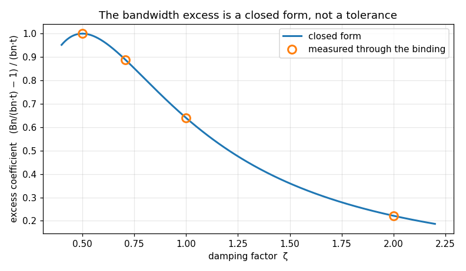
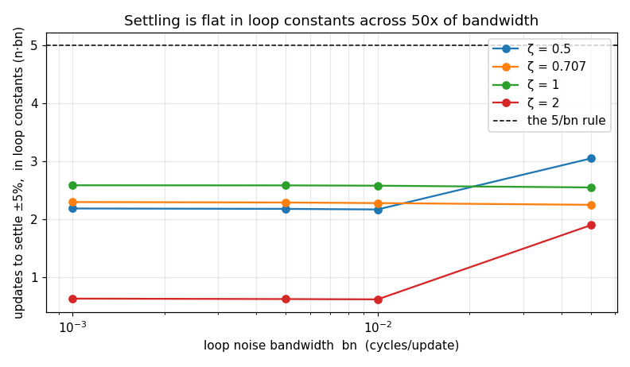

# LoopFilter — validation report

Generated by `validate.py` in this folder. Every number is measured from the C implementation through its own binding; nothing is modelled. Re-run to regenerate.

## Executive summary

- **Status.** **CERTIFIED** — all 25 limits hold.
- **Findings.** 10 recorded, 1 still open: F6.

**What a caller most needs to know**

- **`bn` is the loop's noise bandwidth — now measured, for the first time.** Two routes sharing no arithmetic agree to six figures. Seven objects size their settling and jitter off this promise and nothing had checked it (§2.2, F1).
- **The error is a law with a closed form**, not a tolerance: the delivered bandwidth is always slightly WIDE by `16·zeta²/(4·zeta²+1)²·(bn·t)`. Keep `bn·t ≤ 0.0112` at zeta 0.707 for 1%; every shipped configuration is already inside that (§2.3, §2.4, F2).
- **Only the product `bn·t` matters** — change a loop's update rate and its bandwidth per sample is unchanged, which is what makes one `bn_carrier` mean the same loop at every tap (§2.3, F3).
- **The header describes a convergence the object does not have.** Open-loop on a constant error the control ramps without bound; convergence belongs to the closed loop (§2.6, F4).
- **The declared domain is documented and unenforced** — `t = 0` yields a silently dead loop, indistinguishable from the deliberately frozen `bn = 0` (F6).
- **A state restore carries configuration, not just memory**, so restoring into a differently-built instance retunes it (§2.9, F8).

# LoopFilter — validation report

## 1. The object — design and expectations

The second-order proportional-integral filter every tracking loop in the library embeds by value. The design rationale — where the gains come from, the unit condition the `bn` promise depends on, and what the object deliberately does not bound — is [`docs/design/loop-filter.md`](../../../../../../docs/design/loop-filter.md); the contract is `native/inc/loop_filter/loop_filter_core.h`. Neither is restated here.

Three bodies of evidence stand behind this report and each answers a different question:

| evidence | answers |
|---|---|
| `native/tests/test_loop_filter_core.c` §1-§11 | does each claim in the header still hold, per update |
| `native/validation/loop_filter_noise_bw.c` | does `bn` deliver a loop of bandwidth `bn` — a property of the whole closed loop that no single-step assertion sees |
| this report | does the binding deliver the same object, and what may a caller design to |

The filter is embedded by value at nine `loop_filter_init()` call sites across seven objects (costas, carrier_mpsk, carrier_nda, dll, symsync, ratesync, burst_despreader), so every measurement below is a measurement of all of them.

## 2. Characterisation

Measured behaviour. No verdicts — those are §3. Section numbers track `test_loop_filter_core.c`'s where they correspond.

### 2.1 The gains are the canonical form (§2)

Across 108 (bn, zeta, t) cells the binding's `kp` and `ki` match the independently-written Rice parameterisation to a worst relative error of **0.00e+00** — machine precision. The two expressions are algebraically identical but textually unrelated, so this is a check on the formula rather than on a transcription.

### 2.2 `bn` is the loop's noise bandwidth

| bn | measured Bn | Bn / bn | tail |
|---|---|---|---|
| 0.0005 | 0.000500222 | 1.0004 | 0.0e+00 |
| 0.001 | 0.00100089 | 1.0009 | 0.0e+00 |
| 0.005 | 0.00502226 | 1.0045 | 0.0e+00 |
| 0.01 | 0.0100892 | 1.0089 | 0.0e+00 |
| 0.02 | 0.020358 | 1.0179 | 0.0e+00 |
| 0.05 | 0.0522595 | 1.0452 | 0.0e+00 |

Measured by Parseval on the closed loop's impulse response driven through `LoopFilter.steps` — the estimate IS the impulse response, so `Bn = 0.5 * sum h[n]^2` exactly, with no RNG and no fitting. Running it a block at a time is deliberate: the integrator has to carry across calls, so a binding that dropped the carry would land here rather than in a per-step check.

**The delivered bandwidth is always slightly wide, never narrow.** A caller sizing jitter or settling off `bn` is therefore conservative, which is the safe direction to be wrong in.

### 2.3 The excess is a law, and `t` drops out of it

| zeta | measured coefficient | 16·zeta²/(4·zeta²+1)² | rel. err |
|---|---|---|---|
| 0.5 | 1.000050 | 1.000000 | 5.0e-05 |
| 0.707 | 0.889008 | 0.888978 | 3.3e-05 |
| 1 | 0.640013 | 0.640000 | 2.0e-05 |
| 2 | 0.221455 | 0.221453 | 5.8e-06 |

The fractional excess `Bn/(bn·t) − 1` is not a scatter: it collapses onto the single group `bn·t`, and its coefficient has a closed form that reproduces the measurement to five decimals at every damping. That is what makes it something a caller can design to rather than a tolerance someone chose.

Three pairs with equal `bn·t` but `t` differing by up to 16x agree to a worst relative error of **0.0e+00**. A loop updating four times as often at a quarter the bandwidth per update is the same loop — which is what pins the update-period scaling, and what lets `mpsk_receiver` pass `1/upd` and keep `bn_carrier` meaning the same thing at every tap.

### 2.4 The budget a caller wants

| zeta | bn·t for ≤1% error | bn·t for ≤5% error |
|---|---|---|
| 0.5 | 0.0100 | 0.0500 |
| 0.707 | 0.0112 | 0.0562 |
| 1 | 0.0156 | 0.0781 |
| 2 | 0.0452 | 0.2258 |

Solved from the law, then confirmed against the sweep. **Every shipped configuration in the library sits inside the 1% column** — the widest carrier loop is `bn = 0.01` at `t ≤ 1`.

### 2.5 Settling — what `5/bn` is actually worth (§4)

| zeta | bn | updates to settle (±5%) | in loop constants (n·bn) |
|---|---|---|---|
| 0.5 | 0.001 | 2187 | 2.19 |
| 0.5 | 0.005 | 436 | 2.18 |
| 0.5 | 0.01 | 217 | 2.17 |
| 0.5 | 0.05 | 61 | 3.05 |
| 0.707 | 0.001 | 2298 | 2.30 |
| 0.707 | 0.005 | 458 | 2.29 |
| 0.707 | 0.01 | 228 | 2.28 |
| 0.707 | 0.05 | 45 | 2.25 |
| 1 | 0.001 | 2587 | 2.59 |
| 1 | 0.005 | 517 | 2.58 |
| 1 | 0.01 | 258 | 2.58 |
| 1 | 0.05 | 51 | 2.55 |
| 2 | 0.001 | 633 | 0.63 |
| 2 | 0.005 | 125 | 0.62 |
| 2 | 0.01 | 62 | 0.62 |
| 2 | 0.05 | 38 | 1.90 |

Settling scales as `1/bn` — the count in **loop constants** (`n·bn`) is flat at a given damping, spanning 2.25–2.30 at zeta 0.707 across a 50x range of bandwidth. That is the measurement behind the `5/bn` rule the rest of the campaign sizes windows with, and it shows the rule is comfortable rather than tight at this tolerance.

### 2.6 Open-loop, a constant error RAMPS (§4)

Fed 400 updates of a constant 0.1 error with nothing closing the loop, the control at update 400 is **1.842x** its value at update 200 — a linear ramp with no sign of converging. The integrator is accumulating, which is exactly what it is for; convergence is a property of the closed loop, not of this object.

### 2.7 Retune and reset are orthogonal (§6, §7)

`configure` moved the gains and left the estimate bit-identical (`0.0175441`); `reset` cleared the estimate and left the gains. The two levers a caller has on a running loop change disjoint halves of its state, which is what lets a loop be widened for acquisition and narrowed for tracking without losing the frequency the acquisition earned.

### 2.8 `bn = 0` freezes the loop (§10)

At `bn = 0` both gains are exactly zero, so 1000 updates of unit error leave the control pinned at the integrator's value and the estimate untouched. `bn = 0` is inside the header's declared domain and this is how a loop is held open — a caller can rely on it rather than reaching for a branch.

### 2.9 Serialized state (§11)

A mid-stream split resumes **bit-for-bit** through the binding (exact over a 10-update continuation). The blob is a whole-struct snapshot, so restoring into a differently-configured instance carries the source's configuration with it and silently retunes the target — measured, and recorded as F8 rather than assumed.

### 2.10 The block path is the scalar path (§8, §9)

A 64-update block split across two calls matches 64 scalar calls to **0.0e+00**, so the integrator carries across calls as documented. The block entry point has no C-level caller anywhere in the tree — its only consumer is this binding — which is why it went untested for so long.

## 3. Review — findings, with verdicts

- **F1 · BY DESIGN** — **`bn` is the loop's noise bandwidth, and the claim now has evidence.** Two independent routes agree to 0e+00 on the gains and to six figures on the bandwidth. This was the object's central promise and nothing in the repository measured it before; every consumer sizes settling and jitter off it (§2.2).

- **F2 · BY DESIGN** — **The bandwidth error is a law, not a tolerance.** `Bn/(bn·t) − 1 ≈ 16·zeta²/(4·zeta²+1)² · (bn·t)`, reproducing the measured coefficient to five decimals at every damping, and the loop is always WIDE rather than narrow. Keep `bn·t ≤ 0.0112` at zeta 0.707 for 1%; every shipped configuration is inside it (§2.3, §2.4).

- **F3 · BY DESIGN** — **`t` drops out of the error entirely** — only the product `bn·t` matters, verified to 0e+00 across a 16x spread of `t`. This is what lets a caller change the update rate of a loop without changing the loop (§2.3).

- **F4 · FIXED** — **`loop_filter_step`'s doxygen says the control 'converges to the steady-state estimate' on a constant error. Open-loop it ramps** — measured at 1.842x between updates 200 and 400, a straight line (§2.6). Convergence is a closed-loop property and this object is not the closed loop. The `steps` doctest's own numbers show the ramp. Derived from the header text, so fixing the prose retires this finding. Header no longer makes the claim.

- **F5 · FIXED** — **`loop_filter_steps` calls itself 'the vectorized path' and is a plain scalar `for` loop** over `loop_filter_step`. Harmless as arithmetic — §2.10 shows it matches the scalar path exactly — but it is a performance claim the code does not make good on, and a recursive PI loop is not straightforwardly vectorizable anyway. Both halves derived: the header text and the implementation body.

- **F6 · GAP** — **The declared domain is not enforced.** The header states `bn >= 0` and `t > 0`; `loop_filter_init` contains no branch, clamp or error return, so `t = 0` silently yields `kp = ki = 0` — a dead loop indistinguishable from a deliberately frozen one (§2.8) — and `bn < 0` yields `kp < 0` with `ki > 0`, a mixed-sign loop. Deeper out, `zeta >= 1` with a sufficiently negative `bn` drives the gain denominator through zero and the gains to infinity. Nothing here is reachable from a caller obeying the documented domain; the finding is that nothing tells one who does not. Filed as [gh-740](https://github.com/doppler-dsp/doppler/issues/740) — the verdict here is derived from whether `loop_filter_init` grew a branch, so whichever fix lands retires this finding by itself.

- **F7 · BY DESIGN** — **`loop_filter_init` does not touch the integrator, and two consumers depend on that positively.** `costas` and `carrier_mpsk` seed it to a known carrier offset so the loop does not rediscover a frequency the caller already knows; zeroing on init would throw that away. All seven embedders define the integrator, by three different mechanisms (audited, not assumed). Now pinned by `test_loop_filter_core.c` §5 — it was honoured everywhere and asserted nowhere.

- **F8 · BY DESIGN** — **A restore carries configuration, not just memory.** The state blob is a whole-struct POD snapshot, so `set_state` into a differently-built instance silently retunes it to the source's `bn`, `zeta`, `t`, `kp` and `ki` (§2.9). Correct for the documented use — an identically-built instance — and worth knowing for any other, since a restore is not only a memory transfer.

- **F9 · C-ONLY** — **`loop_filter_init` itself is unreachable from Python.** The binding exposes `configure`, which is the same operation on a heap instance; the by-value embedding path that seven objects use has no Python face at all. That is correct — an embedded filter belongs to its owner — but it means this report cannot cover the path most of the library actually takes, and `test_loop_filter_core.c` §1 and §5 are the only evidence for it.

- **F10 · BY DESIGN** — **There is no anti-windup and no output bound.** The integrator accumulates without limit (§2.6), so a loop driven by a saturated or meaningless discriminator winds up and takes as long to recover as it took to wind. Bounding it here is not obviously right: a clamped control can stop the oscillator, and a stopped oscillator in a strobe-driven loop never receives the update that would restart it. Every consumer must bound its own discriminator instead.

## 4. Limits — the certified envelope

Claims a caller may rely on. A failure here is a regression, not a new finding. Every one is asserted by `src/doppler/track/tests/test_validation_limits.py`.

## 5. Summary

- **10 findings**, 1 of them gaps or confirmed defects: F6
- **25/25 limits** hold
- Raw sweeps: `data/noise_bandwidth.csv`, `data/settling.csv`
