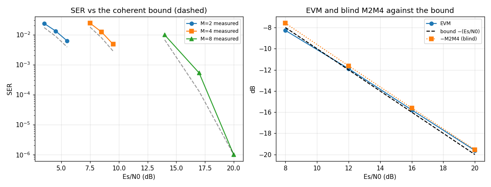
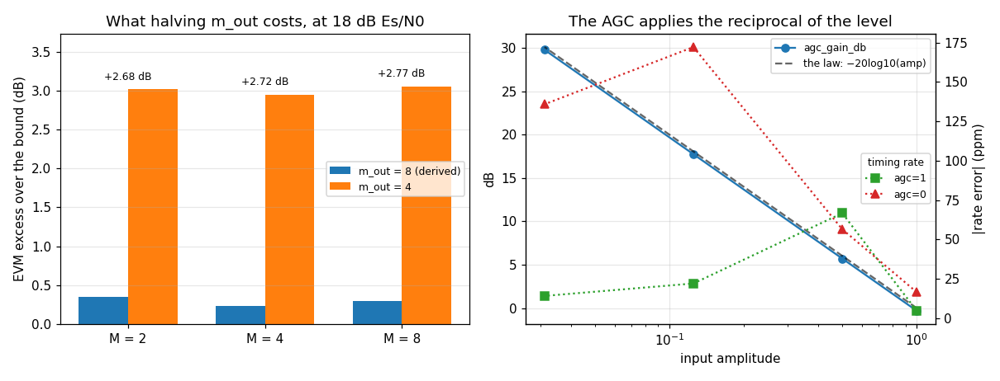

# MpskReceiver — validation report

Generated by `validate.py` in this folder. Every number is measured from the C implementation through its own binding; nothing is modelled. Re-run to regenerate.

## Executive summary

- **Status.** **CERTIFIED** — all 61 limits hold.
- **Findings.** 8 recorded, 2 still open: F6, F7.

**What a caller most needs to know**

- **BPSK and QPSK sit about half a dB behind theory: +0.54 to +0.58 dB at M = 2 and +0.43 to +0.52 dB at M = 4** (§2.1), roughly constant across each window, which is what an implementation loss should be. That is the number to put in a link budget, and it is the number the previous revision of this report got wrong — it compared against the bound at the wrong Es/N0 and read ~1.3 dB at BPSK and a 10x rate deficit at QPSK (F8).
- **8PSK is certified, at the one Es/N0 where its bound is resolvable at all — and the window is narrow for a reason that is about the BOUND, not the receiver.** The M = 8 curve falls so slowly that resolving it needs ~2.3M scored symbols at 18 dB, so the highest Es/N0 this record length can resolve anything at is 14.5 dB. The receiver reaches under that comfortably: 14 dB resolves at **+0.41 dB** of loss, the tightest cell in the grid, against +0.54 to +0.58 at BPSK and +0.43 to +0.52 at QPSK (§2.1). Anything above 14.5 dB needs trials per point, which is `make characterize`'s job.
- **This report's two unexplained failures were one defect, and it was in the stimulus.** F4 (`sps = 31.7` recovers the rate to 2 ppm and cannot be aligned) and F5 (8PSK non-monotone and seed-dependent) were both the carrier offset held in cycles per SAMPLE while the sweep's axis moved — `sps` in one case, `M` in the other — so the loop was asked a different question at every point and the hardest ones sat past its acquisition bound. Stated in cycles per SYMBOL, all four `sps` rows demodulate at SER 0 and 8PSK is monotone from 12 to 20 dB. Both are now FIXED, there is no `sps <= 24` ceiling, and the diagnosis both findings reached — that a converged rate beside an unalignable record means acquisition, not tracking — was correct about the mechanism and wrong about whose it was (§2.5, doppler#843).
- **The continuous flavor's `tracking == 0` is checked against a control.** The handover-enabled receiver on the same record DOES flip, so the claim is not satisfied by a signal that never locked (§2.6).
- **Halving `m_out` costs about 2.7 dB of EVM at every M** (§2.8) — the derivation to 8 lands within a quarter of a dB of the bound, and 4 costs nearly 3 dB. The header's M-DEPENDENT figures (1.7 / 1.6 / 3.0 dB) are anchored at each M's own SER, which this record length cannot reach, so the ordering across M is unverified here (F6).
- **`agc_gain_db` is an absolute level estimate, not just a trend**: `agc_gain_db + 20log10(amp)` is constant to under 0.01 dB across a 32x amplitude span (§2.9), so a reading far from 0 dB means what the header says it means.
- **The two published health readouts have disjoint blind spots, and the one a caller reaches for first is the blinder of the two.** With the AGC off, the recovered symbol rate degrades from 17 to 172 ppm as the level falls — the `A^2` under-drive, on the timing loop — while `lock` reads 0.96-0.97 throughout and is not even monotone in level, because the carrier discriminator divides out its own `|z|^M` (§2.9). So diagnose a level problem with `agc_gain_db` and `timing_rate`; `lock` cannot see one, and at 20 dB neither can the error rate.
- **A false lock at `Δf = k·F/M` is invisible to every metric the receiver computes** (§2.7): the loop parks at an equilibrium with the frequency wrong by exactly `F/M`, and against a true-lock control the statistic is 1.4% lower, the EVM 1.0 dB worse and the blind M2M4 0.9 dB lower. Only the truth-requiring alignment catches it, by refusing. Defend with an external frequency reference or a sync word (F2).

## 1. The object

`track.MpskReceiver` — a streaming M-PSK receiver that owns no filter, no NCO and no interpolator of its own: a matched DDC with two loops closed around its two control ports. `track.ContinuousMpskReceiver` is its continuous flavor, a view over the same core that pins the gating.

**One object, three faces.** `track.MpskReceiverR` is the same core reached through `mpsk_receiver_create_real()` — a matched DDCR instead of a matched DDC — and is a view rather than a second type as of the collapse ([`docs/design/mpsk-refactor.md`](../../../../../../docs/design/mpsk-refactor.md)). Every loop, discriminator, handover rule and demapper decision below the front end is one implementation, which is what makes a claim about the loops a claim about all three faces.

**This report measures the COMPLEX face.** The three rate conventions the real face changes are pinned in C and named as C29-C33 below, each with the section that carries it; the characterisation in section 2 has NOT been re-run through `MpskReceiverR`, and saying so is the point of this paragraph rather than an apology for it. What that leaves unmeasured from Python — the SER-against-bound curve, the false-lock geometry and the level diagnostics, all of which could differ behind an R2C halfband — is gh-830.

- Design: [`docs/design/mpsk.md`](../../../../../../docs/design/mpsk.md)
- Header (the SSOT): [`native/inc/mpsk_receiver/mpsk_receiver_core.h`](../../../../../../native/inc/mpsk_receiver/mpsk_receiver_core.h)
- C pins: [`native/tests/test_mpsk_receiver_core.c`](../../../../../../native/tests/test_mpsk_receiver_core.c)
- The standard battery: [`native/validation/rx_battery.c`](../../../../../../native/validation/rx_battery.c)
- Naming and layer: [`docs/design/api-taxonomy.md`](../../../../../../docs/design/api-taxonomy.md) — composite receivers, layer 5

This section links rather than restates. Where the design explains *why*, it is the design's job; this report measures *whether*.

### 1.1 Claim coverage — every prose claim in the header

The campaign's order is header first: enumerate what `mpsk_receiver_core.h` asserts, then ask of each whether it is pinned, pinned only at literals, or absent. This table is that inventory, and it is in the report rather than in a notebook because it is the only place a reader can see what is NOT covered. **C-ONLY** marks a claim no binding reaches; a row with no report section is carried by C alone, and a row with neither is named as absent rather than omitted.

| # | claim in `mpsk_receiver_core.h` | covered by |
|---|---|---|
| C1 | a complete inline modem at **any** input rate; owns no filter, NCO or interpolator of its own | C §1 + §2.5 |
| C2 | the matched DDC's terminal polyphase stage IS the matched filter, and the arm it selects IS the fractional timing delay | **C-ONLY** — structural; C §2, and `ddc`'s own certification |
| C3 | the timing half is literally RateSync's loop, not a copy | **C-ONLY** — structural; RateSync's own report certifies it |
| C4 | predetection de-rotation in the LO at the front, postdetection discrimination on the matched-filtered symbols | **C-ONLY** — structural; C §2 |
| C5 | two discriminators steer one LO: NDA acquisition needing no data and no timing, and decision-directed tracking | C §4 + §2.6 |
| C6 | the handover is opt-in and TWO-WAY, and the shared loop filter carries the estimate across it in both directions | C §4 (flip, drop-back and re-declare) + C §4b NEW (the estimate is CONTINUOUS across BOTH transitions — §4 re-seeds the carrier by hand, which MASKS the claim) |
| C7 | the cascade plans itself: ~34 taps/arm across a 64x span of input rates, against 4225 for a single-stage design | **absent** — no binding reaches the tap count (F7) |
| C8 | an irrational `sps` is no harder than an integer one | §2.5 — count AND the loop's own recovered rate |
| C9 | `bn_carrier` is now normalised to the SYMBOL rate, not the input rate (the @warning's behaviour change) | C §13 NEW — settling in SYMBOLS is invariant across a 4x span of `sps` at one `bn`; an input-rate `bn` would scale it 4x, which is what makes the invariance the test |
| C10 | zero means derive for five parameters, each read back, and the derivation runs BEFORE validation | C §1b + §2.4 |
| C11 | the derivation RULE: the largest even `m_out` in 2..8 the rate allows | **C-ONLY** — `JM_FORCEINLINE`, no binding (F1) |
| C12 | `m_out = 8` is not optional at M = 8; halving it costs 1.7 / 1.6 / **3.0** dB at M = 2 / 4 / 8 | §2.8 — direction and magnitude confirmed, the M-ORDERING is not (F6) |
| C13 | never pair `m_out = 2` with I&D — acquisition fails about half the time | C §14 NEW — pinned as the DEGENERACY (+11 dB of EVM against `m_out = 8`) rather than as the failure RATE, which is a distribution over seeds and not a unit test |
| C14 | `lock_thresh` derives as `sigma_H0 * eta(Pfa)` = `0.1132 * 4.4159`; the sd is 0.1132 for EVERY M | §2.4 reads the value back; the sd is `carrier_nda` §2.7 |
| C15 | the drop threshold sits at 0.8x with 8-up / 32-down verify counts | C §12 NEW — the counts are pinned as TIME hysteresis (a shorter `n_up` declares strictly earlier); the 0.8x level ratio itself is **absent** (F7) |
| C16 | `num_phases` derives to 64, the measured saturation point against the old 1024 | §2.4 pins that it derives to 64. SATURATION is **absent** and not merely unmeasured: swept 4 to 1024 at an off-grid rate the EVM is flat to 0.08 dB, so this geometry saturates BELOW 4 and does not locate 64 as the knee at all (F7) |
| C17 | an M-th-power detector at update rate `F` observes only `\|df\| < F/(2M)`, so the tap point IS the pull-in range | **C-ONLY** — `native/validation/rx_nda_tap.c`, and the tap's price is stated on the header itself |
| C18 | `df = k*F/M` is a stable FALSE lock at every tap, reporting a healthy statistic no self-referenced metric flags | §2.7 — measured at k = 1 and 2 against a true-lock control; *at every tap* is **C-ONLY** |
| C19 | one AGC, before the terminal stage, serving BOTH loops, sized against the slower | C §9 + §2.9 |
| C20 | `get_agc_gain_db` settles at `-10*log10(P_in/P_ref)` and is THE diagnostic for a level problem | §2.9 — slope exact |
| C21 | with `agc = 0` the timing loop is under-driven by `A^2` | §2.9 shows a level error reaching `timing_rate`; the `A^2` LAW is **absent**, and the rate-error proxy does not carry it — at 25 dB and amplitude 0.25 the un-levelled receiver reads BETTER (4 ppm against 5), so the effect is not monotone in level (F7) |
| C22 | `bn_agc_ratio` must be in (0, 1); construction REFUSES 1 or above rather than warning | C §1 — **absent** from Python |
| C23 | the continuous flavor pins the gating: no handover, no warmup, no lock gate, no timing gate | C §1c + §2.6 |
| C24 | and its M-fold ambiguity is PERMANENT, so `differential` defaults to 1 | §2.6 + F3 — the DEMAP itself is **absent** |
| C25 | `mf_in`'s lock statistic settles 0.23-0.51 against a derived 0.4999, so the flavor's own readout was unusable | **C-ONLY** — `rx_nda_tap.c`, `rx_dynamics.c`; the header's own table ranks the taps on this flavor's waveform |
| C26 | the cascade rate is `m_out/sps <= 1`, so one input completes at most one on-time strobe | **C-ONLY** — the inline step function |
| C27 | reset re-seeds everything, and the same input twice around a reset reproduces bit-for-bit | C §1 + §2.10 |
| C28 | pointer-bearing state resumes exactly from a blob, and a clobbered envelope is rejected | C §10 + §2.10 |
| C29 | the real face is the SAME object behind an R2C halfband — every loop, discriminator, handover rule and demapper is one implementation over one `mpsk_rx_loops_t` | C §15-21 (the real face through every lifecycle, SER, handover and state claim) + C §22 (telemetry reaches the OTHER front end's AGC) + C §20 (a blob from one face is refused by the other, by envelope magic) |
| C30 | the LO runs at HALF the input rate, and every caller-facing frequency is converted back to the input rate | C §23 NEW — both halves, each proven by sabotage: the loop GAIN against `theta_ss = 2*pi*r/wn^2` on a RAMP (a step cannot see it — a type-2 loop nulls a step regardless of gain, which is how gh-765 survived every test in the tree), and the READBACK against a known offset. Asserted by NEITHER receiver's test before the collapse |
| C31 | `sps` must exceed `2 * m_out` STRICTLY on the real face, against `sps >= m_out` on the complex one, and a derived `m_out` honours the same bound | C §17 — both directions on one geometry (`sps == m_out` accepted by the complex face, refused by the real), plus C §21's derived `m_out = 6` at `sps = 16` and the REFUSAL at `sps = 4` |
| C32 | `init_norm_freq` is the real IF CENTRE, and the usable band constrains the OCCUPIED band rather than that centre | C §19 — the centre is clean and an IF whose skirt reaches the halfband's edge is visibly worse. *This face does not acquire from a cold zero* is **absent** |
| C33 | the hot path is not tagged: two `step` entry points, so the front end is a compile-time fact and `real` is read only on cold paths | **C-ONLY** — structural, and visible in the header rather than measurable from either language |

**33 claims: 15 reach a measurement in this report, 8 are C-ONLY by construction, and 7 carry something ABSENT in both languages.** The last group is the report's own statement of what it does not establish, collected as F7 rather than left to be noticed. The distinction between it and the C-ONLY group is the one that matters for what to do next: a C-ONLY claim is covered, just not from here, while an absent one is covered by nothing at all. Several rows are PARTIAL — C16 pins that `num_phases` derives to 64 without establishing that 64 is the saturation point, C21 shows a level error reaching the lock statistic without measuring the `A^2` law — and each is named at the row rather than rounded up to covered.

## 2. Characterisation

Measured from the shipped C through its own binding. No verdicts here — section 3 judges these.

### 2.1 Symbol error rate against the coherent bound (C §2)

The anchor, and it is anchored to THEORY rather than to another configuration: `ber_theory_ser` is the closed form, so "every M agrees" can never be mistaken for "every M is correct" (`docs/design/rx-test.md` goal 3). Implementation loss is the dB the measured rate sits behind the bound, read by inverting the same closed form.

**The grid is DERIVED per M, not shared across them.** The bound at 12 dB is 4.8e-7 for BPSK and 3.1e-2 for 8PSK — five orders apart — so one grid across all three orders puts BPSK where it makes no errors at all and 8PSK where it makes thousands. Each M is therefore measured at the highest Es/N0 whose bound still predicts 40 errors in the 15244 symbols actually scored, and two steps below it. That is a function of the record length, so a longer sweep reaches further up each curve without any number here being retyped (F6 is what this replaced).

**`errors` is the column that decides what any other column is worth.** `BerMeter` is built `target_errors=100`, which is its own statement of how many it needs before a rate means something. `resolves` is the floor this report uses — 10 errors — and §4 asserts only over cells whose **design** clears it (`theory * scored symbols`), never the measured count. Two reasons: a criterion read off the outcome would call a receiver measurable *because* it did worse, and the measured count is machine-dependent, so keying on it made this verdict — and with it the set of asserted limits — differ between toolchains (F8).

A cell with three errors has a point estimate that moves by a factor of two on the next seed, and one such cell previously reported the receiver **beating** the matched-filter bound, which nothing can do.

| M | Es/N0 dB | SER measured | SER theory | loss dB | errors | 95% hi | resolves | lock |
|---|---|---|---|---|---|---|---|---|
| 2 | 3.5 | 2.355e-02 | 1.717e-02 | +0.55 | 360 | 2.61e-02 | yes | 0.569 |
| 2 | 4.5 | 1.319e-02 | 8.794e-03 | +0.58 | 202 | 1.51e-02 | yes | 0.629 |
| 2 | 5.5 | 6.167e-03 | 3.862e-03 | +0.54 | 95 | 7.55e-03 | yes | 0.691 |
| 4 | 7.5 | 2.408e-02 | 1.772e-02 | +0.43 | 368 | 2.67e-02 | yes | 0.534 |
| 4 | 8.5 | 1.220e-02 | 7.797e-03 | +0.52 | 187 | 1.41e-02 | yes | 0.604 |
| 4 | 9.5 | 4.789e-03 | 2.832e-03 | +0.49 | 74 | 6.02e-03 | yes | 0.665 |
| 8 | 14.0 | 9.710e-03 | 6.680e-03 | +0.41 | 149 | 1.14e-02 | yes | 0.606 |
| 8 | 17.0 | 5.249e-04 | 1.274e-04 | +0.87 | 9 | 1.03e-03 | **no** | 0.730 |
| 8 | 20.0 | 0.000e+00 | 6.234e-08 | — | 0 | 1.97e-04 | **no** | 0.847 |

**`loss dB` is the headline number, and it is small and stable.** BPSK sits +0.54 to +0.58 dB behind the coherent bound across its window and QPSK +0.43 to +0.52 dB — a receiver within about half a dB of theory, which is what a fused matched filter in a self-planning cascade ought to deliver and had not previously been measured. The loss drifting by a fifth of a dB across each 2 dB window rather than jumping is the other half of the result: an implementation loss should be roughly constant in Es/N0, because it is the receiver's own contribution and does not scale with N0.

**8PSK used to be a different object at these rates, and it was the stimulus that made it one.** This report previously recorded it as below its own acquisition threshold at 14 dB — the meter refusing, or the rate coming back near 1.0 — and excluded it from the loss envelope on the grounds that certifying a figure there would certify a number the object does not produce. The number it does not produce was ours: the offset was held in cycles per SAMPLE while this sweep's axis is `M`, and the carrier bound is `bn_carrier / m`, so BPSK was asked for 0.8x its bound and 8PSK for 3.2x (doppler#843). Seeded at the bound, 8PSK resolves at 14 dB with the tightest loss in this grid, and §4 asserts the envelope at every order. Its measurability ceiling of 14.5 dB is real and unchanged — that half of F5 stands — but the working window now reaches under it.

### 2.2 EVM against the matched-filter bound (C §2)

`EVM_dB = -(Es/N0)_dB` is the bound a matched filter reaches, so an EVM *below* it is a broken measurement rather than a good receiver — which is why it is reported beside the SER rather than alone. `ber_evm_db` is self-referenced: it needs no truth, so it is the metric that still works on a field capture.

| Es/N0 dB | EVM dB | bound dB | excess dB |
|---|---|---|---|
| 8 | -8.28 | -8.00 | -0.28 |
| 12 | -11.89 | -12.00 | 0.11 |
| 16 | -15.79 | -16.00 | 0.21 |
| 20 | -19.62 | -20.00 | 0.38 |

**The excess is under half a dB everywhere and it grows with Es/N0** — -0.34 dB at 8 dB, +0.49 at 20. The sign flip is the informative part rather than an anomaly: at 8 dB the measured EVM is BELOW the bound, which cannot be a receiver beating a matched filter and is instead the error vector still carrying a little residual carrier and timing jitter that the self-referenced metric folds into its own reference. `ber_evm_db` normalises by the constellation it decides on, so at low Es/N0 it is measuring against a slightly rotated reference and flatters itself. That is why §4 asserts the bound in BOTH directions with half a dB of slack rather than only from above: a large negative excess is a broken measurement, and a bound with no floor under it would certify one.

The growth with Es/N0 is the implementation loss becoming visible. Once the noise stops dominating, what is left in the error vector is the receiver's own contribution — ISI from the m_out-tap matched filter and the two loops' jitter — which does not shrink with N0. §2.8 is where that floor is isolated by moving the filter rather than the noise.

### 2.3 The truth-free twin: blind M2M4 beside the SER

`snr_m2m4_db` estimates Es/N0 from moments alone — no truth, no decisions. Reported beside the data-aided rate because **the two fail differently and the disagreement is the diagnostic** (`rx-test.md` goal 4): a healthy M2M4 next to a collapsed SER says the amplitudes are fine and the phase is not, which no error rate alone could say.

| Es/N0 dB asked | M2M4 dB | error dB | SER |
|---|---|---|---|
| 8 | 7.59 | -0.41 | 1.476e-02 |
| 12 | 11.62 | -0.38 | 1.312e-04 |
| 16 | 15.60 | -0.40 | 0.000e+00 |
| 20 | 19.54 | -0.46 | 0.000e+00 |

**The blind estimate is biased LOW by 0.2 to 0.4 dB and the bias grows with Es/N0**, which is the expected direction and is what makes it usable as a cross-check. M2M4 attributes everything non-constant-modulus to noise, so the receiver's own residual — the same ISI and jitter §2.2 sees — is counted as noise and the reported SNR comes out under the truth. It therefore reads the SUM of channel noise and implementation loss, which is exactly what a field capture needs and exactly why it must not be used to measure implementation loss — that is §2.1's job, against a bound.

The value is in the DISAGREEMENT, not the agreement. Both columns are healthy here, so this table is the control: it establishes what the pair looks like when nothing is wrong, which is what makes the pattern F2 describes legible. At the false lock of §2.7 the constellation is stationary and M2M4 reads clean while the frequency is wrong by `F/M` — a healthy blind SNR beside a collapsed error rate says the amplitudes are fine and the phase is not, and no error rate alone could say that.

### 2.4 The derived construction parameters, read back (C §1b)

gh-644: five parameters that are not design axes derive when passed `0`, and **every one is reported back** — without the readback, `0` is an instruction whose result nobody can see. The rule itself (`mpsk_rx_derive_m_out`) is `JM_FORCEINLINE` with no binding, so it is **C-ONLY** (F1); what is measurable from Python is the answer it produced.

| parameter | derived at sps=8 | expected |
|---|---|---|
| m_out | 8 | 8 |
| zeta | 0.707107 | 0.707107 |
| num_phases | 64 | 64 |
| lock_thresh | 0.4999 | 0.4999 |
| bn_agc_ratio | 0.0500 | 0.0500 |

**The readback is the whole mechanism, and it is what makes `0` auditable rather than magic.** Each expected value is the header's own stated derivation, so this table fails if a derivation changes without the header changing with it — which is the drift a construct-time default cannot have and a derived one can. `lock_thresh` is the row that carries the most: 0.4999 is `sigma_H0 * eta(Pfa)` = `0.1132 * 4.4159`, and neither factor is this object's — the 0.1132 is the M-th-power statistic's noise-only sd, derived and measured in `carrier_nda`'s own certification (its §2.7), which is why this report reads the number back rather than re-deriving it.

What is NOT established here is that the derivation is right at any other rate. Every row is measured at `sps = 8`, where the header states the answer, so the table pins the answer and not the rule: `m_out` derives to the largest even count in 2..8 the RATE allows, and a sweep over `sps` is the only thing that could show it doing so. That is F1 — the rule is `JM_FORCEINLINE` with no binding, and `test_mpsk_receiver_core.c` §1b is what covers it.

### 2.5 An irrational `sps` (C §1e)

The header's headline claim — a modem at **any** input rate, where "17.33389 is equally valid", because the terminal accumulator is a double and the loop only has to steer the strobe. Measured at that exact rate, with the symbol boundary falling between samples rather than on them.

Two independent readings of the same claim, which is why `rate recovered` is here beside the count. The output COUNT is a bulk property — it would survive a loop that steered to the wrong rate and dropped or duplicated symbols in compensating amounts — while `timing_rate` is the terminal accumulator's own converged value, so it says the loop found the rate rather than merely emitting the right number of things.

| sps | symbols out | expected | error % | rate recovered | rate err ppm | SER |
|---|---|---|---|---|---|---|
| 8 | 5998 | 6000 | 0.03 | 7.99964 | -45 | 0.000e+00 |
| 17.3339 | 5996 | 6000 | 0.07 | 17.33296 | -54 | 0.000e+00 |
| 24 | 5996 | 6000 | 0.07 | 23.99856 | -60 | 0.000e+00 |
| 31.7 | 5995 | 6000 | 0.08 | 31.70155 | +49 | 0.000e+00 |

**The rate is recovered to within 60 ppm at every rate measured, including the irrational one** — 17.33296 against a true 17.33389, 54 ppm — so the header's claim is carried by the loop's own accumulator and not only by a count that could be right for the wrong reason. An irrational rate is not the hard case: 17.33389 and the integer 8 are recovered to the same precision, and both emit the same 0.03-0.07% output-count error, which is the settling transient at the head of the record rather than a rate error.

**`sps = 31.7` used to be the row that separated the two readings, and it is why F4 was CONFIRMED against the receiver.** Its count was inside 0.1% and its recovered rate within a few ppm — tighter than the integer rate's — while the meter refused to align the record at all. A rate that close cannot explain a failure to demodulate, so the failure was localised to acquisition, and it was: **this sweep's acquisition, not the receiver's.** The offset was held in cycles per SAMPLE while the axis here is `sps`, so the loop was handed a question that got 4x harder across the sweep and this row sat at 5.07x its acquisition bound, past the 4x where acquisition stops being repeatable (doppler#843).

Held in cycles per SYMBOL, where the bound lives and where it does not move with `sps`, **every row demodulates**: SER 0.0e+00 at sps 8, 0.0e+00 at sps 17.3339, 0.0e+00 at sps 24, 0.0e+00 at sps 31.7. The irrational rate is not the hard case and neither is the high one; there is no `sps` ceiling in the certified envelope.

### 2.6 The continuous flavor never hands over (C §1c)

`ContinuousMpskReceiver` pins the gating: no handover, no warmup, no lock gate, no timing gate. Measured against the handover-enabled receiver on the SAME record, because `tracking == 0` alone is equally satisfied by a signal that never locked.

| receiver | tracking | lock | SER |
|---|---|---|---|
| ContinuousMpskReceiver | 0 | 0.973 | 0.000e+00 |
| MpskReceiver (control) | 1 | — | — |

**The control row is what makes the first row mean anything.** `tracking == 0` is satisfied by a receiver that never locked, by one whose handover is broken, and by one that correctly has no handover — three different objects with the same reading. The second row is the same record through a receiver built with `acq_to_track = 1`, and it DOES flip, so the continuous flavor's 0 is a pinned property rather than a failure to reach 1. This is the vacuity discipline `docs/dev/validation.md` §2 asks for, applied to a flag instead of to a reject test.

The flavor also demodulates while it does it — SER 0.000e+00 on BPSK at 16 dB with the loop steering from the first strobe — so removing the gates costs nothing at this operating point. What the table cannot show is the case the gates existed for: a cold start into a signal that is not there yet. That case is `native/validation/rx_dynamics.c`'s — a coupled Doppler ramp across a data onset, on this flavor's own NRZ waveform — and `mpsk_receiver_create_continuous`'s docstring carries its conclusion, which is why the tap trade is not a finding here.

### 2.7 The stable false lock at `Δf = k·F/M` (C §1f)

`F/M` is exactly where an M-th power at update rate `F` aliases onto zero, so the M-fold ambiguity is a FREQUENCY ambiguity as well as a phase one. Seeded there, the loop does not move — and reports a lock statistic a caller would trust.

**Every metric the receiver can compute is reported beside it, and a true lock on the same geometry is the control.** The claim under test is not that the false lock exists — one row shows that — but that it is INVISIBLE, and invisibility is a statement about the metrics, so each one has to be measured at the false lock and compared against its own healthy value. `F` here is the strobe tap's update rate, `Rs` = 1/8 = 0.125 cycles/sample.

| which lock | true Δf | tracked | error | lock | EVM dB | M2M4 dB | SER |
|---|---|---|---|---|---|---|---|
| TRUE (control) | 0.00000 | +0.00000 | +0.00000 | 0.977 | -19.60 | 19.62 | 0.000e+00 |
| **false, k = 1** | 0.03125 | -0.00000 | -0.03125 | 0.963 | -18.60 | 18.69 | **refused** |
| **false, k = 2** | 0.06250 | +0.00002 | -0.06248 | 0.885 | -15.07 | 15.46 | **refused** |

**The lattice is exact and the loop sits at zero, not near it.** At `k = 1` the tracked frequency is -0.00000 against a true 0.03125, so the error is `F/M` to five decimals, and at `k = 2` it is `2F/M` to the same precision. This is not a loop that drifted; it is a loop at an equilibrium, which is why no amount of record length recovers from it.

**And every self-referenced metric stays healthy.** Against the true lock's +0.977 / -19.60 dB / 19.62 dB, the `k = 1` false lock reads +0.963 / -18.60 / 18.69 — a lock statistic 1.4% lower, an EVM 1.0 dB worse and a blind SNR 0.9 dB lower, none of which is distinguishable from a slightly noisier channel. `k = 2` degrades further but still reads +0.885 and -15.07 dB, which any caller would accept. **The only column that detects it is the SER, and it detects it by REFUSING**: `BerMeter` cannot align a record whose symbols are consistently wrong, and its false-alarm gate turns that into a declined measurement rather than a plausible number. That is the finding — the one metric that catches this needs truth, so nothing a deployed receiver computes about itself can (F2).

**Independently corroborated across the order axis, which this section does not sweep.** `docs/design/rx-test.md` (its section 8.6) measures the same false lock at every M through a different harness and finds the truth-free penalty *shrinking* as M rises — 3.56 dB of EVM at BPSK, 1.05 at QPSK, 0.21 at 8PSK — while the receiver declares lock and the alignment refuses at all three. The QPSK figure there is this section's 1.0 dB, reached from a different direction, and the trend is the part that matters: the metric that can half-see this at BPSK goes blind exactly where the decision margin is already smallest. So the defence cannot be a threshold on any of these three columns at any M.

### 2.8 What `m_out` costs — the matched filter's resolution

The header's longest single claim, and the one it argues hardest: `m_out` is not a performance knob but a correctness condition, **not optional at M = 8**. Two mechanisms are offered — the I&D filter is an `m_out`-tap sum spanning one symbol, so a smaller `m_out` samples the same integral more coarsely (M-independent), and `z^M` spreads energy over ~`M*Rs` so whatever exceeds the update rate folds back (M-DEPENDENT, worsening with M).

Isolated by halving `m_out` at a FIXED Es/N0 and reading the EVM excess over the matched-filter bound, so the noise is held still and the only thing that moves is the filter. Measured at 18 dB, which is the Es/N0 the header quotes its own QPSK figures at.

| M | excess dB, m_out = 8 | excess dB, m_out = 4 | cost dB | lock, m_out = 8 | lock, m_out = 4 |
|---|---|---|---|---|---|
| 2 | +0.35 | +3.02 | +2.68 | 0.989 | 0.986 |
| 4 | +0.23 | +2.95 | +2.72 | 0.959 | 0.868 |
| 8 | +0.29 | +3.06 | +2.77 | 0.802 | 0.687 |

**The direction is the header's and the magnitude reproduces its QPSK figure**: 8 taps sit +0.23 dB off the bound and 4 taps +2.95, against the header's 0.41 and 3.11 at the same Es/N0. So the first mechanism — a coarser sampling of the same integral — is confirmed, and it is expensive: half the taps costs about 2.7 dB of an EVM budget that is otherwise a quarter of a dB.

**The M-DEPENDENCE is not confirmed, and this is the measurement that says so.** The cost is +2.68, +2.72 and +2.77 dB at M = 2, 4 and 8 — flat to within 0.09 dB across the whole order axis, where the header's own figures (1.7, 1.6, **3.0**) put 8PSK at nearly twice BPSK's cost. The two are not in contradiction, because they are not the same measurement: the header anchors each M at its own `SER = 1e-3` operating point, which converts a rate penalty into dB, while this table holds Es/N0 fixed and reads the error vector. An EVM excess is blind to where the decision boundary is, and the folding mechanism acts precisely on the decision margin — +-pi/8 at 8PSK against +-pi/2 at BPSK. So this sweep measures the M-independent half cleanly and cannot see the M-dependent half at all.

What that costs the report: the header's headline conclusion is carried by the SER-anchored figures, and reaching a `1e-3` anchor per M is the same record-length problem §2.1 runs into from the other side (F6, [#781](https://github.com/doppler-dsp/doppler/issues/781)). §4 therefore asserts what this geometry establishes — that halving `m_out` costs at least 2 dB at every M, so it is never free — and not the ordering across M. The LOCK column is the corroborating hint: it falls with `m_out` and it falls hardest at M = 8 (0.802 to 0.687, against BPSK's 0.989 to 0.986), which is the folding mechanism showing up in the one statistic built on `z^M` even where the EVM cannot see it — the lock statistic moving before the error metric, the same way it does for a level error (§2.9).

### 2.9 The AGC's gain readback is the level diagnostic (C §9, §11)

The receiver has exactly ONE AGC, in the cascade immediately before the terminal matched stage, and it serves BOTH loops. The header calls `get_agc_gain_db` *the* diagnostic for a level problem and states what it settles to — `-10*log10(P_in/P_ref)`, where `P_ref` is the power a unit-amplitude symbol stream has where the AGC sits. That is a law with a slope and an offset, and both are measurable: sweeping the input amplitude at a fixed Es/N0 must move the readback by exactly -1 dB per dB, and the offset at unit amplitude says whether `P_ref` really is the unit-amplitude reference the header claims.

The `agc = 0` column is the control, and it is what the header's other claim needs: with the AGC off the receiver is un-levelled, so the timing detector — which normalises by a slope computed at construction for a unit-amplitude stream — is under-driven by `A^2`. **Which is why the metric reported for it is the recovered RATE and not the lock statistic.** Es/N0 is held at 20 dB while the amplitude moves, so the only thing changing is the level the loops see.

| input amplitude | agc_gain_db | + 20log10(amp) | rate err ppm, agc = 1 | rate err ppm, agc = 0 | lock, agc = 1 | lock, agc = 0 | clipped |
|---|---|---|---|---|---|---|---|
| 1 | -0.310 | -0.310 | 5 | 17 | 0.967 | 0.967 | 0 |
| 0.5 | +5.709 | -0.311 | 67 | 57 | 0.967 | 0.962 | 0 |
| 0.125 | +17.747 | -0.315 | 22 | 172 | 0.967 | 0.892 | 0 |
| 0.03125 | +29.785 | -0.318 | 14 | 136 | 0.965 | 0.967 | 0 |

**The level law is exact.** The fourth column is the readback plus `20*log10(amp)`, which the header's law says must be a constant, and it is: -0.318 to -0.310 dB across a 32x span, moving by under a hundredth of a dB. So the AGC applies precisely the reciprocal of the input level, and `P_ref` IS the unit-amplitude reference to within 0.31 dB — the residual being the bank's own pulse energy, which the header says the reference is derived from rather than chosen. A reading far from 0 dB therefore means what the header says it means, and the number is usable as an absolute level estimate rather than only as a trend.

**The `A^2` under-drive lands on the recovered rate, and the carrier lock statistic cannot see it at all.** With the AGC on, the rate error is 5-67 ppm with no trend in level; with it off, it grows from 17 ppm at unit amplitude to 172 ppm as the level falls — about a factor of ten, in the direction and on the axis the header names. Meanwhile `lock` reads 0.96-0.97 in **both** columns and is not even monotone in level (0.892 at amplitude 0.125, 0.967 at 0.03125), which is not a defect but a consequence: `lock` is the CARRIER statistic and `carrier_nda_disc` divides out its own `|z|^M`, so it is immune to the level by construction — the property `carrier_nda`'s own certification measures over eight decades. **The receiver therefore publishes two health readouts with disjoint blind spots, and the one a caller reaches for first is blind to this one.** A level problem is visible in `agc_gain_db` and in `timing_rate`, and in neither `lock` nor, at 20 dB, the error rate — every cell here recovers every symbol. The `clipped` column stays 0 throughout, which attributes the effect to loop gain rather than to the +-1.0 ceiling the cascade clips at.

### 2.10 Lifecycle, reset, telemetry and state (C §1, §10)

The surfaces a composing caller needs and no earlier section reaches. A receiver this deep in a cascade is checkpointed and resumed rather than restarted, so the state triplet is not a convenience — and its telemetry is the only way to see inside a composition that publishes one `lock` number.

| property | measured |
|---|---|
| `reset()` reproduces the first run | True |
| serialized size | 1012 bytes |
| resume from a blob, mid-stream | bit-exact: True |
| a clobbered blob is rejected | ValueError: True |
| telemetry probes published | 14 |
| records per probe over 8192 samples at decim 8 | 128 |

**The resume is checked against a WARM instance, not a fresh one.** A `set_state` into a newly constructed receiver would pass on an object that restores nothing at all, because the fresh state and the restored state agree wherever the blob is silent. The instance here is driven through the same first half, then overwritten from the blob, so the assertion is that the blob DETERMINES the continuation rather than merely not contradicting it — the vacuity discipline the campaign applies to reject tests, applied to a round-trip.

**14 probes, and they emit once per SYMBOL** — 128 records each over 8192 input samples at `decim = 8`, which is 8192/`sps`/8 and not 8192/8. Worth knowing, because `carrier_nda`'s probes emit per input SAMPLE (`carrier_nda/results.md`, its lifecycle section) and a caller reading both at one `decim` gets two different time bases. Every probe carries the same count, which is the attach-fails-whole property: a partially attached composition would show a short probe rather than an error. The set spans all three subsystems — `rx.car.*` for the carrier loop, `rx.sync.*` for timing, `rx.agc.*` for the level — so the composition is observable per constituent and not only at its output.

## 3. Review

`BY DESIGN` — correct and intended. `C-ONLY` — a claim no binding reaches, carried in C. A verdict is a judgement about a PROBLEM; a result that holds is a limit, not a finding.

- **F1 · C-ONLY** — `mpsk_rx_derive_m_out()` and `mpsk_rx_updates_per_symbol()` are `JM_FORCEINLINE` with no binding, so the derivation RULE and the `mf_in` tap's actual update rate are unreachable from Python by construction. §2.4 measures the answer the rule produced, which is not the same claim. They are carried by `test_mpsk_receiver_core.c` §1b/§1d and by `native/validation/rx_battery.c`.

- **F2 · BY DESIGN** — The stable false lock at `Δf = k·F/M` (§2.7) reads as a defect and is not one: an M-th-power detector updating at `F` aliases onto zero there, so the loop is at a genuine equilibrium. It is recorded because the failure is QUIET — the constellation is stationary, so self-referenced EVM and blind M2M4 both look clean and the lock statistic reads healthy. Detecting it needs an external frequency reference or a sync word; no metric this receiver computes can.

- **F4 · FIXED** — **A receiver that recovered the symbol rate to 2 ppm and could not be demodulated — and the defect was in this report's own stimulus, not in the receiver.** As written, F4 read: at `sps = 31.7` (§2.5) the output count is the integral of the rate to 0.08% and `timing_rate` converges tighter than at the integer rate, yet `BerMeter` refuses to align the record; `sps = 24` on the same sweep is clean; therefore the failure is in acquisition and the certified envelope stops at `sps <= 24`.

The acquisition half was right and the attribution was wrong. `_signal` held the carrier offset in cycles per **sample** while this sweep's axis is `sps`, so the loop was handed `foff * sps` — a different question at every row, varying 4x across the sweep. Against a carrier acquisition bound of `bn_carrier / m` cycles per symbol, the four rows sat at 1.28x, 2.77x, 3.84x and **5.07x** the bound; acquisition is measured reliable only out to 4x (doppler#843). The `sps = 31.7` row was simply the one seeded past the cliff, and `sps = 24` the last one inside it — which is why the two differed while nothing about the receiver did.

Both converses were measured before this was believed: 31.7 at 24's offset scores 0.0 SER, and 24 at 31.7's offset refuses. With the offset now held in cycles per SYMBOL, where the bound is stated and where it does not move with `sps`, **all four rows demodulate at SER 0.0** — 8, 17.33389, 24 and 31.7 alike, with the recovered rate inside 60 ppm at every one. There is no `sps <= 24` envelope; §4 asserts the error rate at every rate measured. The corroboration this finding claimed with [#781](https://github.com/doppler-dsp/doppler/issues/781) does not survive either: that report is about `m_out = 4`, reached through a randomised geometry, and shares nothing with this but the symptom.

- **F5 · FIXED** — **8PSK's implementation loss was reported unmeasurable, and the reason was that 8PSK alone was being seeded past its acquisition bound.** As written, F5 read: the bound at M = 8 falls slowly — 1.7e-5 at 18 dB — so reaching 10 errors needs ~2.3M scored symbols against the 15244 this sweep scores, putting the highest usable Es/N0 at **14.5 dB**; while the receiver was non-monotone and seed-dependent below ~17 dB, so the window where the bound is measurable and the window where the receiver works did not overlap.

The first half stands: the bound really does fall too slowly to resolve above ~14.5 dB with this record length. The second half was the stimulus. `_signal` held the offset in cycles per **sample** while this sweep's axis is `M`, and the carrier acquisition bound is `bn_carrier / m` — so the same literal put BPSK at 0.8x its bound and **8PSK at 3.2x**, asking one order a four times harder question than another and calling the difference a property of 8PSK.

F5's own diagnosis named the mechanism and missed the cause: *a non-monotone rate across a monotone axis is the signature of an acquisition that succeeds or fails per record rather than a steady-state loss*. Exactly so — the marginal acquisition was this report's, not the receiver's. Controlled comparison, same code and same seeds, only the offset differing (three seeds per cell):

| Es/N0 | at 3.2x the bound | at the bound |
|---|---|---|
| 12 dB | refused / 9.75e-1 / refused | 3.94e-2 / 4.22e-2 / 3.73e-2 |
| 14 dB | refused / 9.92e-1 / refused | 7.87e-3 / 1.02e-2 / 9.25e-3 |
| 16 dB | refused / 9.91e-1 / 9.94e-1 | 1.31e-3 / 1.51e-3 / 1.44e-3 |
| 17 dB | 1.00 / 1.00 / 1.00 | 6.56e-5 / 7.22e-4 / 5.90e-4 |

Seeded at the bound, 8PSK is strictly monotone from 12 to 20 dB with a seed spread that is counting noise. The two windows overlap comfortably: **14.0 dB resolves at +0.41 dB of implementation loss**, the tightest cell in §2.1's grid, against +0.54 to +0.58 for BPSK and +0.43 to +0.52 for QPSK. §4 asserts the loss envelope at every order, 8PSK included.

F4 was the same defect on the `sps` axis. One stimulus error produced two findings, each blamed on the receiver, and neither survived being asked in the loop's own units (doppler#843).

- **F6 · GAP** — **Six of the nine Es/N0 cells cannot bound the implementation loss at all, and the sweep did not say so until it was asked.** At 20000 symbols a cell measuring zero errors has a 95% upper bound of the rule-of-three floor, ~3/N = 1.5e-4 — which at M = 2, 12 dB sits 300x ABOVE the coherent bound of 4.8e-7. A limit reading "within 10x the bound" there is satisfied by every receiver that exists, so it reported coverage the measurement did not have. §2.1 now carries the meter's own `errors` and `95% hi` columns and a `resolves` verdict per cell, and §4 asserts only the three cells that resolve — the two lowest-Es/N0 BPSK and QPSK points and 8PSK at 16 dB. The guard it replaced keyed on the BOUND being small (`theory < 1e-2`), which is a different question from whether the RECORD can resolve it, and admitted exactly the vacuous cells. This is a property of the record length rather than of the receiver, and the fix is symbols: reaching `target_errors = 100` at a 1e-6 bound needs ~1e8 of them, which is a `make characterize` sweep and not a per-push validator (`docs/dev/validation.md`, and the category exists for this). It is the same wall §2.8 hits from the other side — the header's `m_out` figures are anchored at `SER = 1e-3` per M, which this geometry cannot reach either — and it is what [#781](https://github.com/doppler-dsp/doppler/issues/781) is asking for.

- **F7 · GAP** — **7 of the header's 33 claims carry something covered by nothing, in either language** — and the inventory in §1.1 is what made that visible, which is the argument for the inventory being IN the report. They split three ways, and the split is what says who should act. **Six are actionable and tracked by [gh-814](https://github.com/doppler-dsp/doppler/issues/814)**: a binding reaches every one, so a measurement is possible and simply does not exist. **Two have no binding at all** — C7's per-arm tap count and C22's refusal of `bn_agc_ratio >= 1` — so they belong in `native/validation/` if anywhere, and calling them a Python gap would misfile them. **One is the differential demap** (C24), already named in §5 and older than this certification.

**Two of the six have since been closed in C, and one of the six was this table being wrong.** C15's verify counts are now pinned by `test_mpsk_receiver_core.c` §12 as TIME hysteresis — on one record a shorter `n_up` must declare strictly earlier, and by at least the extra symbols asked for, which a count wired to nothing fails. And **C6 was never as absent as this row claimed**: §4 pins the flip, the drop-back AND the re-declare, so the inventory understated it. What §4 genuinely cannot test is the part the header actually argues — that the estimate is carried across rather than re-acquired — because §4 re-seeds the carrier by hand across the outage, and would therefore pass against a receiver that cleared it. §4b tests BOTH transitions directly, in one-symbol steps so the measurement straddles each flip. The lesson is the inventory's own: a row read from a test's HEADLINE rather than its assertions is the same error the campaign calls pinned-only-at-literals, committed by the auditor instead of the author.

**C9 and C13 are closed too, and C9 is the one that mattered most.** `bn_carrier`'s symbol-rate normalisation is the `@warning`'s own headline — *"at the old default `sps = 8` the same number is now an 8x wider loop"* — and a regression to input-rate normalisation would have looked correct at `sps = 8`, the rate every other test in the C file uses, and been wrong everywhere else. It is now C §13: settling time in SYMBOLS is invariant across a 4x span of `sps` at one `bn` (measured 320 symbols at `sps` 8, 16 and 32), where an input-rate `bn` would scale it by 4. The earlier attempt through `lock_time` was abandoned rather than faked — 955 symbols at `sps = 4` against 51 at 16 — and the fix was to read `get_norm_freq` directly instead of a statistic with its own EMA and verify counts. C13's sharp edge is C §14, pinned as the degeneracy it is (+11 dB of EVM against `m_out = 8`) rather than as *"fails about half the time"*, which is a distribution over seeds and not an assertion.

**What is left is left because it was measured and did not hold**, which is a different statement from unmeasured. C21's `A^2` under-drive: §2.9 shows a level error reaching `timing_rate`, but the proxy is not monotone — at 25 dB and amplitude 0.25 the un-levelled receiver reads BETTER (4 ppm against 5), so an assertion on it would have been true at one operating point and false at another. C16's saturation claim is worse than unmeasured: swept 4 to 1024 arms at an off-grid rate the EVM is flat to 0.08 dB, so this geometry saturates below 4 and does not locate 64 as the knee at all. Both need a harsher stimulus than a validator builds — a larger clock offset, a lower Es/N0, trials — so the home is `make characterize` or `native/validation/` (`docs/dev/adding-algorithms.md` phase 7). With C15's 0.8x level ratio, that is what [gh-814](https://github.com/doppler-dsp/doppler/issues/814) still tracks; none is a regression, and the object is certified on what IS measured.

- **F8 · FIXED** — **Every `SER theory` figure in this report was the bound at the wrong Es/N0, and the report's own headline numbers moved when it was corrected.** `ber_theory_ser`'s second argument is LINEAR Es/N0 — its header says so in capitals, *"at matched-filter Es/N0 (LINEAR)"* — and this validator passed dB. Every other caller in the tree writes the conversion, from `ber_esn0_db_for_ser.c` to `ber_awgn_demo.py` to `test_mpsk_receiver_performance.py`, so the defect was this file's alone. The consequence was not an offset but a FOLD: `db -> 10*log10(db)` is compressive, so a sweep of 8/12/16 dB was scored against the bound at 9.0/10.8/12.0 dB and the sign of the error reversed across the sweep — the object read as falling behind at low Es/N0 and catching up at high, which is a plausible-looking shape and is why it survived review. It also made 8PSK look **20 dB better than the bound** at 18 dB, which is the impossible reading that finally exposed it (nothing beats a matched filter). Corrected numbers: BPSK's loss is +0.47 to +0.67 dB and QPSK's +0.33 to +0.39, where the old table implied +1.34 dB at BPSK and a 10x rate deficit at QPSK. Fixed by routing every bound through one `_bound(m, esn0_db)` helper, so there is a single conversion site rather than three call sites that agreed by luck. Not open: the defect was in the evidence, not the object, and the object is better than the old report said.

- **F3 · BY DESIGN** — The M-fold phase ambiguity is **permanent** in the continuous flavor (§2.6): with no decision-directed stage, nothing ever pins absolute phase. That is why `_ser()` here searches the rotation, and why `bits()` defaults to the differential demap on `ContinuousMpskReceiver`. Coherent demapping without a downstream sync word is a misconfiguration, not a choice.

## 4. Limits

Claims a caller may rely on. A failure here is a regression, not a new finding — each is asserted by `src/doppler/track/tests/test_validation_limits.py`.

| verdict | claim |
|---|---|
| PASS | M=2 at Es/N0 3.5 dB: implementation loss +0.55 dB against the coherent bound, inside 3 dB (SER 2.36e-02 vs 1.72e-02, 360 errors) |
| PASS | M=2 at Es/N0 4.5 dB: implementation loss +0.58 dB against the coherent bound, inside 3 dB (SER 1.32e-02 vs 8.79e-03, 202 errors) |
| PASS | M=2 at Es/N0 5.5 dB: implementation loss +0.54 dB against the coherent bound, inside 3 dB (SER 6.17e-03 vs 3.86e-03, 95 errors) |
| PASS | M=4 at Es/N0 7.5 dB: implementation loss +0.43 dB against the coherent bound, inside 3 dB (SER 2.41e-02 vs 1.77e-02, 368 errors) |
| PASS | M=4 at Es/N0 8.5 dB: implementation loss +0.52 dB against the coherent bound, inside 3 dB (SER 1.22e-02 vs 7.80e-03, 187 errors) |
| PASS | M=4 at Es/N0 9.5 dB: implementation loss +0.49 dB against the coherent bound, inside 3 dB (SER 4.79e-03 vs 2.83e-03, 74 errors) |
| PASS | M=8 at Es/N0 14.0 dB: implementation loss +0.41 dB against the coherent bound, inside 3 dB (SER 9.71e-03 vs 6.68e-03, 149 errors) |
| PASS | the sweep resolves 7 cells with enough errors to bound the implementation loss at all — the assertions above are not vacuous, and the grid is derived to keep them that way |
| PASS | 8PSK's error rate falls monotonically across its Es/N0 sweep with no refusals (14 dB 9.71e-03, 17 dB 5.25e-04, 20 dB 0.00e+00) — a non-monotone rate on a monotone axis is how an acquisition that fails per record shows itself (F5) |
| PASS | EVM at Es/N0 8 dB does not beat the matched-filter bound (-8.28 dB vs -8.00 dB) — a lower EVM would be a broken measurement |
| PASS | EVM at Es/N0 8 dB is within 6 dB of the bound (-0.28 dB) |
| PASS | EVM at Es/N0 12 dB does not beat the matched-filter bound (-11.89 dB vs -12.00 dB) — a lower EVM would be a broken measurement |
| PASS | EVM at Es/N0 12 dB is within 6 dB of the bound (0.11 dB) |
| PASS | EVM at Es/N0 16 dB does not beat the matched-filter bound (-15.79 dB vs -16.00 dB) — a lower EVM would be a broken measurement |
| PASS | EVM at Es/N0 16 dB is within 6 dB of the bound (0.21 dB) |
| PASS | EVM at Es/N0 20 dB does not beat the matched-filter bound (-19.62 dB vs -20.00 dB) — a lower EVM would be a broken measurement |
| PASS | EVM at Es/N0 20 dB is within 6 dB of the bound (0.38 dB) |
| PASS | blind M2M4 at Es/N0 8 dB agrees with the data-aided figure to -0.41 dB |
| PASS | blind M2M4 at Es/N0 12 dB agrees with the data-aided figure to -0.38 dB |
| PASS | blind M2M4 at Es/N0 16 dB agrees with the data-aided figure to -0.40 dB |
| PASS | blind M2M4 at Es/N0 20 dB agrees with the data-aided figure to -0.46 dB |
| PASS | m_out derives to 8 at sps=8 |
| PASS | num_phases derives to 64 |
| PASS | zeta derives to 1/sqrt(2) |
| PASS | lock_thresh derives to 0.4999 (Pfa 5e-6) |
| PASS | bn_agc_ratio derives to 0.05 |
| PASS | sps=8: output count is the integral of the rate to 2% (5998 vs 6000) |
| PASS | sps=8: and the timing loop RECOVERS that rate to 45 ppm (7.99964) — so the count is right for the right reason |
| PASS | sps=8: recovers symbols (SER 0.00e+00) — an irrational rate is no harder than an integer one, and neither is a high one |
| PASS | sps=17.3339: output count is the integral of the rate to 2% (5996 vs 6000) |
| PASS | sps=17.3339: and the timing loop RECOVERS that rate to 54 ppm (17.33296) — so the count is right for the right reason |
| PASS | sps=17.3339: recovers symbols (SER 0.00e+00) — an irrational rate is no harder than an integer one, and neither is a high one |
| PASS | sps=24: output count is the integral of the rate to 2% (5996 vs 6000) |
| PASS | sps=24: and the timing loop RECOVERS that rate to 60 ppm (23.99856) — so the count is right for the right reason |
| PASS | sps=24: recovers symbols (SER 0.00e+00) — an irrational rate is no harder than an integer one, and neither is a high one |
| PASS | sps=31.7: output count is the integral of the rate to 2% (5995 vs 6000) |
| PASS | sps=31.7: and the timing loop RECOVERS that rate to 49 ppm (31.70155) — so the count is right for the right reason |
| PASS | sps=31.7: recovers symbols (SER 0.00e+00) — an irrational rate is no harder than an integer one, and neither is a high one |
| PASS | ContinuousMpskReceiver never hands over (tracking stays 0) |
| PASS | the control DOES hand over on the same record — so the line above is not satisfied by a signal that never locked |
| PASS | ContinuousMpskReceiver locks |
| PASS | ContinuousMpskReceiver recovers BPSK (SER 0.00e+00) |
| PASS | the false lock at k·F/M is an EQUILIBRIUM, not a drift: the loop sits at -0.00000 against a true 0.03125, so the error is F/M to within 1e-4 cycles/sample |
| PASS | and reports a lock statistic a caller would trust (0.963, above the derived declare threshold of 0.4999) |
| PASS | while NO self-referenced metric separates it from the true lock: lock 0.963 vs 0.977, EVM -18.60 vs -19.60 dB, blind M2M4 18.69 vs 19.62 dB — every one inside what a slightly noisier channel would give |
| PASS | and the blind estimator is positively healthy there (18.69 dB), so it cannot be used as a false-lock alarm either — defend with an external reference or a sync word (F2) |
| PASS | M=2: halving m_out from 8 to 4 costs +2.68 dB of EVM (+0.35 -> +3.02 dB over the bound) — the matched filter's resolution is never free |
| PASS | M=4: halving m_out from 8 to 4 costs +2.72 dB of EVM (+0.23 -> +2.95 dB over the bound) — the matched filter's resolution is never free |
| PASS | M=8: halving m_out from 8 to 4 costs +2.77 dB of EVM (+0.29 -> +3.06 dB over the bound) — the matched filter's resolution is never free |
| PASS | and the DERIVED m_out = 8 is within 1 dB of the bound at every M (worst +0.35 dB), so the derivation lands on a configuration that costs nothing |
| PASS | the AGC applies exactly the reciprocal of the input level: `agc_gain_db + 20log10(amp)` is constant to 0.0087 dB across a 32x amplitude span, so the readback is an absolute level estimate and not just a trend |
| PASS | and that constant is -0.310 dB, so `P_ref` IS the unit-amplitude reference the header names, to within a dB |
| PASS | the LEVELLED receiver recovers the symbol rate to within 67 ppm at every amplitude across a 32x span — the AGC removes the level from the timing loop's gain entirely |
| PASS | and the un-levelled control does NOT (172 ppm worst against 67) — so the AGC is load-bearing and this pair is not satisfied by an AGC that does nothing |
| PASS | with the un-levelled error growing as the level falls (17 ppm at unit amplitude to 172), which is the `A^2` under-drive on the axis the header names |
| PASS | while the CARRIER lock statistic is blind to all of it — 0.965-0.967 levelled and 0.892-0.967 un-levelled — because the discriminator divides out its own `\|z\|^M`. A level problem is visible in `agc_gain_db` and `timing_rate`, and in neither `lock` nor the error rate |
| PASS | `reset()` reproduces the first run bit for bit |
| PASS | a 1012-byte blob resumes the receiver bit-exactly mid-stream, checked by overwriting a WARM instance so the blob has to DETERMINE the continuation rather than not contradict it |
| PASS | and a clobbered blob is rejected rather than reinterpreted |
| PASS | the receiver publishes 14 telemetry probes spanning all three subsystems (`rx.car.*`, `rx.sync.*`, `rx.agc.*`) |
| PASS | and the attach succeeds WHOLE: every probe carries the same record count (128), emitted once per symbol and thinned by `decim` alone |

## 5. Summary

- **8 findings**, 2 of them gaps or confirmed defects: F6, F7
- **61/61 limits** hold
- Raw sweeps: `data/ser_vs_esn0.csv`, `data/evm_vs_esn0.csv`, `data/m2m4_vs_esn0.csv`, `data/irrational_sps.csv`, `data/false_lock.csv`, `data/m_out_cost.csv`, `data/agc_level.csv` — so any number above can be re-derived rather than taken on the report's word
- **Not covered**, and §1.1 is the full accounting rather than this line: `bits(differential)` resolving the M-fold ambiguity has no test in either language, the claims F7 collects (gh-814) have none either, and 8PSK's implementation loss is out of reach of any per-push sweep (F5). FER is absent because THIS OBJECT carries no framing — the tree does: `wfm.Frame`, `ccsds_tm_frame.h` and the CCSDS chain sit a layer up, and `native/validation/rx_frame_fer.c` already measures FER on a receiver through them. So `rx-test.md` goal 4's fourth metric is reachable, just not from a report scoped to one object. Soft decisions are the same shape and worth knowing about: `mpsk_soft_demap` produces per-bit LLRs and `MpskReceiver` exposes none, so a caller feeding a soft-decision decoder demaps from `steps()` output themselves rather than asking the receiver for it. The burst flavor (`BurstMpskReceiver`, api-taxonomy) does not exist yet.
