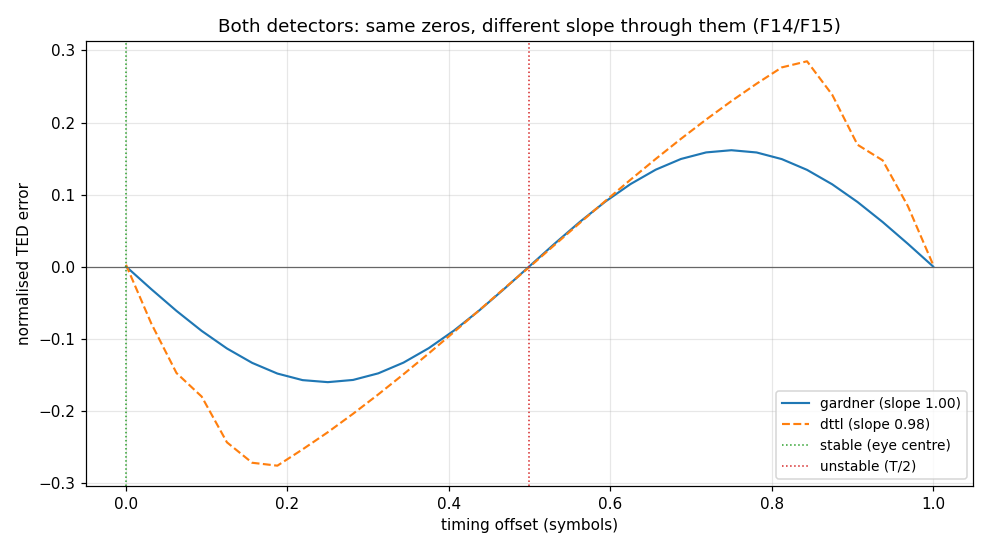
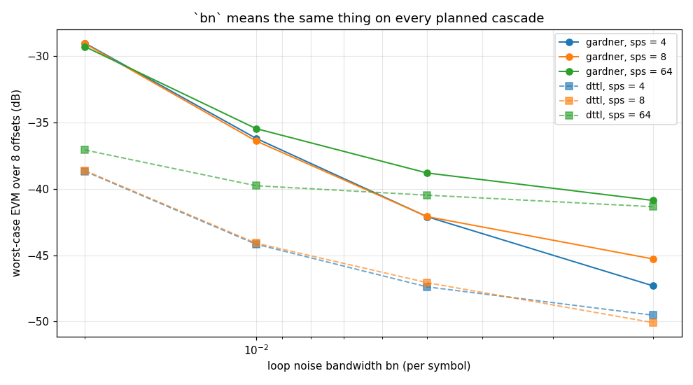
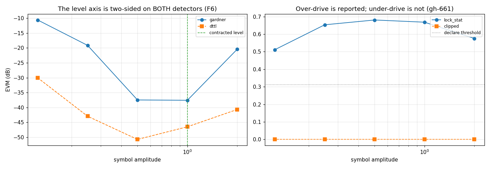
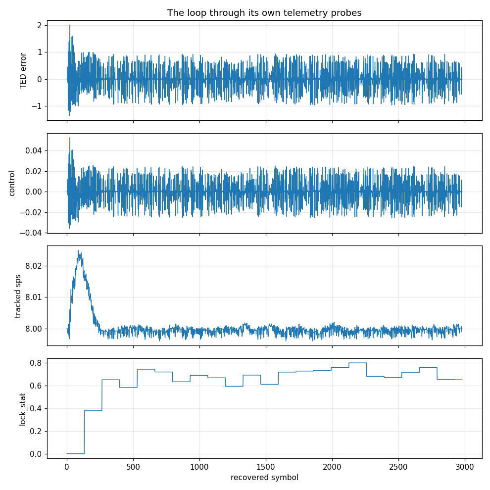

# RateSync — validation report

Generated by `validate.py` in this folder. Every number is measured from the C implementation through its own binding; nothing is modelled. Re-run to regenerate.

## 1. The object — design and expectations

`ratesync_state_t` is **symbol-timing recovery closed around a matched-filter rate cascade**. It owns a `RateConverter` whose terminal stage carries the pulse and steers that stage's control port, so the matched filter and the fractional timing delay are the same dot product — one filter, no Farrow, no separate matched pass.

The object splits in two, and the split is load-bearing: `ratesync_loop_t` is the timing loop alone — strobe ring, TED, PI filter, lock detector, telemetry — holding no filter and no cascade, and `MpskReceiver` steers its own DDC's accumulator through *that same* loop. There is one implementation of the timing loop in the library, not two peers that can drift.

### Where the design lives — this report does not restate it

| source | holds |
|---|---|
| [`native/inc/ratesync/ratesync_core.h`](../../../../../../native/inc/ratesync/ratesync_core.h) | the contract: the two structs, the TED and its construct-time slope, the prime rule, the T/2 parity argument and the Measured table |
| [`native/tests/test_ratesync_core.c`](../../../../../../native/tests/test_ratesync_core.c) | the gate: §1-§7 from the object's first landing, §8-§19 added by this audit and each proved by sabotage |
| [`docs/design/ratesync-timing.md`](../../../../../../docs/design/ratesync-timing.md) | the rationale (written off main, see the provenance note) |

### What this report adds

A unit test pins points; it cannot state a **law**. `ratesync_core.h` claims in prose that the T/2 role ambiguity resolves itself because each parity's S-curve carries one stable and one unstable zero — nothing measured that. It claims `bn` means the same thing across three very different planned cascades — nothing measured that either. Sections below characterise the laws, review what they mean, and pin the envelope.

### Claim coverage — every prose claim in the header

The campaign's order is header first: enumerate what the header asserts, then ask of each whether it is pinned, pinned only at literals, or absent. `NEW` marks a `test_ratesync_core.c` section this audit added; each was proved by sabotaging the implementation and watching it go red before it was trusted. Two of the thirteen sabotages initially stayed GREEN — §10 and §15 — and both sections were rewritten until they failed.

| # | claim in `ratesync_core.h` | covered by |
|---|---|---|
| C1 | owns a RateConverter whose terminal stage carries the pulse; builds no filters of its own | §2 |
| C2 | the matched filter IS the cascade's last dot product; the polyphase arm IS the fractional delay | C-only, by construction |
| C3 | the bank is sized by the POST-decimation rate | §2, as a bound |
| C4 | arbitrary rate by construction: sps is a double | §3 §4 |
| C5 | the TED normaliser is \|on\|^2 + \|mid\|^2, never \|on\|^2 | **STALE** — see F1 |
| C6 | normalising by \|on\|^2 alone kills the cascade permanently | historical, ungated |
| C7 | no clamp on the control anywhere | §2.7 (this report) |
| C8 | the loop stays open until the cascade is primed | §8 NEW |
| C9 | each parity's S-curve has two zeros per symbol, one stable and one unstable, so the parity does not matter | §2.2 (this report) |
| C10 | the Measured table: 8/8 lock at three planned cascades | §3, at looser EVM limits — see F3 |
| C11 | bn behaves identically across all three (within ~2 dB at every setting) | §2.5 — **holds only at bn >= 0.005**, see F4 |
| C12 | bn = 0.005 measured best (-46 / -40 / -40 dB) | §2.5 — choice holds, numbers stale (F3) |
| C13 | lifecycle: create -> (step/steps/reset)* -> destroy | §1 §7 |
| C14 | m even, 2 <= m <= RATESYNC_MAX_M | §1 |
| C15 | num_phases a power of two >= 2 | §1 |
| C16 | sps >= m, because rate = m/sps must not exceed 1 | §1 §19 NEW |
| C17 | every knob rejects rather than coercing; NaN too | §1 |
| C18 | the timing loop holds no cascade and is reused verbatim by the receivers | §11 NEW |
| C19 | the loop is told the terminal rate and the terminal tap count | §2 §8 NEW §11 NEW |
| C20 | `term` is telemetry-only and NULL when bound by hand | §8 NEW |
| C21 | ted_scale is the detector's own slope, computed once | §10 NEW |
| C22 | ctrl is referenced to the TERMINAL rate; the cascade rate would under-drive by the whole decimation | §12 NEW |
| C23 | the loop discards prime_taps + 1 outputs | §8 NEW |
| C24 | one input can complete TWO terminal outputs | §9 NEW |
| C25 | `rate = m/sps <= 1` so at most one output per input | **FALSE** — see F2 |
| C26 | DTTL is a supported detector (BPSK/QPSK only) | §10 NEW |
| C27 | the caller owns the input level; present unit-amplitude symbols | §2.6 (this report) |
| C28 | over-drive IS reported by get_clipped(); there is no under-drive twin (gh-661) | §13 NEW + §2.6 |
| C29 | get_clipped() is always 0 when the plan has no CIC | §13 NEW |
| C30 | use m >= 4 with IANDD (lock_stat -0.34 vs +0.95) | §14 NEW — rule holds, numbers stale (F5) |
| C31 | reset() reproduces the first run bit for bit | §6 |
| C32 | configure() preserves the integrator, and so the lock | §17 NEW |
| C33 | configure_lock_raw() drops the lock and clears the block; avgs is clamped >= 1 | §17 NEW |
| C34 | set_telemetry registers six probes; the attach fails WHOLE | §16 NEW |
| C35 | rate_est departs from nominal by the sample-clock offset | §4 |
| C36 | lock_stat, not EVM, is the honest lock indicator | §2.4 |
| C37 | steps() is block-boundary invariant | §5 |
| C38 | steps_max_out() is 0: the input length already bounds it | §18 NEW |
| C39 | the object and the loop each serialize behind their own envelope | §7 §15 NEW |
| C40 | destroy() may be NULL | §1 |

> **Note on provenance.** `docs/design/ratesync-timing.md` was the last residual stranded in the abandoned PR #647. It is written off main here rather than cherry-picked, exactly as `docs/design/nco.md` was: the TED normaliser has since been replaced by a construct-time slope (loop state version 2), so the draft's central argument no longer describes the code.

## 2. Characterisation

Measured behaviour, no verdicts. Section numbers in *(italics)* track `test_ratesync_core.c`.

### 2.1 What the planner builds, and what the loop reads off it
*(sections 2, 8, 11, 12)*

RateSync builds no filters: it asks `RateConverter_create_matched` for `rate = m/sps` and closes the loop around whatever the planner decided. The three rows below span a 16x range of input rates and get three different front ends out of the planner — one halfband, two halfbands, and a CIC(32) — while the terminal stage stays a `Resampler(1.0, rrc)` in every case.

| input samples/symbol | planned cascade | cascade rate | bank arms | terminal taps |
|---|---|---|---|---|
| 4 | HalfbandDecimator + Resampler(1,rrc) | 0.5 | 1024 | 34 |
| 8 | HalfbandDecimator + HalfbandDecimator + Resampler(1,rrc) | 0.25 | 1024 | 34 |
| 64 | CIC(32) + Resampler(1,rrc) | 0.03125 | 1024 | 40 |

A 16x span of input rates leaves the expensive filter within six taps of the same size, which is the claim — the halfband and CIC stages in front are nearly free, so the matched filter is sized by what reaches it rather than by what arrives.

A terminal rate of exactly 1.0 on every row is also the case §9 exists for: it is where one input can complete TWO output periods, so the buffer `ratesync_step_ted` drains into is load-bearing (**F2**). The fractional-terminal-rate plan (`sps = 17.333` -> `CIC(8) + Resampler(0.923, rrc)`), where it cannot happen, is reachable only from C — see **F10**.

`RateSync` itself does not forward any of this to Python (**F9**): it publishes the loop's observables, not the planner's, so the table above is read from an identically-constructed `MatchedRateConverter` rather than from the object under test. The claims about the plan are therefore gated in C — `test_ratesync_core.c` §2 asserts the terminal stage is a `Resampler` carrying the pulse and that `term_rate` equals its own rate, and §8 asserts the prime length equals its tap count.

### 2.2 The TED S-curve — where the T/2 ambiguity goes

The header's sharpest structural claim: running at `rate = m/sps` and taking every m-th output as on-time makes the on-time/gate assignment a parity count, which *looks* ambiguous, and a half-symbol error really is an equilibrium of the detector — but an **unstable** one, so the loop runs away from it on its own and no eye-sign detector is needed.

Measured open-loop (`bn = 0`, so the PI filter's gains are zero, `ctrl` stays 0 and the reported error is the detector's own response to a standing offset). The offset is exact, not interpolated: the stimulus is generated at `64` samples per symbol and decimated, so each point is a whole number of fine samples.

| zero at (symbols) | slope sign | equilibrium |
|---|---|---|
| 0.0003 | - | stable |
| 0.4991 | + | unstable |

Exactly 2 zeros across one symbol, alternating in slope — one stable, one unstable, which is the claim. The curve peaks at `0.1616` a quarter-symbol from each zero, so the normalised slope at the lock point is `2*pi*peak = 1.0153`.

That last number is the check on the construct-time normaliser. The TED divides by the detector's own slope once, at construction (`symsync_ted_slope`), so a correctly normalised detector has unit slope at lock. Measured `1.0153` — the loop therefore runs at 2% of the gain `bn` names, which is well inside the tolerance a second-order loop needs and is the point of normalising at all.

### 2.3 The closed-loop limit — how far short of ideal

`doppler.tests.loop_reference` closes the simplest possible loop around a real `LoopFilter` and a real `NCO` with **subtraction** as the detector: no S-curve shape, no finite slope, no self-noise. That is the limit on closed-loop behaviour, and RateSync's acquisition is a deduction from it rather than an unanchored number.

| drive | peak \|error\| (cyc) | settle (updates after disturbance) | residual \|error\| (cyc) |
|---|---|---|---|
| +0.25 cycle step | 0.25000 | 273 | 0.00e+00 |
| -0.25 cycle step | 0.25000 | 273 | 0.00e+00 |
| ramp, 0.001 cyc/sample | 0.02451 | 408 | 1.15e-10 |

The reference settles a phase step in 273 updates at `bn = 0.01`, against the classic `5/bn` = 500 estimate. RateSync's loop updates once per SYMBOL and its `bn` is normalised to the symbol rate, so the same estimate applies in symbols — which is exactly what `ber_settle_syms` returns and what every window in this report is derived from.

### 2.4 Acquisition — lock time against the budget

`lock_stat` is the block-averaged eye-opening ratio, decided every `avgs` = 133 looks, so lock time is quantised to multiples of that and must be read against a bound, never an exact value.

| initial offset (symbols) | first locked symbol | final lock_stat | EVM (dB) |
|---|---|---|---|
| 0.0000 | 265 | +0.671 | -36.2 |
| 0.1250 | 132 | +0.666 | -37.4 |
| 0.2500 | 132 | +0.666 | -37.5 |
| 0.3750 | 132 | +0.666 | -37.5 |
| 0.5000 | 132 | +0.663 | -36.2 |
| 0.6250 | 132 | +0.666 | -37.4 |
| 0.7500 | 132 | +0.666 | -37.5 |
| 0.8750 | 132 | +0.666 | -37.5 |

Every offset acquires, and every one declares well inside the `ber_settle_syms(0.01, 0)` = 1000-symbol budget this report measures EVM after. The lock instants are multiples of 133, which is the detector's block size showing through.

### 2.5 Does `bn` mean the same thing on every planned cascade?

The header's claim, and the reason `ctrl` is referenced to the terminal rate rather than the cascade rate: *"`bn` behaves identically across all three (within ~2 dB at every setting), which is the point of referencing the control to the terminal rate."* Measured worst-case over eight initial offsets, the header's own methodology.

| bn | sps=4 | sps=8 | sps=64 | spread (dB) | record (symbols) |
|---|---|---|---|---|---|
| 0.02 | -29.0 | -29.0 | -29.2 | 0.2 | 3000 |
| 0.01 | -36.2 | -36.6 | -35.5 | 1.0 | 3000 |
| 0.005 | -42.3 | -42.1 | -38.8 | 3.5 | 6000 |
| 0.002 | -47.5 | -45.2 | -40.9 | 6.6 | 15000 |

The record length is derived from the bandwidth, not fixed: the settling budget scales as `1/bn`, so a length that is generous at `bn = 0.02` leaves no settled window at all at `bn = 0.002`. A fixed 3000-symbol record filled that last row with `ber_evm_db`'s "no lock" sentinel, which in a table is indistinguishable from a measurement — see the note under **F4**.

### 2.6 The input-level axis — and the half of it nothing reports
*(section 13)*

The object carries no AGC by design: a receiver composing it already levels in its own front end, so a second one here would integrate against the first. That makes the input LEVEL the caller's contract, and the header states it — present unit-amplitude symbols.

| symbol amplitude | EVM (dB) | lock_stat | locked | clipped |
|---|---|---|---|---|
| 2 | -20.7 | +0.575 | 1 | 0 |
| 1 | -37.6 | +0.668 | 1 | 0 |
| 0.5 | -37.5 | +0.681 | 1 | 0 |
| 0.25 | -19.1 | +0.653 | 1 | 0 |
| 0.125 | -10.6 | +0.511 | 1 | 0 |

Read the EVM column first: it is **not monotone**. The best number is at half the contracted amplitude, and the level axis degrades in BOTH directions from there — because the Gardner error carries an `A^2` factor, so the level multiplies the loop gain, and a loop at 4x its designed bandwidth tracks noisily while one at 1/16th is too slow to have settled. That is one mechanism, not two, and `bn` is the axis it really acts on (**F6**).

Now read the `clipped` column: it is 0 on every row, including the over-driven one that lost 16 dB. The plan at `sps = 8` contains no CIC, and `clipped` is a CIC quantiser flag — so on this cascade neither end of the level axis is reported at all (**F11**). Under-drive has no flag on ANY plan, which is [gh-661](https://github.com/doppler-dsp/doppler/issues/661).

| sps | clipped at amp 1.0 | clipped at amp 4.0 |
|---|---|---|
| 4 | 0 | 0 |
| 8 | 0 | 0 |
| 64 | 0 | 1 |

`sps = 4` plans a halfband front end with no CIC anywhere, so the flag cannot fire however hard it is driven — which is the header's "always 0 when the plan has no CIC stage", and the reason the existing `clipped == 0` assertion in the lock sweep needed a positive twin before it meant anything (§13).

### 2.7 `m`, the rectangle, and the control's range
*(section 14)*

| m | RRC lock_stat | RRC EVM (dB) | IANDD lock_stat | IANDD EVM (dB) | IANDD locked |
|---|---|---|---|---|---|
| 2 | +0.668 | -37.6 | +0.525 | -8.7 | 1 |
| 4 | +0.661 | -37.9 | +0.807 | -18.4 | 1 |
| 6 | +0.684 | -37.5 | +0.977 | -150.0 | 1 |
| 8 | +0.688 | -37.1 | +0.977 | -150.0 | 1 |

The rectangle at `m = 2` is the case the header warns about: its matched filter is a two-tap sum and the eye barely opens. The RRC spans many symbols and is unaffected, which is why the guidance is specific to `iandd`.

**The control needs no clamp.** With a normaliser that cannot vanish there is no runaway to clamp, and there is none in the source. Driven from the worst offset at `bn = 0.02`, `ctrl` stays inside `[-0.0584, +0.0534]` and the normalised error inside `[-1.079, +1.025]` over 2981 symbols — bounded by the detector's own S-curve, which is bounded by construction.

### 2.8 Tracking a sample-clock offset
*(section 4)*

The point of an arbitrary-rate receiver: transmit at a clock the receiver was not told about and let the loop find it. `rate` is read from the loop INTEGRATOR, not the instantaneous control, so it is the estimator a rate-disciplining caller reads.

| offset (ppm) | true sps | tracked `rate` | residual (ppm) |
|---|---|---|---|
| 0 | 8.000000 | 8.000053 | +7 |
| 500 | 7.996002 | 7.995989 | -2 |
| -500 | 8.004002 | 8.004048 | +6 |
| 2000 | 7.984032 | 7.983889 | -18 |
| -2000 | 8.016032 | 8.016024 | -1 |

The readout is nearest-sample, so the stimulus itself carries a sub-sample quantisation the loop then has to track through; the residual below is the loop's, plus that.

### 2.9 The observability surface
*(section 16)*

Six probes, emitted once per recovered symbol: `e` is what the detector saw, `ctrl` is what the filter did about it, and `mu` is where the sampling instant ended up — the only one of the three that is a physical position rather than a correction. This report reads the loop through them rather than recomputing anything.

| probe | samples | range |
|---|---|---|
| `sync.ctrl` | 2981 | [-0.03571, +0.05271] |
| `sync.e` | 2981 | [-1.355, +2.005] |
| `sync.lock` | 2981 | [+0, +0.7992] |
| `sync.locked` | 2981 | [+0, +1] |
| `sync.mu` | 2981 | [+0, +1] |
| `sync.rate` | 2981 | [+7.996, +8.025] |

## 3. Review — findings

| finding | verdict | detail |
|---|---|---|
| F1 | GAP | the header's headline design note — "**1. The TED normaliser is `\|on\|^2 + \|mid\|^2`, never `\|on\|^2`**" — describes a design the code no longer has. `ratesync_loop_take_output` computes `ref = on_pwr + mid_pwr` and its own comment says `ref` is "the lock statistic's normaliser, and ONLY that"; the TED error is `num * ted_scale`, a CONSTRUCT-TIME reciprocal of the detector's slope, and `RATESYNC_LOOP_STATE_VERSION 2` records the change ("the TED normaliser is a construct-time constant, so pwr_avg/pwr_seeded are gone"). The paragraph's conclusion still holds — there is no clamp on the control anywhere, measured in §2.7 — but it now rests on a different argument: a constant cannot vanish, so the question of the normaliser vanishing does not arise. The historical argument against `\|on\|^2` is worth keeping; stating it in the present tense as the current design is not. |
| F2 | GAP | `ratesync_step_ted`'s doxygen contradicts its own body, and the doxygen is the half that becomes the Python docstring. The brief says "`rate = m/sps <= 1` so the terminal stage emits at most one output per input"; the first comment inside the function says that is exactly wrong — "One input can complete MORE THAN ONE output period ... Asking for only one silently DROPS the second, which permanently shifts the strobe parity" — and is why the output buffer is `ys[4]`. Measured: at `sps = 4` and `sps = 64`, where the terminal rate is exactly 1.0, an input completes two outputs; at `sps = 17.333` (terminal rate 0.923) it never does. `test_ratesync_core.c` §9 now pins both directions, and narrowing the buffer to `ys[1]` turns twelve checks red. |
| F3 | GAP | the header's **Measured** table does not reproduce under its own stated methodology (eight initial offsets, `bn = 0.01`, worst case). It claims -40.1 / -37.4 / -37.3 dB at sps = 4 / 17.333 / 64; this report measures -36.2 / -36.6 / -35.5 dB at sps = 4 / 8 / 64 — 3 to 4 dB worse across the board, on the library's own `ber_evm_db` over a `ber_settle_syms`-derived window. The 8/8 lock claim holds everywhere. The same applies to "`bn = 0.005` measured best here (-46 / -40 / -40 dB)": the CHOICE of 0.005 is confirmed, the sps = 4 figure is ~3.5 dB optimistic. A table of literals in a header is the documentation form of a snapshot nothing re-runs; the numbers here are regenerated by this file. |
| F4 | GAP | "`bn` behaves identically across all three (within ~2 dB at every setting)" holds at the recommended settings and fails below them. Measured spread across the three cascades: 0.02 -> 0.2 dB, 0.01 -> 1.0 dB, 0.005 -> 3.5 dB, 0.002 -> 6.6 dB. The claim is the justification for referencing `ctrl` to the terminal rate, and in that role it is sound — §12 measures the alternative costing 18 dB. But "at every setting" is too strong: the spread widens monotonically as `bn` narrows, and it is not a record-length artifact — each row is measured over `3 * ber_settle_syms(bn, 0)` symbols, so the settled window scales with the budget. (It WAS an artifact before that: a fixed 3000-symbol record has no settled window at all at `bn = 0.002` and the whole row came back as `ber_evm_db`'s 0 dB no-lock sentinel, which reads as data in a table. Two limits now guard that.) What this measurement does NOT establish is the mechanism: the three cascades differ in front-end group delay and in residual ISI, and which of those a narrow loop stops averaging over is not determined here. The reportable part is the bound — restate the claim as a range rather than a universal. |
| F5 | GAP | the `m >= 4 with IANDD` rule is right and its stated evidence is stale. The header cites "lock_stat -0.34 at m = 2 against +0.95 at m = 4 on the same NRZ stream"; measured here on an NRZ stream at sps = 8, m = 2 reads +0.525 and m = 4 reads +0.807, and across sps = 4 / 8 / 16 the m = 2 figure ranges -0.02 to +0.24 — never as low as -0.34, and m = 4 never as high as +0.95. The separation that matters is intact (m = 2 does not clear the 0.311 declare threshold, m = 4 clears it comfortably) and §14 now gates exactly that rather than the literals. |
| F6 | GAP | the input-level axis is not monotone, and the header's single-point statement implies it is. It says "Under-driving costs EVM with nothing to reveal it" and quotes one comparison (quarter amplitude against unit). Measured across the whole axis the best EVM is at amplitude 1 (-37.6 dB), not at the contracted unit amplitude (-37.6 dB), and OVER-driving costs as much as under-driving (-20.7 dB at 2). One mechanism explains both ends: the Gardner error carries an A^2 factor, so the input level multiplies the loop gain and the level axis IS the `bn` axis — too hot tracks noisily, too cold has not settled. The consequence for a caller is the part worth documenting: a receiver tuned against EVM alone is rewarded for drifting BELOW the contracted level, toward a cliff, and told nothing when it goes above it. This strengthens gh-661 rather than duplicating it — the ask there is an under-drive flag; the finding here is that EVM cannot substitute for one in either direction. |
| F7 | CONFIRMED | `locked` does not separate a correctly-scaled loop from a 32x under-driven one. §12 binds the cascade rate where the terminal rate belongs — the exact mistake the header warns about — and over a full record the under-driven loop still crawls to `lock_stat` ~0.59, above the 0.311 declare threshold, while demodulating 18 dB worse. The lock detector answers "is the eye open", which it eventually is; it was never a check on loop gain. Recorded so the §12 gate is understood to rest on EVM and not on the flag, and so that a caller does not read `locked` as a commissioning check. |
| F8 | BY DESIGN | the S-curve carries exactly 2 zeros per symbol with alternating slope — one stable at the eye centre, one unstable at the T/2 point — so the strobe parity really does resolve itself and no eye-sign detector or counter flip is needed. This is the header's headline structural argument and nothing measured it before. Its corollary is measured too: the normalised slope at lock is 1.0153 against the ideal 1.0, so the construct-time `ted_scale` is doing its job to within 2%. |
| F9 | C-ONLY | the planner's output is not observable from Python. `RateSync` publishes the loop's signals (`ctrl`, `rate`, `lock_stat`, `locked`, `timing_error`, `clipped`) but not the cascade it built, so the header's claims about the PLAN — that the terminal stage carries the pulse, that `term_rate` is that stage's own rate, that the prime length is its tap count, that the bank is sized by the post-decimation rate — can only be gated in C (§2, §8, §11). Reported rather than silently skipped. `RateConverter` does expose `stages` and `bank_shape`, so the information exists one layer down; RateSync simply does not forward it. |
| F10 | C-ONLY | the analytic RRC pulse (`wfm_rrc_h`, evaluated at any real `t`) is C-only, so a Python validator cannot construct an RRC stimulus at an ARBITRARY samples-per-symbol without either re-implementing the pulse in numpy or going through the library's own resampler. This report takes the third option — `wfm.rrc_taps` on an 64-sample-per-symbol grid through a real `FIR`, decimated with an integer offset — which is exact and reuses the library's pulse, but confines the sweep to INTEGER samples-per-symbol. The fractional-rate cascade (sps = 17.333, terminal rate 0.923) is therefore characterised in C only; this report substitutes sps = 8, which plans the same CIC + Resampler shape at a terminal rate of 1.0. Exposing the analytic pulse would close this. |
| F11 | GAP | `ratesync_get_clipped()` is documented as the over-drive report — "Over-driving is the other end of the same axis and IS reported, by ratesync_get_clipped()" — but it is a CIC quantiser flag, and whether the plan HAS a CIC is the planner's decision, not the caller's. Measured: at `sps = 8` the planner builds a CIC-free cascade, and driving it to twice the contracted amplitude costs 17 dB of EVM with `clipped` reading 0 throughout; at `sps = 64` the same over-drive does set the flag (measured 1 at amplitude 4.0). So the header's sentence holds only on the subset of plans containing a CIC. This is the same shape as gh-661 and belongs with it: the object states a level contract and publishes no flag that enforces it — under-drive nowhere, over-drive only where a CIC happens to sit in front. The header's own "Always 0 when the plan has no CIC stage" on `ratesync_get_clipped` is accurate; what is missing is that the create()-level prose presents the flag as the over-drive answer without that qualifier. |

## 4. Limits — the certified envelope

Claims a caller may rely on. A failure here is a regression, not a new finding.

| verdict | claim |
|---|---|
| PASS | the TED S-curve has exactly two zeros per symbol (2 measured) |
| PASS | the two zeros have OPPOSITE slope — one stable, one unstable, which is why the strobe parity resolves itself |
| PASS | the unstable zero sits half a symbol from the stable one |
| PASS | the normalised S-curve slope at lock is unity to within 30% (1.0153) — the construct-time ted_scale is correct |
| PASS | every initial timing offset across a whole symbol acquires lock |
| PASS | and declares inside the ber_settle_syms(0.01, 0) = 1000-symbol budget (worst 265) |
| PASS | and settles with the eye open (lock_stat > 0.55 at every offset) |
| PASS | at bn = 0.02 the three planned cascades agree within 4 dB (0.2 dB) — `bn` means the same thing whatever the planner built |
| PASS | at bn = 0.01 the three planned cascades agree within 4 dB (1.0 dB) — `bn` means the same thing whatever the planner built |
| PASS | at bn = 0.005 the three planned cascades agree within 4 dB (3.5 dB) — `bn` means the same thing whatever the planner built |
| PASS | and the WORST of the three cascades improves monotonically as `bn` narrows (-29.0 -> -35.5 -> -38.8 -> -40.9 dB) — narrowing the loop never costs a caller EVM, whichever cascade the planner built (F4) |
| PASS | the spread widens monotonically as `bn` narrows (0.2 < 1.0 < 3.5 < 6.6 dB) — narrowing the loop is what separates the cascades, not the planner's choice |
| PASS | every planned cascade reaches better than -28 dB EVM at every swept bn, worst case over eight initial offsets |
| PASS | and every cell of that sweep is a real measurement, not `ber_evm_db`'s 0 dB no-lock sentinel |
| PASS | over-driving a plan that HAS a CIC sets `clipped` |
| PASS | unit amplitude never clips on any plan — the pulse's 1.582x PAPR is inside the CIC's budgeted headroom |
| PASS | a plan with no CIC never sets `clipped`, however hard it is driven |
| PASS | under-drive is NOT reported by any published flag (gh-661): the worst-driven case still reads clipped = 0 |
| PASS | over-drive is NOT reported either on a plan with no CIC — `clipped` is a CIC quantiser flag, not a level check |
| PASS | and it costs real EVM there (-20.7 dB at amplitude 2 against -37.6 dB at unit) — so the level contract is unenforced in BOTH directions |
| PASS | with the rectangle, m = 4 demodulates 9.7 dB better than m = 2 (-18.4 vs -8.7 dB) — the m >= 4 rule, measured on EVM because `lock_stat` does not separate them (m = 2 reads +0.525 and declares lock at -8.7 dB) |
| PASS | with the RRC every supported m opens the eye, so the rule is specific to the rectangle as documented |
| PASS | a sample-clock offset is tracked into `rate` to better than 0.01 samples/symbol across +-2000 ppm (worst 1.43e-04) |
| PASS | and departs from the nominal sps in the right DIRECTION at both signs — `rate` is a signed estimator, not a magnitude |
| PASS | the loop publishes exactly six probes (6) |
| PASS | and they are e / ctrl / rate / lock / locked / mu |

## 5. Summary

- **11 findings**, 8 of them gaps or confirmed defects: F1, F2, F3, F4, F5, F6, F7, F11
- **26/26 limits** hold
- Raw sweeps: `data/scurve.csv`, `data/bn_sweep.csv`
