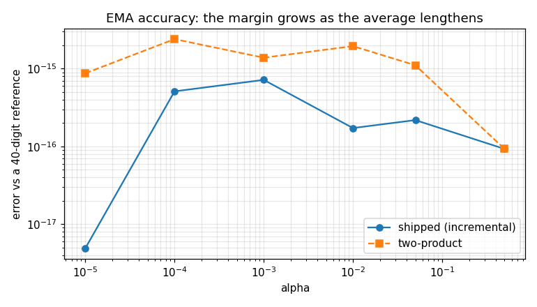
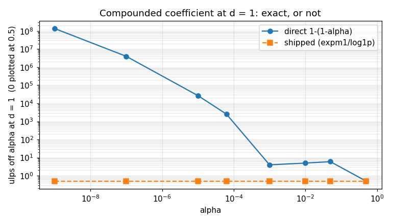

# EMA — validation report

*Generated by `validate.py`. Do not hand-edit.*

## 1. The object

A first-order exponential moving average: `state + alpha * (x - state)`, the running average every estimator in the library is built on. It is one function because it was four — a power detector, a lock statistic, a spectrum accumulator and the recursion `det_ema_alpha` sizes — written in two different algebraic forms that are identical on paper and not in floating point.

Design and API, not restated here:

- `native/inc/util/util_core.h` — the SSOT for every claim below (`ema_step`, `ema_alpha_decim`)
- `native/tests/test_util_core.c` §1-§8 — the C certification
- [EMA design](../../../../../../docs/design/ema.md) — why this algebraic form, why the boundaries are contract, and why an EMA is not a loop filter
- `doppler.util.ema_step` / `ema_alpha_decim` — measured below

### Claim coverage — every prose claim in the header

The campaign's order is header first: enumerate what the header asserts, then ask of each whether it is pinned in C, and only then measure it through the binding. `NEW` marks a law this report establishes that no C assertion covers — both are statistical properties of a long run, not of one step.

| # | claim in `util_core.h` | C section | here |
|---|---|---|---|
| C1 | the recursion is `state + alpha*(x - state)` | §4 | §2.1 |
| C2 | more accurate than the two-product form, by a margin that grows as alpha shrinks | — | §2.1 (NEW) |
| C3 | `alpha == 1` is EXACT pass-through | §1 | §2.2 |
| C4 | `alpha == 0` EXACTLY freezes the state | §2 | §2.2 |
| C5 | the fixed point does not move, at any alpha | §3 | §2.2 |
| C6 | the step never passes the observation | §4 | §2.2 |
| C7 | `alpha > 1` saturates to pass-through | §5 | §2.2 |
| C8 | NOT total in `x`: a non-finite observation poisons the state | — | §3 F3, by design |
| C9 | `ema_alpha_decim` returns `1-(1-alpha)^d` | §7 | §2.4 |
| C10 | at `d == 1` it returns alpha EXACTLY | §6 | §2.3 |
| C11 | `expm1`/`log1p` avoids the cancellation the direct form has | §6 | §2.3 |
| C12 | the result stays in [0, 1] and is non-decreasing in d | §8 | §2.4 |
| C13 | noise reduction is `(2-alpha)/alpha` | — | §2.5 (NEW) |
| C14 | the memory is `-1/ln(1-alpha)` observations | — | §2.6 (NEW) |

**What Python cannot reach.** Nothing, unusually — both functions are module-level and fully exposed. The one C-only property is structural rather than behavioural and is recorded as §3 F6: every C caller inlines the header definition while this report exercises the single out-of-line copy the `extern inline` translation unit emits, and it is the C99 idiom rather than a test that makes those the same source.

## 2. Characterisation

Measured, no verdicts — those are §3. Each heading names the C section it tracks; the numbering here is this report's own, because a section routinely merges several C ones.

### 2.1 The two algebraic forms, scored on accuracy (C §4)

Both forms run over the same 2000-sample random stream and are scored against a 40-digit reference computed from neither of them. This is the measurement the design's choice of form rests on, so it is reported as a comparison, never as a bare number.

| alpha | shipped (incremental) | two-product | ratio |
|---|---|---|---|
| 1e-05 | 4.90e-18 | 8.72e-16 | 178.0x |
| 0.0001 | 5.11e-16 | 2.40e-15 | 4.7x |
| 0.001 | 7.17e-16 | 1.38e-15 | 1.9x |
| 0.01 | 1.72e-16 | 1.95e-15 | 11.3x |
| 0.05 | 2.18e-16 | 1.11e-15 | 5.1x |
| 0.5 | 9.29e-17 | 9.29e-17 | 1.0x |

The shipped form is the more accurate one across the range, and the margin widens as the average lengthens — which is the direction every narrow-band estimator moves. The mechanism is structural: the incremental form adds a small correction to a large state, so the large quantity is never re-rounded.

### 2.2 The boundaries are exact, not merely close (C §1-§5)

| boundary | shipped | unguarded recursion |
|---|---|---|
| `alpha = 1` returns x exactly | 121/121 | 107/121 |
| `alpha = 0` returns state exactly | 121/121 | — |
| fixed point does not move | 55/55 | — |
| step never passes the observation | 363/363 | — |
| `alpha > 1` saturates | yes | — |

`alpha = 1` is the case that separates the two forms: the unguarded recursion misses it on 14 of 121 pairs here, and `det_ema_alpha(0, 0)` returns exactly 1.0, so it is a coefficient callers really pass.

### 2.3 The compounded coefficient at `d = 1` (C §6)

The property that makes a decimated path comparable to an undecimated one: the chunk coefficient for a chunk of one sample must be the per-sample coefficient itself. Scored in ulps, because a relative error hides how many representable values lie between.

| alpha | direct `1-(1-alpha)`, ulps off | shipped, ulps off |
|---|---|---|
| 1e-09 | 136763029 | 0 |
| 1e-07 | 3977032 | 0 |
| 1e-05 | 26865 | 0 |
| 6.25e-05 | 2556 | 0 |
| 0.001 | 4 | 0 |
| 0.01 | 5 | 0 |
| 0.05 | 6 | 0 |
| 0.5 | 0 | 0 |

The direct form's error grows without bound as the average lengthens; the shipped form is exact at every coefficient tried. `agc_steps` now forms its detector pole with `ema_alpha_decim` and therefore sits in the right-hand column — §3 F2, fixed.

### 2.4 Compounding is exact, not approximate (C §7, §8)

`d` steps of `alpha` must equal one step of `ema_alpha_decim(alpha, d)`. This is what *decimation does not retune the loop* means.

| alpha | d | \|per-sample − chunked\| |
|---|---|---|
| 0.0001 | 2 | 0.0e+00 |
| 0.0001 | 8 | 2.2e-19 |
| 0.0001 | 32 | 4.3e-19 |
| 0.0001 | 128 | 1.7e-18 |
| 0.001 | 2 | 0.0e+00 |
| 0.001 | 8 | 0.0e+00 |
| 0.001 | 32 | 6.9e-18 |
| 0.001 | 128 | 2.8e-17 |
| 0.01 | 2 | 0.0e+00 |
| 0.01 | 8 | 0.0e+00 |
| 0.01 | 32 | 5.6e-17 |
| 0.01 | 128 | 1.1e-16 |
| 0.05 | 2 | 0.0e+00 |
| 0.05 | 8 | 0.0e+00 |
| 0.05 | 32 | 0.0e+00 |
| 0.05 | 128 | 0.0e+00 |

Across the same coefficients the compounded value stays in [0, 1] (yes) and is non-decreasing in `d` (yes) — a longer chunk moves the average further, never less far, and never past its observation.

### 2.5 Noise reduction — the law `det_ema_alpha` inverts (NEW)

For a white input of variance `s2`, the converged output variance is `s2 * alpha/(2 - alpha)`, so the estimator's SNR improves by `(2 - alpha)/alpha`. `det_ema_alpha` in `detection_core.h` **inverts exactly this law** to size a coefficient for a requested estimator SNR — so the law is already load-bearing, and nothing checked the EMA delivered it. No C section covers it: it is a property of a long run, not of one step.

| alpha | measured var | predicted `a/(2-a)` | ratio |
|---|---|---|---|
| 0.001 | 0.00051 | 0.00050 | 1.021 |
| 0.01 | 0.00498 | 0.00503 | 0.990 |
| 0.05 | 0.02561 | 0.02564 | 0.999 |
| 0.2 | 0.10993 | 0.11111 | 0.989 |

### 2.6 Memory — samples to the `1/e` point (NEW)

From a cold start against a constant input of 1, the state is `1-(1-alpha)^n`, so it clears `1 - 1/e` once `n >= -1/ln(1-alpha)`. The continuous constant is what a caller budgets a warm-up from; the sample the state *actually* crosses on is its **ceiling**, and that is an exact discrete claim rather than a tolerance. Like §2.5 this is a run-length property with no C section.

This section was first written scoring the crossing against the continuous constant within 2%, and that limit FAILED at alpha 0.5 — measured 2 against 1.44, a 39% miss. The law was not wrong; the claim was, because a crossing is an integer and at alpha 0.5 the quantisation IS the quantity. Recorded rather than quietly re-toleranced: the fix was a stronger claim, not a looser one.

| alpha | measured n | `-1/ln(1-alpha)` | its ceiling | exact? |
|---|---|---|---|---|
| 0.001 | 1000 | 999.50 | 1000 | yes |
| 0.01 | 100 | 99.50 | 100 | yes |
| 0.05 | 20 | 19.50 | 20 | yes |
| 0.5 | 2 | 1.44 | 2 | yes |

## 3. Review

Findings, with verdicts. Limits are section 4.

- **F1 · FIXED** — Every historical call site now calls the shared primitive: `acc_trace_core.c`, `agc_core.c`, `async_dsss_receiver_core.c`. So the properties below are statements about the library's behaviour and not only about `ema_step` — which is what this finding existed to deny until it was true. (`det_ema_alpha` sizes the recursion and never runs it, so there was nothing there to migrate.) Verdict READ from those files rather than asserted here, so it cannot outlive the state it describes.

- **F2 · FIXED** — `agc_steps` forms its detector pole with `ema_alpha_decim`, so `decim = 1` is now bit-for-bit the undecimated recursion. It previously used a repeated multiply of `(1 - alpha)`, off by up to 136763029 ulps at d == 1 across the coefficients §2.3 sweeps. Note what this did NOT buy: `agc_steps(decim=1)` and `agc_step` still differ, because the two apply GAIN differently (a first-order-hold ramp across the chunk against a per-period refresh) — the pole was never that gap's cause. Verdict READ from `agc_core.c`.

- **F3 · BY DESIGN** — `ema_step` is not total in `x`: a non-finite observation poisons the state permanently, and there is no guard. That is the same decision `saturate` exists to serve — an EMA remembers, so its input is the boundary where an untrusted value first becomes persistent state, and one guard there makes the whole downstream chain total where a clamp at each stage is several chances to miss one. The caller places it because only the caller knows which end is safe. The AGC's history is the argument: one non-finite sample destroyed its loop permanently, and the fix was a single `saturate` at the detector's input, not a defensive recursion.

- **F4 · BY DESIGN** — A coefficient above 1 saturates to pass-through rather than applying the bare recursion, which would fly past the observation and oscillate outward. It is a caller error either way; saturating makes the worst case 'no averaging', which is wrong but stable, instead of a diverging estimator.

- **F5 · BY DESIGN** — Two expectations about the two-product form did not survive measurement, and are recorded because the reasoning that produced them is tempting: it does NOT drift off its fixed point (both forms return the state exactly when handed their own value), and it is exact at alpha = 0. So §2.2's freeze and fixed-point rows pin a floor BOTH forms meet — they are not the argument for the shipped one. The argument is §2.1's accuracy margin and the `alpha = 1` row.

- **F6 · C-ONLY** — Every C caller inlines the header definition, while this report exercises the single out-of-line copy emitted by `native/src/util/ema_step.c`. Those are the same source by construction — the C99 `extern inline` idiom, where the translation unit declares rather than redefines — so they cannot drift. Worth naming because the sibling `square_clip.c` does NOT follow it: it carries a hand-copied second body, so the function C inlines and the function Python calls are two pieces of source kept in agreement by hand. That is the duplication this primitive exists to end, and it is still present next door.

## 4. Limits

Claims a caller may rely on. A failure here is a regression, not a new finding.

## 5. Summary

- **6 findings**, 0 of them gaps or confirmed defects — none left
- **15/15 limits** hold
- Raw sweeps: `data/accuracy.csv`, `data/decim_d1.csv`, `data/noise_reduction.csv`
