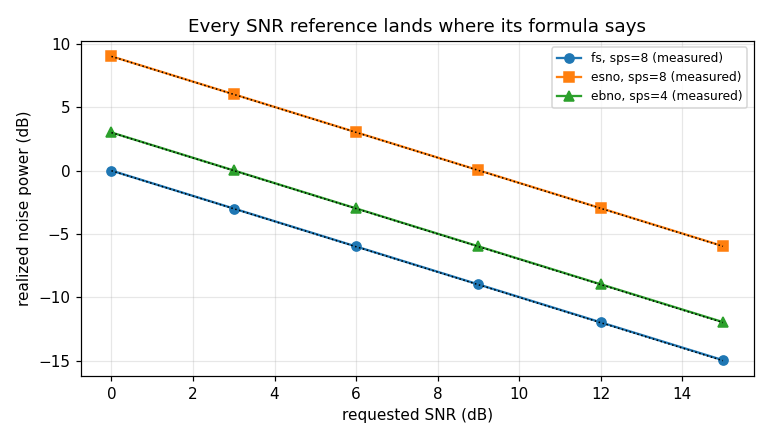
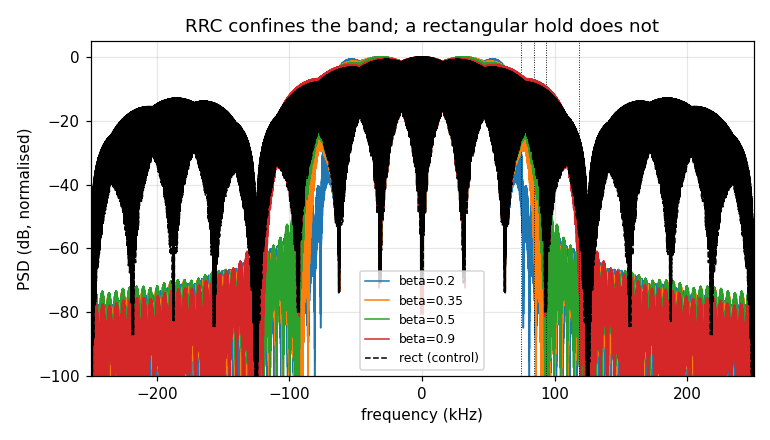
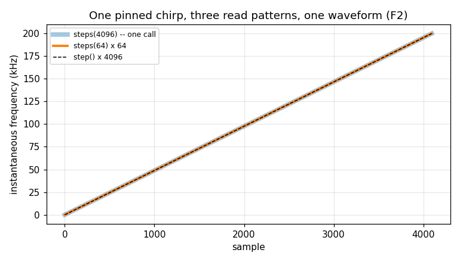

# Synth — validation report

Generated by `validate.py` in this folder. Every number is measured from the C implementation through its own binding; nothing is modelled. Re-run to regenerate.

## Executive summary

- **Status.** **CERTIFIED** — all 20 limits hold.
- **Findings.** 6 recorded, 1 still open: F5.

**What a caller most needs to know**

- **A chirp's span is declared, never read off the caller.** Pinned, it is one waveform however it is read -- one call, step() or 64-sample blocks, bit for bit. A standalone `Synth` that sweeps must say `span=` and raises without it; a `Segment` lends its `num_samples` (§2.6, F2, gh-1115).
- **The SNR you ask for is the SNR you get, in all three references.** Realized noise power tracks `snr [+10log10(bps)] -10log10(span)` to 0.20% across a 15 dB sweep -- but `esno` and `ebno` differ by 10log10(bps), so on QPSK they are 3.01 dB apart. Name the reference (§2.4).
- **`snr >= 100` is a cost switch, not an accuracy one.** It builds no AWGN child at all; one tenth of a dB below, it does. The samples on either side are indistinguishable in float32, so the boundary shows up as 387 vs 83 bytes of state, not as visible noise (§2.4).
- **Pass `rrc_taps()` output raw.** The sqrt(sps) scaling is internal and delivers unit power to 0.05% on both shaping branches, so an SNR set before shaping still means what it said. The filter confines all but 0.0014% of the power to (1+beta)*Rs, against 12.6% leaking past the same edge unshaped (§2.5).
- **Every type is safe to chunk.** step() equals steps(), a block read is independent of block size and a mid-stream state hand-off resumes bit-for-bit on all nine -- which is what lets a render be split across calls, threads or processes (§2.7, §2.8).
- **The evidence is younger than the object.** The SNR conversion the header calls its single source of truth, four more public entry points and all ten accessors were tested by nothing until this certification; the chirp defect had been reachable from the public API the whole time (F1, F2, F3).

## 1. The object

`Synth` is the bottom of the wfmgen ladder: one streaming source that combines a symbol generator, a carrier and additive noise, and that every `Segment`, `Timeline` and `Composer` above it is built out of. The design is [docs/design/wfmgen.md](../../../../../../docs/design/wfmgen.md); the API is `native/inc/wfm_synth/wfm_synth_core.h`, certified in C by `native/tests/test_wfm_synth_core.c`. Neither is restated here.

Measured through `doppler.wfm._SynthEngine`, the raw engine. The public `Synth` is a thin declarative wrapper over the same core, so a property proven here holds for the ladder above it. The wrapper adds one rule of its own: a standalone sweeping chirp must declare its `span`, because it has no segment to lend one (F2).

## 2. Characterisation

Measured behaviour, no verdicts. Each heading names the C section it tracks where there is one; the numbering is this report's own.

### 2.1 The nine waveform types (C §create)

What each type emits, and the truth it is scored against. Nothing here is a verdict -- the numbers are in the sections that follow.

| type | mean power | peak \|y\| | all finite |
|---|---|---|---|
| tone | 1.0000 | 1.0000 | yes |
| noise | 0.9703 | 2.9433 | yes |
| pn | 1.0000 | 1.0000 | yes |
| bpsk | 1.0000 | 1.0000 | yes |
| qpsk | 1.0000 | 1.0000 | yes |
| chirp | 1.0000 | 1.0000 | yes |
| bits | 1.0000 | 1.0000 | yes |
| symbols | 0.8750 | 1.0000 | yes |
| dsss | 1.0000 | 1.0000 | yes |

Every type produces finite samples at a sane level. `noise` sits at unit power by construction (the amplitude is 1/sqrt(2) per component); `tone` is exactly 1; the modulated types are 1 because their constellations are unit-modulus, which is what makes the SNR reference in §2.4 mean what it says.

### 2.2 The PN is a maximal-length sequence (C §create)

The header says `pn_length` gives period 2^n - 1 and that poly 0 looks up the canonical MLS polynomial. The check is the defining property of an m-sequence rather than a comparison against another doppler component: its periodic autocorrelation is exactly `-1/L` at EVERY non-zero lag. A sequence that is merely pseudo-random would not be, and a wrong tap polynomial gives a shorter period whose autocorrelation shows a second peak.

| n | L = 2^n-1 | peak | off-peak max | off-peak min | ideal |
|---|---|---|---|---|---|
| 7 | 127 | +1.000000 | -0.007874 | -0.007874 | -0.007874 |
| 9 | 511 | +1.000000 | -0.001957 | -0.001957 | -0.001957 |
| 11 | 2047 | +1.000000 | -0.000489 | -0.000489 | -0.000489 |

Every off-peak lag equals `-1/L` to 1e-9, at all three register lengths -- the sequence is maximal-length, not approximately so.

### 2.3 The constellation, and the Gray label (C §bits map)

QPSK emits exactly 4 distinct points, every one of unit modulus to 3.09e-07 -- so the Es/No reference in §2.4 is referred to a genuinely unit-power symbol.

The header is emphatic that one bits->symbol map serves every order, because a private QPSK copy once put b0 on the I sign and b1 on the Q sign: the same four points, two labels exchanged, which scores about half the bits wrong on a working receiver and produces no visibly odd waveform. `mpsk_constellation` is not bound in Python, so the identity is certified in C. What Python can check is the property that makes the map worth having, and it needs no reference implementation: **adjacent labels differ in exactly one bit.**

| bits (MSB first) | I | Q |
|---|---|---|
| 00 | +0.7071 | +0.7071 |
| 01 | -0.7071 | +0.7071 |
| 10 | +0.7071 | -0.7071 |
| 11 | -0.7071 | -0.7071 |

Walking the labels in Gray order -- 00, 01, 11, 10 -- steps a quarter turn each time, so a symbol error between neighbours costs one bit, not two.

### 2.4 The SNR contract (C §A, §B)

The one piece of arithmetic in this object whose failure is silent: get it wrong and the waveform is still a waveform, at an SNR nobody asked for. Three references -- `fs`, `esno`, `ebno` -- and the conversion to noise power over the full rate is `snr_fs = snr [+ 10log10(bps)] - 10log10(span)`.

Scored against that formula evaluated in numpy, never against the library's own converter. The signal is unit power in every case, so the expected total is `1 + 10^(-snr_fs/10)` and the residual is the noise placement alone.

| type | mode | sps | snr dB | measured P | expected P | rel |
|---|---|---|---|---|---|---|
| tone | fs | 8 | 0.0 | 2.0026 | 2.0000 | 0.129% |
| tone | fs | 8 | 3.0 | 1.5027 | 1.5012 | 0.100% |
| tone | fs | 8 | 6.0 | 1.2521 | 1.2512 | 0.072% |
| tone | fs | 8 | 9.0 | 1.1265 | 1.1259 | 0.050% |
| tone | fs | 8 | 12.0 | 1.0635 | 1.0631 | 0.033% |
| tone | fs | 8 | 15.0 | 1.0319 | 1.0316 | 0.022% |
| bpsk | fs | 8 | 0.0 | 2.0030 | 2.0000 | 0.151% |
| bpsk | fs | 8 | 3.0 | 1.5030 | 1.5012 | 0.121% |
| bpsk | fs | 8 | 6.0 | 1.2523 | 1.2512 | 0.090% |
| bpsk | fs | 8 | 9.0 | 1.1266 | 1.1259 | 0.063% |
| bpsk | fs | 8 | 12.0 | 1.0636 | 1.0631 | 0.044% |
| bpsk | fs | 8 | 15.0 | 1.0319 | 1.0316 | 0.030% |
| bpsk | esno | 8 | 0.0 | 9.0165 | 9.0000 | 0.184% |
| bpsk | esno | 8 | 3.0 | 5.0186 | 5.0095 | 0.182% |
| bpsk | esno | 8 | 6.0 | 3.0147 | 3.0095 | 0.172% |
| bpsk | esno | 8 | 9.0 | 2.0102 | 2.0071 | 0.151% |
| bpsk | esno | 8 | 12.0 | 1.5066 | 1.5048 | 0.121% |
| bpsk | esno | 8 | 15.0 | 1.2541 | 1.2530 | 0.090% |
| bpsk | ebno | 8 | 0.0 | 9.0165 | 9.0000 | 0.184% |
| bpsk | ebno | 8 | 3.0 | 5.0186 | 5.0095 | 0.182% |
| bpsk | ebno | 8 | 6.0 | 3.0147 | 3.0095 | 0.172% |
| bpsk | ebno | 8 | 9.0 | 2.0102 | 2.0071 | 0.151% |
| bpsk | ebno | 8 | 12.0 | 1.5066 | 1.5048 | 0.121% |
| bpsk | ebno | 8 | 15.0 | 1.2541 | 1.2530 | 0.090% |
| qpsk | esno | 4 | 0.0 | 5.0099 | 5.0000 | 0.198% |
| qpsk | esno | 4 | 3.0 | 3.0105 | 3.0047 | 0.190% |
| qpsk | esno | 4 | 6.0 | 2.0082 | 2.0048 | 0.170% |
| qpsk | esno | 4 | 9.0 | 1.5057 | 1.5036 | 0.139% |
| qpsk | esno | 4 | 12.0 | 1.2537 | 1.2524 | 0.105% |
| qpsk | esno | 4 | 15.0 | 1.1273 | 1.1265 | 0.076% |
| qpsk | ebno | 4 | 0.0 | 3.0057 | 3.0000 | 0.190% |
| qpsk | ebno | 4 | 3.0 | 2.0058 | 2.0024 | 0.170% |
| qpsk | ebno | 4 | 6.0 | 1.5045 | 1.5024 | 0.139% |
| qpsk | ebno | 4 | 9.0 | 1.2531 | 1.2518 | 0.105% |
| qpsk | ebno | 4 | 12.0 | 1.1270 | 1.1262 | 0.076% |
| qpsk | ebno | 4 | 15.0 | 1.0638 | 1.0632 | 0.053% |
| qpsk | esno | 8 | 0.0 | 9.0121 | 9.0000 | 0.135% |
| qpsk | esno | 8 | 3.0 | 5.0155 | 5.0095 | 0.120% |
| qpsk | esno | 8 | 6.0 | 3.0125 | 3.0095 | 0.099% |
| qpsk | esno | 8 | 9.0 | 2.0086 | 2.0071 | 0.073% |
| qpsk | esno | 8 | 12.0 | 1.5055 | 1.5048 | 0.048% |
| qpsk | esno | 8 | 15.0 | 1.2533 | 1.2530 | 0.028% |

Worst deviation across all 42 cases is 0.20%, which is the Monte-Carlo error of a 400000-sample power estimate and not an offset: the standard error of a noise-power mean is P/sqrt(N), about 0.16% here.

#### The 100 dB clean cutoff

`snr >= 100` skips AWGN entirely, so a clean waveform pays no noise cost. That boundary is invisible in the samples -- at 99.9 dB the noise is 1e-10 of the signal, far below float32 resolution -- so it is measured where it is actually observable: the serialized state, whose children are presence-flagged.

| snr | state bytes | AWGN child |
|---|---|---|
| 100.0 (clean) | 83 | absent |
| 99.9 | 387 | present |

The cutoff is a structural switch, not a numerical one: 304 bytes of AWGN state appear the moment the requested SNR drops below 100 dB, while the samples on either side of the boundary are indistinguishable in float32. A clean tone is exactly `1+0j` at every sample.

### 2.5 Pulse shaping: unit power, and the occupied band (C §G)

`set_rrc` scales the caller's taps by sqrt(sps) internally so the symbol-rate impulse train -- one impulse every sps samples, mean power 1/sps -- comes back out at unit power. That scaling is what makes the SNR reference in §2.4 survive shaping, so it is measured across both of set_rrc's branches: a power-of-two sps takes the polyphase shaper, anything else the dense FIR.

| sps | branch | beta | mean power |
|---|---|---|---|
| 2 | polyphase | 0.2 | 0.9999 |
| 2 | polyphase | 0.35 | 0.9999 |
| 2 | polyphase | 0.5 | 0.9999 |
| 2 | polyphase | 0.9 | 0.9999 |
| 4 | polyphase | 0.2 | 0.9998 |
| 4 | polyphase | 0.35 | 0.9998 |
| 4 | polyphase | 0.5 | 0.9998 |
| 4 | polyphase | 0.9 | 0.9998 |
| 8 | polyphase | 0.2 | 0.9996 |
| 8 | polyphase | 0.35 | 0.9996 |
| 8 | polyphase | 0.5 | 0.9995 |
| 8 | polyphase | 0.9 | 0.9995 |
| 3 | dense FIR | 0.2 | 0.9998 |
| 3 | dense FIR | 0.35 | 0.9998 |
| 3 | dense FIR | 0.5 | 0.9998 |
| 3 | dense FIR | 0.9 | 0.9998 |
| 5 | dense FIR | 0.2 | 0.9997 |
| 5 | dense FIR | 0.35 | 0.9997 |
| 5 | dense FIR | 0.5 | 0.9997 |
| 5 | dense FIR | 0.9 | 0.9997 |

Unit power to within 0.05% everywhere, and the two branches agree with each other -- the caller passes raw `rrc_taps()` output and does not scale anything.

#### The band the shaping buys

An RRC with roll-off beta occupies `(1+beta) * Rs`. Measured as the fraction of power outside that edge, from numpy's FFT, with the unshaped rectangular hold as the control -- without one, a containment number proves nothing, because any signal contains most of its power somewhere.

| beta | edge (1+b)Rs/2 kHz | power beyond the edge |
|---|---|---|
| 0.2 | 75.00 | 0.0014% |
| 0.35 | 84.38 | 0.0005% |
| 0.5 | 93.75 | 0.0002% |
| 0.9 | 118.75 | 0.0001% |
| rect (control) | 84.38 | 12.5589% |

Shaping confines all but 0.0014% of the power inside `(1+beta)*Rs`. The same BPSK stream unshaped leaks 12.6% past the same edge -- a rectangular hold is a sinc in frequency and never stops. That ratio, about 9089x, is what the filter is for.

### 2.6 The chirp sweeps linearly -- when its span is pinned

A linear FM sweep's slope is `(f_end - f_start)/span`, so the span has to be known before generation. Scored against a straight-line fit to the instantaneous frequency, which is one numpy unwrap and one difference.

| f_start kHz | f_end kHz | slope Hz/sa | ideal | max dev Hz |
|---|---|---|---|---|
| +0.0 | +200.0 | 48.8281 | 48.8281 | 0.07 |
| +200.0 | -100.0 | -73.2422 | -73.2422 | 0.07 |
| -150.0 | +150.0 | 73.2422 | 73.2422 | 0.08 |

The slope matches the ideal to four decimals in all three cases, up-chirp and down, with at most 0.08 Hz of deviation from the straight line across a 200 kHz sweep and an envelope standard deviation of 1.7e-08 -- a pure FM tone, constant modulus, as it should be.

#### Read three ways, it is one waveform

The span above is pinned by `set_chirp_span()` before the first read. It used to be taken from the first `steps()` call instead, and `step()` never took one at all, so the same chirp was three different waveforms depending on how it was read (**F2**, gh-1115, now fixed). Read the same pinned chirp three ways:

| how the same chirp was read | frequency swept | max diff vs one call |
|---|---|---|
| `steps(4096)`, one call | 199.9 kHz | -- |
| `step()` x 4096 | 199.9 kHz | 0.000 |
| `steps(64)` x 64 | 199.9 kHz | 0.000 |

All three sweep 199.9 kHz and differ by at most 0 -- bit for bit. An engine nobody pins does not sweep at all: it holds `f_start` on `step()` and `steps()` alike (0 Hz swept, the two reads differing by 0), so no read pattern can change it. The public `Synth` refuses that case outright rather than emit a tone nobody asked for: a sweeping standalone chirp must declare `span`, and raises on first generation without one.

### 2.7 One waveform, two faces (C §steps)

`step()` and `steps()` must be the same waveform, and a block read must not depend on the block size -- both are what let a caller swap a streaming loop for a bulk render, and what the composer relies on when it renders a segment in chunks.

| type | step() vs steps() | steps(64) vs 4 x steps(16) |
|---|---|---|
| tone | identical | identical |
| noise | identical | identical |
| pn | identical | identical |
| bpsk | identical | identical |
| qpsk | identical | identical |
| chirp | identical | identical |
| bits | identical | identical |
| symbols | identical | identical |
| dsss | identical | identical |

Bit-for-bit on 9 of 9 types, both ways -- `chirp` included, now that its span is pinned before the first read instead of taken from it (§2.6, F2).

### 2.8 Reset, and the serialized state

`reset()` rewinds every child -- LO phase, AWGN stream, PN register, shaper delay line -- so the sequence repeats from sample 0. True for all 9 types, with noise on.

The state triplet is the elastic-resume face: a mid-stream hand-off must resume bit-for-bit into a fresh instance. Split at 200 of 600 samples, with noise on so the RNG has to carry too.

| type | blob bytes | resume |
|---|---|---|
| tone | 407 | bit-exact |
| noise | 387 | bit-exact |
| pn | 431 | bit-exact |
| bpsk | 431 | bit-exact |
| qpsk | 431 | bit-exact |
| chirp | 387 | bit-exact |
| bits | 407 | bit-exact |
| symbols | 407 | bit-exact |
| dsss | 431 | bit-exact |

The two user-supplied sources cycle at exactly `n * sps` samples -- a 6-bit pattern at sps 3 repeats every 18 (confirmed), a 4-symbol stream at sps 2 every 8 (confirmed).

### 2.9 The accessors, and what Python cannot reach

All ten get/set accessors are bound and behave: `sym_pos` counts 0..nsps-1 and wraps, the held symbol reads back as the QPSK leg +-1/sqrt(2), and an injected value survives the round trip. They had no C coverage at all before this certification (F3).

**C-ONLY.** Five entry points the header declares are not on the Python face. Each is certified in C instead -- the new §C, §D, §E and §A of `test_wfm_synth_core.c` -- and none is a gap in the binding except the first:

- `wfm_synth_set_dsss_chips` -- installs a pre-assembled burst; the four-field `set_dsss` is bound and routes through it.
- `wfm_synth_reseed_noise` -- fresh noise per segment repeat, used by the composer in C.
- `wfm_synth_noise_steps` -- renders a segment's off-time gap, used by the composer in C.
- `wfm_synth_snr_over_fs` / `wfm_synth_bps` -- header inlines; the conversion they perform is measured end-to-end in §2.4.

## 3. Review -- findings, with verdicts

- **F1 · FIXED** — **The arithmetic the header calls 'the one place this lives' was tested by nothing.** `wfm_synth_snr_over_fs` and `wfm_synth_bps` had zero mentions in every C test in the tree, and the header's own comment says the failure mode is silent -- the waveform is still a waveform, at an SNR nobody asked for. The only thing pinning either was `test_wfm_compose.c`'s noise-power table, which reaches them one layer up through `wfm_snr_over_fs` and only for the seven segment-level cases it lists; the span guard and the whole `bps` enum were outside it. Closed by §A of `test_wfm_synth_core.c`, against literals derived by hand from the doc comment -- never by calling the function, which is the mistake the compose test already had to unlearn. Sabotage: dropping the `10log10(bps)` term from the Eb/No branch goes red; so does removing the non-positive span guard.

- **F2 · FIXED** — **`step()` on a chirp emitted a flat CW tone, and an unpinned chirp's sweep depended on how the caller chunked its reads** (gh-1115). `wfm_synth_steps()` self-pinned the span to its first block and `wfm_synth_step()` never pinned, so one configuration was three waveforms 2.0 apart -- the largest two unit-modulus signals can differ by -- and a mid-sweep state resume re-pinned to whatever the resumed instance read first, since the span is configuration the blob does not carry. The C test missed it because all three of its chirp cases pinned first. Fixed by making the span DECLARED: the self-pin is gone, so an unpinned engine holds `f_start` on both paths; `set_chirp_span` is bound on `_SynthEngine`; the public `Synth`/`chirp()` take `span=` and refuse a sweeping standalone chirp without one; a `Segment` still defaults it to `num_samples`. Now: the three read patterns differ by 0 (§2.6), chirp joins the step()/steps() and resume tables (§2.7, §2.8). Sabotage: restoring the self-pin in `wfm_synth_steps()` turns the C unpinned-parity case and the §2.6 limit red.

- **F3 · FIXED** — **Four public entry points and all ten accessors had zero C coverage.** `wfm_synth_set_dsss_chips`, `wfm_synth_reseed_noise` and the five get/set pairs were mentioned in no C test anywhere in the tree; `wfm_synth_noise_steps` was reachable only through `test_wfm_compose.c`, so the object's own claims about it -- seamless continuation, exact zeros for a clean synth -- were certified only as a side effect of testing the composition. Closed by §C, §D, §E and §F. Each was proven by sabotage: `set_dsss_chips` borrowing instead of copying, `reseed_noise` doing nothing, `set_sym_pos` doing nothing -- all now red.

- **F4 · BY DESIGN** — **`create()` and the composer resolve `auto` differently for dsss, and they must.** `wfm_synth_create` resolves an `auto` SNR mode to fs for a DSSS source while `wfm_snr_over_fs` resolves the same source to Es/No. That reads as drift and is not: the codes that set the spreading factor attach AFTER create(), so the generator cannot refer a data-symbol Es/N0 to fs and the composer can. Both files document it; nothing asserted it, so the two silently agreeing would have moved every bundled DSSS source's noise by 10log10(sf*sps) with no test objecting. Now pinned by §B, which measures a codeless dsss synth's noise power (its output IS the noise term) against the fs answer and against the Es/No one it must not give.

- **F5 · GAP** — **`noise_steps` matches `steps()`'s AWGN chunking to defend against a code path that no longer exists, and nothing would catch its return** (gh-1114). The chunk size is justified in comment by the vectorized AWGN generator not being block-boundary invariant -- but that generator was removed in gh-690, leaving a scalar per-sample loop that is invariant by construction. Measured: sabotaging `CH` from 2048 to 1024 and rebuilding leaves §E green, on a 3000-sample gap chosen to cross the boundary. It was the only sabotage in the pass that did not go red. The chunking is correct and should stay -- `awgn_core.c` argues the vectorised path is worth restoring -- but if it returns, this property becomes load-bearing and is ungated, and gh-690's own post-mortem records that the last time these two paths disagreed 'nothing noticed'.

- **F6 · C-ONLY** — **The bits->symbol map's identity with the library's is certified in C.** `mpsk_constellation` is not bound in Python, so the claim that Synth's mapping IS the library's -- the one `dp_ber_score()` inverts -- cannot be asked from here. It matters because the failure is invisible: a private QPSK copy put b0 on the I sign and b1 on the Q, which is the same four points with two labels exchanged and scores about half the bits wrong on a working receiver. Certified by the 'bits->symbol map is the LIBRARY's, at every order' section of `test_wfm_synth_core.c`. §2.3 measures the property that survives the language boundary: adjacent labels differ in one bit.

## 4. Limits -- the certified envelope

Claims a caller may rely on. A failure here is a regression, not a new finding. Every one is asserted by `src/doppler/wfm/tests/test_validation_limits.py`.

| verdict | claim |
|---|---|
| PASS | every one of the nine waveform types produces finite samples |
| PASS | the PN is maximal-length: its periodic autocorrelation is -1/L at every non-zero lag, to 1e-9, at register lengths 7, 9 and 11 |
| PASS | QPSK emits exactly four points, all of unit modulus |
| PASS | the bit->symbol map is Gray: adjacent labels are a quarter turn apart, so a neighbour error costs one bit |
| PASS | realized noise power matches snr [+10log10(bps)] -10log10(span) to 0.20% across all three references, every sps and a 15 dB sweep |
| PASS | snr >= 100 dB builds no AWGN child at all and a clean tone is exactly 1+0j; one tenth of a dB below, the child is there |
| PASS | RRC shaping delivers unit transmit power to 0.05%, on BOTH branches -- the caller passes raw rrc_taps() and scales nothing |
| PASS | shaping confines all but 0.0014% of the power inside (1+beta)*Rs |
| PASS | the unshaped rectangular hold leaks 12.6% past the same edge -- the containment above is a property of the filter, not of any signal (the control) |
| PASS | a pinned chirp's instantaneous frequency is linear to 0.08 Hz across a 200 kHz sweep, up and down |
| PASS | and it holds a constant envelope -- a pure FM tone |
| PASS | a pinned chirp read by one steps(), by step() and in 64-sample blocks is one waveform, bit for bit (F2) |
| PASS | an unpinned chirp does not sweep on either read path, so the read pattern cannot choose its span |
| PASS | step() and steps() are bit-for-bit identical on every type |
| PASS | and a block read is independent of the block size on every type |
| PASS | reset() rewinds every child, so all nine types repeat from sample 0 with noise on |
| PASS | a mid-stream state hand-off resumes bit-for-bit in a fresh instance, for every type that has one |
| PASS | a user bit pattern and a user symbol stream each cycle at exactly n * sps samples |
| PASS | all ten accessors are bound and behave: sym_pos counts and wraps, the held symbol reads back, an injected value survives |
| PASS | four header entry points are not on the Python face and are certified in C instead -- counted, so one quietly appearing or vanishing is a change |

## 5. Summary

- **6 findings**, 1 of them gaps or confirmed defects: F5
- **20/20 limits** hold
- Raw sweeps: `data/snr_contract.csv`, `data/rrc_containment.csv`, `data/pn_autocorr.csv`
