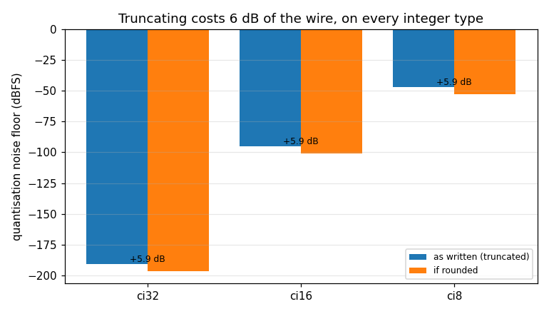

# Writer — validation report

Generated by `validate.py` in this folder. Every number is measured from the C implementation through its own binding; nothing is modelled. Re-run to regenerate.

## Executive summary

- **Status.** **CERTIFIED** — all 16 limits hold.
- **Findings.** 5 recorded, 2 still open: F1, F5.

**What a caller most needs to know**

- **An integer capture costs 5.9 dB more quantisation noise than it needs to.** The writer truncates where doppler's own `f32_to_i16` rounds -- three private copies of that conversion exist. It bites hardest at 8 bits: -46.9 dBFS against a possible -52.8 (§2.2, F1, gh-1117).
- **Set headroom from the peak you measured, and the rule is exact.** `ceil(20*log10(peak))` dB clears the clip at every level measured, and one dB less does not -- so it is a bound to design to, not a margin to pad (§2.4).
- **Headroom costs no SNR.** A single scale moves signal and noise together; the ratio varied by 3e-09 dB across 12 dB of backoff. And headroom 0 is byte-identical to omitting it, so the no-op really is one (§2.4).
- **`clipped` is about the wire type, not the level.** The same 1.5 that saturates ci16 is merely loud in cf32, and a float capture still reports a peak -- which `StreamSink`, whose own comment says it mirrors this object, does not (§2.3, F3).
- **Tell `Reader` the sample type of a raw capture.** The writer records it in a `.sigmf-meta` sidecar and the reader does not read it, so an untold raw capture comes back as cf32 -- half the samples and garbage values, with `trailing_bytes` silent in 7 of 9 cases and unable to fire at all for ci32. Use BLUE or SigMF if you want the file to say what it is (§2.5, F5, gh-1120).
- **Turn the clip counter on before you need it.** The peak is always tracked and free; the per-component fraction is opt-in, and off by default a fully saturated capture reports 0.0 (§2.3).
- **The evidence is younger than the object.** Every property the Python face exposes -- peak_dbfs, clipped, clip_fraction -- and the destructor whose status makes `close()` raise were tested by nothing in C until this certification (F2).

## 1. The object

`Writer` is where a generated waveform stops being samples in memory and becomes a file another program will read -- raw interleaved I/Q, CSV, BLUE type-1000, or SigMF. The design is [docs/design/wfmgen.md](../../../../../../docs/design/wfmgen.md); the API is `native/inc/wfm_writer/wfm_writer_core.h`, certified in C by `native/tests/test_wfm_writer_core.c`. Neither is restated here.

Everything below is measured offline -- a temporary directory and numpy -- so this report renders identically on any machine, which is what `make validate-check` requires of it.

## 2. Characterisation

Measured behaviour, no verdicts. Each heading names the C section it tracks where there is one; the numbering is this report's own.

### 2.1 Five wire types, read back by numpy (C §raw/endian)

The writer's contract is that `+-1.0` maps to the type's full scale. Read back with `np.fromfile` at the declared dtype -- not through `Reader`, which shares the writer's own scale table.

| type | dtype | components | mapping | vs arithmetic |
|---|---|---|---|---|
| cf32 | <c8 | 512 | float, stored as-is | exact |
| cf64 | <c16 | 512 | float, stored as-is | exact |
| ci32 | <i4 | 512 | +-1.0 -> +-2147483647 | exact |
| ci16 | <i2 | 512 | +-1.0 -> +-32767 | exact |
| ci8 | <i1 | 512 | +-1.0 -> +-127 | exact |

Every type lands exactly where the arithmetic says, and the component count is `2 * n` in each -- the file is interleaved I/Q with no padding and no header (`raw`).

### 2.2 The quantiser truncates, and what that costs (F1)

The interesting question about an integer capture is not whether it round-trips but how much of the wire's dynamic range it spends. doppler's canonical converter, `f32_to_i16`, says it "rounds to the nearest integer". The writer does not call it: `wfm_writer_core.c` has its own `(long)(v * scale)`, which **truncates toward zero**.

Both models are evaluated in numpy and the file is compared against each, so this is a measurement rather than a reading of the source.

| type | matches truncation | matches rounding | max err (LSB) | rms (LSB) | noise floor dBFS | if rounded |
|---|---|---|---|---|---|---|
| ci32 | yes | no | 0.998 | 0.6035 | -191.0 | -196.9 |
| ci16 | yes | no | 1.000 | 0.5695 | -95.2 | -101.1 |
| ci8 | yes | no | 1.000 | 0.5757 | -46.9 | -52.8 |

Truncation on every integer type, and the cost is the same on each: **5.9 dB**. That is not a coincidence of this signal -- truncation toward zero spreads the error over a whole LSB (rms `1/sqrt(3)` = 0.577) where round-to-nearest spreads it over half (`1/sqrt(12)` = 0.289), and the ratio is exactly 2, which is 6.02 dB. Measured 0.5757 against 0.2902.

It bites hardest where there is least to spare: an 8-bit capture sits at **-46.9 dBFS** where it could sit at -52.8. Recorded as F1 and filed as gh-1117, which also names the two sibling copies in `wfm_sink` and `wfm_reader`.

### 2.3 peak, clipped and the clip fraction (C §accessors)

The three properties a caller reads to answer one question -- did this capture survive its own level? `peak_dbfs` is `20*log10(peak)` over the largest axis written, and it is reported for float captures too, which is where this object and `StreamSink` deliberately differ (F3).

| written amplitude | 20*log10 dBFS | peak_dbfs | clipped |
|---|---|---|---|
| 0.25 | -12.0412 | -12.0412 | no |
| 0.5 | -6.0206 | -6.0206 | no |
| 0.9 | -0.9151 | -0.9152 | no |
| 1.5 | +3.5218 | +3.5218 | yes |

`clipped` is a rule about the WIRE TYPE, not only the level: the same 1.5 that saturates an integer capture is merely loud in a float one.

| type | kind | clipped at 1.5 |
|---|---|---|
| cf32 | float | no |
| cf64 | float | no |
| ci32 | integer | yes |
| ci16 | integer | yes |
| ci8 | integer | yes |

The clipped *fraction* is the one extra per-sample compare, so it is opt-in. Its denominator is COMPONENTS, two per sample, which makes a block whose I saturates and whose Q does not exactly one half -- a number that needs no reference implementation, only counting.

| block | expected | measured |
|---|---|---|
| nothing saturates | 0.00 | 0.00 |
| I saturates, Q does not | 0.50 | 0.50 |
| both saturate | 1.00 | 1.00 |

Off by default the same fully-saturated block reports 0.0 while `clipped` still reads true -- the peak is free, the counter is not, and only the counter is opt-in.

### 2.4 Headroom: the remedy is exact, and costs no SNR

The header states the remedy for a clipped capture with a number in it -- "exactly `ceil(20*log10(peak))` dB of headroom" -- so it can be checked rather than believed. Apply it, and the capture must clear full scale; apply one dB less, and it must not.

| peak | remedy dB | peak after | verdict | one dB less |
|---|---|---|---|---|
| 1.05 | 1 | 0.9358 | cleared | n/a |
| 1.5 | 4 | 0.9464 | cleared | still clips |
| 2.0 | 7 | 0.8934 | cleared | still clips |
| 3.7 | 12 | 0.9294 | cleared | still clips |

And the header's other half: headroom "does not change any power ratio (SNR is invariant); it only moves the absolute level". Measured on a tone in noise, comparing the in-band to out-of-band power ratio of the file at each backoff.

| headroom dB | measured SNR dB |
|---|---|
| 0 | 14.9736 |
| 3 | 14.9736 |
| 6 | 14.9736 |
| 12 | 14.9736 |

The SNR moves by 3.00e-09 dB across 12 dB of backoff -- a single scale multiplies signal and noise alike, so the ratio is untouched and only the level moves.

Headroom 0 is documented as a bit-exact no-op. Written twice per wire type -- once with the argument omitted, once with `0.0` -- and compared byte for byte.

Byte-identical on all five.

### 2.5 Reading it back, and the sidecar nobody reads (F5)

Everything above scored the writer against numpy. This asks the separate question of whether the library recovers its own capture -- and for the self-describing types it does, exactly.

| file type | sample type | how the type is known | samples | vs written |
|---|---|---|---|---|
| blue | ci16 | carried | 512 | agrees |
| blue | cf32 | carried | 512 | agrees |
| csv | cf32 | carried | 512 | agrees |
| raw | ci16 | hint `ci16` | 512 | agrees |

BLUE and SigMF carry their own type, so they need nothing. Raw and CSV are headerless, and the last row had to be TOLD -- which is the whole of F5.

#### What happens when it is not told

The writer records the type in a `<path>.sigmf-meta` sidecar it writes beside every raw capture. The reader does not consult it. Read back at the default `cf32` hint, with the sidecar sitting next to the file saying otherwise:

| samples written | written as | read as | samples read | trailing bytes | tell fires? |
|---|---|---|---|---|---|
| 512 | ci8 | cf32 | 128 | 0 | **no** |
| 512 | ci16 | cf32 | 256 | 0 | **no** |
| 512 | ci32 | cf32 | 512 | 0 | **no** |
| 4096 | ci8 | cf32 | 1024 | 0 | **no** |
| 4096 | ci16 | cf32 | 2048 | 0 | **no** |
| 4096 | ci32 | cf32 | 4096 | 0 | **no** |
| 513 | ci8 | cf32 | 128 | 2 | yes |
| 513 | ci16 | cf32 | 256 | 4 | yes |
| 513 | ci32 | cf32 | 513 | 0 | **no** |

The reader reports `cf32` every time, and the documented safeguard -- `trailing_bytes`, which the docstring names for exactly this -- stays silent in 7 of 9 cases. It can only fire when the byte count fails to divide by 8, so every even sample count is invisible. **ci32 is invisible at every length**: it is 8 bytes per complex sample, the same as cf32, so the count comes back correct and every value is wrong. No size-based check could ever separate those two.

The sample rate goes the same way: the sidecar records `core:sample_rate` = 1000000, and the reader reports 0.0. Filed as gh-1120.

### 2.6 What the Python face does not reach

- `wfm_writer_open` -- the `FILE*`-taking constructor. Python gets `wfm_writer_create`, which owns the file; a caller who already has a stream is a C caller.
- `wfm_writer_set_gain` -- reachable, but only as the `headroom` dB argument at construction (§2.4), never as a linear gain and never mid-capture.
- `wfm_writer_peak` -- the linear peak. Python exposes `peak_dbfs` and `clipped`, both derived from it; the raw magnitude is C-only.
- `wfm_writer_destroy` -- the same function as `close()` under the binding's name, so Python reaches the behaviour through `close()` and the C test covers the identity.

Each is certified in C instead -- none is a gap in the binding.

## 3. Review -- findings, with verdicts

- **F1 · CONFIRMED** — **The quantiser truncates where the library's own converter rounds, and it costs 5.9 dB** (gh-1117). `f32_to_i16`'s header says it "rounds to the nearest integer"; `wfm_writer_core.c` has its own `(long)(v * scale)` and truncates toward zero, as do `wfm_sink.c` and `wfm_reader_core.c` -- three private copies of one conversion, which is the drift class `CLAUDE.md` names by example. Measured against both models on the file itself: truncation on every integer type, rms 0.5757 LSB against 0.2902 rounded, a factor of exactly 2. An 8-bit capture sits at -46.9 dBFS where it could sit at -52.8. Not fixed here: the round trip is self-consistent today, so changing it changes bytes in every committed capture fixture and needs a deliberate pass. Phase 8 measures; it does not repair.

- **F2 · FIXED** — **The three properties the Python face exposes were untested in C.** `wfm_writer_get_peak_dbfs`, `wfm_writer_get_clipped` and `wfm_writer_get_clip_fraction` had zero mentions in any C test in the tree, and so did `wfm_writer_destroy` -- the binding's fallible destructor, whose non-zero return is what makes `Writer.close()` raise out of a `with` block. The accessors are where a derivation hides: one is a log, one is a rule about which wire types can saturate. Closed by a new section in `test_wfm_writer_core.c`, pinned to the digit (`20*log10(0.25) = -12.0411998`) and to -inf rather than 0 dB before anything is written. Sabotage: 10*log10 for 20, 0 dB for -inf, `clipped` without its wire-type condition, and `destroy` always returning success -- all now red.

- **F3 · BY DESIGN** — **A float capture reports a peak here and does not through `StreamSink`, and the sink says it mirrors this object.** `wfm_writer`'s header: floats "never clip but still report a peak", and they do (§2.3). `wfm_sink.h`'s clip block opens "mirroring wfm_writer" and then excludes the float paths entirely -- "the cf32 path is left untouched ... it never clips and is the streaming hot path" -- so a caller who moves a pipeline from a file capture to a stream loses the peak reading with nothing to say so. Both behaviours are deliberate and both are documented; what is wrong is the word "mirroring", which promises a parity that does not exist. Recorded rather than changed: the streaming hot path has a real reason to skip the compare.

- **F4 · C-ONLY** — **Four header entry points are not on the Python face** (§2.6), and one of them is worth naming: `wfm_writer_set_gain` is reachable only as the `headroom` argument at construction, in dB. A caller cannot change the gain mid-capture from Python, which is the right default -- a level that moves partway through a file is a file whose samples mean two different things -- but it means the linear-gain path is exercised in C alone.

- **F5 · CONFIRMED** — **The writer records the sample type in a sidecar the reader does not read, and the documented safeguard cannot see it** (gh-1120). Every raw capture gets a `<path>.sigmf-meta` beside it carrying `core:datatype` and `core:sample_rate` -- the writer's own comment says the sidecar exists because raw and CSV otherwise "hand back a file nobody could interpret". `Reader` opens the same path and does not look: it reports `cf32`, `fs = 0.0` against the 1000000 recorded beside it, half the samples, and garbage values, with nothing raised. `Reader`'s docstring points at `trailing_bytes` for a wrong hint; measured, it stays silent in 7 of 9 cases, because it can only fire when the byte count fails to divide by 8 -- so every even sample count is invisible. For ci32 it can NEVER fire: 8 bytes per complex sample, the same as cf32, so the count is right and every value is wrong (§2.5). Passing `sample_type=` works and is the current contract; the defect is that the answer is already on disk and getting it wrong is silent.

## 4. Limits -- the certified envelope

Claims a caller may rely on. A failure here is a regression, not a new finding. Every one is asserted by `src/doppler/wfm/tests/test_validation_limits.py`.

| verdict | claim |
|---|---|
| PASS | all five wire types land exactly where the arithmetic says, read back by numpy at the declared dtype |
| PASS | the integer quantiser truncates toward zero on every type -- recorded so gh-1117 cannot be 'fixed' without this report moving |
| PASS | and that costs 5.95 dB against round-to-nearest, the factor of 2 in quantiser rms the theory predicts |
| PASS | the quantisation error never exceeds one LSB (1.000 measured) |
| PASS | peak_dbfs is 20*log10 of the largest axis written, exactly, at every level measured |
| PASS | clipped is true for the three integer wire types and false for the two float ones at the same 1.5 amplitude -- it is a rule about the wire type, not only the level |
| PASS | clip_fraction counts COMPONENTS: 0, exactly one half when only I saturates, and 1 when both do |
| PASS | and it is opt-in -- off by default a fully saturated block still reports 0.0 while clipped reads true |
| PASS | ceil(20*log10(peak)) dB of headroom clears the clip at every peak measured |
| PASS | and one dB less does not -- the header's 'exactly' is a bound that bites, not a comfortable margin |
| PASS | headroom moves the level and not the ratio: SNR varies by 3.0e-09 dB across 12 dB of backoff |
| PASS | headroom 0 is a bit-exact no-op -- byte-identical to omitting it, on all five wire types |
| PASS | Reader recovers the written samples across blue, csv and raw -- raw only when told the type |
| PASS | an untold raw capture reads back as cf32 with trailing_bytes silent in 7/9 cases -- recorded so gh-1120 cannot be closed without this report moving |
| PASS | and the sample rate the sidecar records comes back as 0.0 |
| PASS | four header entry points are not on the Python face and are certified in C instead -- counted, so one appearing or vanishing is a change |

## 5. Summary

- **5 findings**, 2 of them gaps or confirmed defects: F1, F5
- **16/16 limits** hold
- Raw sweeps: `data/quantisation.csv`, `data/headroom_snr.csv`
